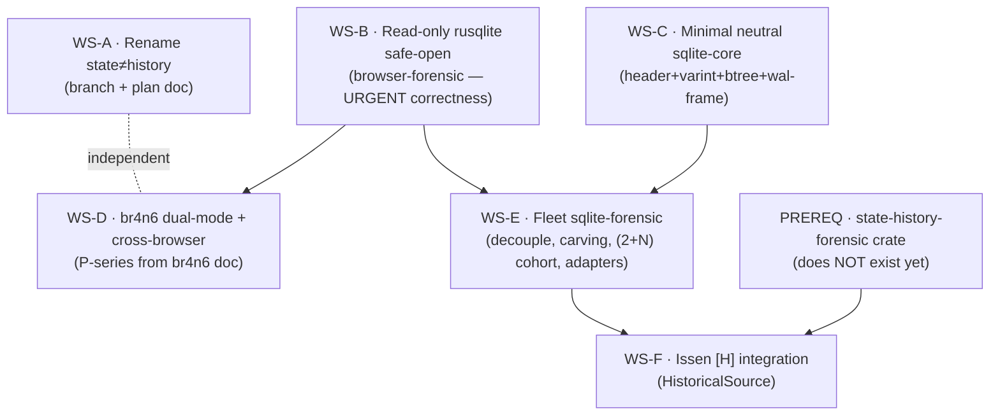

# PLAN — Fleet SQLite Unification + br4n6 Dual-Mode Cross-Browser (Handover)

Status: **Ready to pick up** · Authored: 2026-06-09 · For: a fresh Claude Code agent
Owner repos: `~/src/browser-forensic`, `~/src/chat4n6`, `~/src/issen`
Companion design docs (read these first — they hold the full reasoning and `file:line` evidence):
- `~/src/browser-forensic/docs/design/fleet-sqlite-forensic.md`
- `~/src/browser-forensic/docs/design/br4n6-unified-cli-tui.md`

---

## 0. Orientation for the picking-up agent (read fully before any edit)

You are taking over a forensic-tooling effort spanning three repos. Two design docs already exist (paths above); both were stress-tested by an adversarial Codex review and corrected. **This plan is the operational decomposition of those docs into executable workstreams.** Do not re-litigate the designs; execute them, but verify every `file:line` claim against the live tree before you act on it (some were last checked 2026-06-09 — see Doer-Checker below).

**Non-negotiable disciplines (from the user's global CLAUDE directives):**

1. **Strict TDD, RED→GREEN, separate commits.** For every code change: write failing tests first, commit them (RED), then the minimal implementation that passes, commit that (GREEN). The RED commit is the proof TDD happened — do not collapse into one commit except for trivial one-liners.
2. **Secure by default.** The safe path is the only path in the API surface. No read-write open of evidence; no "call sanitize() first" contracts — make the wrong thing unconstructible.
3. **Prefer our own crates.** Never add a third-party crate where a SecurityRonin/`h4x0r` crate exists or is being built. New format support uses the `<x>-core` (raw reader, `Read + Seek`, no findings) + `<x>-forensic` (anomaly auditor → `forensicnomicon::report::Finding`) split. Reference impl: `ntfs-forensic`.
4. **Doer-Checker / real data.** Validate parsers against **real** artifacts (real `History`/`places.sqlite` with a populated `-wal`, real `sessionstore.jsonlz4`, real `LastSession.plist`), not only synthetic fixtures. Never assert a `file:line` as fact without a same-session re-read.
5. **Minimal diffs, fit the codebase.** Match neighboring conventions; change only what the task requires.

**Environment notes:**
- Before dispatching subagents that commit, start the gitsign credential cache so all subprocesses share one OIDC token:
  ```
  gitsign credential-cache start
  export GITSIGN_CREDENTIAL_CACHE="$HOME/Library/Caches/sigstore/gitsign/cache.sock"
  ```
- `browser-forensic` runs a pre-commit hook (rustfmt + clippy) and CI runs `cargo-deny`. Keep commits green; for docs-only commits on a WIP base you may `--no-verify`, but **never** skip hooks on code commits.
- Do not run multiple heavy test runners concurrently — sequential, targeted `cargo test` only.

**The Issen framework this work serves (recap, with citations):**
- 5 data sources / navigation primitives: `[P]` persistent, `[M]` memory, `[L]` log, `[Q]` live-query, `[C]` content-addressed (`~/src/issen/README.md:55-61`).
- `[H]` State-History is a **cross-cutting functor** that lifts each primitive to a time-indexed variant (`STATE_HISTORY_PLAN.md:69-75`). **State** = one `TemporalState` (snapshot at an epoch, `:484-491`); **History** = a `TemporalCohort` (ordered `Vec<TemporalState>`, `:492-505`) with `diff(a,b) -> StateDelta` (`:501`).
- The SQLite WAL is the **canonical 2-state instance** of `[H]`, generalizing to the `(2+N)`-state model (`:215-231`). This entire plan makes that concrete at SQLite granularity.

---

## 1. The big picture & dependency graph

Six workstreams. A, B are independent and shippable immediately. C unblocks E. D (br4n6) depends only on B for its safety story. E (fleet crate) is the large one; F (Issen integration) is gated on an external prerequisite.



**Recommended order:** WS-A (minutes) → WS-B (urgent fix, hours) → WS-C (spike, ~1 day) → in parallel: WS-D (br4n6) and WS-E (fleet crate) → WS-F last, only once the prerequisite crate exists.

---

## WS-A — Rename to reflect state ≠ history

**Goal:** stop the branch name and plan filename implying state and history are one thing. The code already separates them (done in `browser-forensic` crate `browsing-state-mcp`); only labels lag.

**Steps:**
1. In `~/src/browser-forensic`: rename branch `feat/history-state-browser` → `feat/browser-state-and-history` (or `feat/browsing-state-history`). `git branch -m`, then update any open PR/remote ref.
2. Rename `~/src/browser-forensic/docs/plans/history-state-browser.md` → `browser-state-and-history.md`; fix its internal title/headings to name **State** and **History** as the two distinct concepts (cross-reference Issen `TemporalState` vs `TemporalCohort`).
3. Grep the repo for `history-state`/`state-history` strings in docs/CI/config and update references.

**Acceptance:** no doc or branch label conflates the two; `rg -i 'state[- ]history|history[- ]state'` returns only intentional references (e.g. citations to Issen's `[H]`/`STATE_HISTORY_PLAN.md`).
**Risk:** low. Coordinate the branch rename if a remote PR exists.

---

## WS-B — Read-only `rusqlite` safe-open in browser-forensic (URGENT)

**Goal:** eliminate the evidence-mutation defect. Every primary SQLite open is read-**write** today; a R/W open of a live/imaged DB can checkpoint the WAL and **mutate evidence**. This is the highest-confidence correctness bug in the fleet and is **independently shippable** — it does NOT need the fleet crate.

**Evidence (re-verify before editing):** read-write `Connection::open(path)` at:
- `browser-chrome/src/{history.rs:~22, cookies.rs:~27, downloads.rs:~22, autofill.rs:~23, visits.rs:~67, login_data.rs:~26}`
- `browser-firefox/src/{history.rs:~20, cookies.rs:~23, downloads.rs:~20, bookmarks.rs:~20, autofill.rs:~20}`
- `browser-safari/src/{history.rs:~21, cookies.rs:~21}`
- `browser-integrity/src/database.rs` (also opens for checks)

**Design (secure-by-default):**
- Add one helper — `browser_core::sqlite::open_evidence_db(path) -> rusqlite::Connection` — the **only** way the workspace opens a SQLite file. It opens with `OpenFlags::SQLITE_OPEN_READ_ONLY` (no create, no write).
- **WAL correctness (critical):** do **not** use `immutable=1` when a `-wal` sidecar exists — `immutable=1` makes SQLite *ignore the WAL*, silently dropping the newest, uncheckpointed rows. Instead: if `{path}-wal` is non-empty, **copy `{db, -wal, -shm}` to a temp working set and open the copy `READ_ONLY`** (WAL honored; any checkpoint hits the disposable copy). If no `-wal`, opening the original `immutable=1` is safe and copy-free.
- Provenance: when a snapshot copy is made, record `{original_path, snapshot_path, sha256, copied_at}` and thread it into outputs **additively** (do not break the existing `bw` JSON schema). `BrowserEvent.source` carries only a path today (`browser-core/src/lib.rs:68-77`) — extend, don't replace.

**TDD:**
- RED: a test that opens a DB with a populated `-wal` via the helper and asserts (a) the original file's mtime/bytes are unchanged after read (no checkpoint), and (b) rows present only in the `-wal` ARE returned (proves we didn't `immutable=1`-drop them). Also a test that a write attempt through the connection fails.
- GREEN: implement `open_evidence_db`; migrate every call site above to it. Remove all bare `Connection::open` for evidence.
- Refactor: ensure `browser-integrity` and any test helpers route through it too.

**Acceptance:** `rg 'Connection::open\(' crates/` shows no evidence-path R/W opens (test-only DB *creation* may remain in `#[cfg(test)]`); the `-wal` round-trip test passes; CI green.
**Risk:** locked live DBs — the copy-first path handles them. Watch for parsers that depend on write-mode side effects (none expected).

---

## WS-C — Minimal neutral `sqlite-core` carve-out (de-risking spike)

**Goal:** prove the seam for the fleet crate *before* committing four repos to it. Extract the smallest useful, **fleet-neutral** SQLite decoder and validate it both sides.

**Source (chat4n6, `~/src/chat4n6/crates/chat4n6-sqlite-forensics/src/`):**
- `header.rs` (DB header parse; magic `SQLite format 3\0` at `:1,3`)
- `varint.rs` (1–9 byte varint codec)
- `btree.rs` (table b-tree walk; **note** it indexes directly into one contiguous `&[u8]` — `:12,225,282,288`)
- `wal.rs` frame parsing + overlay construction only (`build_wal_overlay` `:245,261`)

**Critical decoupling (the review's #1 finding):** these modules are **not** fleet-neutral as-is. `chat4n6-plugin-api` is a *production* dep (`Cargo.toml:16`) and its types are threaded through core structures — `RecoveredRecord` carries `EvidenceSource` (`record.rs:12,17`), WAL imports `WalDelta`/`WalDeltaStatus` (`wal.rs:5`). **Define neutral types in `sqlite-core`** (`SqliteRow`, `WalFrame`, `PageRef`) with **zero fleet provenance**; provenance/findings live above, in `-forensic`.

**Correctness gaps to fix while extracting (do not copy the bugs):**
- **Reserved-bytes:** overflow math assumes 0 reserved bytes (`btree.rs:282,288`). Read the header's reserved-bytes field; SQLCipher/some DBs use it (salt) → wrong overflow chains otherwise.
- **Encrypted DBs:** header parse fails on non-plaintext magic with no signal. Detect "not a plaintext SQLite header" and return a typed `Encrypted`/`Unknown` outcome (fail loud, scoped out), don't panic or misparse.
- **Page-size sentinel:** keep the correct `65536` handling (`header.rs:~22`).

**TDD & validation:**
- RED: decode tests over a known small DB (header fields, a varint table, a b-tree leaf row, a WAL frame/overlay) using only neutral types.
- GREEN: minimal `sqlite-core` crate (new repo `~/src/sqlite-forensic`, member `sqlite-core`) passing them.
- **Cross-validation gate (the whole point):** (a) wire one existing `chat4n6` recovery test to the new `sqlite-core` and confirm parity; (b) wire one `browser-forensic` read-only path (e.g. read a History b-tree) through it. Only proceed to WS-E if both pass.

**Acceptance:** `sqlite-core` builds with **no fleet dependencies**, neutral types only, both cross-validations green.
**Decision after C:** if decoupling proved clean → proceed to WS-E. If coupling fights back → stop and reassess (the design's "yes, eventually" was conditional on this spike).

---

## WS-D — br4n6 dual-mode binary + cross-browser (from `br4n6-unified-cli-tui.md`)

**Goal:** one binary `br4n6`: no-subcommand → TUI on auto-discovered profiles; `br4n6 open <PATH>` → scoped TUI; `br4n6 <subcommand>` → the existing `bw` CLI. Generalize the TUI beyond Brave/Chromium to every discovered browser. Read the companion doc for full reasoning; phases below are its corrected sequence (its old "P0 read-only" is now **WS-B**, already done independently).

**Key current-state facts (re-verify):**
- TUI hardcodes Brave/macOS default profile: `browser-tui/src/main.rs:13` (`SessionStore::open_default_profile()`); model is the snss tree only.
- TUI reducer is a **fixed 4-level tree**: `selection: [usize; 4]`, `MAX_DEPTH = 3` (`browser-tui/src/lib.rs`). Generalizing needs a **path-stack cursor** (`Vec<usize>`).
- CLI lives in `bw-cli/src/main.rs`; emits flat `Vec<BrowserEvent>`; Safari artifacts rejected at `:195-217`; session only Firefox at `:207-210`.
- Discovery already cross-browser/cross-OS: `browser-discovery/src/lib.rs`.
- **clap ambiguity:** a bare top-level positional `PATH` collides with subcommand names (`history`, `profiles`, …). Use an explicit `open` verb (`br4n6 open <PATH>`); do **not** rely on `args_conflicts_with_subcommands`.

**Phases (TDD, RED→GREEN per phase):**
1. **D1 — Extract `bw-cli` handlers into a library crate** (thin binary). No behavior change; existing CLI tests stay green. Prereq for unification.
2. **D2 — Dual-mode `br4n6` binary.** `Option<Commands>`: `None` → TUI (auto-discover); `Open{path}` → scoped TUI; other subcommands → CLI via D1 lib. `bw` becomes a deprecated alias (prints notice, forwards) for one release.
3. **D3 — Unified `Node` tree + lazy loading.** Define `Node{label,kind,item,children}` and `Item{url,title,timestamp_ns,browser,artifact,attrs}`. Lower `snss::Source` and `Vec<BrowserEvent>` into it. **Children produced lazily on descend** (a thunk the cursor invokes) — never eager-load millions of rows across profiles.
4. **D4 — Generic-tree TUI.** Replace `[usize;4]`/`MAX_DEPTH` with the path-stack cursor; re-point search/tag/sort/export at a generic leaf-walk. Behavior-preserving; existing TUI tests stay green.
5. **D5 — Cross-browser content in the TUI.** Loader feeds history/downloads/cookies/etc. for every discovered profile (lazily). Render the coverage gaps (below) as **labelled-unavailable** cells, never empty lists.
6. **D6 — Session-state parity.** Reconstruct the full Firefox `Window→Tab→Nav` tree from `sessionstore.jsonlz4` (today `browser-firefox/src/session.rs:~50` keeps only `entries.last()` per tab — lossy); add a Safari `LastSession.plist` reader (`plist` is a workspace dep); normalize all session readers to one `Node` shape.

**Honest coverage matrix to encode in the UI (re-verify against `bw-cli` dispatch):**
- History/Cookies/Downloads/Bookmarks/Extensions: Chromium ✓, Firefox ✓, Safari ✓.
- Login-data/Autofill/Cache: Chromium ✓, Firefox ✓, **Safari ✗** (CLI rejects, `bw-cli/src/main.rs:195-217`).
- Session state: Chromium rich via `snss-core` (TUI only); Firefox **lossy** (current-tab-only); **Safari none** (new reader needed).
- **Encrypted fields are metadata-only:** cookies/passwords surface as `"ENCRYPTED"`; Keychain/DPAPI/NSS decryption is a deliberate non-goal — never emit a plaintext secret.

**Acceptance:** `br4n6` launches TUI with no args; `br4n6 open <dir>` scopes to a path; all `bw` subcommands work unchanged; the TUI shows every discovered browser's available artifacts with gaps labelled; existing tests green.

---

## WS-E — Fleet `sqlite-forensic` (the large workstream)

**Goal:** promote chat4n6's pure-Rust SQLite engine to the fleet crate `~/src/sqlite-forensic` (workspace: `sqlite-core` from WS-C + `sqlite-forensic`), and migrate chat4n6, browser-forensic, and (later) issen onto it. Read `fleet-sqlite-forensic.md` for full reasoning.

**Build on WS-C's neutral `sqlite-core`. Then:**
1. **E1 — Lift `sqlite-forensic`** (recovery/carving/integrity) onto `sqlite-core`: `carver.rs` (record-header/serial-type carving — higher fidelity than browser-carve), `unalloc.rs`, `gap.rs`, `journal.rs`, `wal_enhanced.rs` (frame classification), `verify.rs`, `pragma.rs`, `dedup.rs`, `rowid_gap.rs`. Emit **`forensicnomicon::report::Finding`** via an adapter (chat4n6 emits its own `VerifiableFinding`/`VerificationReport` today, `verify.rs:9,20`).
2. **E2 — WAL `(2+N)`-state cohort (NEW capability, not a port).** Current `WalMode::Both` is a **2-state last-writer-wins diff** (collapse *all* frames, walk twice — `wal.rs:245,293,306`). Building a distinct state at **each commit boundary** needs incremental overlay snapshots (per-commit page-map) or a replay-log structure that doesn't exist. Produce `Vec<TemporalState>` + `diff()`. New fixtures required: a multi-transaction WAL exercised at each boundary (none exists today).
3. **E3 — Repoint `chat4n6`** at `sqlite-core`/`sqlite-forensic` (path dep during the coordinated change; switch to the registry version once published, per the prefer-our-own-crates rule). Keep `fts.rs`/`schema_sig.rs` as chat-plugin-side code. Delete the in-tree engine copy.
4. **E4 — Migrate `browser-forensic`:** retire `browser-carve`'s lower-fidelity SQLite carving (it string-matches `http` in freelist/WAL — `browser-carve/src/sqlite_carve.rs:54,110`, `wal_recovery.rs:56,76`) onto `sqlite-forensic`. Browser **allocated** reads stay on WS-B's read-only `rusqlite` — do **not** reimplement SELECT/JOIN over raw b-tree walks (Chromium `visits⋈urls` `visits.rs:67`, Firefox 3-table downloads join `downloads.rs:20`, Safari joins `history.rs:21`). Pure-Rust is additive: deleted/carved/temporal only.
5. **E5 — Streaming:** convert the `&[u8]` whole-file boundary to `Read + Seek`/mmap before browser DBs at scale (`History`/`places.sqlite` reach GBs). This is a **breaking refactor** of every b-tree offset site — budget accordingly.

**SQLite correctness checklist (apply across E):**
- [ ] Reserved-bytes honored in overflow math (not assumed 0).
- [ ] Encrypted (SQLCipher/SEE) detected and scoped out gracefully.
- [ ] `-shm` / checkpoint-mode (`RESTART`/`TRUNCATE`) frame visibility consulted for `(2+N)` materialization (no `shm_data` tracked today, `db.rs:53`).
- [ ] `auto_vacuum=Incremental` pointer-map handled distinctly (only `Full` suppresses freelist recovery today, `pragma.rs:117`).

**Acceptance:** `sqlite-forensic` emits `forensicnomicon` findings; chat4n6 builds against it with its tests green; browser-carve SQLite paths retired; `(2+N)` cohort + `diff()` covered by multi-transaction-WAL fixtures.
**Risk:** 4-repo version coupling (highest-friction op in the fleet) — use path deps during the coordinated change, publish, then move dependents to the registry version; one owner drives the cut.

---

## WS-F — Issen `[H]` integration (gated)

**Goal:** make a `(db, -wal, -shm)` unit a first-class Issen `HistoricalSource` emitting a `TemporalCohort`, feeding `issen-correlation`'s `TemporalEventGraph` (deletion-window inference, `STATE_HISTORY_PLAN.md:552-556`).

**HARD PREREQUISITE:** the `state-history-forensic` traits crate (`HistoricalSource`, `TemporalState`, `TemporalCohort`) **does not exist yet** — it is Step 1 of the migration plan (`STATE_HISTORY_PLAN.md:534`, planned KNOWLEDGE-tier, zero-dep). **Do not start WS-F until that crate is created and published.** If asked to create it, that becomes WS-F0 and follows `STATE_HISTORY_PLAN.md:433` (traits + types only).

**Steps (once prereq exists):**
1. Implement `state_history_forensic::HistoricalSource` for `sqlite-forensic`'s `(2+N)` cohort.
2. Collapse Issen's planned `issen-sqlite-history` (`STATE_HISTORY_PLAN.md:543-545`) to a thin adapter (or remove it).
3. Wire into `issen-correlation`; validate the deletion-window use case end-to-end with two snapshots + live (real data).

**Acceptance:** a SQLite artifact appears in Issen as a `TemporalCohort`; `diff(epoch_a, epoch_b)` yields a `StateDelta`; deletion-window inference works on a real multi-snapshot fixture.

---

## 2. Definition of done (whole effort)

- WS-A: labels fixed; no false state≡history conflation.
- WS-B: zero read-write evidence opens; WAL rows preserved; provenance additive; CI green. **(Shippable alone.)**
- WS-C: neutral `sqlite-core` validated both sides. **(Go/no-go gate for E.)**
- WS-D: `br4n6` is dual-mode and cross-browser with honest coverage labelling.
- WS-E: fleet crate is the single SQLite layer; chat4n6 + browser-carve migrated; `(2+N)` cohort real.
- WS-F: SQLite is an Issen `[H]` `TemporalCohort` (gated on `state-history-forensic`).

## 3. First three moves for the picking-up agent

1. Read both companion design docs end-to-end.
2. Do **WS-A** (quick) and **WS-B** (urgent correctness) — both independently shippable, both TDD RED→GREEN with separate commits.
3. Run the **WS-C** spike to decide whether the fleet `sqlite-forensic` extraction proceeds. Report the go/no-go with evidence before starting WS-E.

*Every `file:line` in this plan was captured on 2026-06-09 against the live trees; re-verify before editing (Doer-Checker). The two highest-impact facts: the read-write `Connection::open` evidence-mutation defect (WS-B, fix now) and the `immutable=1`-vs-`-wal` data-loss hazard (WS-B/WS-C, the correct primitive is copy-then-`READ_ONLY`, never `immutable=1` when a `-wal` exists).*
