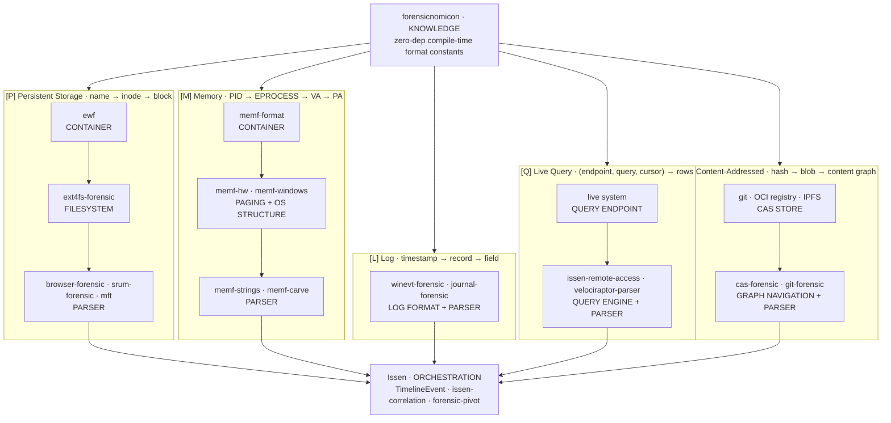

# Issen

[](https://github.com/SecurityRonin/issen/stargazers) [](LICENSE) [](https://github.com/SecurityRonin/issen/actions/workflows/ci.yml) [](https://www.rust-lang.org) [](#install) [](https://github.com/sponsors/h4x0r)

**One command. One output. The full attack narrative.**

---

```
$ issen analyse collection.tar.gz

[CRITICAL] Rootkit concealed miner activity
  Rule    : correlation.miner.rootkit-concealment
  Evidence: ld_preload /lib/x86_64-linux-gnu/libymv.so.3
            PID 977 "top" [thread: libuv-worker] → XMRig
            127.0.0.1:59182 → 127.0.0.1:3333 [Stratum tunnel]
```

A rootkit hiding a crypto miner behind an SSH tunnel. Found automatically. Zero manual grep.

---

## How it works

Issen ingests evidence from five independent source types, then correlates across all of them:



Open [architecture.html](architecture.html) in a browser for the full interactive diagram.

- **Ingests** UAC live response collections, Velociraptor query results, EVTX logs, memory dumps, git repositories, and OCI registries — simultaneously.
- **Correlates** evidence across all five source types using the Pivot engine: a network connection isn't a finding on its own; combined with a hidden PID, a loaded rootkit library, and a supply-chain hash match, it is.
- **Outputs** a structured Finding with severity, rule name, and the full evidence chain — ready for your report.

No Python env. No dependency hell. One static binary.

### The five source types

| ID | Source | Navigation primitive | What it captures |
|---|---|---|---|
| **[P]** | Persistent Storage | `name → inode → block` | Disk images (E01/raw), filesystems, file artifacts |
| **[M]** | Memory | `PID → EPROCESS → VA → PA` | RAM dumps, hiberfil.sys, live-at-time process state |
| **[L]** | Log | `timestamp → record → field` | EVTX, journal, tracev3, CloudTrail, Zeek/Suricata |
| **[Q]** | Live Query | `(endpoint, query, cursor) → rows` | Ephemeral state an attacker cannot retroactively destroy |
| **[C]** | Content-Addressed | `hash → blob → content graph` | Supply chain provenance, Merkle DAG traversal |

**[Q] Live Query** differs fundamentally from the other sources: the data is *produced* by a query rather than *retrieved* from storage. Once captured, the result set is attacker-durable — no subsequent disk wipe changes what `velociraptor collect` saw at query time. The query itself becomes part of the evidence chain.

**[C] Content-Addressed** gives every artifact a globally-unique, tamper-evident identity: its hash. Issen can pivot from a malicious binary hash across git commits, OCI image layers, and Sigstore transparency log entries to answer "which systems ran this exact blob, when, and where did it come from?"

---

## Install

```bash
# Requires Rust 1.80+
cargo install --git https://github.com/SecurityRonin/issen issen

# Verify
issen --version
```

## First command

```bash
issen analyse collection.tar.gz
```

That's it. Everything else is optional.

---

## Quick reference

```bash
# Parse artifacts into a DuckDB timeline and scan for IOCs
issen ingest evidence/ --output case.duckdb --scan

# Query the timeline
issen timeline case.duckdb --flagged --min-severity high

# Export timeline as CSV or bodyfile
issen timeline case.duckdb --format csv
issen timeline case.duckdb --format bodyfile

# Analyse a physical memory dump (LiME, AVML, crash dump)
issen memf dump.lime --command all

# Detect remote access tools (LOLRMM-based)
issen remote-access evidence/

# Scan files against YARA/Sigma/hash/STIX signatures
issen scan evidence/ --auto-feeds

# Update threat intel feeds (YARA, Sigma, STIX, Zeek, Suricata)
issen feed update

# Generate HTML report from a timeline database
issen report case.duckdb --output report.html
```

---

## What it covers

| Category | Formats / Sources |
|---|---|
| **Collection formats** | UAC `.tar.gz`, Velociraptor, KAPE triage zip |
| **Disk images** | E01/EWF, raw DD, split images |
| **Filesystems** | ext4, NTFS [planned], APFS [planned] |
| **Memory formats** | LiME, AVML, WinPMEM, crash dump (DMP), Hibernation (hiberfil.sys) |
| **Log streams** | EVTX, Zeek `conn.log`, Suricata EVE, systemd journal [planned], Apple Unified Log [planned], CloudTrail [planned] |
| **Live query** | Velociraptor VQL, WMI/WQL [planned], OSQuery SQL [planned] |
| **Content-addressed** | git repositories, OCI image registries, IPFS [planned], Sigstore transparency log [planned] |
| **Detection types** | YARA rules, Sigma rules, STIX 2.1 indicators, hash IOCs, Suricata rules |
| **Artifact sources** | EVTX, registry hives, MFT, USN Journal, Prefetch, LNK shortcuts, browser history, SRUM |
| **Network analysis** | Volatility sockstat, Zeek logs, Suricata EVE, pcap |
| **Remote evidence** | 48 URI schemes — S3, GCS, Azure, SFTP, HDFS, OneDrive, Google Drive, Redis, PostgreSQL, IPFS, and more ([full list →](https://securityronin.github.io/issen/)) |
| **Output formats** | Terminal (colour-coded), JSON, HTML report, PDF, STIX 2.1 Attack Flow, AFB (Attack Flow Builder), DOT/PNG (Graphviz), Mermaid, CSV, bodyfile, DuckDB timeline |
| **RAT detection** | LOLRMM rule set (400+ tools) |
| **Attack Flow ingestion** | CTID Attack Flow v3.0.0 corpus — parse STIX bundles → correlation rules via BFS DAG traversal |
| **Attack Flow output** | STIX 2.1 bundle, `.afb` (Attack Flow Builder), Mermaid `flowchart LR`, PNG (via Graphviz or mmdc) |
| **VSS awareness** | Enumerates Volume Shadow Copies in evidence trees; `is_vss_path` guard prevents double-counting |
| **Time-skew detection** | Flags timestamp divergence > 5 min across sources for the same artifact — anti-forensics signal |
| **Event clustering** | Groups evidence by PID, user, or path for focused correlation queries |

---

## Ecosystem

Issen is the thin correlation layer on top of a family of deep forensic libraries. Each library is independently usable in your own tooling.

| Crate | Source | Layer | Description |
|---|---|---|---|
| [forensicnomicon](https://github.com/SecurityRonin/forensicnomicon) | all | Knowledge | Zero-dep compile-time artifact specs, magic bytes, format constants |
| [ewf](https://github.com/SecurityRonin/ewf) | [P] | Container | E01/EWF → raw sector stream with hash verification |
| [ext4fs-forensic](https://github.com/SecurityRonin/ext4fs-forensic) | [P] | Filesystem | ext4 sector stream → files by path (name → inode → block) |
| [4n6mount](https://github.com/SecurityRonin/4n6mount) | [P] | Filesystem | FUSE bridge — makes any container+filesystem pair look like a normal path |
| [memory-forensic](https://github.com/SecurityRonin/memory-forensic) | [M] | Container + Paging + OS Structure | WinPMEM/LiME/hiberfil → page stream → VA→PA → EPROCESS/VAD/DPAPI |
| [winevt-forensic](https://github.com/SecurityRonin/winevt-forensic) | [L] | Log Format + Parser | EVTX binary seek + BinXML decode → typed Windows EventRecord |
| [browser-forensic](https://github.com/SecurityRonin/browser-forensic) | [P][M] | Parser | Chrome/Firefox/Safari history, cookies, downloads, bookmarks, session data |
| [srum-forensic](https://github.com/SecurityRonin/srum-forensic) | [P][L] | Parser | ESE/JET Blue page walk → SRUM network/process/energy usage records |
| issen-remote-access | [Q] | Query Engine | Live query dispatcher — Velociraptor VQL, LOLRMM 400+ tool definitions |
| cas-forensic [planned] | [C] | CAS + Graph | git/OCI/IPFS hash-addressed object store → Merkle DAG navigation |
| git-forensic [planned] | [C] | Graph + Parser | git commit/blob/tree forensics → supply chain provenance |
| sigstore-forensic [planned] | [C] | Graph + Parser | Sigstore transparency log entries → artifact signing chain |

<details>
<summary>Full layer hierarchy</summary>

```
KNOWLEDGE
  forensicnomicon        zero-dep, compile-time artifact specs, format constants

CONTAINER              decode a raw source format → addressable data stream
  ewf                  E01/EWF → raw sector stream
  memf-format          memory dumps (WinPMEM, LiME, hiberfil.sys) → raw page stream
  (log containers are integrated within each log-format crate)

Five parallel paths from CONTAINER — each with its own address space
and navigation primitive:

[P] Persistent Storage        [M] Memory              [L] Log
  navigate by: path             navigate by: PID        navigate by: timestamp
  name → inode → block          PID → EPROCESS          timestamp → record → field
                                → VA → PA

  FILESYSTEM                    PAGING                  LOG FORMAT
    ext4fs-forensic               memf-hw                 winevt-forensic (EVTX)
    ntfs-forensic [planned]       PML4/PAE/AArch64        journal-forensic [planned]
    apfs-forensic [planned]       OS STRUCTURE            tracev3-forensic [planned]
    4n6mount (FUSE bridge)          memf-windows            zeek-forensic [planned]
                                    EPROCESS, VAD           cloudtrail-src [planned]
                                    DPAPI, DKOM
                                    memf-linux [planned]

[Q] Live Query                [C] Content-Addressed
  navigate by: query            navigate by: hash
  (endpoint, query, cursor)     hash → blob → content graph
  → result rows

  QUERY ENGINE                  GRAPH NAVIGATION
    issen-remote-access           cas-forensic
    velociraptor-parser           git-forensic [planned]
    WQL / OSQuery [planned]       sigstore-forensic [planned]

PARSER                   interpret artifact records → forensic meaning
  browser-forensic       browser artifact files / SQLite pages → BrowserEvent
  winevt-forensic        EVTX records → EventRecord
  srum-forensic          ESE page bytes → SrumRecord

ORCHESTRATION
  Issen            wires all five paths, cross-artifact correlation, CLI
```

</details>

---

## Architecture

<details>
<summary>Crate layout</summary>

```
issen-cli                   # The issen binary — commands and arg parsing
issen-core                  # Shared types, plugin traits, error types
issen-timeline              # DuckDB (primary) + SQLite export timeline store
issen-fswalker              # Parallel filesystem walk via rayon; SHA-256 integrity; VSS awareness
issen-unpack                # Collection format detection (UAC tar.gz, Velociraptor, KAPE)
issen-remote-io             # Remote storage I/O — 48 URI schemes via OpenDAL (S3, GCS, Azure, SFTP, …)
issen-signatures            # YARA-X, Sigma/Tau-Engine, Hash/Network/STIX/Suricata IOCs, feed sync
issen-correlation           # Pivot engine: YAML rules, Attack Flow STIX ingestion, zeek-intel, time-skew, clustering
issen-remote-access         # LOLRMM 400+ tool definitions, RMM/RAT detection; Velociraptor VQL dispatcher
issen-mem                   # Memory forensics bridge (memf-* sibling workspace)
issen-report                # HTML/PDF/STIX/AFB/Mermaid/DOT+PNG report generation
issen-mft-tree              # MFT heuristic analysis
issen-navigator             # Interactive TUI navigation
issen-ewf                   # EWF/E01 forensic image support
issen-evtx                  # Windows Event Log bridge
parsers/issen-parser-mft    # NTFS MFT + USN Journal parser
parsers/issen-parser-evtx   # Windows Event Log parser
parsers/issen-parser-uac    # UAC collection format parser
parsers/issen-parser-velociraptor  # Velociraptor collection parser
forensic-pivot              # Sigma/Suricata/STIX rule pivoting
```

Each crate is independently testable and versioned. The CLI wires them together; you can also use the crates as a library in your own tooling.

</details>

---

## Correlation Rules

Most tools find indicators. Issen finds **attack patterns** by joining evidence across sources automatically.

A Correlation Rule looks like this:

```yaml
id: correlation.miner.rootkit-concealment
severity: critical
description: Rootkit concealing cryptominer activity via LD_PRELOAD
within_seconds: 300
references:
  - https://redcanary.com/threat-detection-report/trends/linux-coinminers/
clauses:
  - source: artifact
    required_tag: rootkit_indicator
  - source: memory
    required_tag: miner_thread
  - source: memory
    required_tag: mining_pool
```

Rules are YAML files in `~/.config/issen/rules/`. Ship your own. Share with your team.

The bundled rule set ships with rules covering miners, rootkits, SSH tunnels, LD_PRELOAD persistence, hidden processes, and LOLRMM RATs. Custom rules compose with the built-ins — one `issen analyse` call evaluates all of them.

### Attack Flow STIX ingestion

The correlation engine also ingests CTID Attack Flow v3.0.0 corpus bundles (STIX 2.1 JSON). Each bundle is parsed into an `AttackFlowBundle` and converted to a `CorrelationRule` via BFS traversal of the `effect_refs` DAG. Every `attack-action` with a `technique_id` becomes a rule clause with `required_tag: "technique:<ID>"`. The bundled corpus is downloaded with `issen feed update`.

```bash
# Fetch and index the Attack Flow corpus
issen feed update

# The engine will evaluate Attack Flow rules alongside your YAML rules
issen analyse collection.tar.gz
```

<details>
<summary>Why YAML rules and not hard-coded detections?</summary>

Hard-coded detections age badly. Threat actors change port numbers, rename binaries, and swap libraries. YAML rules are versionable, shareable, and reviewable in a pull request. The correlation engine is stable; the rules are data.

</details>

---

## Demo

```
$ issen analyse collection-WIN10-CORP-20260401.zip

+===========================================================+
|  Issen — Collection Analysis                              |
+===========================================================+

  Collection : collection-WIN10-CORP-20260401.zip
  Host       : WIN10-CORP
  OS         : Windows 10 Enterprise 22H2 (19045.4291)
  Collected  : 2026-04-01T14:32:07Z
  Artifacts  : MFT, EVTX, Registry, Prefetch, Amcache

  Parsed 1,247,831 MFT entries in 3.2s
  Parsed 48 EVTX logs (312,406 events) in 1.8s
  Parsed 4 registry hives in 0.4s

+- PERSISTENCE ───────────────────────────────────────────
|
|  [SERVICE] AnyDeskMaint
|    Binary  : C:\ProgramData\Temp\Support\anydesk.exe --service
|    Start   : Auto (SERVICE_AUTO_START)
|    Account : LocalSystem
|    Created : 2026-03-28T09:14:22Z
|
|  [REG RUN KEY] HKLM\SOFTWARE\Microsoft\Windows\CurrentVersion\Run
|    Name    : AnyDeskUpdate
|    Value   : "C:\ProgramData\Temp\Support\anydesk.exe" --start-with-win
|    Modified: 2026-03-28T09:14:38Z

+- REMOTE ACCESS ─────────────────────────────────────────
|
|  [LOLRMM] AnyDesk (relocated binary)
|    Path    : C:\ProgramData\Temp\Support\anydesk.exe
|    SHA256  : a1b2c3d4e5f60718293a4b5c6d7e8f90aabbccdd11223344556677889900eeff
|    Size    : 5,389,312 bytes
|    Signed  : philandro Software GmbH (valid, not revoked)
|    Config  : ad.router.custom_id = "corp-maint-04"
|
|  [C2 CONNECTION]
|    Dest IP : 194.36.28.117:7070
|    First   : 2026-03-28T09:17:03Z
|    Last    : 2026-04-01T13:58:41Z
|    Note    : IP not in AnyDesk relay network (AS 208323 / BL Networks, RU)

+- TIMELINE ──────────────────────────────────────────────
|
|  2026-03-28T09:12:55Z  [EVTX Security 4624]  Logon Type 3 — CORP\svc_backup
|                         from 10.20.5.44 (WIN-RUNBOOK)
|  2026-03-28T09:14:18Z  [MFT]  File created: C:\ProgramData\Temp\Support\anydesk.exe
|                         Parent created at same time — directory is new
|  2026-03-28T09:14:22Z  [EVTX System 7045]   Service installed: AnyDeskMaint
|                         ImagePath: C:\ProgramData\Temp\Support\anydesk.exe --service
|                         Account: LocalSystem | Type: user mode (0x10)
|  2026-03-28T09:17:03Z  [EVTX Security 5156] Outbound TCP — anydesk.exe (PID 6284)
|                         -> 194.36.28.117:7070

+- CORRELATION FINDINGS ──────────────────────────────────
|
|  [CRITICAL] LOLRMM with non-vendor C2 infrastructure
|    Rule    : remote-access.lolrmm.custom-c2
|    Evidence: AnyDesk outside vendor path (C:\ProgramData\Temp\Support\)
|              Outbound -> 194.36.28.117 (AS 208323, not AnyDesk relay ASN)
|              MFT entry + EVTX 7045 + EVTX 5156 + Registry Run key
|    MITRE   : T1219, T1543.003
|
|  [HIGH] Lateral movement via service account
|    Rule    : lateral-movement.service-account.file-drop
|    Evidence: Type 3 logon CORP\svc_backup from 10.20.5.44 (WIN-RUNBOOK)
|              File drop + service install within 120s of logon
|    MITRE   : T1021.002

  2 findings | 1 critical, 1 high | 4 artifact sources correlated
```

The correlation engine flagged AnyDesk installed under `C:\ProgramData\Temp\Support\` — not its standard `Program Files` path — with outbound connections to a Russian ASN outside AnyDesk's relay infrastructure. The timeline shows a service account logon from an internal host, followed by file drop, service install, and first C2 callback within a four-minute window: the attacker pivoted from `WIN-RUNBOOK` using `svc_backup` credentials to deploy the RAT on `WIN10-CORP`.

---

## Remote evidence — wherever it lives

Evidence doesn't wait on an FTP download. Point `issen ingest` at the source:

```bash
# Evidence uploaded to S3 after cloud acquisition
issen ingest --source s3://dfir-bucket/cases/2026-04-19/collection.tar.gz

# Analyst workstation via SFTP — no staging required
issen ingest --source sftp://analyst@10.0.1.5/evidence/

# Google Drive share from the client
issen ingest --source gdrive://1BxiMVs0XRA5nFMdKvBdBZjgmUUqptlbs74OgVE2upms
```

48 URI schemes supported: object storage (S3, GCS, Azure, B2), cloud drives (OneDrive, Dropbox, Google Drive), SFTP, HDFS, IPFS, Redis, PostgreSQL, and more. Same command regardless of backend. [Full reference →](https://securityronin.github.io/issen/issen_remote_io/)

---

## Acknowledgements

**Hal Pomeranz** whose forensic Linux training materials documented ext4 inode/block internals that inform the filesystem layer design.

**Yogesh Khatri** (@SwiftForensics) whose [srum-dump](https://github.com/MarkBaggett/srum-dump) Python tool proved the forensic value of SRUM data and documented the ESE table schemas.

**Jared Atkinson** and the [hayabusa](https://github.com/Yamato-Security/hayabusa) / **Yamato Security** team for pioneering fast, rule-based EVTX triage in Rust and demonstrating the performance ceiling the ecosystem should target.

The [Volatility Foundation](https://github.com/volatilityfoundation/volatility3) for open-sourcing memory forensics algorithms and kernel structure offsets that inform the memory path design.

The [Plaso](https://github.com/log2timeline/plaso) / log2timeline team for proving the value of super-timelines and establishing the artifact-to-timeline ingestion model that Issen builds on.

---

[Privacy Policy](https://securityronin.github.io/issen/privacy/) · [Terms of Service](https://securityronin.github.io/issen/terms/) · © 2026 Security Ronin Ltd.
