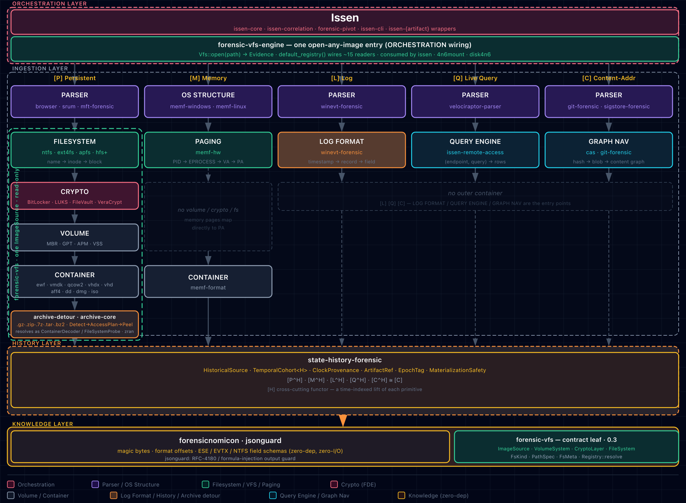

<p align="center">
  
  
</p>

<p align="center">
  <a href="https://github.com/SecurityRonin/issen/releases"></a>
  <a href="LICENSE"></a>
  <a href="https://github.com/SecurityRonin/issen/actions/workflows/ci.yml"></a>
  <a href="https://www.rust-lang.org"></a>
  <a href="#install"></a>
  <a href="https://github.com/sponsors/h4x0r"></a>
</p>

**One command turns disk + memory evidence into a correlated, ATT&CK-mapped attack narrative.**

Issen is the orchestration layer of the SecurityRonin forensic fleet — a multi-crate Rust workspace and the `issen` CLI. Hand it acquired evidence, and it auto-detects the container, triages the filesystem for the artifacts that matter, parses each one, and builds a single queryable timeline you can scan and report on.

---

```bash
# One command: ingest disk artifacts, parse memory dumps, correlate, and scan —
# in a single resumable pass. Auto-detects E01/EWF/VMDK/raw + memory dumps.
issen evidence.E01 memory.raw -o case.duckdb

# Read the result: the correlated attack narrative as text (or a shareable HTML report)
issen report case.duckdb --format text
```

One command takes a raw acquisition to a correlated attack narrative. No Python env, no dependency hell — one static binary.

**Resumable by default.** Ingest fingerprints each artifact by content, so re-running re-parses only what changed — a crash, an added source, or a repeated run picks up where it stopped instead of redoing the whole case. An unchanged warm re-ingest drops from **7.36 s to 0.20 s** (~37×): the second pass reads nothing it already has.

---

## How it works

Issen ingests evidence from five independent source types, then correlates across all of them:

<a href="https://securityronin.github.io/issen/architecture-diagram.html">
  
</a>

*Click the diagram to open the [full interactive version](https://securityronin.github.io/issen/architecture-diagram.html).*

- **Ingests** UAC live response collections, Velociraptor query results, EVTX logs, memory dumps, git repositories, and OCI registries — simultaneously.
- **Correlates** evidence across all five source types using the Pivot engine: a network connection isn't a finding on its own; combined with a hidden PID, a loaded rootkit library, and a supply-chain hash match, it is.
- **Outputs** a structured Finding with severity, rule name, and the full evidence chain — ready for your report.

No Python env. No dependency hell. One static binary.

### The five source types

| ID | Source | Navigation primitive | What it captures |
|---|---|---|---|
| **[P]** | Persistent Storage | `name → inode → block` | Disk images (E01/raw), filesystems, file artifacts |
| **[M]** | Memory | `PID → EPROCESS → VA → PA` | RAM dumps, hiberfil.sys, live-at-time process state |
| **[L]** | Log | `timestamp → record → field` | EVTX, journal, tracev3, CloudTrail, Zeek/Suricata |
| **[Q]** | Live Query | `(endpoint, query, cursor) → rows` | Ephemeral state an attacker cannot retroactively destroy |
| **[C]** | Content-Addressed | `hash → blob → content graph` | Supply chain provenance, Merkle DAG traversal |

**[Q] Live Query** differs fundamentally from the other sources: the data is *produced* by a query rather than *retrieved* from storage. Once captured, the result set is attacker-durable — no subsequent disk wipe changes what `velociraptor collect` saw at query time. The query itself becomes part of the evidence chain.

**[C] Content-Addressed** gives every artifact a globally-unique, tamper-evident identity: its hash. Issen can pivot from a malicious binary hash across git commits, OCI image layers, and Sigstore transparency log entries to answer "which systems ran this exact blob, when, and where did it come from?"

---

## Install

```bash
# Prebuilt binaries — Windows .exe/.msi and Apple-silicon .dmg — on the Releases page:
#   https://github.com/SecurityRonin/issen/releases

# …or build from source (uses the pinned toolchain in rust-toolchain.toml)
cargo install --git https://github.com/SecurityRonin/issen issen-cli

# Verify
issen --version
```

## The headline workflow

```bash
# The default pipeline — ingest disk artifacts, parse memory dumps, correlate
# cross-artifact rules, and scan cached threat-intel feeds. Pass any mix of disk
# images and memory dumps; re-run the same command to resume where it stopped.
issen DC01.E01 DESKTOP.E01 DC01-memory.raw -o case.duckdb

# Read the result: correlated findings as text, or a self-contained HTML report
issen report case.duckdb --format text
issen report case.duckdb -o report.html
```

Issen auto-detects each container via its `CollectionProvider` registry, triages the NTFS volume for the artifacts that matter, parses each one, walks memory dumps for process / network / injection state, and correlates everything into one super-timeline. `issen timeline`, `issen report`, and `issen info` all read the same DuckDB database.

### What it triages from a disk image

When the evidence is a Windows disk image, Issen walks the NTFS filesystem and extracts:

- **`$MFT`** — the Master File Table (file metadata + timestamps)
- **`$Extend\$UsnJrnl:$J`** — the USN change journal (file create/delete/rename history)
- **All `.evtx`** event logs under `Windows\System32\winevt\Logs` (Security, System, Application, Sysmon, and every other channel)
- **Registry hives** — `SYSTEM`, `SOFTWARE`, `SAM`, `SECURITY`, `DEFAULT`, plus per-user `NTUSER.DAT`
- **`SRUDB.dat`** — the System Resource Usage Monitor database

### Fastest evidence formats

Issen reads only the artifacts a triage needs, so it ingests fastest from containers that allow random access **without inflating the whole image**. For the quickest runs:

- ✅ **E01/EWF** — chunk-indexed, so reads stay selective at full compression. The recommended default for acquired evidence.
- ✅ **raw `.dd`**, or an image stored *uncompressed* inside a **zip** — zero decompression.
- ✅ **`.bz2` / `.tar.bz2`** — block-seekable; reads decode only the blocks they touch.
- ✅ **deflate-compressed zip** (e.g. an `.E01.zip` — the shape evidence often ships in) — made seekable by a pure-Rust `zran` DEFLATE index: bounded RAM, decodes only the blocks a triage touches (validated reading an **80 GB** image at **304 MB** peak RSS). Pays a one-pass index build.
- ⚠️ **`.tar.gz`, `.7z`** — no random-access unit, so Issen must decompress the *entire* image before it can read anything. Fine for transport (e.g. an `.E01.7z`), but extract it to a fast format first.

See [Selective Decompression for Triage](https://github.com/SecurityRonin/issen/blob/main/docs/selective-decompression-triage.md) for why.

---

## Subcommands

| Command | What it does |
|---|---|
| `issen <evidence…>` | **The default pipeline** — ingest disk + memory evidence, correlate, scan, and analyse memory in one resumable pass (`-o` names the case DB) |
| `issen timeline` | Query and export the timeline (text, JSON, CSV, bodyfile; `--flagged` for findings) |
| `issen report` | Render the correlated findings as text (`--format text`) or a self-contained HTML report |
| `issen info` | Show information about a timeline database |
| `issen memory` | Analyse a physical memory dump (LiME, AVML, Windows crash dump, raw) — processes, netstat, injection, creds |
| `issen scan` | Scan files or indicators against threat-intel signatures (YARA / Sigma / hash / network) |
| `issen remote-access` | Scan evidence for remote-access infrastructure (LOLRMM rule set) |
| `issen rules` | List the bundled detection rules ("what detections do you have?") |
| `issen feed` | Manage threat-intelligence feeds (list, update, inspect) |
| `issen srum` | Parse and query SRUM (System Resource Usage Monitor) data |
| `issen biome` | Parse an Apple Biome `App.MenuItem` SEGB file — macOS menu-bar selections |
| `issen frequency` | Rare-event frequency / stacking analysis across EVTX |
| `issen processes` | Process-creation events from one or more EVTX files |
| `issen session` | Correlate Windows logon sessions from EVTX |

```bash
# Query the timeline; show only flagged findings at high+ severity
issen timeline timeline.duckdb --flagged --min-severity high

# Export the timeline as CSV or a bodyfile for cross-tool timelining
issen timeline timeline.duckdb --format csv
issen timeline timeline.duckdb --format bodyfile

# Analyse a physical memory dump (LiME, AVML, crash dump)
issen memory dump.lime --command all

# Scan files against YARA / Sigma / hash / STIX signatures
issen scan evidence/ --auto-feeds

# Update threat-intel feeds (YARA, Sigma, STIX, Zeek, Suricata)
issen feed update
```

---

## Trust but verify

Issen has been run end-to-end against a real **29 GB DEF CON E01** acquisition: it auto-detected the container, triaged the NTFS volume, and parsed **843 artifacts** into a **431,863-event** DuckDB timeline. Synthetic fixtures miss real-world quirks; validation against genuine acquired evidence is part of the development discipline.

---

## Fast on real evidence

Engineered to stay bounded at real-world scale — measured, not asserted:

- **Bounded RAM at any size.** Reads an **80 GB** macOS image straight from its deflate-compressed zip (the `zran` DEFLATE index) at **304 MB** peak RSS — RAM doesn't scale with image size.
- **Resumable by default.** Re-ingesting an unchanged case drops **7.36 s → 0.20 s** (~37×); only changed content re-parses.
- **Parallel and deterministic.** Evidence sources and their artifacts parse concurrently, and the timeline is byte-identical regardless of which finishes first.
- **Columnar bulk-load.** Events land through DuckDB's columnar appender, not row-at-a-time inserts — the ingest insert phase runs **~11× faster** (194 s → 17 s).

---

## What it covers

| Category | Formats / Sources |
|---|---|
| **Collection formats** | UAC `.tar.gz`, Velociraptor, KAPE triage zip |
| **Disk images** | E01/EWF, raw DD (split images), VMDK, VHD, VHDX, QCOW2, ISO9660 — auto-detected via a `CollectionProvider` registry |
| **Filesystems** | NTFS (the Windows disk leg — MFT/USN/hives/$I$R), ext4, APFS [planned] |
| **Memory formats** | LiME, AVML, WinPMEM, crash dump (DMP), Hibernation (hiberfil.sys) |
| **Log streams** | EVTX, Zeek `conn.log`, Suricata EVE, systemd journal [planned], Apple Unified Log [planned], CloudTrail [planned] |
| **Live query** | Velociraptor VQL, WMI/WQL [planned], OSQuery SQL [planned] |
| **Content-addressed** | git repositories, OCI image registries, IPFS [planned], Sigstore transparency log [planned] |
| **Detection types** | YARA rules, Sigma rules, STIX 2.1 indicators, hash IOCs, Suricata rules |
| **Artifact sources** | MFT, USN Journal, EVTX, registry hives (incl. Shimcache / UserAssist / network config), Amcache, Prefetch, LNK / Jump Lists, Recycle Bin ($I/$R content), browser history, SRUM, Apple Biome |
| **Network analysis** | Volatility sockstat, Zeek logs, Suricata EVE, pcap |
| **Output formats** | Terminal (colour-coded), JSON, HTML report, PDF, STIX 2.1 Attack Flow, AFB (Attack Flow Builder), DOT/PNG (Graphviz), Mermaid, CSV, bodyfile, DuckDB timeline |
| **RAT detection** | LOLRMM rule set (400+ tools) |
| **Attack Flow ingestion** | CTID Attack Flow v3.0.0 corpus — parse STIX bundles → correlation rules via BFS DAG traversal |
| **Attack Flow output** | STIX 2.1 bundle, `.afb` (Attack Flow Builder), Mermaid `flowchart LR`, PNG (via Graphviz or mmdc) |
| **VSS awareness** | Enumerates Volume Shadow Copies in evidence trees; `is_vss_path` guard prevents double-counting |
| **Time-skew detection** | Flags timestamp divergence > 5 min across sources for the same artifact — anti-forensics signal |
| **Event clustering** | Groups evidence by PID, user, or path for focused correlation queries |

---

## Ecosystem

Issen is the thin correlation layer on top of a family of deep forensic libraries. Each library is independently usable in your own tooling.

| Crate | Source | Layer | Description |
|---|---|---|---|
| [forensicnomicon](https://github.com/SecurityRonin/forensicnomicon) | all | Knowledge | Zero-dep compile-time artifact specs, magic bytes, format constants |
| [state-history-forensic](https://github.com/SecurityRonin/state-history-forensic) | `[H]` | Knowledge | Zero-dep `[H]` functor traits: `HistoricalSource`, `TemporalCohort<H>`, `ClockProvenance`, multi-facet `ArtifactRef` |
| [ewf](https://github.com/SecurityRonin/ewf) | [P] | Container | E01/EWF → raw sector stream with hash verification |
| [ext4fs-forensic](https://github.com/SecurityRonin/ext4fs-forensic) | [P] | Filesystem | ext4 sector stream → files by path (name → inode → block) |
| [4n6mount](https://github.com/SecurityRonin/4n6mount) | [P] | Filesystem | FUSE bridge — makes any container+filesystem pair look like a normal path |
| [memory-forensic](https://github.com/SecurityRonin/memory-forensic) | [M] | Container + Paging + OS Structure | WinPMEM/LiME/hiberfil → page stream → VA→PA → EPROCESS/VAD/DPAPI |
| [winevt-forensic](https://github.com/SecurityRonin/winevt-forensic) | [L] | Log Format + Parser | EVTX binary seek + BinXML decode → typed Windows EventRecord |
| [browser-forensic](https://github.com/SecurityRonin/browser-forensic) | [P][M] | Parser | Chrome/Firefox/Safari history, cookies, downloads, bookmarks, session data |
| [srum-forensic](https://github.com/SecurityRonin/srum-forensic) | [P][L] | Parser | ESE/JET Blue page walk → SRUM network/process/energy usage records |
| issen-remote-access | [Q] | Query Engine | Live query dispatcher — Velociraptor VQL, LOLRMM 400+ tool definitions |
| cas-forensic [planned] | [C] | CAS + Graph | git/OCI/IPFS hash-addressed object store → Merkle DAG navigation |
| git-forensic [planned] | [C] | Graph + Parser | git commit/blob/tree forensics → supply chain provenance |
| sigstore-forensic [planned] | [C] | Graph + Parser | Sigstore transparency log entries → artifact signing chain |

<details>
<summary>Full layer hierarchy</summary>

```
KNOWLEDGE
  forensicnomicon        zero-dep, compile-time artifact specs, format constants
  state-history-forensic zero-dep, [H] functor traits: HistoricalSource,
                         TemporalCohort<H>, ClockProvenance, ArtifactRef, …

CONTAINER              decode a raw source format → addressable data stream
  ewf                  E01/EWF → raw sector stream
  memf-format          memory dumps (WinPMEM, LiME, hiberfil.sys) → raw page stream
  (log containers are integrated within each log-format crate)

Five parallel paths from CONTAINER — each with its own address space
and navigation primitive:

[P] Persistent Storage        [M] Memory              [L] Log
  navigate by: path             navigate by: PID        navigate by: timestamp
  name → inode → block          PID → EPROCESS          timestamp → record → field
                                → VA → PA

  FILESYSTEM                    PAGING                  LOG FORMAT
    ext4fs-forensic               memf-hw                 winevt-forensic (EVTX)
    ntfs-forensic [planned]       PML4/PAE/AArch64        journal-forensic [planned]
    apfs-forensic [planned]       OS STRUCTURE            tracev3-forensic [planned]
    4n6mount (FUSE bridge)          memf-windows            zeek-forensic [planned]
                                    EPROCESS, VAD           cloudtrail-src [planned]
                                    DPAPI, DKOM
                                    memf-linux [planned]

[Q] Live Query                [C] Content-Addressed
  navigate by: query            navigate by: hash
  (endpoint, query, cursor)     hash → blob → content graph
  → result rows

  QUERY ENGINE                  GRAPH NAVIGATION
    issen-remote-access           cas-forensic
    velociraptor-parser           git-forensic [planned]
    WQL / OSQuery [planned]       sigstore-forensic [planned]

[H] State-History (cross-cutting functor — shared traits in state-history-forensic)
  [P^H] vss-history [planned]            VSS shadow copies, Time Machine, btrfs
  [P^H] apfs-snapshot-history [planned]  APFS snapshots
  [M^H] mem-history [planned]            hiberfil chain, VMware memory snapshots
  [L^H] log-history [planned]            journald sealed epochs, rotated logs
  [Q^H] query-history [planned]          point-in-time osquery exports
  [C^H] ≅ [C]                            git already encodes its own history (identity functor)

PARSER                   interpret artifact records → forensic meaning
  browser-forensic       browser artifact files / SQLite pages → BrowserEvent
  winevt-forensic        EVTX records → EventRecord
  srum-forensic          ESE page bytes → SrumRecord

ORCHESTRATION
  Issen            wires all five paths, cross-artifact correlation, CLI
```

</details>

---

## Architecture

<details>
<summary>Crate layout</summary>

```
issen-cli                   # The issen binary — commands and arg parsing
issen-core                  # Shared types, plugin traits, error types
issen-timeline              # DuckDB (primary) + SQLite export timeline store
issen-fswalker              # Parallel filesystem walk via rayon; SHA-256 integrity; VSS awareness
issen-unpack                # Collection format detection (UAC tar.gz, Velociraptor, KAPE)
issen-remote-io             # Remote storage I/O — 48 URI schemes via OpenDAL (S3, GCS, Azure, SFTP, …)
issen-signatures            # YARA-X, Sigma/Tau-Engine, Hash/Network/STIX/Suricata IOCs, feed sync
issen-correlation           # Pivot engine: YAML rules, Attack Flow STIX ingestion, zeek-intel, time-skew, clustering
issen-remote-access         # LOLRMM 400+ tool definitions, RMM/RAT detection; Velociraptor VQL dispatcher
issen-mem                   # Memory forensics bridge (memf-* sibling workspace)
issen-report                # HTML/PDF/STIX/AFB/Mermaid/DOT+PNG report generation
issen-mft-tree              # MFT heuristic analysis
issen-navigator             # Interactive TUI navigation
issen-ewf                   # EWF/E01 forensic image support
issen-evtx                  # Windows Event Log bridge
parsers/issen-parser-mft    # NTFS MFT + USN Journal parser
parsers/issen-parser-evtx   # Windows Event Log parser
parsers/issen-parser-uac    # UAC collection format parser
parsers/issen-parser-velociraptor  # Velociraptor collection parser
forensic-pivot              # Sigma/Suricata/STIX rule pivoting
```

Each crate is independently testable and versioned. The CLI wires them together; you can also use the crates as a library in your own tooling.

</details>

---

## Correlation Rules

Most tools find indicators. Issen finds **attack patterns** by joining evidence across sources automatically.

A Correlation Rule looks like this:

```yaml
id: correlation.miner.rootkit-concealment
severity: critical
description: Rootkit concealing cryptominer activity via LD_PRELOAD
within_seconds: 300
references:
  - https://redcanary.com/threat-detection-report/trends/linux-coinminers/
clauses:
  - source: artifact
    required_tag: rootkit_indicator
  - source: memory
    required_tag: miner_thread
  - source: memory
    required_tag: mining_pool
```

Rules are YAML files in `~/.config/issen/rules/`. Ship your own. Share with your team.

The bundled rule set ships with rules covering miners, rootkits, SSH tunnels, LD_PRELOAD persistence, hidden processes, and LOLRMM RATs. Custom rules compose with the built-ins — a single `issen <evidence>` pass evaluates all of them.

### Attack Flow STIX ingestion

The correlation engine also ingests CTID Attack Flow v3.0.0 corpus bundles (STIX 2.1 JSON). Each bundle is parsed into an `AttackFlowBundle` and converted to a `CorrelationRule` via BFS traversal of the `effect_refs` DAG. Every `attack-action` with a `technique_id` becomes a rule clause with `required_tag: "technique:<ID>"`. The bundled corpus is downloaded with `issen feed update`.

```bash
# Fetch and index the Attack Flow corpus
issen feed update

# The engine evaluates Attack Flow rules alongside your YAML rules in the default pass
issen collection.tar.gz
```

<details>
<summary>Why YAML rules and not hard-coded detections?</summary>

Hard-coded detections age badly. Threat actors change port numbers, rename binaries, and swap libraries. YAML rules are versionable, shareable, and reviewable in a pull request. The correlation engine is stable; the rules are data.

</details>

---

## Demo

```
$ issen collection-WIN10-CORP-20260401.zip

+===========================================================+
|  Issen — Collection Analysis                              |
+===========================================================+

  Collection : collection-WIN10-CORP-20260401.zip
  Host       : WIN10-CORP
  OS         : Windows 10 Enterprise 22H2 (19045.4291)
  Collected  : 2026-04-01T14:32:07Z
  Artifacts  : MFT, EVTX, Registry, Prefetch, Amcache

  Parsed 1,247,831 MFT entries in 3.2s
  Parsed 48 EVTX logs (312,406 events) in 1.8s
  Parsed 4 registry hives in 0.4s

+- PERSISTENCE ───────────────────────────────────────────
|
|  [SERVICE] AnyDeskMaint
|    Binary  : C:\ProgramData\Temp\Support\anydesk.exe --service
|    Start   : Auto (SERVICE_AUTO_START)
|    Account : LocalSystem
|    Created : 2026-03-28T09:14:22Z
|
|  [REG RUN KEY] HKLM\SOFTWARE\Microsoft\Windows\CurrentVersion\Run
|    Name    : AnyDeskUpdate
|    Value   : "C:\ProgramData\Temp\Support\anydesk.exe" --start-with-win
|    Modified: 2026-03-28T09:14:38Z

+- REMOTE ACCESS ─────────────────────────────────────────
|
|  [LOLRMM] AnyDesk (relocated binary)
|    Path    : C:\ProgramData\Temp\Support\anydesk.exe
|    SHA256  : a1b2c3d4e5f60718293a4b5c6d7e8f90aabbccdd11223344556677889900eeff
|    Size    : 5,389,312 bytes
|    Signed  : philandro Software GmbH (valid, not revoked)
|    Config  : ad.router.custom_id = "corp-maint-04"
|
|  [C2 CONNECTION]
|    Dest IP : 194.36.28.117:7070
|    First   : 2026-03-28T09:17:03Z
|    Last    : 2026-04-01T13:58:41Z
|    Note    : IP not in AnyDesk relay network (AS 208323 / BL Networks, RU)

+- TIMELINE ──────────────────────────────────────────────
|
|  2026-03-28T09:12:55Z  [EVTX Security 4624]  Logon Type 3 — CORP\svc_backup
|                         from 10.20.5.44 (WIN-RUNBOOK)
|  2026-03-28T09:14:18Z  [MFT]  File created: C:\ProgramData\Temp\Support\anydesk.exe
|                         Parent created at same time — directory is new
|  2026-03-28T09:14:22Z  [EVTX System 7045]   Service installed: AnyDeskMaint
|                         ImagePath: C:\ProgramData\Temp\Support\anydesk.exe --service
|                         Account: LocalSystem | Type: user mode (0x10)
|  2026-03-28T09:17:03Z  [EVTX Security 5156] Outbound TCP — anydesk.exe (PID 6284)
|                         -> 194.36.28.117:7070

+- CORRELATION FINDINGS ──────────────────────────────────
|
|  [CRITICAL] LOLRMM with non-vendor C2 infrastructure
|    Rule    : remote-access.lolrmm.custom-c2
|    Evidence: AnyDesk outside vendor path (C:\ProgramData\Temp\Support\)
|              Outbound -> 194.36.28.117 (AS 208323, not AnyDesk relay ASN)
|              MFT entry + EVTX 7045 + EVTX 5156 + Registry Run key
|    MITRE   : T1219, T1543.003
|
|  [HIGH] Lateral movement via service account
|    Rule    : lateral-movement.service-account.file-drop
|    Evidence: Type 3 logon CORP\svc_backup from 10.20.5.44 (WIN-RUNBOOK)
|              File drop + service install within 120s of logon
|    MITRE   : T1021.002

  2 findings | 1 critical, 1 high | 4 artifact sources correlated
```

The correlation engine flagged AnyDesk installed under `C:\ProgramData\Temp\Support\` — not its standard `Program Files` path — with outbound connections to a Russian ASN outside AnyDesk's relay infrastructure. The timeline shows a service account logon from an internal host, followed by file drop, service install, and first C2 callback within a four-minute window: the attacker pivoted from `WIN-RUNBOOK` using `svc_backup` credentials to deploy the RAT on `WIN10-CORP`.


---

## Acknowledgements

**Hal Pomeranz** whose forensic Linux training materials documented ext4 inode/block internals that inform the filesystem layer design.

**Yogesh Khatri** (@SwiftForensics) whose [srum-dump](https://github.com/MarkBaggett/srum-dump) Python tool proved the forensic value of SRUM data and documented the ESE table schemas.

**Jared Atkinson** and the [hayabusa](https://github.com/Yamato-Security/hayabusa) / **Yamato Security** team for pioneering fast, rule-based EVTX triage in Rust and demonstrating the performance ceiling the ecosystem should target.

The [Volatility Foundation](https://github.com/volatilityfoundation/volatility3) for open-sourcing memory forensics algorithms and kernel structure offsets that inform the memory path design.

The [Plaso](https://github.com/log2timeline/plaso) / log2timeline team for proving the value of super-timelines and establishing the artifact-to-timeline ingestion model that Issen builds on.

---

[Privacy Policy](https://securityronin.github.io/issen/privacy/) · [Terms of Service](https://securityronin.github.io/issen/terms/) · © 2026 Security Ronin Ltd.
