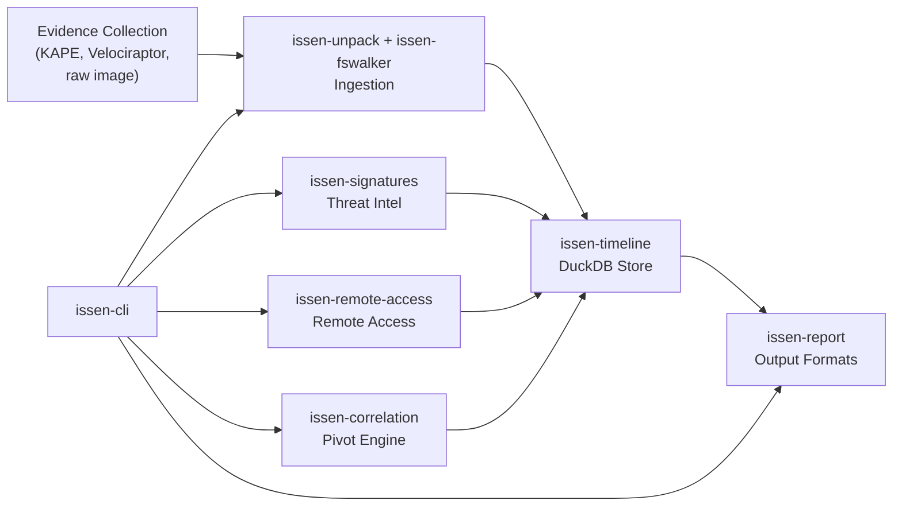
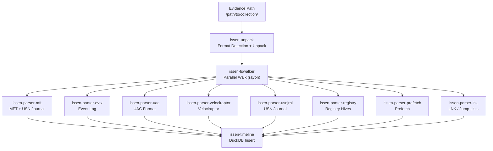
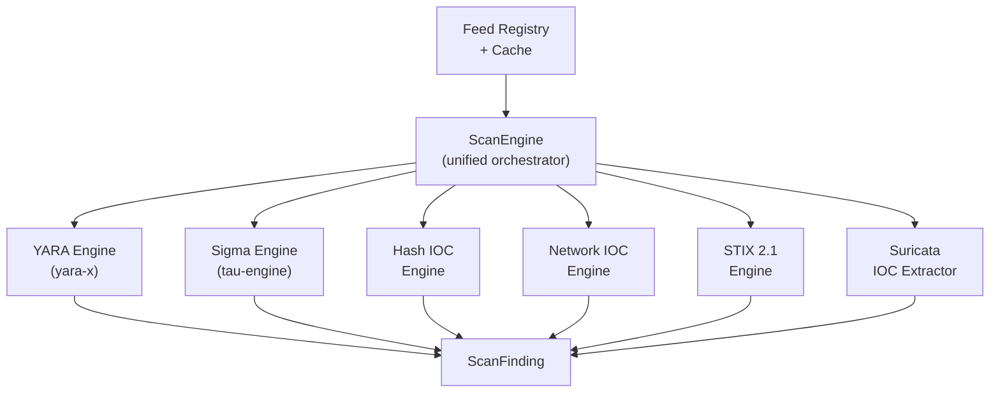
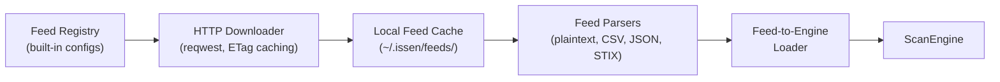
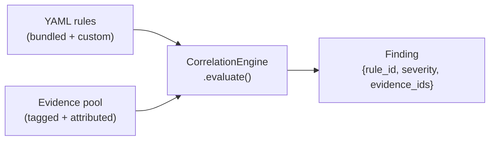
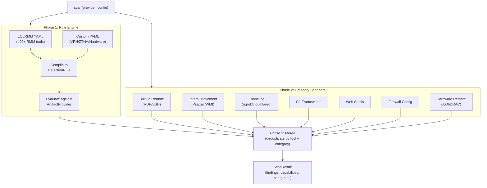
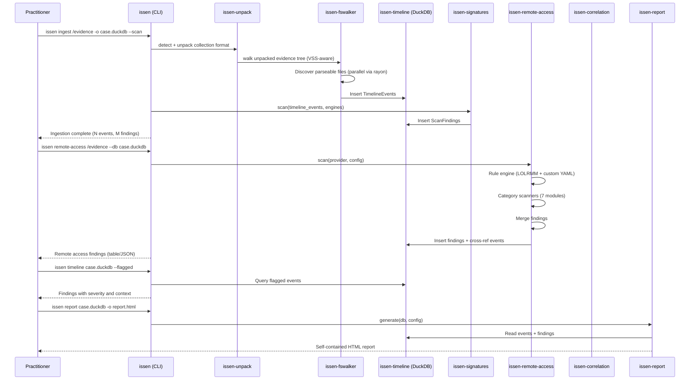

# Architecture

> **Interactive diagram:** [architecture-diagram.html](architecture-diagram.html) — full system map with all 25 crates, cloud backends, detection engines, and data flow.

This document describes Issen's architecture using progressive disclosure. Start with the overview, then drill into subsystems as needed.

## Overview

Issen transforms forensic evidence collections into structured timelines and assessment findings. Evidence goes in, a DuckDB database with parsed events, signature matches, and remote access detections comes out.



The CLI (`issen`) is the entry point. It dispatches to four subsystems: the ingestion pipeline, signature scanning, remote access detection, and report generation. All subsystems write to or read from a shared DuckDB timeline database.

## Workspace Structure

25 crates in a Cargo workspace, organized by responsibility:

```mermaid
graph TD
    subgraph CLI["CLI Layer"]
        issen-cli
    end

    subgraph Assessment["Assessment Layer"]
        issen-signatures
        issen-remote-access
        issen-correlation
    end

    subgraph Pipeline["Pipeline Layer"]
        issen-unpack
        issen-fswalker
        issen-report
        issen-navigator
        issen-mft-tree
    end

    subgraph Storage["Storage Layer"]
        issen-timeline
    end

    subgraph RemoteIO["Remote I/O Layer"]
        issen-remote-io
    end

    subgraph Memory["Memory Layer"]
        issen-mem
    end

    subgraph Parsers["Parser Plugins"]
        issen-parser-mft
        issen-parser-evtx
        issen-parser-uac
        issen-parser-velociraptor
        issen-parser-usnjrnl
        issen-parser-registry
        issen-parser-prefetch
        issen-parser-lnk
    end

    subgraph Foundation["Foundation"]
        issen-core
        issen-plugin-sdk
        issen-ewf
        issen-shrinkpath
    end

    issen-cli --> issen-unpack
    issen-cli --> issen-fswalker
    issen-cli --> issen-signatures
    issen-cli --> issen-remote-access
    issen-cli --> issen-correlation
    issen-cli --> issen-report
    issen-cli --> issen-mem
    issen-cli --> issen-navigator
    issen-cli --> issen-remote-io
    issen-unpack --> issen-core
    issen-fswalker --> issen-core
    issen-fswalker --> issen-plugin-sdk
    issen-signatures --> issen-core
    issen-remote-access --> issen-core
    issen-remote-access --> issen-timeline
    issen-correlation --> issen-core
    issen-correlation --> issen-timeline
    issen-report --> issen-timeline
    issen-report --> issen-core
    issen-timeline --> issen-core
    issen-mft-tree --> issen-core
    issen-parser-mft --> issen-core
    issen-parser-mft --> issen-plugin-sdk
    issen-parser-evtx --> issen-core
    issen-parser-evtx --> issen-plugin-sdk
    issen-parser-uac --> issen-core
    issen-parser-uac --> issen-plugin-sdk
    issen-parser-velociraptor --> issen-core
    issen-parser-velociraptor --> issen-plugin-sdk
    issen-parser-usnjrnl --> issen-core
    issen-parser-usnjrnl --> issen-plugin-sdk
    issen-parser-registry --> issen-core
    issen-parser-registry --> issen-plugin-sdk
    issen-parser-prefetch --> issen-core
    issen-parser-prefetch --> issen-plugin-sdk
    issen-parser-lnk --> issen-core
    issen-parser-lnk --> issen-plugin-sdk
    issen-unpack --> issen-ewf
```



**Dependency rule:** Arrows point downward. Higher layers depend on lower layers, never the reverse. `issen-core` has no internal dependencies.

### Crate Responsibilities

| Crate | Layer | Responsibility |
|-------|-------|---------------|
| `issen-core` | Foundation | Shared types (`TimelineEvent`, `ArtifactType`, `EventType`), plugin traits, error types, configuration |
| `issen-plugin-sdk` | Foundation | Parser plugin registration via `inventory` crate. Parsers register themselves at compile time |
| `issen-ewf` | Foundation | Expert Witness Format (E01) forensic image reading |
| `issen-shrinkpath` | Foundation | Path abbreviation utilities |
| `issen-timeline` | Storage | DuckDB columnar timeline store. Insert events, query by time/type/source, export to SQLite, CSV, and bodyfile |
| `issen-unpack` | Pipeline | Collection format detection and unpacking (UAC tar.gz, Velociraptor, KAPE) |
| `issen-fswalker` | Pipeline | Parallel filesystem walk via rayon; SHA-256 integrity hashing; VSS/shadow-copy awareness; dispatches parsers via plugin SDK |
| `issen-report` | Pipeline | HTML, PDF, STIX 2.1 Attack Flow, AFB, Mermaid, and DOT/PNG report generation from timeline data |
| `issen-navigator` | Pipeline | Interactive TUI navigation for timeline and findings |
| `issen-mft-tree` | Pipeline | MFT heuristic analysis |
| `issen-remote-io` | Remote I/O | Remote storage I/O via OpenDAL 0.55: 48 URI schemes including S3, GCS, Azure Blob, WebDAV, SFTP, HDFS, Google Drive (OAuth2) |
| `issen-mem` | Memory | Memory forensics bridge into the memf-* sibling workspace |
| `issen-signatures` | Assessment | Six detection engines (YARA-X, Sigma/Tau-Engine, Hash IOC, Network IOC, STIX, Suricata) + feed infrastructure |
| `issen-remote-access` | Assessment | Remote access detection: LOLRMM rule engine (400+ tools) + 7 category scanners + DuckDB findings store |
| `issen-correlation` | Assessment | Pivot engine: YAML correlation rules, Attack Flow STIX ingestion, time-skew detection, event clustering, zeek-intel |
| `issen-parser-mft` | Parsers | NTFS MFT + USN Journal parser. Registers via `inventory::submit!` |
| `issen-parser-evtx` | Parsers | Windows Event Log (EVTX) parser. Registers via `inventory::submit!` |
| `issen-parser-uac` | Parsers | UAC collection format parser; hidden-PID detection, sockstat analysis. Registers via `inventory::submit!` |
| `issen-parser-velociraptor` | Parsers | Velociraptor collection parser. Registers via `inventory::submit!` |
| `issen-parser-usnjrnl` | Parsers | Windows USN Change Journal parser. Registers via `inventory::submit!` |
| `issen-parser-registry` | Parsers | Windows registry hive parser (notatin). Run keys, services, shimcache, amcache. Registers via `inventory::submit!` |
| `issen-parser-prefetch` | Parsers | Windows Prefetch (`.pf`) file parser — execution evidence. Registers via `inventory::submit!` |
| `issen-parser-lnk` | Parsers | LNK shortcut and Jump List parser — lateral movement evidence. Registers via `inventory::submit!` |
| `issen-cli` | CLI | Command-line interface. Parses args, dispatches to subsystems, formats output |
| `xtask` | Build | Build automation tasks |

---

## Ingestion Pipeline

The pipeline ingests an evidence collection and produces a DuckDB timeline. It uses a layered architecture where each layer handles one level of abstraction.



### VSS / Shadow Copy Awareness

`issen-fswalker` enumerates VSS snapshots in the evidence root using `list_vss_volumes`. Each discovered snapshot directory (Windows-style `HarddiskVolumeShadowCopy*`, Unix-style `vss/*/` or `shadow/*/`, and test-friendly `snapshot_*` / `shadow_*` / `vsc_*` prefixes) is walked independently. The `is_vss_path` guard prevents the same file from being double-counted if evidence already includes a mounted VSS path.

### Plugin System

Parsers register themselves at compile time using the `inventory` crate. The filesystem walker discovers registered parsers at runtime without hardcoded dispatch:

```rust
// In issen-parser-mft:
inventory::submit! {
    ParserPlugin::new("mft", &["$MFT"], parse_mft)
}

// In issen-fswalker:
for plugin in inventory::iter::<ParserPlugin> {
    if plugin.can_parse(file_path) {
        plugin.parse(file_path, &timeline)?;
    }
}
```

Adding a new parser means creating a new crate, implementing the trait, and linking it — no changes to the pipeline, timeline, or CLI are required.

### Timeline Schema

All parsed events become `TimelineEvent` records in DuckDB:

| Column | Type | Description |
|--------|------|-------------|
| `timestamp` | `TIMESTAMP_NS` | Event time (nanosecond precision) |
| `event_type` | `VARCHAR` | `FileCreate`, `FileDelete`, `ProcessExec`, `LogonEvent`, ... |
| `source` | `VARCHAR` | Artifact type: `UsnJournal`, `MFT`, `EventLog`, ... |
| `path` | `VARCHAR` | File path or event identifier |
| `description` | `VARCHAR` | Human-readable event summary |
| `evidence_source` | `VARCHAR` | Case/host identifier |
| `metadata` | `VARCHAR` (JSON) | Artifact-specific structured data |

DuckDB's columnar storage makes time-range and type-filtered queries fast, even with millions of events. The `issen timeline` command supports `--format text`, `--format json`, `--format csv`, and `--format bodyfile` export.

---

## Signature Scanning

`issen-signatures` provides six detection engines behind a unified `ScanEngine` interface.



### Engine Details

| Engine | Input | Matching Strategy |
|--------|-------|-------------------|
| YARA | File bytes | Pattern matching via yara-x. Compiles rules once, scans files in parallel |
| Sigma | Timeline events | Converts events to field maps, evaluates detection logic via tau-engine |
| Hash IOC | File hashes | MD5/SHA-1/SHA-256 lookup in HashSet. Hashes computed on-the-fly |
| Network IOC | Event metadata | IP, domain, CIDR matching against string fields in event metadata |
| STIX 2.1 | Files + events | Extracts indicators from STIX bundles, dispatches to hash/network engines |
| Suricata | Rule files | Parses Suricata syntax to extract IPs, domains, ports as network IOCs |

### Feed Infrastructure

Threat intelligence feeds are downloaded, cached locally, and loaded into engines automatically:



Conditional HTTP requests (ETag / If-None-Match) avoid re-downloading unchanged feeds. Each feed has a format parser that extracts indicators into the appropriate engine.

**Built-in `FeedSpec` registry** includes:
- `sigmahq/sigma` — SigmaHQ rule archive (GitArchive)
- `neo23x0/signature-base` — YARA rules (GitArchive)
- `et/open` — Emerging Threats Suricata rules (SuricataUpdate)
- `zeek/packages` — Zeek intel packages (GitArchive)
- CTID Attack Flow v3.0.0 corpus — fetched with `download_attack_flow_corpus_zip` (`remote` feature)

---

## Correlation Engine

`issen-correlation` contains the Pivot engine, Attack Flow ingestion, time-skew detection, and event clustering.

### YAML Correlation Rules

Rules are YAML files with `id`, `severity`, `within_seconds`, and `clauses`. Each clause specifies a `source` (artifact, memory, zeek, sigma, …) and either a `required_tag` or `attr_predicates` (key=value matches on evidence attributes). The engine evaluates all clauses against the evidence pool and emits a `Finding` when all clauses are satisfied within the time window.



Bundled rules include:
- `correlation.miner.rootkit-concealment`
- `correlation.miner.ssh-stratum-tunnel`
- `correlation.network.ssh-tunnel-stratum`
- `correlation.persistence.ld-preload`
- `correlation.process.hidden-no-memory`

Custom rules in `~/.config/issen/rules/` merge with bundled rules by ID (duplicates are deduplicated).

### Attack Flow STIX Ingestion

`issen-correlation::attack_flow` parses CTID Attack Flow v3.0.0 STIX 2.1 bundles into `AttackFlowBundle` structs and converts them to `CorrelationRule` objects.

**Public API:**

| Function | Description |
|----------|-------------|
| `parse_attack_flow_bundle(json)` | Parse a STIX 2.1 bundle JSON string into `AttackFlowBundle`. Ignores identity, extension-definition, relationship, and other standard STIX objects. |
| `bundle_to_correlation_rules(bundle)` | BFS DAG traversal over `effect_refs` from `start_refs`. Each `attack-action` with a `technique_id` becomes a `RuleClause` with `required_tag: "technique:<ID>"`. Returns one `CorrelationRule` per bundle. |
| `bundle_to_flow_graph(bundle)` | Converts actions to `FlowNode`s and `effect_refs` to `FlowEdge`s for Mermaid rendering. Node IDs are short Excel-column-style strings (A, B, … Z, AA, …). Operators are pass-through (not rendered as nodes). |
| `extract_bundles_from_zip(zip_path)` | Scans a zip archive for STIX 2.1 JSON files containing attack-flow objects. Skips schema files and non-STIX JSON. |
| `download_attack_flow_corpus_zip(cache_dir)` | Downloads the CTID v3.0.0 corpus zip from GitHub. Requires the `remote` feature. |

**BFS conversion detail:** `bundle_to_correlation_rules` builds a `HashMap<id, AttackAction>` and `HashMap<id, AttackOperator>`. It starts BFS from `flow.start_refs` (or from actions not referenced by any other action's `effect_refs` if there is no flow root). Operators are pass-through nodes: when BFS reaches an operator, its `effect_refs` are enqueued without producing a clause. The resulting clauses preserve the BFS order of the attack chain.

### Time-Skew Detection

`issen-correlation::skew::detect_time_skew` groups `Evidence` items by their `path` attribute (falling back to `id`), then compares all pairs from different sources. When `|Δt| > threshold_secs` (default 300s), a `SkewFinding` is emitted. This is an anti-forensics signal: legitimate timestamps for the same artifact should agree across MFT, USN Journal, and Event Log.

### Event Clustering

`issen-correlation::cluster::cluster_events` groups `Evidence` items by:
- `ClusterKey::ByPid` — groups by `SubjectRef::Process(pid)`
- `ClusterKey::ByUser` — groups by `attrs["user"]`
- `ClusterKey::ByPath` — groups by `attrs["path"]`

Events without the requested attribute fall into the sentinel bucket `"__unknown__"`.

---

## Remote Access Detection

`issen-remote-access` uses a hybrid detection engine to find every category of remote access capability in forensic evidence.



### ArtifactProvider Trait

The scanner doesn't read forensic artifacts directly. Instead, it queries an `ArtifactProvider` trait that abstracts over available data sources:

```rust
pub trait ArtifactProvider: Send + Sync {
    fn capabilities(&self) -> Vec<ProviderCapability>;
    fn registry_values(&self, path: &str) -> Result<Vec<RegistryEntry>>;
    fn event_log_entries(&self, log_name: &str) -> Result<Vec<EventLogEntry>>;
    fn prefetch_entries(&self) -> Result<Vec<PrefetchEntry>>;
    fn file_exists(&self, path: &str) -> Result<bool>;
    // ... 12 methods total, all with default empty implementations
}
```

**Graceful degradation:** Every method has a default implementation returning empty results. If the evidence lacks Event Logs, event-based scanners silently skip rather than error.

---

## Report Generation

`issen-report` generates multiple output formats from correlation findings and timeline data.

### Output Formats

| Format | Function | Description |
|--------|----------|-------------|
| HTML | `generate_report()` | Self-contained HTML with embedded CSS. No external dependencies. Includes Mermaid attack chain diagrams. |
| PDF | `export_pdf(html, path)` | Strips HTML to plain text, writes a PDF via `printpdf` using the built-in Helvetica font. No external binaries required. |
| STIX 2.1 | `findings_to_stix_bundle(findings, title, author)` + `write_stix_bundle(bundle, path)` | Each `Finding` becomes one `attack-action` SDO. Severity maps to STIX confidence (critical→100, high→75, medium→50). |
| AFB | `findings_to_afb(findings, title)` + `write_afb(doc, path)` | Attack Flow Builder `.afb` JSON. Applies BFS-layered auto-layout: `x = layer × 300px`, `y` centred per layer. |
| Mermaid | `render_attack_chain(input)` | Color-coded `flowchart LR` by `AttackTactic`. Tactic CSS classes: `initial`, `exec`, `persist`, `evasion`, `c2`, `impact`, `unknown`. |
| Mermaid | `render_defenses(input)` | `flowchart TD` with PREVENT / DETECT / HUNT / GAPS subgraphs. Empty categories are omitted. |
| DOT | `render_attack_chain_dot(input)` | Graphviz DOT format (`rankdir=LR`, filled boxes, tactic fill colours). |
| PNG (Graphviz) | `render_attack_chain_png(input, path)` | Shells out to `dot -Tpng`. Requires Graphviz installed separately. |
| PNG (Mermaid) | `render_mermaid_png(mermaid_src, path)` | Shells out to `mmdc -i input -o output`. Requires mermaid-cli installed separately. |
| MISP | `build_misp_event(title, findings)` + `push_to_misp(event, base_url, key)` | Each finding string becomes a MISP attribute. `push_to_misp` POSTs to `{base_url}/events` with `Authorization` header. Requires `remote` feature. |

**System dependencies for PNG output:** `dot` (Graphviz) for `render_attack_chain_png`; `mmdc` (mermaid-cli / `@mermaid-js/mermaid-cli`) for `render_mermaid_png`. If neither is installed, the DOT/Mermaid source string outputs are available without external tools.

---

## Data Flow

End-to-end flow for a typical incident response engagement:



---

## Design Principles

**Correctness over speed.** Forensic accuracy is non-negotiable. Rust's type system and `unsafe_code = "deny"` enforce memory safety. `clippy::unwrap_used = "deny"` prevents silent panics. When speed and correctness conflict, correctness wins.

**Graceful degradation.** Missing artifacts produce coverage gaps, not crashes. Every parser failure is caught and logged. The pipeline continues with whatever data is available. Partial results with explicit warnings are more valuable than no results.

**Evidence integrity.** Issen never modifies source evidence. All data flows from evidence into new DuckDB databases. Read-only access to evidence is enforced by design.

**Plugin extensibility.** New artifact parsers are added by creating a crate, implementing the plugin trait, and linking it. No changes to the pipeline, timeline, or CLI are required.

**Progressive analysis.** Each command produces useful output independently. `issen ingest` creates a timeline. `issen scan` adds threat intel. `issen remote-access` adds infrastructure assessment. `issen report` generates deliverables. Run them all or run them individually.

---

## Key Dependencies

| Dependency | Version | Purpose |
|------------|---------|---------|
| `duckdb` | 1.x (bundled) | Columnar timeline storage, analytical queries |
| `yara-x` | 0.12 | YARA rule compilation and file scanning |
| `tau-engine` | 1.0 | Sigma rule evaluation |
| `opendal` | 0.55 | Remote storage abstraction (S3, GCS, Azure Blob, WebDAV, GDrive, SFTP, HDFS) |
| `notatin` | 1.0 | Windows registry hive parsing |
| `evtx` | 0.11 | Windows Event Log parsing |
| `mft` | 0.6 | NTFS Master File Table parsing |
| `printpdf` | 0.7 | PDF generation (built-in fonts, no external tools) |
| `ewf` | 0.1 | Expert Witness Format (E01) image support |
| `inventory` | 0.3 | Compile-time parser plugin registration |
| `clap` | 4.x | CLI argument parsing |
| `rayon` | 1.x | Parallel parser dispatch |
| `ratatui` | 0.29 | TUI framework for issen-navigator |
| `reqwest` | 0.12 | HTTP feed downloads (rustls-tls) |
| `serde` / `serde_yaml` | 1.x / 0.9 | LOLRMM YAML deserialization, rule loading |
| `serde_json` | 1.x | STIX/AFB/MISP JSON serialization |
| `uuid` | 1.x | STIX object ID generation |
| `tracing` | 0.1 | Structured logging and diagnostics |
| `zip` | 2.x | Attack Flow corpus zip extraction |

---

## Build and Test

```bash
# Full build
cargo build --workspace --release

# Full test suite
cargo test --workspace

# Single crate
cargo test -p issen-remote-access
cargo test -p issen-signatures
cargo test -p issen-correlation
cargo test -p issen-report

# Lints
cargo clippy --workspace --lib --bins
```

Minimum Rust version: 1.80. C compiler required for bundled DuckDB.

**Optional system dependencies** (not required for the build, only for PNG output):
- `dot` (Graphviz) — `render_attack_chain_png`
- `mmdc` (`@mermaid-js/mermaid-cli`) — `render_mermaid_png`
