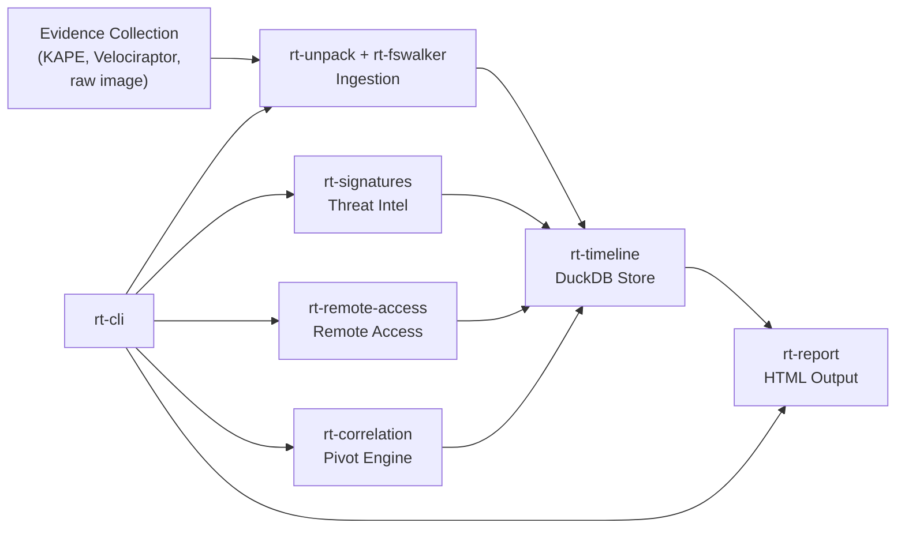
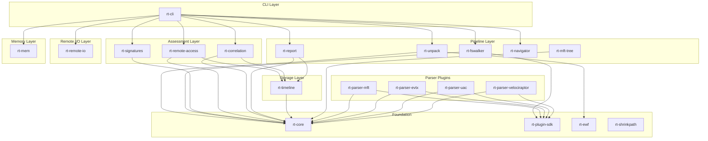
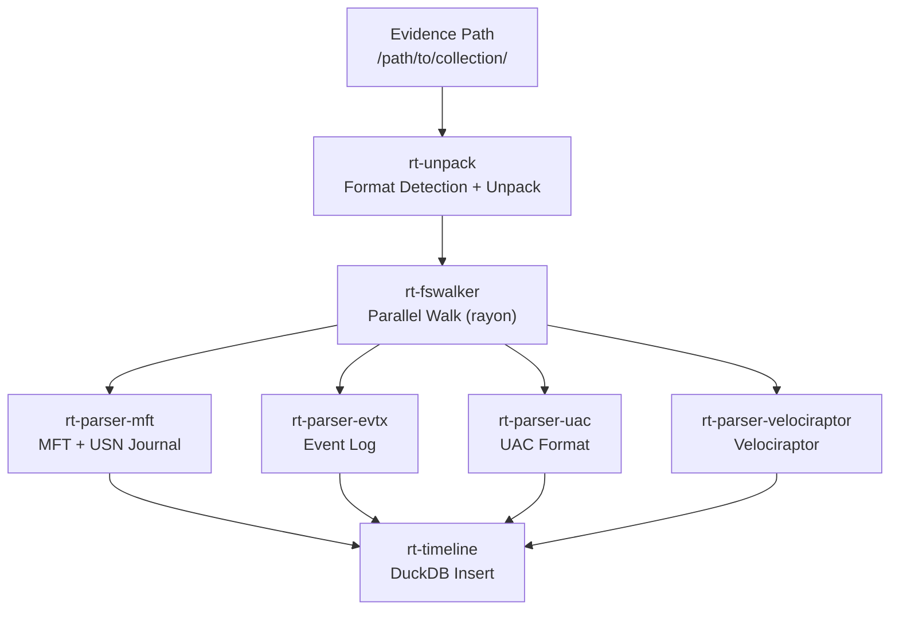
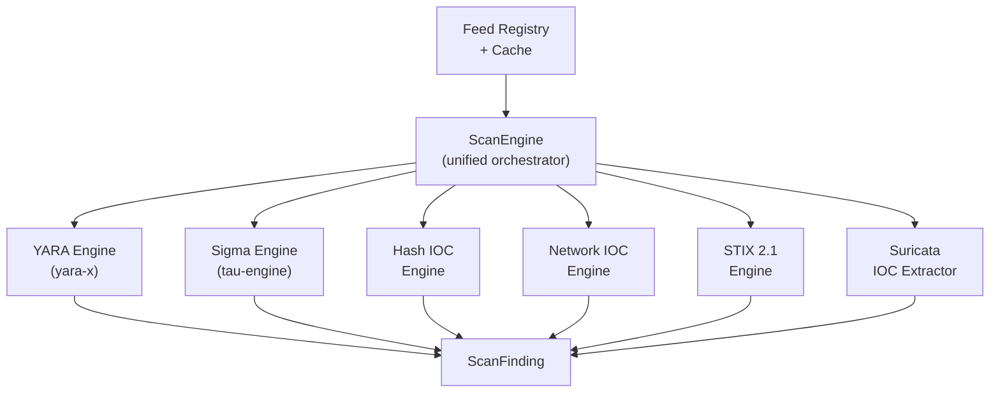
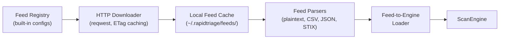
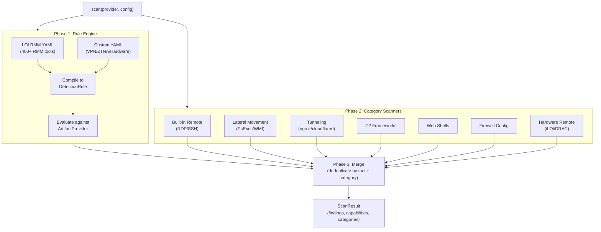
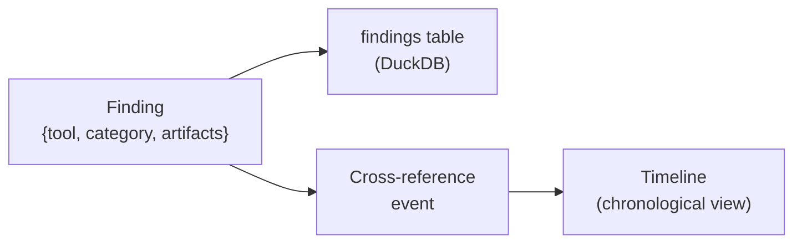
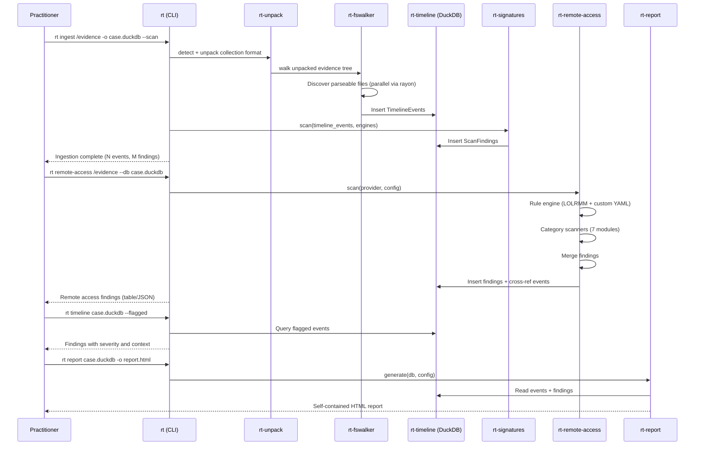

# Architecture

> **Interactive diagram:** [architecture-diagram.html](architecture-diagram.html) — full system map with all 24 crates, cloud backends, detection engines, and data flow.

This document describes RapidTriage's architecture using progressive disclosure. Start with the overview, then drill into subsystems as needed.

## Overview

RapidTriage transforms forensic evidence collections into structured timelines and assessment findings. Evidence goes in, a DuckDB database with parsed events, signature matches, and remote access detections comes out.



The CLI (`rt`) is the entry point. It dispatches to four subsystems: the ingestion pipeline, signature scanning, remote access detection, and report generation. All subsystems write to or read from a shared DuckDB timeline database.

## Workspace Structure

20 crates in a Cargo workspace, organized by responsibility:



**Dependency rule:** Arrows point downward. Higher layers depend on lower layers, never the reverse. `rt-core` has no internal dependencies.

### Crate Responsibilities

| Crate | Layer | Responsibility |
|-------|-------|---------------|
| `rt-core` | Foundation | Shared types (`TimelineEvent`, `ArtifactType`, `EventType`), plugin traits, error types, configuration |
| `rt-plugin-sdk` | Foundation | Parser plugin registration via `inventory` crate. Parsers register themselves at compile time |
| `rt-ewf` | Foundation | Expert Witness Format (E01) forensic image reading |
| `rt-shrinkpath` | Foundation | Path abbreviation utilities |
| `rt-timeline` | Storage | DuckDB columnar timeline store. Insert events, query by time/type/source, export to SQLite |
| `rt-unpack` | Pipeline | Collection format detection and unpacking (UAC tar.gz, Velociraptor, KAPE) |
| `rt-fswalker` | Pipeline | Parallel filesystem walk via rayon; SHA-256 integrity hashing; dispatches parsers via plugin SDK |
| `rt-report` | Pipeline | Self-contained HTML report generation from timeline data, including Mermaid attack chain diagrams |
| `rt-navigator` | Pipeline | Interactive TUI navigation for timeline and findings |
| `rt-mft-tree` | Pipeline | MFT heuristic analysis |
| `rt-remote-io` | Remote I/O | Remote storage I/O via OpenDAL 0.55: S3, GCS, Azure Blob, WebDAV, HTTP, Google Drive (OAuth2) |
| `rt-mem` | Memory | Memory forensics bridge into the memf-* sibling workspace |
| `rt-signatures` | Assessment | Six detection engines (YARA-X, Sigma/Tau-Engine, Hash IOC, Network IOC, STIX, Suricata) + feed infrastructure |
| `rt-remote-access` | Assessment | Remote access detection: LOLRMM rule engine (400+ tools) + 7 category scanners + DuckDB findings store |
| `rt-correlation` | Assessment | Pivot engine: YAML correlation rules, zeek-intel, cross-source evidence joining |
| `rt-parser-mft` | Parsers | NTFS MFT + USN Journal parser. Registers via `inventory::submit!` |
| `rt-parser-evtx` | Parsers | Windows Event Log (EVTX) parser. Registers via `inventory::submit!` |
| `rt-parser-uac` | Parsers | UAC collection format parser. Registers via `inventory::submit!` |
| `rt-parser-velociraptor` | Parsers | Velociraptor collection parser. Registers via `inventory::submit!` |
| `rt-cli` | CLI | Command-line interface. Parses args, dispatches to subsystems, formats output |
| `xtask` | Build | Build automation tasks |

---

## Ingestion Pipeline

The pipeline ingests an evidence collection and produces a DuckDB timeline. It uses a layered architecture where each layer handles one level of abstraction.



### Plugin System

Parsers register themselves at compile time using the `inventory` crate. The filesystem walker discovers registered parsers at runtime without hardcoded dispatch:

```rust
// In rt-parser-mft:
inventory::submit! {
    ParserPlugin::new("mft", &["$MFT"], parse_mft)
}

// In rt-fswalker:
for plugin in inventory::iter::<ParserPlugin> {
    if plugin.can_parse(file_path) {
        plugin.parse(file_path, &timeline)?;
    }
}
```

Adding a new parser means creating a new crate, implementing the trait, and linking it — no changes to the pipeline.

### Timeline Schema

All parsed events become `TimelineEvent` records in DuckDB:

| Column | Type | Description |
|--------|------|-------------|
| `timestamp` | `TIMESTAMP_NS` | Event time (nanosecond precision) |
| `event_type` | `VARCHAR` | `FileCreate`, `FileDelete`, `ProcessExec`, `LogonEvent`, ... |
| `source` | `VARCHAR` | Artifact type: `UsnJournal`, `MFT`, `EventLog`, ... |
| `path` | `VARCHAR` | File path or event identifier |
| `description` | `VARCHAR` | Human-readable event summary |
| `evidence_source` | `VARCHAR` | Case/host identifier |
| `metadata` | `VARCHAR` (JSON) | Artifact-specific structured data |

DuckDB's columnar storage makes time-range and type-filtered queries fast, even with millions of events.

---

## Signature Scanning

`rt-signatures` provides six detection engines behind a unified `ScanEngine` interface.



### Engine Details

| Engine | Input | Matching Strategy |
|--------|-------|-------------------|
| YARA | File bytes | Pattern matching via yara-x. Compiles rules once, scans files in parallel |
| Sigma | Timeline events | Converts events to field maps, evaluates detection logic via tau-engine |
| Hash IOC | File hashes | MD5/SHA-1/SHA-256 lookup in HashSet. Hashes computed on-the-fly |
| Network IOC | Event metadata | IP, domain, CIDR matching against string fields in event metadata |
| STIX 2.1 | Files + events | Extracts indicators from STIX bundles, dispatches to hash/network engines |
| Suricata | Rule files | Parses Suricata syntax to extract IPs, domains, ports as network IOCs |

### Feed Infrastructure

Threat intelligence feeds are downloaded, cached locally, and loaded into engines automatically:



Conditional HTTP requests (ETag / If-None-Match) avoid re-downloading unchanged feeds. Each feed has a format parser that extracts indicators into the appropriate engine.

---

## Remote Access Detection

`rt-remote-access` uses a hybrid detection engine to find every category of remote access capability in forensic evidence.



### ArtifactProvider Trait

The scanner doesn't read forensic artifacts directly. Instead, it queries an `ArtifactProvider` trait that abstracts over available data sources:

```rust
pub trait ArtifactProvider: Send + Sync {
    fn capabilities(&self) -> Vec<ProviderCapability>;
    fn registry_values(&self, path: &str) -> Result<Vec<RegistryEntry>>;
    fn event_log_entries(&self, log_name: &str) -> Result<Vec<EventLogEntry>>;
    fn prefetch_entries(&self) -> Result<Vec<PrefetchEntry>>;
    fn file_exists(&self, path: &str) -> Result<bool>;
    // ... 12 methods total, all with default empty implementations
}
```

**Graceful degradation:** Every method has a default implementation returning empty results. If the evidence lacks Event Logs, event-based scanners silently skip rather than error. The `capabilities()` method reports what data is available, and the evaluator checks capabilities before attempting queries.

**CompositeArtifactProvider** aggregates specialized sub-providers (registry, filesystem, event log) into a single provider, delegating calls based on capability.

### Detection Flow

**Rule engine** (Phase 1): LOLRMM YAML definitions describe what artifacts each RMM tool leaves behind (registry keys, file paths, services, event log entries). These are compiled into `DetectionRule` structs with `DetectionCondition` variants:

```
LOLRMM YAML ──> compile_lolrmm() ──> DetectionRule {
    conditions: [
        RegistryKeyExists("HKLM\\SOFTWARE\\AnyDesk"),
        FilePathExists("C:\\Program Files\\AnyDesk\\*"),
        ServiceName("AnyDesk"),
        EventLogSource("AnyDesk"),
    ]
}
```

The evaluator tests each condition against the provider, producing a `Finding` with raw artifact hits when any condition matches.

**Category scanners** (Phase 2): For detection that requires correlation or behavioral analysis (e.g., "RDP is enabled AND NLA is disabled AND firewall allows 3389"), dedicated scanner modules implement the `CategoryScanner` trait.

### Findings Storage

Findings are stored in a DuckDB `findings` table and cross-referenced into the timeline as `Assessment` events:



This gives analysts two views: the findings table for assessment-oriented queries ("what remote access tools were found?") and the timeline for chronological context ("when did AnyDesk first appear relative to the intrusion?").

---

## Report Generation

`rt-report` generates self-contained HTML reports from a DuckDB timeline database. Reports include:

- Case metadata (case ID, examiner, generation timestamp)
- Event timeline with filtering and sorting
- Signature findings summary
- Evidence source breakdown

Reports are single HTML files with embedded CSS — no external dependencies, suitable for email attachment or upload to case management systems.

---

## Data Flow

End-to-end flow for a typical incident response engagement:



---

## Design Principles

**Correctness over speed.** Forensic accuracy is non-negotiable. Rust's type system and `unsafe_code = "deny"` enforce memory safety. `clippy::unwrap_used = "deny"` prevents silent panics. When speed and correctness conflict, correctness wins.

**Graceful degradation.** Missing artifacts produce coverage gaps, not crashes. Every parser failure is caught and logged. The pipeline continues with whatever data is available. Partial results with explicit warnings are more valuable than no results.

**Evidence integrity.** RapidTriage never modifies source evidence. All data flows from evidence into new DuckDB databases. Read-only access to evidence is enforced by design.

**Plugin extensibility.** New artifact parsers are added by creating a crate, implementing the plugin trait, and linking it. No changes to the pipeline, timeline, or CLI are required.

**Progressive analysis.** Each command produces useful output independently. `rt ingest` creates a timeline. `rt scan` adds threat intel. `rt remote-access` adds infrastructure assessment. `rt report` generates deliverables. Run them all or run them individually.

---

## Key Dependencies

| Dependency | Version | Purpose |
|------------|---------|---------|
| `duckdb` | 1.x (bundled) | Columnar timeline storage, analytical queries |
| `yara-x` | 0.12 | YARA rule compilation and file scanning |
| `tau-engine` | 1.0 | Sigma rule evaluation |
| `opendal` | 0.55 | Remote storage abstraction (S3, GCS, Azure Blob, WebDAV, GDrive) |
| `notatin` | 1.0 | Windows registry hive parsing |
| `evtx` | 0.11 | Windows Event Log parsing |
| `mft` | 0.6 | NTFS Master File Table parsing |
| `ewf` | 0.1 | Expert Witness Format (E01) image support |
| `inventory` | 0.3 | Compile-time parser plugin registration |
| `clap` | 4.x | CLI argument parsing |
| `rayon` | 1.x | Parallel parser dispatch |
| `ratatui` | 0.29 | TUI framework for rt-navigator |
| `reqwest` | 0.12 | HTTP feed downloads (rustls-tls) |
| `serde` / `serde_yaml` | 1.x / 0.9 | LOLRMM YAML deserialization |
| `tracing` | 0.1 | Structured logging and diagnostics |

---

## Build and Test

```bash
# Full build
cargo build --workspace --release

# Full test suite
cargo test --workspace

# Single crate
cargo test -p rt-remote-access
cargo test -p rt-signatures

# Lints
cargo clippy --workspace --lib --bins
```

Minimum Rust version: 1.80. C compiler required for bundled DuckDB.
