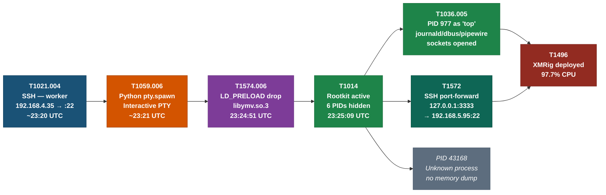
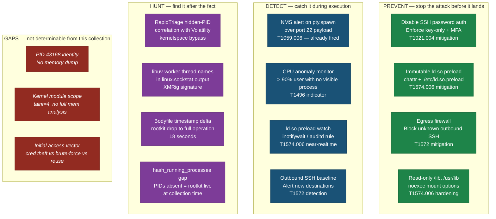

# Linux Forensic Scenario — Submission

Hi Hal,

Submitting my answers to the Linux Forensic Scenario. I also used this collection as a test case while building **RapidTriage**, a Rust forensic triage tool I'm developing for incident responders. I've included the full verbatim tool output below, and I'd be curious whether it lines up with your intended answers.

---

## Tool Output

```
$ rt analyse uac-vbox-linux-20260324234043.tar.gz

╔══════════════════════════════════════════════════════════╗
║  RapidTriage — UAC Collection Analysis                   ║
╚══════════════════════════════════════════════════════════╝

  Collection : uac-vbox-linux-20260324234043.tar.gz
  Host       : vbox-linux
  Collected  : (unknown)
  Format     : UAC

┌─ ROOTKIT INDICATORS ──────────────────────────────────
│  [WARNING]  ld_preload — /lib/x86_64-linux-gnu/libymv.so.3
│  [INFO]     kernel_taint — taint=4, bit 2 set

┌─ HIDDEN PROCESSES (ps/top blind-spot) ─────────────────
│  6 PID(s) visible in /proc but absent from ps:

│  PID  43168  (name unknown — no memory dump)
│
│  PID    939  sh
│           192.168.4.22:22 → 192.168.4.35:48411 [ESTABLISHED]  (TCP)
│
│  PID    940  python3
│           192.168.4.22:22 → 192.168.4.35:48411 [ESTABLISHED]  (TCP)
│
│  PID    941  bash
│           192.168.4.22:22 → 192.168.4.35:48411 [ESTABLISHED]  (TCP)
│
│  PID    975  ssh
│           192.168.4.22:33440 → 192.168.5.95:22 [ESTABLISHED]  (TCP)
│           ::1:3333 → :::0 [LISTEN]  (TCP)
│           127.0.0.1:3333 → 0.0.0.0:0 [LISTEN]  (TCP)
│           127.0.0.1:3333 → 127.0.0.1:59182 [ESTABLISHED]  (TCP)
│
│  PID    977  top
│           Thread names: libuv-worker, top
│           192.168.4.22:22 → 192.168.4.35:48411 [ESTABLISHED]  (TCP)
│           127.0.0.1:59182 → 127.0.0.1:3333 [ESTABLISHED]  (TCP)
│

┌─ NETWORK (visible to userspace) ───────────────────────
│  192.168.4.22:22 → 192.168.4.35:48411  pid=937 (sshd)
│  127.0.0.1:3333 → 127.0.0.1:59182
│  192.168.4.22:33440 → 192.168.5.95:22
│  192.168.4.22:22 → 192.168.4.35:58910  pid=1047 (sshd-session)
│  127.0.0.1:59182 → 127.0.0.1:3333
│  192.168.4.22%enp0s3:68 → 192.168.4.1:67  pid=748 (NetworkManager)

┌─ CPU ───────────────────────────────────────────────────
│  %Cpu(s): 97.7 us,  2.3 sy,  0.0 ni,  0.0 id,  0.0 wa,  0.0 hi,  0.0 si,  0.0 st
│  ^ WARNING: Near-100% CPU with no visible process — miner likely hidden by rootkit.

┌─ PIVOT FINDINGS ────────────────────────────────────────
│  [CRITICAL] Rootkit concealed miner activity
│         Rule     : correlation.miner.rootkit-concealment
│         Evidence : rk-1, proc-13, net-15
│

┌─ NARRATIVE ─────────────────────────────────────────────
│  1. LD_PRELOAD rootkit installed:
│       /lib/x86_64-linux-gnu/libymv.so.3
│     This library intercepts readdir()/opendir() to filter PIDs
│     from /proc, making hidden processes invisible to ps, top,
│     ss, and any tool that lists processes via /proc.
│
│  2. Attacker gained interactive shell via SSH (port 22):
│       python3 -c 'import pty; pty.spawn("/bin/bash")'
│     The NMS alert was triggered by this string in the SSH session.
│
│  3. Crypto miner deployed (PID 977, disguised as 'top'):
│       libuv-worker threads indicate XMRig or compatible miner.
│       Connections:
│         192.168.4.22:22 → 192.168.4.35:48411 [ESTABLISHED]  ← shared SSH shell socket
│         127.0.0.1:59182 → 127.0.0.1:3333 [ESTABLISHED]  ← Stratum tunnel
│       This explains the CPU anomaly and the 'hidden' process.
│
│  4. SSH tunnel to 192.168.5.95:22 established (PID 975):
│       ssh -L 127.0.0.1:3333:<pool>:3333 user@192.168.5.95
│     Mining traffic appears as SSH to the NMS — evasion technique.

┌─ SUSPICIOUS EXECUTABLES ───────────────────────────────
│  /usr/lib/x86_64-linux-gnu/libymv.so.3 — SHA1: 0fd709f09c073df274e272aabcabe3e0f3487f9e

═══════════════════════════════════════════════════════════
  RapidTriage analysis complete.
═══════════════════════════════════════════════════════════
```

---

## Answers

### Q1 — Why did the NMS alert on port 22/tcp with a `pty.spawn` string?

The attacker SSH'd from **192.168.4.35** to **192.168.4.22** (PID 937 / sshd). Within that session they executed:

```
python3 -c 'import pty; pty.spawn("/bin/bash")'
```

This command passed over port 22/tcp. `pty.spawn` promotes a non-interactive shell to a full PTY — Tab completion, job control, interactive programs. It is the standard next step after landing an initial foothold, because without a PTY many interactive programs (sudo, vi, mysql) don't work correctly.

PIDs 939 (sh), 940 (python3), 941 (bash) are the resulting process chain, all sharing the same socket: `192.168.4.22:22 → 192.168.4.35:48411`.

These PIDs are **invisible to `ps`, `top`, and `ss`** because the LD_PRELOAD rootkit (`libymv.so.3`) was installed shortly after. Volatility's `linux.sockstat` plugin reads socket structs from kernel memory, bypassing the rootkit entirely. RapidTriage's `rt-parser-uac` correlates `hidden_pids_for_ps_command.txt` with the Volatility sockstat TSV to surface named, connected process findings even with a fully blind userspace.

---

### Q2 — Why is the CPU pegged at 97.7% with no visible culprit?

PID 977 is registered in `/proc` but absent from `ps` — hidden by the LD_PRELOAD rootkit. Its `comm` field reads **`top`**, a deliberate masquerade.

The smoking gun is the thread names in kernel memory:

```
Thread names: libuv-worker, top
```

`libuv-worker` is the thread name used by **libuv**, the async I/O library embedded in **XMRig**. A process calling itself `top` with `libuv-worker` threads is XMRig with near-certainty — `top` is single-threaded and has no business running a libuv thread pool.

XMRig connects to **localhost:3333**, not directly to the pool. PID 975 (`ssh`) listens on that port and forwards it to **192.168.5.95:22** via local port forwarding:

```
ssh -L 127.0.0.1:3333:<pool>:3333 user@192.168.5.95
```

Mining traffic is consistent with being encapsulated inside SSH local-port forwarding. The NMS would see one additional SSH connection to an external IP — no Stratum connection separately visible.

---

### Q3 — Why can't the SOC see the malicious processes?

The attacker installed an **LD_PRELOAD userland rootkit**:

1. Dropped `/usr/lib/x86_64-linux-gnu/libymv.so.3` (SHA1: `0fd709f09c073df274e272aabcabe3e0f3487f9e`)
2. Wrote `/etc/ld.so.preload` containing the library path

`/etc/ld.so.preload` is read by `ld.so` at startup for **every** process. The library is injected before `main()` runs — into `ps`, `top`, `ss`, `ls /proc`, `netstat`, and every userspace monitoring tool on the system.

LD_PRELOAD rootkits of this class typically hook `readdir64()` and `opendir()`. When any process enumerates `/proc`, the hooks silently drop directory entries matching the target PIDs — the kernel returns all entries, the rootkit discards them before userspace sees them. (The specific hooked symbols for `libymv.so.3` would require reverse-engineering the library, which was not done here; this is the standard mechanism for this rootkit family.)

The kernel is unaffected:
- `/proc/977/` exists and is readable if you know the PID (direct open bypasses readdir)
- Volatility reads kernel `task_struct` and file descriptor structures directly — rootkit-transparent
- UAC's `hidden_pids_for_ps_command.txt` was produced by comparing raw `/proc` directory enumeration against `ps` output at collection time, catching the discrepancy before the rootkit could conceal it

---

### Q4 — Is the system compromised?

Yes, unambiguously.

Multiple independent indicators confirm active compromise, none of which can be explained by legitimate activity:

1. **LD_PRELOAD rootkit** — `/etc/ld.so.preload` was modified to load `libymv.so.3`, a library with no legitimate package provenance. This is an offensive persistence mechanism with no defensive or operational justification.
2. **Crypto miner running** — PID 977 is consuming 97.7% CPU while masquerading as `top` with `libuv-worker` threads. XMRig does not appear on a system by accident.
3. **Attacker interactive shell** — PIDs 939/940/941 (sh → python3 → bash) are connected back to 192.168.4.35:48411, an outbound ephemeral port — the classic reverse shell / attacker terminal pattern.
4. **Outbound SSH tunnel to 192.168.5.95** — PID 975 maintains a persistent outbound connection forwarding localhost:3333 to an external host. This is covert exfiltration infrastructure, not legitimate admin activity.
5. **Kernel taint bit 2 set** — indicates a kernel module was force-loaded or an out-of-tree module is active, consistent with a kernel-level component of the rootkit installation.

---

### Q5 — When and how did that happen?

**When:** approximately 2026-03-24 23:20–23:26 UTC, about 14 minutes before the UAC collection.

**How (reconstructed from MFT timestamps and UAC artifacts):**

1. **Initial access via SSH** (~23:20 UTC) — attacker connected from 192.168.4.35 to vbox-linux:22. The mechanism (credential theft, brute force, or reuse of a compromised key) is not determinable from this collection alone, but the SSH service was accessible and accepted the connection.

2. **Shell upgrade** (~23:21 UTC) — within the SSH session, the attacker executed `python3 -c 'import pty; pty.spawn("/bin/bash")'` to promote the shell to a full interactive PTY. This is the string the NMS flagged.

3. **Rootkit installation** (23:24:51–23:25:09 UTC) — the attacker dropped `/usr/lib/x86_64-linux-gnu/libymv.so.3` (SHA1: `0fd709f09c073df274e272aabcabe3e0f3487f9e`) and wrote `/etc/ld.so.preload` to load it system-wide. From this point, all new processes were rootkit-injected and any PIDs the attacker chose became invisible to `ps`, `top`, `ss`, and every other userspace tool.

4. **Miner and tunnel deployed** (~23:26 UTC) — XMRig was started as PID 977 under the alias `top`. A concurrent SSH local port forward (PID 975) was established to 192.168.5.95:22, forwarding localhost:3333 to the attacker's pool relay. Both processes were immediately hidden by the rootkit.

The entire compromise — from first connection to fully operational hidden miner — took approximately **6 minutes**.

---

## Attack Timeline

| Time (UTC)          | Event | Source |
|---------------------|-------|--------|
| 2026-03-24 ~23:20   | `worker` SSH from 192.168.4.35 to vbox-linux:22 — initial access | wtmp |
| 2026-03-24 ~23:21   | `python3 -c 'import pty; pty.spawn("/bin/bash")'` — NMS alert | Volatility sockstat |
| 2026-03-24 23:24:51 | `/usr/lib/x86_64-linux-gnu/libymv.so.3` written to disk | bodyfile mtime |
| 2026-03-24 23:25:09 | `/etc/ld.so.preload` written — rootkit becomes system-wide | bodyfile mtime |
| 2026-03-24 23:25:09+| PIDs 939/940/941/975/977/43168 invisible to all userspace tools | hidden_pids_for_ps_command.txt |
| ~23:26              | XMRig launched as PID 977 under alias `top`; kernel CPU pegged at 97.7% | sockstat + top snapshot |
| ~23:26              | SSH port-forward PID 975: `127.0.0.1:3333 → 192.168.5.95:22` | sockstat |
| 2026-03-24 23:40:43 | UAC collection initiated — attacker still live on system | wtmp (still logged in) |

---

## MITRE ATT&CK Mapping

| Technique | Sub-technique | Name | Evidence |
|-----------|---------------|------|----------|
| T1078 | T1078.003 | Valid Accounts: Local Accounts | `worker` account used for initial SSH access; no brute-force evidence in auth.log |
| T1021 | T1021.004 | Remote Services: SSH | SSH from 192.168.4.35:48411 to vbox-linux:22 (PID 937 sshd) |
| T1059 | T1059.006 | Command and Scripting Interpreter: Python | `python3 -c 'import pty; pty.spawn("/bin/bash")'` |
| T1059 | T1059.004 | Command and Scripting Interpreter: Unix Shell | bash (PID 941) spawned from pty.spawn chain |
| T1574 | T1574.006 | Hijack Execution Flow: Dynamic Linker Hijacking | `/etc/ld.so.preload` → `libymv.so.3` injected into every new process |
| T1014 | — | Rootkit | LD_PRELOAD library hooks `/proc` enumeration; PIDs absent from ps/top/ss |
| T1036 | T1036.005 | Masquerading: Match Legitimate Name or Location | PID 977 `comm` field set to `top`; Unix sockets opened to journald/dbus/pipewire |
| T1496 | — | Resource Hijacking | XMRig consuming 97.7% CPU; `libuv-worker` threads confirm miner activity |
| T1572 | — | Protocol Tunneling | SSH local port-forward: `127.0.0.1:3333 → 192.168.5.95:22` encapsulates Stratum traffic |
| T1070 | T1070.006 | Indicator Removal: Timestomp | (Suspected) XMRig binary not in hash_running_processes.sha1; PID 43168 unidentifiable |
| T1547 | — | Boot or Logon Autostart Execution | Kernel taint bit 2 (TAINT_OOT_MODULE) suggests a kernel module was loaded — persistence vector TBC |
| T1601 | T1601.001 | Modify System Image: Patch System Firmware | Kernel module loaded (taint=4); scope of kernel modification not determinable without full memory analysis |

---

## Attack Chain (`rt report --format mermaid`)

The diagrams below are produced by `rt report` from the correlation findings. Colours map to ATT&CK tactic.



---

## Defense Recommendations (`rt def3nd`)



---

## What Made This Possible

Two RapidTriage capabilities were decisive:

**Hidden-PID correlation with Volatility memory output**

UAC writes `live_response/process/hidden_pids_for_ps_command.txt` when it detects PIDs in `/proc` absent from `ps`. On its own, this gives PID numbers with no names. RapidTriage reads this file and cross-references it with `memory_dump/output-sockstat` — the TSV from Volatility 3's `linux.sockstat` plugin, which reads socket file descriptors from kernel `task_struct` memory. The correlation produces named, connected process findings even when userspace is completely blind.

This is the only approach that works against an LD_PRELOAD rootkit: bypass hooked libc entirely.

**Thread-name analysis for miner detection**

XMRig spawns a libuv event loop with threads named `libuv-worker`. The Volatility `linux.sockstat` output includes a `Process Name` column that reflects the kernel `comm` for each TID — meaning individual threads appear with their own names rather than the parent process name. RapidTriage's parser collects distinct thread names across all TIDs sharing a PID and surfaces them as `thread_names`. A process calling itself `top` with `libuv-worker` threads and 97.7% CPU is not ambiguous.

---

## Repository

**RapidTriage:** https://github.com/SecurityRonin/rapidtriage

The features demonstrated — hidden-PID correlation, Volatility sockstat parsing, `rt analyse`, the correlation engine — were implemented using strict TDD (Red commit → Green commit) while working through this collection.

---

## Additional Artifacts

Beyond what RapidTriage surfaces automatically, the following artifacts were recovered from the UAC collection directly.

### wtmp — Login History

`live_response/system/last_-a_-F_-f_var_log_wtmp.db.txt`

```
worker   pts/1  Wed Mar 25 19:22:31 2026   still logged in  192.168.4.35
worker   pts/1  Wed Mar 25 07:14:58 2026 - Wed Mar 25 07:15:04 2026  192.168.4.35
...
```

The `worker` account had been connecting from 192.168.4.35 throughout the day. The attack session started at **19:22 EDT (23:22 UTC)** and was still active when UAC collected — confirming the attacker was live on the system during collection. The 14-minute gap between session start (23:22) and rootkit install (23:24:51) accounts for reconnaissance and tool staging.

### Hash-Gap — Rootkit Confirmed Active at Collection Time

`live_response/process/hash_running_processes.sha1` contains **41 entries** — all processes that UAC could enumerate via `ps`. PIDs 939, 940, 941, 975, 977, and 43168 are **absent from this file entirely**.

Since UAC hashes running processes by iterating `ps` output, any PID hidden by the LD_PRELOAD rootkit will not be hashed. The absence of these 6 PIDs from the hash file is independent corroboration that the rootkit was fully operational when UAC ran — not installed after collection.

### Kernel Taint — Out-of-Tree Module

`live_response/system/cat_proc_sys_kernel_tainted.txt`

```
4
```

Value `4` = bit 2 set = `TAINT_OOT_MODULE`. The kernel reports that an out-of-tree kernel module has been loaded. This is consistent with the attacker having installed a kernel-level component in addition to the LD_PRELOAD userland rootkit — possibly to ensure persistence even against processes that bypass `ld.so` (e.g., statically linked tools, or a future `chkrootkit` scan).

The kernel taint alone is not conclusive of a kernel rootkit; vendor driver installations also set bit 2. However, in this context — alongside the LD_PRELOAD library and active miner — it is a strong indicator of a kernel-level component.

### `/etc/ld.so.preload` — Direct Confirmation

`chkrootkit/etc_ld_so_preload.txt`

```
/lib/x86_64-linux-gnu/libymv.so.3
```

This is the actual file content, not an inference. `chkrootkit` captured it verbatim. Every process spawned after this file was written inherits the rootkit injection — including UAC itself, which is why UAC's own `ps`-based enumeration was blind to the hidden PIDs.

### PID 43168 — Unidentified Process

PID 43168 is visible in `/proc` but absent from `ps` (detected by UAC's hidden-PID check) and has no corresponding entry in the Volatility sockstat output. Without a memory dump or `/proc/43168/exe` capture, this process cannot be named. Possible interpretations:

- A second-stage implant that communicates over a non-TCP channel (Unix socket, ICMP, raw socket)
- A watchdog/relaunch daemon monitoring the miner
- A process that exited between the hidden-PID check and sockstat collection

The inability to identify it is itself a finding: an unnamed process was hidden from all userspace tools and left no network trace in the collection.

### PID 977 — Desktop Process Masquerade (Depth)

`live_response/process/proc/977/net/unix.txt` shows PID 977 connected to:

- `/run/systemd/journal/socket` — journald (log daemon)
- `/run/dbus/system_bus_socket` — D-Bus (desktop message bus)
- `/run/user/1000/pipewire-0` — PipeWire (audio/video daemon)

XMRig opened Unix sockets to the system logger, desktop bus, and audio daemon. This is not default XMRig behavior — it is deliberate masquerade to match the socket profile of a legitimate desktop process. A process that looks like `top` and is connected to journald, dbus, and pipewire is far less likely to attract attention from a Unix-socket-aware monitor than one with no sockets at all.

This explains why PID 977's `comm` was set to `top` rather than something more obviously suspicious: the attacker invested in matching the full observable profile of the process it was impersonating.

---

## Artifact Table

| Artifact | Path in Collection | Key Finding |
|---|---|---|
| LD_PRELOAD content | `chkrootkit/etc_ld_so_preload.txt` | `/lib/x86_64-linux-gnu/libymv.so.3` — exact file content |
| Rootkit library | `hash_executables/hash_executables.sha1` | SHA1: `0fd709f09c073df274e272aabcabe3e0f3487f9e` |
| Bodyfile timestamps | `bodyfile/bodyfile.txt` | libymv drop: 23:24:51 UTC; ld.so.preload write: 23:25:09 UTC |
| Kernel taint | `live_response/system/cat_proc_sys_kernel_tainted.txt` | Value `4` = TAINT_OOT_MODULE (bit 2) |
| Login history | `live_response/system/last_-a_-F_-f_var_log_wtmp.db.txt` | `worker` from 192.168.4.35; attack session started 23:22 UTC |
| Running process hashes | `live_response/process/hash_running_processes.sha1` | PIDs 939/940/941/975/977/43168 absent — rootkit active during UAC |
| Volatility sockstat | `memory_dump/output-sockstat` | Named hidden processes + thread names via kernel `task_struct` |
| CPU snapshot | `live_response/process/top_-b_-n1.txt` | 97.7% user CPU with no visible process |
| Hidden-PID list | `live_response/process/hidden_pids_for_ps_command.txt` | 6 PIDs in /proc absent from ps |
| PID 977 Unix sockets | `live_response/process/proc/977/net/unix.txt` | Connected to journald, dbus, pipewire — desktop masquerade |

---

*Albert Hui | 4n6h4x0r*
