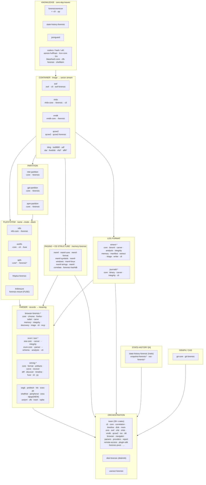

# Fleet Atlas — every component, grouped by sibling family

A single map of the SecurityRonin forensic fleet: each repo's sibling crates grouped together,
the families grouped by architectural layer. Companion to
[`fleet-capability-inventory.md`](fleet-capability-inventory.md) (what each *does*) and the layer
model in [`../CLAUDE.md`](../CLAUDE.md) (why the layers exist).

**Compiled 2026-06-24** from three sources: local `~/src` checkouts, the `SecurityRonin` GitHub
org, and crates.io (published version shown where live). Legend: a bare version = **published**;
`—` = not yet on crates.io; `*` = scaffold / WIP / planned; **NEW** = newly added this cycle.

---

## The atlas

---

## KNOWLEDGE — zero-dep leaves (everything depends down onto these)

| Repo / family | Crates | Published | Role |
|---|---|---|---|
| forensicnomicon | `forensicnomicon` · `forensicnomicon-cli` (4n6query) · `forensicnomicon-py` | **0.9.0** | format specs, magic bytes, the `report` vocabulary |
| state-history-forensic | `state-history-forensic` | **0.1.0** | `[H]` functor traits — `HistoricalSource`, `TemporalCohort<H>`, `ClockProvenance` |
| jsonguard | `jsonguard` | **0.2.3** | output sanitization — CSV/formula-injection, bidi/control, `JsonSafe` |
| blazehash | `blazehash-core` · `blazehash` (app) | **0.2.4** | hashing primitives (lean core) + full GPU/cloud app |
| xpress-huffman | `xpress-huffman` | **0.1.0** | [MS-XCA] Xpress-Huffman codec (prefetch/hiberfil/hive) |
| lzvn / lzo | `lzvn-core` · `lzo` · `lzodiff` | `lzvn-core` **0.1.0** | Apple LZVN + LZO decompressors |
| cfb-forensic | `cfb-forensic` | **0.1.0** | OLE/CFB carving + anomaly over the `cfb` crate |
| shellitem | `shellitem` | — | Windows ShellBag/ShellItem ID-list decoder |

## CONTAINER — decode an image format → addressable sector stream

| Repo / family | Crates | Published | Role |
|---|---|---|---|
| ewf | `ewf` · `ewf-cli` · `ewf-forensic` | `ewf` **0.2.1** | E01/EWF reader + analyzer |
| vhdx-forensic | `vhdx-core` · `vhdx-forensic` · `vhdx-cli` | `vhdx-core` **0.2.1** | Hyper-V VHDX |
| vmdk-forensic | `vmdk-core` · `vmdk-forensic` (+ `vmdk` cli) | `vmdk-core` **0.7.0** | VMware VMDK |
| qcow2-forensic | `qcow2` · `qcow2-forensic` | `qcow2` **0.1.2** | QEMU QCOW2 |
| dmg | `dmg` | — | Apple DMG |
| iso9660-forensic | `iso` (+ analyzer) | — | ISO-9660 optical |
| udf-forensic | `udf-forensic` | — | UDF optical |
| dar-forensic | `dar` (+ analyzer) | — | Disk ARchive |
| livedisk-forensic | `livedisk-core` · `livedisk-forensic` | — | live-disk acquisition |
| vhd* / aff4* | (stubs) | — | VHD, AFF4 — planned |
| memf-format | (in memory-forensic) | — | memory dumps → page stream (WinPMEM/raw/hiberfil/ELF) |

## FILESYSTEM — navigate by path

| Repo / family | Crates | Published | Role |
|---|---|---|---|
| ntfs-forensic | `ntfs-core` · `ntfs-forensic` | `ntfs-core` **0.8.1** | NTFS reader + analyzer (the FS foundation) |
| ext4fs-forensic | `ext4fs-core` · `ext4fs-cli` · `ext4fs-fuse` | `ext4fs-core` **0.1.0** | ext4 |
| apfs-forensic* | `apfs-core`* · `apfs-forensic`* | — | APFS — WIP |
| hfsplus-forensic | `hfsplus-forensic` | **0.1.1** | HFS+ (incl. decmpfs LZVN/LZFSE/zlib) |
| 4n6mount | `forensic-mount` | — | FUSE bridge — any container+FS → an OS path |

## PARTITION — find the volumes

| Repo / family | Crates | Published | Role |
|---|---|---|---|
| mbr-partition-forensic | `mbr-partition-core` · `mbr-partition-forensic` | `…-core` **0.5.1** | MBR |
| gpt-partition-forensic | `gpt-partition-core` · `gpt-partition-forensic` | `…-core` **0.5.0** | GPT |
| apm-partition-forensic | `apm-partition-core` · `apm-partition-forensic` | `…-core` **0.5.0** | Apple Partition Map |

## PAGING + OS STRUCTURE — memory-forensic (memf-* suite)

| Crates | Published | Role |
|---|---|---|
| `memf` (umbrella bin) · `memf-core` · `memf-format` · `memf-symbols` · `memf-windows` · `memf-linux` · `memf-strings` · `memf-correlate` · `forensic-hashdb` | `memf-windows` **0.2.4** (others mixed) | VA→PA page walks, EPROCESS/VAD/netstat/creds, symbol resolution |

## LOG FORMAT — navigate by timestamp / record-id

| Repo / family | Crates | Published | Role |
|---|---|---|---|
| winevt-forensic | `winevt-core` · `-binxml` · `-carver` · `-analysis` · `-integrity` · `-memory` · `-manifest` · `-extract` · `-triage` · `-writer` · `-cli` (ev4n6) | `winevt-core` **0.2.0** | EVTX seek + BinXML + event-ID → ATT&CK |
| journald-forensic | `journald-core` · `-binary` · `-carver` · `-integrity` · `-cli` (jd4n6) | `journald-core` **0.1.0** | systemd journal |

## PARSER — interpret artifact records

| Repo / family | Crates | Published | Role |
|---|---|---|---|
| browser-forensic | `-core` · `-chrome` · `-firefox` · `-safari` · `-carve` · `-memory` · `-integrity` · `-discovery` · `-triage` · `-cli` (br4n6) · `-mcp` | `-core` **0.1.0** | browser artifacts |
| srum-forensic | `ese-core` · `ese-carver` · `ese-integrity` · `srum-core` · `srum-parser` · `srum-schema` · `srum-analysis` · `srum-cli` | `srum-core` **0.1.0** | ESE B-tree + SRUM usage ledger |
| winreg-forensic | `winreg-core` · `-format` · `-artifacts` · `-carve` · `-recover` · `-diff` · `-discover` · `-timeline` · `-fuse` · `-cli` · `-py` | `winreg-core` **0.1.0** | registry hives |
| segb-forensic | `segb` (core) · `segb-forensic` | `segb-core` **0.1.0** | Apple SEGB / Biome |
| dpapi-forensic | `dpapi-core` · `dpapi-forensic` | — **NEW** | DPAPI master keys / blobs |
| prefetch-forensic | `prefetch-core` · `prefetch-forensic` | `…-core` **0.1.0** | Windows Prefetch |
| lnk-forensic | `lnk-core` · `lnk-forensic` | `lnk-core` **0.3.0** | LNK / Jump Lists |
| exec-pe-forensic | `exec-pe-core` · `exec-pe-analysis` | `…-core` **0.2.0** | PE executable anomalies |
| shellhist-forensic | `shellhist-core` · `shellhist-forensic` | `…-core` **0.1.0** | shell history |
| peripheral-forensic | `peripheral-core` · `peripheral-forensic` | `…-core` **0.1.0** | USB / peripheral device history |
| snss-forensic | `snss` (core) · `snss-forensic` | `snss-core` **0.1.0** | Chrome SNSS session restore |
| usnjrnl-forensic | `usnjrnl-forensic` | **0.7.3** | NTFS `$UsnJrnl` change journal |
| trash-forensic | `trash-forensic` | — | Recycle Bin / Trash |
| sqlite-forensic | `sqlite-core` · `sqlite-forensic` · `sqlite4n6` | `sqlite-core` **0.2.0** | SQLite incl. deleted-record carving |

## STATE-HISTORY `[H]` · GRAPH/CAS

| Repo / family | Crates | Published | Role |
|---|---|---|---|
| state-history-forensic | `state-history-forensic` | **0.1.0** | shared `[H]` traits (also KNOWLEDGE) |
| snapshot-forensic* / vsc-forensic* | `snapshot`* · `vsc`* | — | VSS / snapshot enumeration — scaffolds |
| git-forensic | `git-core` · `git-forensic` | `git-core` **0.1.0** | git commit/blob/tree graph + provenance |

## ORCHESTRATION — the wiring layer

| Repo | Crates | Published | Role |
|---|---|---|---|
| issen | `issen-cli` · `-core` · `-correlation` · `-timeline` · `-disk` · `-mem` · `-evtx` · `-ewf` · `-vhd` · `-vhdx` · `-vmdk` · `-qcow2` · `-iso` · `-dd` · `-aff4` · `-browser` · `-fswalker` · `-mft-tree` · `-navigator` · `-parsers` · `-providers` · `-plugin-sdk` · `-remote-access` · `-remote-io` · `-report` · `-signatures` · `-unpack` · `-wsl` · `-shrinkpath` · `forensic-pivot` | (app) | wires all five paths, cross-artifact correlation, the CLI |
| disk-forensic | `disk-forensic` (disk4n6) | (app) | disk-image triage front-end |
| useract-forensic | `useract-forensic` | **0.3.1** | user-activity correlation (shell + peripheral + Biome) |

---

## Notes

- **`dpapi-forensic` is the newest family** (`dpapi-core` + `dpapi-forensic`) — DPAPI key/blob decryption; not yet on crates.io.
- **`segb-core` 0.1.0 is published**; `useract-forensic` consumes it for the Biome `App.MenuItem` timeline.
- **Reader/analyzer split** is the fleet norm — `<x>-core` (panic-free reader) + `<x>-forensic` (anomaly analyzer); multi-format suites (`memf-*`, `winevt-*`, `browser-forensic-*`, `winreg-*`) decompose by concern.
- **`vhd`, `aff4` (containers), `apfs` (FS), `snapshot`/`vsc` (`[H]`)** are scaffolds/WIP — present in `~/src` but not all on GitHub/crates.io.
- **Third-party references kept in `~/src` but not fleet crates:** `ccl-segb`, `ext4fuse`, `cfb` (we wrap, not own).
- Publication versions are a 2026-06-24 snapshot — re-run `curl -H "User-Agent: …" https://crates.io/api/v1/crates/<name>` to refresh.
