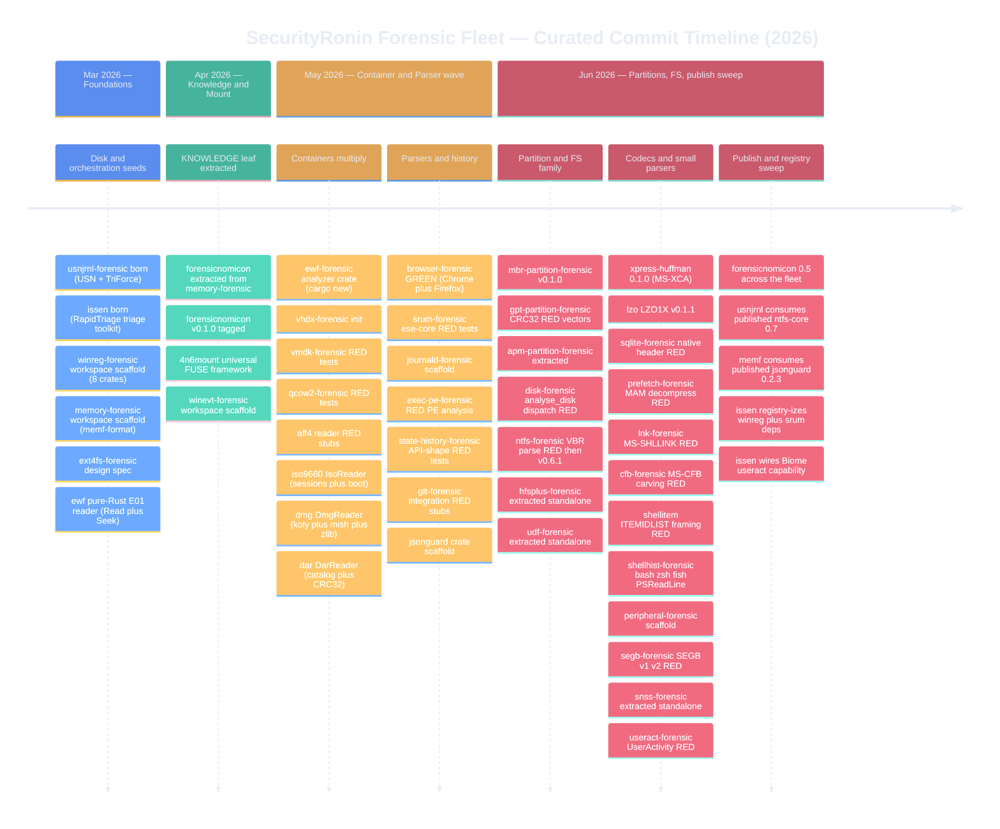
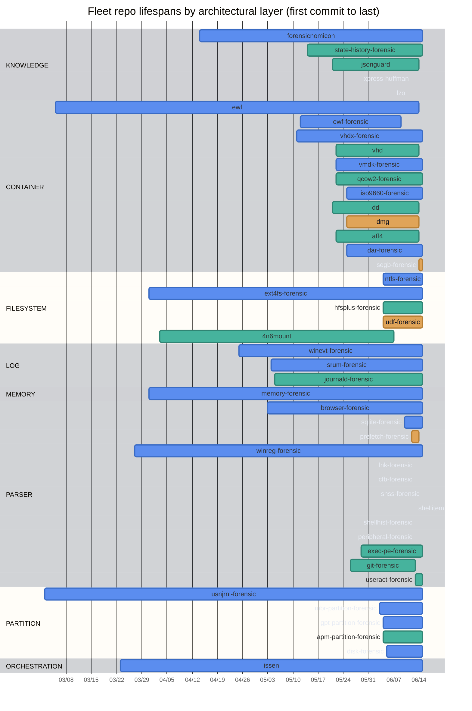
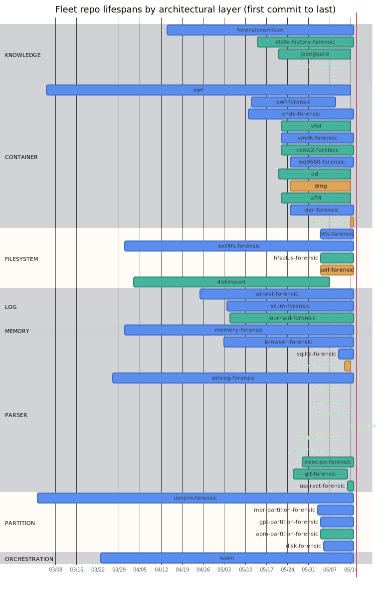

# SecurityRonin Fleet — Commit-History Timeline

A curated, Aeon-Timeline-styled view of the SecurityRonin forensic fleet's git
history. Each architectural layer is its own colored track; events are the
high-signal milestone commits (births, first-GREEN features, crates.io
publishes, registry migrations), not every commit.

**Scope:** 45 git repositories of the forensic fleet + orchestration tooling.
**Date range:** 2026-03-02 (usnjrnl-forensic, the eldest fleet repo) through
2026-06-15. **Total commits tallied across the 45 repos:** 4,871.

The numbers below are derived from `git log` / `git tag` in each repo (repo
birth = first commit date, last = most recent commit date, count =
`git rev-list --count HEAD`). Two complementary diagrams follow: a **`timeline`**
for the chronological narrative, and a themed **`gantt`** for the per-repo
lifespans laid out as Aeon-style horizontal tracks colored by layer.

---

## Narrative timeline (milestones by period)

Sections are time periods; under each period the `repo : milestone` events are
grouped. Colors are applied per layer via the theme below.

---

## Per-repo lifespans (Aeon-style tracks by layer)

Each bar runs from the repo's first commit to its last; sections are the
fleet's architectural layers (the Aeon "tracks"), and `gantt` colors them via
the `active`/`done`/`crit`/`milestone` tag classes themed below. Bar length
reflects calendar lifespan, not commit volume.

---

## Rendered image

A pre-rendered SVG of the per-repo lifespan gantt is committed alongside this
file (GitHub also renders the Mermaid blocks above natively):

---

### Top repos by commit count (context for the timeline)

| Repo | Layer | Commits | Born | Last |
|---|---|---:|---|---|
| memory-forensic | MEMORY | 808 | 2026-03-31 | 2026-06-15 |
| forensicnomicon | KNOWLEDGE | 772 | 2026-04-14 | 2026-06-15 |
| issen | ORCHESTRATION | 630 | 2026-03-23 | 2026-06-15 |
| iso9660-forensic | CONTAINER | 295 | 2026-05-25 | 2026-06-15 |
| srum-forensic | LOG | 272 | 2026-05-04 | 2026-06-15 |
| winevt-forensic | LOG | 250 | 2026-04-25 | 2026-06-15 |
| vmdk-forensic | CONTAINER | 195 | 2026-05-22 | 2026-06-15 |
| browser-forensic | PARSER | 196 | 2026-05-03 | 2026-06-15 |
| dar-forensic | CONTAINER | 122 | 2026-05-25 | 2026-06-15 |
| ewf-forensic | CONTAINER | 120 | 2026-05-12 | 2026-06-09 |
| ntfs-forensic | FILESYSTEM | 115 | 2026-06-04 | 2026-06-15 |
| sqlite-forensic | PARSER | 110 | 2026-06-10 | 2026-06-15 |
| usnjrnl-forensic | PARTITION/FS | 107 | 2026-03-02 | 2026-06-15 |
