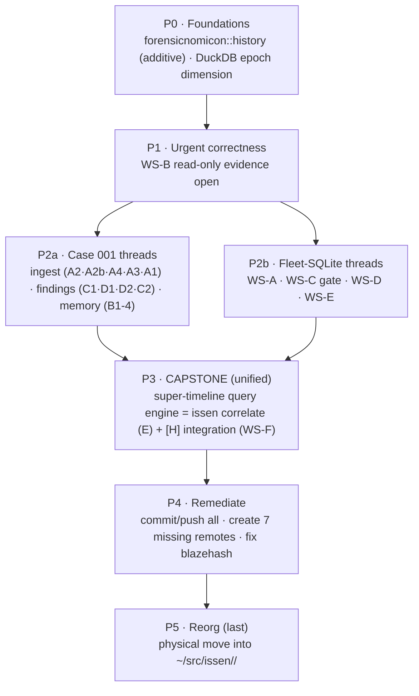

# Issen Grand Plan (2026-06-09)

**Status:** ACTIVE · **Authority:** the authoritative cross-repo roadmap. **Supersedes `PLAN.md`** (2026-05-04) and the standalone plans archived alongside it. Detailed sub-plans remain valid and are *orchestrated* by this doc, not replaced.
**Execution tracker:** the task board (#23–43). This doc is the reasoning + order + locked decisions; the board is the checklist.

---

## Executive summary

Three concurrent missions, one shared foundation, then hygiene:

1. **Case 001 readiness** — make `issen` actually solve the DFIR-Madness "Stolen Szechuan Sauce" case end-to-end (ingest terminates + broad, memory works, findings carry ATT&CK, the report narrates the attack chain). Sub-plan: `2026-06-09-closing-case001-capability-gaps.md`.
2. **Fleet SQLite + br4n6** — fix the evidence-mutation defect, unify the fleet's SQLite engine, ship the `br4n6` dual-mode browser tool. Sub-plan: `PLAN-fleet-sqlite-and-br4n6.md`.
3. **The `[H]` super-timeline** — the queryable, multi-snapshot temporal model that **both** missions converge on (Case 001's `issen correlate` *is* the SQLite plan's `[H]` integration). Design reference: `STATE_HISTORY_PLAN.md` (crate-home overruled below).

Then: **remediate** the fleet (commit/push everything, create missing remotes), and **last**, the physical **hierarchy reorg**. Sub-plan: `2026-06-09-fleet-hierarchy-reorg.md`.

**Done already (strict TDD, pushed):** A0 (DuckDB ingest hang → appender + set-based dedup; 50K events >60s→1.2s) · A00 (EWF bare-filename F1).

---

## Locked architectural decisions (this session)

1. **`[H]` State-History folds into `forensicnomicon::history`** — *not* a standalone `state-history-forensic` crate. It's KNOWLEDGE-tier vocabulary, the sibling of `forensicnomicon::report`; the `[H]` source crates already depend on forensicnomicon (to emit Findings) so this adds **zero new dependency edges**. Evolve **additively** (`#[non_exhaustive]` + builders → minor bumps only). Keep the `[H]` symbol (a functor, not a `[T]` primitive). *Supersedes* `STATE_HISTORY_PLAN.md`'s standalone-crate design and dissolves the `chrononomicon`/`temporalnomicon` naming question. Module name `forensicnomicon::history` (distinct from the existing `::temporal` correlation module — no shadowing, honors the plan's "NOT temporal" rule). The throwaway `~/src/state-history-forensic` (2 commits, unpublished) is the prototype; its types migrate into the module, then it is deleted.

2. **The `[H]` functor.** It lifts each base primitive (`[P]` disk, `[M]` memory, `[L]` log, `[Q]` query, `[C]` content) from a *single-state* reader to a *time-indexed* reader, preserving navigation. `[C]` is the fixed point (`[C^H] ≅ [C]` — content-addressing already encodes history). Realized as the `HistoricalSource` trait + `TemporalState<H>` (the atom — itself a timeline) + `TemporalCohort<H>` (the group, with `CohortTopology` for linear vs branching — WAL is linear, VHDX differencing chains / git / snapshot trees branch).

3. **The super-timeline (two-level).** A `TemporalCohort` is many snapshots; **each snapshot is itself a full timeline** (its `$MFT`+logs+USN+registry as of that epoch). Realized concretely as **issen-timeline's DuckDB + an `epoch`/`cohort_id` dimension** — reusing A0's fast ingest, getting SQL queries for free. Queries: point-in-time `at(t)` (`WHERE epoch ≤ T`), **cross-snapshot `diff`** at the event level (appeared-between / **deleted-between = tamper/log-clearing**), event `lifecycle`. The **query algebra** (the trait signatures) lives in `forensicnomicon::history`; the **engine** that executes it is `TemporalEventGraph` in `issen-correlation`. Three layers, no merging — the algebra must be implementable by standalone lower-layer `*-history` source crates (`vss-history`, `wal-history`, …) without depending *up* on issen.

4. **`issen correlate` (Case 001 E) ≡ `[H]` integration (SQLite WS-F).** Same artifact — the queryable super-timeline. Built **once**, in P3.

5. **WS-B is URGENT correctness** (evidence-mutation: read-write opens of evidence SQLite can checkpoint the WAL and mutate evidence). It preempts feature work. `browser-forensic` gets an early remote (it's the target of WS-B/D/E).

6. **Reorg is LAST**, gated on remediation. Umbrella = `~/src/issen/` (no `.git` at root; the crate demotes to `~/src/issen/orchestration/issen`). Taxonomy corrections locked: `iso9660`→container; `ewf-forensic` & `dar-forensic`→container; `udf-forensic`→filesystem; `4n6mount`→its own mount tier; `br4n6` is a crate *inside* browser-forensic; **excluded from fleet:** `mft` (third-party), `jsonguard` (general util), `usnjrnl-forensic` (deprecated). Full detail + blast-radius (31 cross-repo path deps, CI flat-sibling checkouts) in `2026-06-09-fleet-hierarchy-reorg.md`.

---

## Phase order

### P0 — Foundations (early; additive, low-risk, unblocks the temporal work)
- **Migrate the `[H]` types into `forensicnomicon::history`** (from the prototype `state-history-forensic`), additive; delete the prototype crate. Define the two-level query algebra trait signatures (cohort, `at`, `diff`, lifecycle, `CohortTopology`).
- **Super-timeline storage primitive:** add the `epoch`/`cohort_id` dimension to issen-timeline's DuckDB schema + ingest (TDD). Foundation for both P3 capstone halves.

### P1 — Urgent correctness
- **WS-B** read-only `open_evidence_db` (copy-then-`READ_ONLY` when a `-wal` exists; never `immutable=1` with a WAL); migrate every evidence open. Independently shippable. (Early remote for browser-forensic.)

### P2 — Feature threads (interleave; different repos)
- **Case 001:** ingest — A2 (registry parse+link), A2b (Desktop `$MFT` under-parse), A4 (SRUM ESE+link), A3 (USN assertion), A1 (isolation harness); findings — C1 (`$FN` surface, both converters), D1 (findings schema + native event→ATT&CK classifier), D2 (report attack-chain), C2 (timestomp → T1070.006); memory — B1 (CR3/AutoProfile), B2 (ps), B3+B4 (netstat + malfind).
- **Fleet-SQLite:** WS-A (rename state≠history labels), WS-C (neutral `sqlite-core` spike — **go/no-go gate** for WS-E), WS-D (br4n6 dual-mode + cross-browser), WS-E (fleet `sqlite-forensic` crate; `(2+N)` WAL cohort emits `TemporalCohort` per P0's algebra).

### P3 — Capstone (unified)
- The **super-timeline query engine**: `TemporalEventGraph` (issen-correlation) over the epoched DuckDB — point-in-time, cross-snapshot diff (deletion-window/tamper), lifecycle. Exposed as **`issen correlate <case-dir>`** (Case 001 E) and as the SQLite plan's **`[H]` integration** (WS-F) — one build. WS-E's `sqlite-forensic` and the Case 001 sources feed it.

### P4 — Remediate (gates the reorg)
- Commit + push every fleet repo; **create GitHub remotes for the 7 that have none** (`state-history-forensic`[being deleted], `vhd`, `dd`, `aff4`, `dmg`, `browser-forensic`, `winreg-forensic`); investigate & fix `blazehash`'s 10,499-file dirty state. Pre-flight gate: every fleet repo clean + pushed.

### P5 — Reorg (last)
- Per `2026-06-09-fleet-hierarchy-reorg.md`: scripted, reversible physical move into `~/src/issen/<layer>/`, path-deps/CI-checkouts/refs swept, `cargo metadata` verified per workspace.

---

## What changed vs the old plans (reconciliations)
- **`PLAN.md` (May)** → superseded by this doc (archived).
- **`SPLIT_PLAN.md`** (core/forensic split) → done across the fleet (archived).
- **`STATE_HISTORY_PLAN.md`** → kept as the `[H]` *design reference* (TemporalCohort, MaterializationSafety, ArtifactRef identity, the temporal-source inventory). **Overruled:** `[H]` is a `forensicnomicon::history` module, not a standalone crate; WS-F's "crate must exist" prereq collapses accordingly.
- **`PLAN-winevt-extract-migration.md` / `PLAN-session-enrichment.md`** → parked (session-enrichment is a future feature the P3 super-timeline engine enables; archived with pointers).

---

## Binding disciplines (all phases)
Strict TDD (RED→GREEN separate commits) · Doer-Checker (validate against the real `/tmp/case001` artifacts + real browser DBs, never synthetic alone) · prefer our own registry crates · Paranoid Gatekeeper (panic-free, bounds-checked, fuzzed) · secure-by-default (no read-write evidence opens) · `// cov:unreachable` for provably-dead defensive guards · gitsign-signed commits.

## Top risks
Memory (B-thread) is the long pole (CR3/AutoProfile across real builds — validate on two dumps). SQLite `(2+N)` WAL cohort is a new capability, not a port (needs multi-transaction fixtures). 4-repo version coupling on WS-E (path deps during the coordinated change, then registry). The reorg's blast radius (31 path deps + CI checkouts) — registry-migrate first or rewrite relative paths in one scripted pass.
