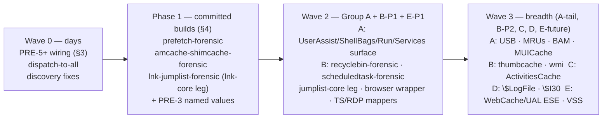

# Windows Endpoint Artifact Expansion — Coverage Matrix + New `-core`/`-forensic` Repos

**Date:** 2026-06-12 · **Status:** DESIGN (no code) · **Scope:** issen wiring + three Phase-1 fleet repos + the Phase-2+ A–E build-strategy roadmap
**Companion docs:** [capstone v5](2026-06-11-issen-correlate-capstone-v5.md) (PRE-1..6, G1/G2 gates) · [szechuan-sauce-union-answers](../../../tests/data/dfirmadness-szechuan-sauce/szechuan-sauce-writeups/szechuan-sauce-union-answers.md) (the honest-coverage accounting this plan closes)
**Structure:** (1) exec summary + gap · (2) full IWE coverage matrix · (3) Wave 0 wiring · (4) Phase 1 = the 3 committed repos · (5) Phase 2+ = the A–E roadmap grouped by build strategy · (6) sequencing · (7) cross-cutting integration (orchestrator fix, migration, super-timeline/correlation)

---

## Executive Summary

issen today parses **4 disk artifact families through the ingest pipeline** on real evidence — $MFT, $UsnJrnl, registry hive walk, EVTX — plus a memory process list, and it measures only **~11 of the 44 Case-001 union findings**. (SRUM is reachable only via the explicit `issen srum` command — its ingest `ForensicParser::parse()` returns empty at `issen-parser-srum/src/lib.rs:117-124` — so it is **command-only, not ingest-wired**.) Audited against the "Investigating Windows Endpoints" (IWE) taxonomy, that is **4 of 59 artifacts ingest-wired** (≈ 7%; SRUM command-only is a fifth surface). The single biggest gap is **evidence of execution** — Prefetch run counts/times, Amcache SHA-1s, Shimcache presence — and **LNK/Jump Lists**, which several Case-001 questions genuinely require ("was `coreupdater.exe` run, how many times, at what times"; the `Loot.lnk`/`Secret.lnk` staging answers). Four parser crates for these artifacts exist under `crates/parsers/`. As of 2026-06-11 three (prefetch/amcache/shimcache) are now **force-linked but still "dark"** — wiring alone did NOT make them measurable: on the re-run they emit **0 events** (prefetch is a MAM-skipping stub; amcache/shimcache emit nothing, shimcache also dispatch-starved by `.find()`). **LNK remains fully dead** (not yet a dep / not force-linked). So Wave 0 is link + the dispatch/discovery fixes; the parsers themselves still need real work.

The build strategy is **Wave 0 (wire) → Phase 1 (three repos) → Phase 2+ (the A–E roadmap), cheapest-first**:

- **Wave 0 — WIRE + the dark-parser reality (issen-only — PRE-5+):** force-link LNK (prefetch/amcache/shimcache are already linked), add the missing `.lnk` discovery arm, and fix two discovery/dispatch bugs (the `NTUSER.DAT` path-gate miss and the `.find()` single-parser dispatch that structurally starves Shimcache). **Caveat (verified): the force-linked amcache/shimcache still emit 0 events** — they are not just unwired, their `parse()` produces nothing on the real image — so Wave 0 ALSO needs each parser's `parse()` fixed (or superseded by the Phase-1 repos), not just linking. Prefetch is a MAM-skipping stub (`timestamp_ns = 0` — verified) deferred to Phase 1. (§3)
- **Phase 1 — BUILD the three committed repos (§4):** three new fleet workspaces in `~/src`, each on the vmdk/ewf `core/` + `forensic/` pattern, each a clean-room Rust reimplementation studying a named reference — **`prefetch-forensic`** (pure-Rust Xpress-Huffman/MAM + SCCA reader — the real fix for the execution answers; ref kacos2000/Prefetch-Browser), **`amcache-shimcache-forensic`** (both hive-derived EoE artifacts, reading hives via our `winreg-core`; ref Eric Zimmerman's AmcacheParser/AppCompatCacheParser), and **`lnk-jumplist-forensic`** (members `lnk-core` + `jumplist-core` + a shared analyzer — Jump Lists structurally embed LNK; refs EricZimmerman/LECmd + kacos2000/Jumplist-Browser). These supersede the four issen-parser-* crates, which become thin wrappers and are then retired.
- **Phase 2+ — the prioritized roadmap, grouped by build strategy (§5):** the actionable spine, ordered by leverage. **A. EXTEND `winreg-forensic`** (highest leverage — ~10 registry-derived artifacts unlock at once; we already own the reader and already extract the hives, so the work is analyzers + wiring, not new readers). **B. New `<x>-core`/`<x>-forensic` repos** for genuinely new formats (`recyclebin-forensic`, `thumbcache-forensic`, `scheduledtask-forensic`, `wmi-forensic`). **C. Ride `sqlite-forensic`** for SQLite-backed artifacts (ActivitiesCache.db; plus trivial shell-history text). **D. Extend `ntfs-forensic`** for NTFS internals ($LogFile, $I30 INDX slack, $Bitmap/$Boot). **E. Already in the fleet — WIRE/verify, don't build** (SRUM, EVTX channel mappers, browser-forensic + the Edge/IE WebCache ESE gap, VSS → state-history, SetupAPI).

Target after Wave 0 + Phase 1 + Group A: **~30 of 59 artifacts producing timeline events**, with every Case-001-required artifact (P0/P1 rows) covered.

---

## 1. Current State (verified 2026-06-12)

Every claim below was checked against the code on this date; file:line references are to the working tree.

**Wired (parser linked into `issen` and dispatchable):**

| Artifact | Where | Evidence |
|---|---|---|
| $MFT | `issen-cli/src/parsers/mft.rs` (internal, not the crates/parsers crate) | G1 measured events |
| $UsnJrnl:$J | `issen-cli/src/parsers/usnjrnl.rs` (internal) | G1 measured events |
| Registry hive walk | `issen-parser-registry` (force-linked `main.rs:13`, `lib.rs:45`) → `winreg-core`/`winreg-artifacts::registry_keys::walk_keys` | 193,636 events G1; named-value extraction is PRE-3 |
| EVTX | `issen-parser-evtx` (force-linked `main.rs:12`) | 4624/4625/7045 measured |
| SRUM | `issen-parser-srum` → `srum-forensic` (`srum-parser`/`srum-core`/`ese-core` path deps, `Cargo.toml:166-167`); linked via `commands/srum.rs` use | wired 0575027 |
| Memory process list | `memf` psscan route | G2 passed 2026-06-11 |

**Dead (crate exists, `inventory::submit!` present, never linked into the binary):** `issen-parser-prefetch`, `-shimcache`, `-amcache`, `-lnk`, `-shellbags`, `-setupapi`, `-pe`. Also `issen-parser-mft` and `-usnjrnl` are dead *duplicates* of the wired internal parsers (consolidation debt, flagged separately).

**Three structural defects found in this audit (all in `issen-fswalker/src/orchestrator.rs`):**

1. **Single-parser dispatch.** `run_pipeline` and `run_pipeline_parallel` select a parser with `parsers.iter().find(|p| p.supported_artifacts().contains(&t))` — exactly one parser per artifact. `issen-parser-shimcache` registers `ArtifactType::Registry` (`lib.rs:258-259`), so even force-linked it can never fire: the registry walker always wins the `.find()`. The same hive legitimately feeds multiple parsers (SYSTEM → walk + shimcache; NTUSER.DAT → walk + shellbags + UserAssist). The general fix is dispatch-to-all-matching (`.filter()`), not a per-artifact special case — isolation already exists per parse (`run_isolated`, A1).
2. **`NTUSER.DAT` discovery gate.** Hive names are only detected when the full path contains `registry` or `config`. Real images carry `C:\Users\<user>\NTUSER.DAT` — neither substring matches, so user hives in situ are never discovered. Generalize: detect hive names anywhere (magic-byte confirm `regf` on open), or add a `users` path predicate derived from structure, not a literal.
3. **No `.lnk` arm** in `detect_artifact_type` (and none for jump lists, setupapi, recycle-bin `$I`, etc.) — the discovery additions table is in §7.2.

**Our mature registry capability (`~/src/winreg-forensic/crates/winreg-artifacts`)** already decodes, today: `amcache`, `shimcache`, `userassist`, `shellbags`, `run_keys`, `typed_urls`, `sam`, `lsadump`, `com_hijacking`, `svc_diff`, `lxss`, `catalog_scan`, `registry_keys` (walk). None of these decoders is surfaced as issen timeline events yet except the raw key walk. The issen-parser-amcache/-shimcache/-shellbags crates re-implement hive parsing that winreg-artifacts already owns — duplication this plan removes via the migration in §4.

**Prefetch parser is a stub.** `issen-parser-prefetch/src/parser.rs:4` states timestamps require MAM/format-specific parsing it does not do; `lib.rs:199` asserts `timestamp_ns == 0` as the expected output. Win10 `.pf` files are MAM-compressed (Xpress-Huffman) — the current parser cannot decode the Case-001 Desktop prefetch at all. Force-linking it (PRE-5) therefore does **not** deliver the execution answers; `prefetch-core` (§4.1) does.

---

## 2. Coverage Matrix — IWE Artifact × issen Status × Action

One row per artifact named by the IWE knowledge base (`~/brain2/01_Projects/Investigating Windows Endpoints/`, modules 02–10 + exam cram). Status: ✅ wired · `partial` (capability exists but not surfaced / stub) · — none. Priority: **P0** = Case-001 answer requires it; **P1** = Case-001-corroborating or near-term breadth; **P2/P3** = strategic breadth.

### 2.1 Evidence of execution (IWE module 04)

| # | Artifact | Answers it yields | Where it lives today | Action | Pri |
|---|---|---|---|---|---|
| 1 | Prefetch (`C:\Windows\Prefetch\*.pf`) | exe name, **run count**, last-8 run times, first run, loaded modules, volume serial | `issen-parser-prefetch` DEAD + stub (no MAM, ts=0) | **BUILD `prefetch-forensic`** (§4.1); WIRE stub now for plumbing | **P0** |
| 2 | Shimcache (SYSTEM `...\Session Manager\AppCompatCache`) | binary existed on disk: path, size, $SI mtime, insertion order (not proof of execution on Win8+) | `issen-parser-shimcache` DEAD + dispatch-starved; `winreg-artifacts::shimcache` decodes; `memf-windows::shimcache` (memory) | **BUILD `amcache-shimcache-forensic`** (§4.2); WIRE now via dispatch fix | **P0** |
| 3 | Amcache (`Amcache.hve` InventoryApplicationFile) | **SHA-1**, path, size, publisher, link date; install/existence evidence | `issen-parser-amcache` DEAD; `winreg-artifacts::amcache` decodes | **BUILD `amcache-shimcache-forensic`** (§4.2); WIRE now | **P0** |
| 4 | UserAssist (NTUSER `...\Explorer\UserAssist\{GUID}\Count`) | per-user GUI execution, run count, focus count/time, last run (ROT13) | `winreg-artifacts::userassist` decodes; not surfaced | EXTEND `issen-parser-registry` to emit events | **P1** |
| 5 | SRUM (`SRUDB.dat`) | per-app CPU/network bytes per hour; exfil sizing | command-only via `issen srum` (ingest `parse()` empty); NOT ingest-wired | WIRE into ingest pipeline + extend table coverage (network bytes → events) | P1 |
| 6 | BAM/DAM (SYSTEM `bam\State\UserSettings\<SID>`) — *named in the task brief; not an IWE lesson* | per-user last-execution time with full path | — | EXTEND `winreg-artifacts` (new `bam.rs`) | P1 |
| 7 | MUICache (UsrClass `...\Shell\MuiCache`) | app ran at least once per user; FriendlyAppName | — | EXTEND `winreg-artifacts` | P2 |
| 8 | PCA (`C:\Windows\AppCompat\pca\PcaAppLaunchDic.txt`, `PcaGeneralDb0/1.txt`) | Win11 22H2+ last-exec timestamps, abnormal exits | — | BUILD `issen-parser-pca` (pipe-delimited text; trivial) | P3 |

### 2.2 LNK, Jump Lists, user file activity (IWE modules 08, 03, 10)

| # | Artifact | Answers it yields | Where it lives today | Action | Pri |
|---|---|---|---|---|---|
| 9 | LNK (`%APPDATA%\...\Recent\*.lnk` + anywhere) | target path + target MACB, volume serial, drive type, UNC share, machine ID/MAC; staging (F21 `Loot.lnk`/`Secret.lnk`) | `issen-parser-lnk` DEAD + no discovery arm | **BUILD `lnk-jumplist-forensic`** (§4.3, `lnk-core`); WIRE now (PRE-5 + `.lnk` arm) | **P0** |
| 10 | Jump Lists (`<AppID>.automaticDestinations-ms`) | per-app MRU/MFU documents, DestList interaction count + timestamps, embedded LNK streams | — (`ArtifactType::JumpLists` exists, no parser) | **BUILD in `lnk-jumplist-forensic`** (§4.3, `jumplist-core` → depends on `lnk-core`) | **P1** |
| 11 | Custom Jump Lists (`<AppID>.customDestinations-ms`) | pinned items; serialized LNK stream | — | BUILD in `lnk-jumplist-forensic` (`jumplist-core`) | P2 |
| 12 | ShellBags (NTUSER + UsrClass `BagMRU`/`Bags`) | every Explorer-navigated folder incl. deleted/UNC/removable/ZIP | `issen-parser-shellbags` DEAD; `winreg-artifacts::shellbags` decodes | WIRE now; CONSOLIDATE onto winreg-artifacts; FUTURE shellitems deep-decode | P1 |
| 13 | RecentDocs (NTUSER `...\Explorer\RecentDocs`) | recently opened docs per extension, MRU order | — | EXTEND `winreg-artifacts` | P2 |
| 14 | ComDlg32 `OpenSavePidlMRU` + `LastVisitedPidlMRU` | files opened/saved via dialogs + the originating executable | — | EXTEND `winreg-artifacts` | P2 |
| 15 | RunMRU (NTUSER `...\Explorer\RunMRU`) | commands typed into the Run dialog | — | EXTEND `winreg-artifacts` | P2 |
| 16 | TypedPaths (NTUSER `...\Explorer\TypedPaths`) | paths typed into the Explorer address bar | — | EXTEND `winreg-artifacts` | P2 |
| 17 | WordWheelQuery (NTUSER) | Explorer search terms | — | EXTEND `winreg-artifacts` | P3 |
| 18 | TypedURLs (NTUSER `Software\Microsoft\Internet Explorer\TypedURLs`) | typed IE URLs | `winreg-artifacts::typed_urls` decodes; not surfaced | EXTEND `issen-parser-registry` to emit | P2 |
| 19 | Windows Activity Timeline (`ActivitiesCache.db`, WxTCmd-equivalent) | app focus/usage, cross-device activity | — (SQLite; `sqlite-forensic` fleet repo is the base) | RIDE `sqlite-forensic` + schema (§5 Group C) | P3 |
| 19b | PowerShell `ConsoleHost_history.txt` (PSReadLine) | typed PowerShell commands per user | — | BUILD `issen-parser-pshistory` (trivial text; §5 Group C) | P2 |
| 20 | Thumbs.db / `thumbcache_*.db` | viewed-media existence surviving deletion | — | BUILD `thumbcache-forensic` (§5 Group B; CFB reader shared with `jumplist-core`) | P2 |
| 21 | Windows Search Index (`Windows.edb`) | indexed file/content existence incl. deleted | — (ESE; `ese-core` is the base) | FUTURE BUILD on `ese-core` | P3 |

### 2.3 Registry — system profile, devices, persistence keys (IWE modules 03, 05)

| # | Artifact | Answers it yields | Where it lives today | Action | Pri |
|---|---|---|---|---|---|
| 22 | Hive key/value walk → timeline | last-write timeline of every key | ✅ wired (`walk_keys`) | keep | — |
| 23 | `CurrentVersion` (OS version, InstallDate/InstallTime) | F1/F2 OS questions | partial — raw events exist; named-value extraction pending | **PRE-3** declarative named-value table | **P0** |
| 24 | `ComputerName` | F22 host identity | partial (PRE-3) | PRE-3 | **P0** |
| 25 | `TimeZoneInformation` | timeline normalization | partial (PRE-3) | PRE-3 | **P0** |
| 26 | `Tcpip\...\Interfaces` | F22 IP/network profile | partial (PRE-3) | PRE-3 | **P0** |
| 27 | Run/RunOnce keys | F17 persistence | `winreg-artifacts::run_keys` (+ `classify_run_entry`); not surfaced | PRE-3 surface | **P0** |
| 28 | `Services\<name>` | F17 `coreupdater` service persistence | `winreg-artifacts::svc_diff`; not surfaced | PRE-3 surface | **P0** |
| 29 | SAM hive (users, last login, RID) | account questions | `winreg-artifacts::sam`; not surfaced | EXTEND surface | P1 |
| 30 | TaskCache (`Schedule\TaskCache\Tasks` + `Tree`) + `\System32\Tasks\*` XML | scheduled-task persistence | — | EXTEND `winreg-artifacts` (`taskcache.rs`, §5-A) + BUILD `scheduledtask-forensic` for the XML side (§5 Group B); join on GUID | P1 |
| 31 | NetworkList (SOFTWARE) | network profiles, first/last connect | — | EXTEND `winreg-artifacts` | P2 |
| 32 | USBSTOR/USB enum + Properties `0064/0066/0067` | device, serial, first-install / last-arrival / last-removal | — | EXTEND `winreg-artifacts` (`usb.rs`) | P2 |
| 33 | MountedDevices (SYSTEM) | volume ↔ device ↔ drive-letter mapping | — | EXTEND `winreg-artifacts` | P2 |
| 34 | MountPoints2 (NTUSER) | which *user* mounted the device | — | EXTEND `winreg-artifacts` | P2 |
| 35 | Windows Portable Devices | friendly names of MTP devices | — | EXTEND `winreg-artifacts` | P3 |
| 36 | WDigest `UseLogonCredential` | credential-theft enablement | — | EXTEND `winreg-artifacts` (single-value check) | P2 |
| 37 | COM hijacking (HKCU vs HKCR InprocServer32) | persistence technique | `winreg-artifacts::com_hijacking`; not surfaced | EXTEND surface | P2 |
| 38 | LSA secrets / DCC2 | cached creds, secrets | `winreg-artifacts::lsadump`; not surfaced | EXTEND surface | P2 |

### 2.4 Event logs (IWE modules 02, 05)

| # | Artifact | Answers it yields | Where it lives today | Action | Pri |
|---|---|---|---|---|---|
| 39 | Security/System/Application EVTX | logons 4624/4625, services 7045, accounts | ✅ wired; D2 adds 4776 | keep + D2 | **P0** |
| 40 | TerminalServices LSM/RCM channels (21/22/25/1149) | RDP session truth (1149 alone ≠ auth — IWE caveat) | partial — files parse as EVTX; no semantic mappers | EXTEND `issen-parser-evtx` mappers | P1 |
| 41 | PowerShell/Operational (4103/4104) | script-block evidence | partial (same) | EXTEND mappers | P2 |
| 42 | Sysmon/Operational | process/network telemetry where present | partial (same) | EXTEND mappers | P2 |
| 43 | WMI-Activity/Operational | WMI lateral movement / persistence | partial (same) | EXTEND mappers | P2 |
| 44 | Defender/Operational (1116/1117) | detection/remediation history | partial (same) | EXTEND mappers | P2 |
| 45 | DriverFrameworks-UserMode + Kernel-PnP | USB connect/disconnect times | partial (same) | EXTEND mappers (pairs with #32) | P3 |
| 46 | UAL (`System32\LogFiles\SUM\Current.mdb` + `<GUID>.mdb`) | server: role/user/IP access counts (lateral movement) | — (ESE) | BUILD `ual-forensic` on `ese-core` (§5 Group E, future) | P2 |
| 47 | ESENT log evidence of `ntdsutil` (NTDS.dit staging) | DC credential-theft staging | partial — Application EVTX parses; no mapper | EXTEND mappers | P2 |
| 47b | WMI repository (`OBJECTS.DATA` — `__EventConsumer`/`__FilterToConsumerBinding`) | permanent (fileless) WMI-event persistence | — | BUILD `wmi-forensic` (§5 Group B) | P2 |

### 2.5 NTFS, deletion, recovery, timelining (IWE modules 06, 07, 09)

| # | Artifact | Answers it yields | Where it lives today | Action | Pri |
|---|---|---|---|---|---|
| 48 | $MFT ($SI/$FN MACB, resident data) | file timeline; timestomp inputs | ✅ wired | migrate onto `ntfs-core` per the existing parity-gate plan | — |
| 49 | $UsnJrnl:$J | create/delete/rename truth | ✅ wired (+ standalone `usnjrnl-forensic` fleet repo) | consolidate later | — |
| 50 | Timestomp detection ($SI < $FN) | tamper lead (deliberately Info-graded) | ✅ wired | layered redesign (staged elsewhere) | P2 |
| 51 | $Recycle.Bin `$I`/`$R` (+ legacy INFO2/RECYCLER) | who deleted what, when, original path | — | BUILD `recyclebin-forensic` (§5 Group B; oracle = RBCmd) — **answers Case-001 Beth-file deletion** | **P1** |
| 52 | $LogFile | low-level op replay; resurrect short-lived files | — | FUTURE BUILD in `ntfs-forensic` | P2 |
| 53 | $I30 slack (INDEX_ROOT/INDEX_ALLOCATION) | deleted directory entries with $FN timestamps | partial — `ntfs-core` parses index buffers; slack carving not surfaced | EXTEND `ntfs-forensic` → issen | P2 |
| 54 | ADS (`:streamname`) | hidden payloads, Zone.Identifier provenance | partial — MFT parser sees attributes; no ADS events | EXTEND issen MFT parsing | P2 |
| 55 | VSS (Volume Shadow Copies) | historical artifact states ([P^H] state-history) | — (`vsc-forensic`/`snapshot-forensic` are research-stage docs only) | FUTURE BUILD `vsc-forensic` | P2 |
| 56 | setupapi.dev.log | USB first-install timestamps surviving registry wipes | `issen-parser-setupapi` DEAD (mis-registered as `Registry`) | WIRE with own `ArtifactType::SetupApi` + discovery arm | P2 |

### 2.6 Browser and binary metadata (IWE module 10)

| # | Artifact | Answers it yields | Where it lives today | Action | Pri |
|---|---|---|---|---|---|
| 57 | Chrome/Edge/Firefox history, cache, cookies | F10 download corroboration | — in issen (`browser-forensic` fleet repo is mature standalone) | BUILD `issen-parser-browser` wrapper over `browser-forensic` | P1 |
| 58 | IE/legacy `WebCacheV01.dat` | F10 download corroboration on 2012R2/Win10 IE | — (ESE; browser-forensic has no Edge/IE crate) | BUILD `webcache-forensic` on `ese-core` (§5 Group E gap) | P2 |
| 59 | PE metadata (compile time, signatures, anomalies) | binary provenance | `issen-parser-pe` DEAD; `exec-pe-forensic` fleet repo exists | CONSOLIDATE onto `exec-pe-forensic`, wire | P2 |

**Tallies:** 62 rows (incl. 19b/47b/added). Wired today ✅: **5** (+2 NTFS detections riding them). `partial` (capability exists somewhere in the fleet but not surfaced as issen events, or stub): **17**. — none: rest. Strategy-group mix (§5): WIRE/Phase-0 7 · Phase-1 committed repos 6 rows (3 repos, §4) · **Group A** EXTEND winreg-artifacts ~12 · **Group B** new repos 4 · **Group C** sqlite-ride 2 · **Group D** ntfs-extend 3 · **Group E** wire-existing 7 · EVTX mappers 7 · PRE-3 6.

---

## 3. PRE-5+ — The Immediate Wiring (separate from the repo builds)

Smallest change that makes the dead parsers measurable; lands first, independent of §4. Verbatim PRE-5 from capstone v5 ("force-link inert parsers + `.lnk` discovery arm; serves F10 Amcache leg, F21 LNK leg"), plus the two defects this audit added.

1. **Force-link** in `issen-cli/src/main.rs` (pattern of `main.rs:12-15`): `extern crate issen_parser_prefetch; extern crate issen_parser_shimcache; extern crate issen_parser_amcache; extern crate issen_parser_lnk;` + the four `Cargo.toml` workspace-dep lines. (Shellbags and setupapi can ride along at zero cost, but the four are the PRE-5 contract.)
2. **`.lnk` discovery arm** in `detect_artifact_type` (`orchestrator.rs:78` region): extension `.lnk` (case-insensitive) → `ArtifactType::Lnk`.
3. **Dispatch-to-all fix:** replace the `.find()` parser selection in `run_pipeline` / `run_pipeline_parallel` with iteration over **all** parsers whose `supported_artifacts()` contains the type. This is the general rule — one artifact, N readers — not a shimcache special case; SYSTEM and NTUSER hives each legitimately feed several parsers. Per-parse isolation (`run_isolated`) already bounds the blast radius. `IngestResult::artifacts_parsed` semantics change from "artifacts" to "parser runs" — record the decision in the changelog.
4. **`NTUSER.DAT`/`UsrClass.dat` discovery fix:** drop the `registry|config` path-substring gate; detect hive filenames anywhere and confirm by the `regf` magic on open (structure-derived, not path-literal).
5. **TDD discipline:** RED = G1 re-run recording prefetch/shimcache/amcache/lnk event counts (capstone already prescribes recording the expected-0 baseline — that recording *is* the RED). GREEN = re-run showing nonzero amcache/shimcache/lnk counts on the Case-001 images. Prefetch is **expected to stay ~0 useful events** until `prefetch-core` lands (stub emits `timestamp_ns = 0`); state that in the gate so the number is not misread as regression.

What PRE-5+ buys for Case-001: F21 LNK staging leg, F10 Amcache leg, shimcache presence corroboration. What it does *not* buy: prefetch run counts/times — that is §4.1.

---

## 4. Phase 1 — The Committed Near-Term Repos (decided)

Three new workspaces in `~/src`, each exactly on the vmdk/ewf fleet pattern: one repo named `<x>-forensic`, members `core/` (raw reader, `Path`/`&[u8]` in, typed records out, **no findings**) + `forensic/` (anomaly analyzer emitting `forensicnomicon::report::Finding` via `impl Observation`), optional `cli/`. Every repo carries the full standard from `issen/CLAUDE.md`: Paranoid-Gatekeeper workspace lints (`unsafe_code = forbid`, `unwrap_used`/`expect_used = deny`, panic-free bounds-checked reads, allocation caps), `fuzz/` with one target per parsed structure + a full-pipeline target, 100% `--lib` line coverage gated with `// cov:unreachable` exemptions only, `deny.toml`/`clippy.toml`/`rustfmt.toml`/`.gitleaks.toml`/`renovate.json`/`LICENSE` (Apache-2.0), README to the SecurityRonin standard with live docs site at publish, and `docs/validation.md` recording real-artifact validation. **Validation corpus:** the real Case-001 Desktop Win10 artifacts (`*.pf`, `Amcache.hve`, `SYSTEM`, `Recent\*.lnk`, jump lists) are the acceptance fixtures; each repo also validates against the established oracle (PECmd, AppCompatCacheParser/AmcacheParser, LECmd, JLECmd) — reconcile counts and contents, explain divergences. Catalog every fixture in `issen/docs/corpus-catalog.md` + the repo's `tests/data/README.md` in the same change.

**Reference implementations — clean-room discipline (binding).** Each repo studies a named reference for *format and algorithm knowledge only* and reimplements in Rust from that understanding plus the public specs ([MS-SHLLINK], [MS-CFB], [MS-XCA], libyal format docs). **No code is copied or translated line-by-line** — same discipline as the Volatility steelman. Cite the reference repo per format detail in the source comments and `docs/validation.md`. References are cloned at `~/src/_refs/` (verified present: `Prefetch-Browser`, `LECmd`, `Jumplist-Browser`).

### 4.1 `~/src/prefetch-forensic` — the execution-answers repo

Reference: `~/src/_refs/Prefetch-Browser` (kacos2000) — `Local_PfAp.ps1` shows the load-bearing technique: Win8.1/10 `.pf` files are MAM-wrapped and it decompresses via P/Invoke `RtlDecompressBufferEx(COMPRESSION_FORMAT_XPRESS_HUFFMAN)` (`Xpress.dll`). We cannot P/Invoke; the wrapper must be decoded in pure Rust.

- **`prefetch-core`** (crate `prefetch-core`; import name per the collision rule once checked on crates.io):
  - **MUST decode the MAM wrapper first**: Win8.1/10/11 `.pf` files open with `MAM\x04` + decompressed-size header, body LZXPRESS-Huffman compressed. This is the precise reason the current parser yields 0 usable events on the real Win10 image. Requires a **pure-Rust Xpress-Huffman decompressor** (LZ77 + canonical Huffman per [MS-XCA] §2.2; no Windows API): first search crates.io for an existing implementation we can depend on (e.g. libfwnt-derived ports) and vet it against the Paranoid-Gatekeeper bar; if nothing meets it, implement in-crate — bounded, allocation-capped by the declared decompressed size, hard ceiling against decompression bombs. (Fleet note: this decompressor also serves future hiberfil/Win10-memory-compression work — design it as a reusable module.)
  - Then the SCCA body, versions 17 (XP) / 23 (Vista/7) / 26 (8.1) / 30–31 (10/11): executable name, prefetch hash, **run count**, **last-8 run timestamps** (1 on ≤ v23), volume info (serial, creation), **loaded-module list** (the F-strings), file-references.
  - API shape (mirrors the fleet): `Prefetch::from_bytes(&[u8]) -> Result<Prefetch, Error>` / `Prefetch::open(Read + Seek)`; typed `PrefetchFile { exe_name, hash, run_count, run_times: Vec<FILETIME>, volumes, modules, version }`. Zero panics on attacker bytes; every offset/length range-checked.
  - Fuzz targets: `mam_decompress`, `xpress_huffman`, `scca_header`, `volume_info`, `module_list`, `fuzz_forensic`.
- **`prefetch-forensic`**: `audit(&PrefetchFile) -> Vec<Finding>` via `impl Observation`. Anomaly codes (scheme-prefixed, published contract): `PF-HASH-MISMATCH` (filename hash ≠ computed path hash — copied/renamed `.pf`), `PF-VERSION-UNKNOWN`, `PF-TRUNCATED`, `PF-RUNTIME-FUTURE` (run time after acquisition), `PF-RUNCOUNT-ZERO-WITH-TIMES`. All graded; observations, never verdicts.
- **issen wrap:** `issen-parser-prefetch` becomes a thin adapter — `prefetch-core` record → one `ProcessExec` `TimelineEvent` **per run timestamp** (metadata: `run_count`, `run_index`, `volume_serial`; `EntityRef::Process(exe)`, `EntityRef::FilePath`), plus module-list events on demand; `prefetch-forensic` findings → `Report`.

### 4.2 ~~`~/src/amcache-shimcache-forensic`~~ — SUPERSEDED: fold into `winreg-artifacts`

> **Decision (2026-06-12): do NOT build a standalone repo.** Amcache and Shimcache
> are registry-hive artifacts, and the fleet already owns the registry-artifact home:
> `winreg-artifacts` (in `winreg-forensic`) already ships `amcache.rs` and
> `shimcache.rs` decoders over `winreg-core` — no notatin. A separate repo would
> duplicate them and contradicts §5-A ("extend `winreg-forensic`"). **Done:** the
> issen `issen-parser-amcache` / `-shimcache` / `-shellbags` parsers now delegate to
> `winreg-artifacts` and notatin is fully removed from the issen dep tree
> (`cargo tree -i notatin` → no match). **Remaining:** add the forensic *findings*
> layer (the `AMC-*` / `SHIM-*` codes below, `EOE-PRESENT-NOT-EXECUTED`) to
> `winreg-forensic`'s analyzer, and converge the memory leg
> (`memf-windows::shimcache`) on the shared `ShimcacheEntry`. The reference notes
> below are retained as the spec for that analyzer work.

Reference: Eric Zimmerman's [AmcacheParser](https://github.com/EricZimmerman/AmcacheParser) and [AppCompatCacheParser](https://github.com/EricZimmerman/AppCompatCacheParser) (format knowledge — key layouts, version discrimination, value semantics; not cloned locally, cite per detail).

One workspace, both artifacts (both are EoE facts extracted from registry hives; they share the hive substrate and the analyzer narrative). Members:

- **`amcache-core`**: parses `Amcache.hve` — modern `Root\InventoryApplicationFile\` (LowerCaseLongPath, FileId/**SHA-1**, LinkDate, Size, Publisher, BinaryType) and legacy Win7 `Root\File\<VolumeGuid>\<seq>` (value `15` path, `101` SHA-1). **Reads the hive via our `winreg-core`** (`Hive::from_bytes`) — no registry re-implementation (fleet rule). The decode logic seeds from `winreg-artifacts::amcache` (lifted/factored, not duplicated — winreg-artifacts then depends on or re-exports `amcache-core` so one decoder exists fleet-wide).
  - IWE caveat encoded in the API: Amcache last-write is **not** a reliable first-execution indicator on modern systems — the record type exposes timestamps with named provenance (`key_last_write`, `link_date`), never a field called `executed_at`.
- **`shimcache-core`**: parses the `AppCompatCache` value out of a SYSTEM hive (via `winreg-core`; ControlSet resolution via the `Select` key), formats: Win10 `10ts`, Win8 `00ts`/`10ts`, Win7 (x86/x64), XP. Typed `ShimcacheEntry { path, size, si_mtime, position, executed_flag: Option<bool> }` — insertion order preserved (it is evidentiary).
  - IWE caveat in the type: presence proves existence, not execution; `executed_flag` is `Option` because the flag exists only on some versions.
- **`amcache-shimcache-forensic`** (shared analyzer): codes `AMC-SHA1-KNOWNBAD-FORMAT` is *not* emitted here (hash matching is issen's PRE-6 job — analyzer stays offline-pure); instead: `AMC-ENTRY-TRUNCATED`, `AMC-PATH-NONCANONICAL`, `SHIM-CONTROLSET-MISMATCH`, `SHIM-FORMAT-UNKNOWN`, `SHIM-ENTRY-COUNT-IMPLAUSIBLE`, and the cross-artifact observation `EOE-PRESENT-NOT-EXECUTED` (shimcache entry with no amcache/prefetch corroboration — Info-graded, "consistent with").
- **issen wrap:** `issen-parser-amcache`/`-shimcache` become thin adapters (then retire); shimcache dispatch works because of the §3 dispatch-to-all fix — the SYSTEM hive routes to both the registry walker and the shimcache adapter. `memf-windows::shimcache` (memory-resident shimcache, F36) converges on the same `ShimcacheEntry` type so disk and memory legs are comparable.

### 4.3 `~/src/lnk-jumplist-forensic` — ShellLink + Jump Lists, one family

References: `~/src/_refs/LECmd` (EricZimmerman; MIT — the gold-standard C# LNK parser and the differential-validation oracle) and `~/src/_refs/Jumplist-Browser` (kacos2000 — DestList layout notes, AppID catalog `AppIdlist.csv`, CustomDestinations format doc).

One workspace, not two: Jump Lists structurally *embed* full LNK records, so the two formats are a tightly-coupled family that always versions together — two `-core` readers, one analyzer (name parallel with `amcache-shimcache-forensic`). issen still exposes `Lnk` and `JumpLists` as distinct artifact types. Members:

- **`lnk-core`**: [MS-SHLLINK] decoder — ShellLinkHeader (target $SI MACB, size, flags, hotkey), LinkTargetIDList (shell items), LinkInfo (volume serial, drive type, local/UNC base path), StringData, and the ExtraData blocks including TrackerDataBlock (machine ID, **MAC address**, droid/birth-droid GUIDs), PropertyStore, EnvironmentVariable and KnownFolder blocks. Entry points: `ShellLink::from_bytes(&[u8])` for a standalone `.lnk` **and** for LNK byte ranges embedded in other containers — the `&[u8]` slice entry point is the seam `jumplist-core` consumes, so LNK parsing exists exactly once in the fleet.
- **`jumplist-core`**: parses `automaticDestinations-ms` — an OLE compound file ([MS-CFB]: bounded header/FAT/directory walking, implemented in-crate and scoped to read-only stream extraction) containing numbered LNK streams + the **DestList** stream (entry ID, interaction count, last-used FILETIME, hostname, pin status; versioned Win7/8/10/11) — and `customDestinations-ms` (concatenated serialized LNKs). **Depends on `lnk-core`** for every embedded LNK structure — no duplicated LNK parsing (the fleet dependency edge `jumplist-core → lnk-core`). Ships the AppID → application mapping as compile-time data (forensicnomicon-style constants) with provenance noted.
- **`lnk-jumplist-forensic`** (shared analyzer over both readers): codes `LNK-TIME-INCONSISTENT` (target MACB self-contradiction), `LNK-UNC-TARGET` (Info — network staging lead), `LNK-REMOVABLE-TARGET`, `LNK-TRACKER-HOST-MISMATCH`, `JL-DESTLIST-COUNT-MISMATCH` (DestList entries vs LNK streams), `JL-CFB-MALFORMED`, `JL-DESTLIST-VERSION-UNKNOWN`, `JL-ENTRY-TIME-INCONSISTENT`. Observations only.
- **issen wrap:** `.lnk` → `FileAccess`/`FileCreate` events carrying target MACB + volume serial (`EntityRef::FilePath` for both the lnk and the target — F21 join keys); `*.automaticDestinations-ms`/`*.customDestinations-ms` → `ArtifactType::JumpLists` events (`FileAccess` semantics) carrying interaction counts and per-entry target metadata from the embedded LNKs.

### 4.4 Migration — the new repos supersede the issen-parser-* crates

| Phase | State |
|---|---|
| 0 (now) | PRE-5+ wires the existing crates as-is — the quick win is independent of the builds |
| 1 (build) | Each repo developed in `~/src/<repo>`; issen takes **path deps** only while actively co-developing (`prefetch-core = { path = "../prefetch-forensic/core" }`), mirroring the current srum-forensic pattern (`issen/Cargo.toml:166-167`) |
| 2 (adapt) | `issen-parser-{prefetch,amcache,shimcache,lnk}` rewritten as thin adapters: fleet record types → `TimelineEvent`; all format knowledge deleted from issen. Parity gate: adapter output ⊇ old parser output on the Case-001 corpus before the old code path is removed |
| 3 (publish) | Repos published to crates.io; issen switches to **registry versions** (fleet rule: published crate over path dep); the dead duplicate `issen-parser-mft`/`-usnjrnl` crates are retired in the same sweep |
| 4 (retire) | Adapters are the only issen-side code; `winreg-artifacts::{amcache,shimcache}` re-export the `-core` decoders so the fleet has exactly one decoder per format |

---

## 5. Phase 2+ — The Prioritized Roadmap, Grouped by Build Strategy

This is the actionable spine. After Phase 1 (the three repos in §4), everything else sequences into five build-strategy groups **A–E, ordered by leverage** (effort-to-coverage ratio, cheapest first). Each item carries a priority tied to **IWE frequency** (how central the artifact is across the IWE modules) and **Case-001 relevance**. The fleet location of every "already own it" claim was verified by reading the code on 2026-06-12 (see the Appendix ledger).

The promotion rule that assigns each artifact to a group: *registry-derived → EXTEND winreg-artifacts (A); genuinely new binary format with standalone analyst value → new `-core`/`-forensic` repo (B); SQLite-backed → ride `sqlite-forensic` (C); NTFS-internal → extend ntfs-forensic (D); already in the fleet → WIRE/verify, never rebuild (E).*

### Group A — Registry-derived → EXTEND `~/src/winreg-forensic` (HIGHEST LEVERAGE)

**Why first:** ~10 artifacts unlock from *one* substrate we already fully own — `winreg-core` reads the hive, issen already extracts the hives during the G1 walk, and `winreg-artifacts` already has the module pattern (`pub struct XEntry` + `pub fn parse(&Hive) -> Vec<XEntry>`). The work is **analyzers + issen event-emission, not new readers**. No new repo, no new format decoder for the hive itself.

**Verified state of `winreg-artifacts` (read 2026-06-12 — 15 modules present):** the following decoders **already exist** and only need *surfacing* as issen timeline events (the decode is done): `userassist` (with `rot13_decode`), `shellbags`, `run_keys` (Run/RunOnce **and** Winlogon Shell/Userinit), `svc_diff` (services), `typed_urls`, `shimcache`, `amcache`, `sam`, `com_hijacking`, `lsadump`, `catalog_scan`, `lxss`. The following are **absent and need adding as new modules** (grep confirmed zero hits): `bam`/`dam`, `muicache`, `recentdocs`, `runmru`, `typedpaths`, the ComDlg32 MRUs (`opensave`/`lastvisited`), `wordwheel`, `usbstor`, `mounteddevices`.

| Item | winreg-artifacts state | Work | IWE freq | Case-001 | Pri |
|---|---|---|---|---|---|
| UserAssist (ROT13 run-counts, focus time) | **decoder exists** (`userassist.rs`) | surface → issen events | high (module 04 EoE) | per-user GUI exec | **P1** |
| ShellBags (folder navigation, incl. deleted/UNC/ZIP) | **decoder exists** (`shellbags.rs`) | surface; deep shellitem decode later | high (module 03) | folder-access leads | **P1** |
| Run/RunOnce/Winlogon persistence | **decoder exists** (`run_keys.rs` + `classify_run_entry`) | surface (rides PRE-3) | high (module 05) | **F17** coreupdater Run key | **P0** |
| Services persistence | **decoder exists** (`svc_diff.rs`) | surface (rides PRE-3) | high (module 05) | **F17** coreupdater service | **P0** |
| BAM/DAM (per-SID last-run + full path) | **absent** — add `bam.rs` | new module + surface | medium (not an IWE lesson; std EoE) | per-user exec timeline | P1 |
| MUICache (app ran ≥ once per user) | **absent** — add `muicache.rs` | new module + surface | medium (module 04) | corroborating EoE | P2 |
| RecentDocs (recently opened docs, MRU order) | **absent** — add `recentdocs.rs` | new module + surface | medium (module 03) | file-access leads | P2 |
| MRUs: RunMRU / TypedPaths / OpenSaveMRU / LastVisitedMRU / ComDlg32 / WordWheelQuery | **absent** — add `runmru.rs`, `typedpaths.rs`, `comdlg32.rs`, `wordwheel.rs` | new modules + surface | medium (module 03) | typed-command & dialog leads | P2 |
| TypedURLs (IE typed URLs) | **decoder exists** (`typed_urls.rs`) | surface | low (module 03) | download corroboration | P2 |
| USBSTOR + MountedDevices (device, serial, first/last connect, drive-letter map) | **absent** — add `usbstor.rs`, `mounted_devices.rs` | new modules + surface; pairs with EVTX DriverFrameworks (Group E) | medium (module 03) | USB exfil profiling | P2 |

**issen wiring for all of Group A:** one hive read, N decoders — surfaced through `issen-parser-registry`, made possible by the §3 dispatch-to-all fix (so NTUSER.DAT → walk + shellbags + UserAssist + MRUs in a single pass). Each decoder's `XEntry` → typed `TimelineEvent` per §7.1.

### Group B — New `<x>-core`/`<x>-forensic` repos (genuinely new formats)

**Why:** these are binary formats not derived from a hive, a SQLite DB, or the NTFS metafiles — they earn the full repo treatment (deep format + standalone analyst value, per the promotion rule). All four are **ABSENT** today (verified: no `thumbcache-forensic`/`recyclebin-forensic`/`wmi-forensic`/`scheduledtask-forensic` directory in `~/src`). Each follows the §4 standard (core/forensic, Paranoid Gatekeeper, fuzz, 100% lib coverage, clean-room with cited reference + oracle validation).

| Repo | Format / IWE basis | Reader API sketch | IWE freq | Case-001 | Pri |
|---|---|---|---|---|---|
| **`recyclebin-forensic`** | `$I`/`$R` (Vista+) + legacy `INFO2`/RECYCLER — IWE module 07 "The Recycle Bin" (RBCmd) | `RecycleEntry { original_path, deleted_at: FILETIME, original_size, sid }`; one `$I` = fixed 24/28-byte header + UTF-16 path; oracle = RBCmd | high (module 07, dedicated lesson) | **directly answers Case-001 Beth-file deletion** (who deleted what, when, original path) | **P1** |
| **`thumbcache-forensic`** | `thumbcache_*.db` (Win Vista+ CFB-ish cache) + legacy `Thumbs.db` (OLE/CFB) — IWE module 10 | `ThumbEntry { cache_id, signature, hash, image_bytes }`; reuses the CFB reader factored from `jumplist-core` (§4.3) for `Thumbs.db`; oracle = Thumbcache Viewer | medium (module 10, dedicated lesson) | viewed-media existence surviving deletion | P2 |
| **`scheduledtask-forensic`** | `\System32\Tasks\*` task XML + the registry `TaskCache` (Tree/Tasks) cross-check — IWE module 05 (exam cram: "each task is an XML file; KAPE-collectable") | `ScheduledTask { name, author, triggers, action, last_run, registration_time }`; XML reader + TaskCache GUID join | high (module 05 persistence) | scheduled-task persistence | P1 |
| **`wmi-forensic`** | `OBJECTS.DATA` (CIM repository) — `__EventFilter` / `__EventConsumer` / `__FilterToConsumerBinding` permanent-WMI-event persistence — IWE module 05 (WMI-Activity) | `CimObject` walk → consumer-binding triples; the standard fileless-persistence artifact | medium (module 05) | WMI persistence (none in Case-001, but core technique) | P2 |

Note: `scheduledtask-forensic`'s registry-`TaskCache` leg also surfaces via a small `taskcache.rs` in Group A (the registry side); the repo owns the **XML file** side. The two join on task GUID — designed together.

### Group C — SQLite-backed → ride `~/src/sqlite-forensic` + a schema (no new format repo)

**Why:** `sqlite-forensic` exists (`core`/`forensic`/`cli`, verified) and already does panic-free SQLite page parsing + deleted-record carving. SQLite-backed Windows artifacts are a **schema mapping on top of `sqlite-core`**, not a new format reader.

| Item | Basis | Work | IWE freq | Pri |
|---|---|---|---|---|
| Windows Activity Timeline (`ActivitiesCache.db`) | SQLite, `Activity`/`ActivityOperation` tables — IWE module 10 (WxTCmd) | schema map over `sqlite-core` → app focus/usage events; carve deleted rows for free | medium (module 10) | P3 |
| PowerShell `ConsoleHost_history.txt` | trivial plain text (PSReadLine), not SQLite | one-line text reader in issen (`issen-parser-pshistory`) — listed here as the SQLite-group "while we're in user-shell-history land" companion | medium (module 05) | P2 |

### Group D — NTFS internals → extend `~/src/ntfs-forensic`

**Why:** `ntfs-forensic` (`core`/`forensic`) already parses the boot sector, MFT, attributes, runlists, **a `logfile/` module (with `usn_extractor`), `index.rs`, and `carve.rs`** (verified). These items are *new surfaces on the existing reader*, not a new repo.

| Item | ntfs-core state | Work | IWE freq | Pri |
|---|---|---|---|---|
| `$LogFile` (transaction log replay — resurrect short-lived files) | `logfile/` module **exists** (currently USN-extraction focused) | extend to full LSN/redo-undo replay → issen events | medium (module 06/07) | P2 |
| `$I30` INDX slack (deleted directory entries with $FN MACB) | `index.rs` parses index buffers | surface slack-region carving as issen events | medium (module 06) | P2 |
| `$Bitmap` / `$Boot` (cluster allocation state, volume serial/geometry) | `boot.rs` exists; no `$Bitmap` surfacing | add `$Bitmap` allocation map (carving support) + `$Boot` profile event | low (module 06) | P3 |

### Group E — Already in the fleet → WIRE / verify, don't build

**Why:** the capability exists; the only work is wiring or filling a small gap. Building anything new here would violate the fleet "prefer our own crates" rule.

| Item | Fleet location (verified) | Work | Pri |
|---|---|---|---|
| SRUM (`SRUDB.dat`) | `issen-parser-srum` → `srum-forensic` (wired) | verify table coverage; push network-usage rows as events | P1 |
| EVTX | `issen-parser-evtx` (wired) + `winevt-forensic` fleet repo | add the channel mappers (Group A pairs with USB; TS/RDP, PowerShell, Sysmon, WMI-Activity, Defender) | P1/P2 |
| Browser history/cache/cookies | `browser-forensic` (Chrome/Firefox/Safari crates present) | BUILD `issen-parser-browser` wrapper; **gap: no Edge/IE WebCache (ESE) crate** — that ESE leg builds on `srum-forensic`'s `ese-core` (new `webcache-forensic`), not browser-forensic | P1 (wrapper) / P2 (ESE gap) |
| VSS (Volume Shadow Copies) | `vsc-forensic` = RESEARCH.md only; `state-history-forensic` is a real crate; `snapshot-forensic` = docs only | FUTURE BUILD `vsc-forensic` as the `[P^H]` state-history leaf onto `state-history-forensic` | P2 |
| SetupAPI (`setupapi.dev.log`) | `issen-parser-setupapi` exists but **mis-registers as `ArtifactType::Registry`** (verified `lib.rs:192-193`) | WIRE: give it its own `ArtifactType::SetupApi` + discovery arm (§7.2); USB first-install times surviving registry wipes | P2 |
| UAL (`Current.mdb`/`<GUID>.mdb`) | ESE — `ese-core` exists in `srum-forensic` | FUTURE BUILD `ual-forensic` on `ese-core` (server lateral-movement access counts) | P2 |
| PE metadata | `issen-parser-pe` DEAD; `exec-pe-forensic` fleet repo exists | CONSOLIDATE onto `exec-pe-forensic`, wire | P2 |

---

## 6. Sequencing & Priority — mapped to Case-001 findings and IWE modules

| Wave | Strategy groups | Items | Union findings / questions served | IWE module |
|---|---|---|---|---|
| 0 | (pre-build) | PRE-5+ (§3) | F10 Amcache leg, F21 LNK leg; shimcache corroboration | 04, 08 |
| Phase 1 | the 3 repos (§4) | prefetch-forensic + amcache-shimcache-forensic + lnk-jumplist-forensic `lnk-core` leg + PRE-3 | **the execution answers** (run count/times of `coreupdater.exe` — Prefetch; SHA-1 — Amcache F9-adjacent), F1–F3/F22 (OS/host/IP), F17/F19 (Run*/Services) | 03, 04, 08 |
| 2 | **A** (P0/P1 surface) · **B** (P1) · **E** (P1) | Run/Services/UserAssist/ShellBags surfacing (decoders already exist); `recyclebin-forensic`, `scheduledtask-forensic`; `jumplist-core` leg; `issen-parser-browser`; TS/RDP + 4776 mappers; SRUM verify | **F17/F19** persistence, F10 download corroboration, RDP session truth (F6/F20), **Case-001 Beth-file deletion** | 02, 03, 05, 07, 08 |
| 3 | **A** (P2 tail) · **B** (P2) · **C** · **D** · **E** (future) | winreg add-modules (BAM, MUICache, RecentDocs, MRUs, USBSTOR/MountedDevices); `thumbcache-forensic`, `wmi-forensic`; ActivitiesCache + shell history; `$LogFile`/`$I30`/`$Bitmap`; WebCache/UAL ESE; VSS | breadth beyond Case-001: USB exfil, search terms, WMI persistence, server lateral movement (UAL), historical states | 02, 03, 05, 06, 10 |

Within every wave, Case-001-relevant items run first; each repo build follows strict TDD with the Case-001 real artifacts as the GREEN acceptance fixtures and separate RED/GREEN commits per the global discipline.

---

## 7. Integration — how each artifact reaches the super-timeline and the Report

### 7.1 Events

All parsers emit `issen_core::timeline::event::TimelineEvent { timestamp_ns, timestamp_display, event_type, source: ArtifactType, ... }` with `entity_refs` populated (PRE-2/PRE-4: `FilePath`/`Process`/`User`/`Ip`/`Session`) so `temporal_join` and the CORR rules can pivot. Mapping conventions:

| Source | EventType | Entity refs | Notes |
|---|---|---|---|
| Prefetch run | `ProcessExec` (one per run timestamp) | Process(exe), FilePath | metadata: run_count, run_index, volume_serial |
| Amcache entry | `ProcessExec`-class existence event | Process, FilePath | metadata: sha1, publisher, link_date; timestamp = key last-write, **labeled as such** |
| Shimcache entry | `Other("ShimcachePresence")` | FilePath | deliberately *not* `ProcessExec` — presence ≠ execution (IWE) |
| LNK | `FileAccess` (+ `FileCreate` for target birth) | FilePath ×2 | target MACB + volume serial in metadata |
| Jump list DestList | `FileAccess` | FilePath, User | interaction_count |
| UserAssist / BAM / MUICache / MRUs | `ProcessExec` / `Other(...)` per semantics | User + Process/FilePath | per-user attribution is the point |

New `ArtifactType` variants needed (enum at `issen-core/src/artifacts/types.rs:5`; additive): `Shimcache`, `SetupApi`, `RecycleBin`, plus later `WebCache`, `Ual`, `ActivityTimeline`, `Pca`, `SearchIndex`, `ScheduledTask`, `WmiRepository`. `Lnk`, `JumpLists`, `Bam`, `BrowserHistory`, `Shellbags` already exist.

### 7.2 Discovery additions (`detect_artifact_type`)

| Pattern (case-insensitive) | ArtifactType |
|---|---|
| `*.lnk` | Lnk (Wave 0) |
| `*.automaticdestinations-ms`, `*.customdestinations-ms` | JumpLists |
| hive filenames anywhere + `regf` magic confirm (drop the `registry|config` gate) | Registry (Wave 0) |
| `setupapi.dev.log` / `setupapi.log` | SetupApi |
| `$I*` under a `$Recycle.Bin`/`RECYCLER` path component | RecycleBin |
| `pcaapplaunchdic.txt`, `pcageneraldb0/1.txt` | Pca |
| `activitiescache.db` | ActivityTimeline |
| `webcachev*.dat` | WebCache |
| `current.mdb` under `LogFiles\SUM` | Ual |
| `windows.edb` | SearchIndex |
| `$LogFile` | (NTFS deepening) |

Dispatch runs **all** matching parsers per artifact (§3, item 3) — the structural prerequisite for hive-multiplexing (SYSTEM → walk + shimcache; NTUSER.DAT → walk + shellbags + UserAssist + MRUs) and thus for all of §5 Group A.

### 7.3 Findings

Analyzer output (`prefetch-forensic`, `amcache-shimcache-forensic`, `lnk-jumplist-forensic`, and later analyzers) flows as `forensicnomicon::report::Finding` built via `Finding::observation(...)`/`impl Observation`, aggregated into the case `Report`. Codes are scheme-prefixed SCREAMING-KEBAB published contracts (`PF-*`, `AMC-*`, `SHIM-*`, `LNK-*`, `JL-*`); `Category::from_code` defaults; MITRE references via `ExternalRef::mitre_attack(...)` are always "consistent with", never verdicts — the analyst and tribunal conclude. Severity grading follows the canonical normalization table in `issen/CLAUDE.md`; `severity: None` only where a finding genuinely cannot be graded in isolation.

---

## Appendix — Verification ledger (claims → where checked, 2026-06-12)

- Force-linked parsers: `issen-cli/src/main.rs:12-15` (evtx, registry, uac, velociraptor), `lib.rs:45` (registry); srum linked via `commands/srum.rs:7` + workspace dep.
- Dead parsers: `inventory::submit!` present in all 16 `crates/parsers/*/src/lib.rs`; no `extern crate`/`use` for prefetch/shimcache/amcache/lnk/shellbags/setupapi/pe/mft/usnjrnl crates anywhere in `issen-cli/src/`.
- Single-parser dispatch: `issen-fswalker/src/orchestrator.rs` `run_pipeline`/`run_pipeline_parallel` use `.find()` on `supported_artifacts()`.
- Shimcache/setupapi register `ArtifactType::Registry`: `issen-parser-shimcache/src/lib.rs:258-259`, `issen-parser-setupapi/src/lib.rs:192-193`.
- NTUSER gate: `detect_artifact_type` requires `full.contains("registry") || full.contains("config")` for hive names.
- Prefetch stub: `issen-parser-prefetch/src/parser.rs:4` (no MAM), `lib.rs:199` (`timestamp_ns == 0` asserted).
- winreg-artifacts modules: `~/src/winreg-forensic/crates/winreg-artifacts/src/` (14 modules listed in §1); `issen-parser-registry` already depends on `winreg-core`/`winreg-artifacts`.
- srum-forensic = ESE+SRUM workspace (`ese-core`, `ese-integrity`, `ese-carver`, `srum-core`, `srum-parser`); issen path-deps at `issen/Cargo.toml:166-167`.
- Fleet pattern reference: `~/src/vmdk-forensic` (`core/`+`forensic/`+`cli/`+`fuzz/`+deny/clippy/rustfmt), `~/src/ewf`.
- `vsc-forensic` = RESEARCH.md only; `snapshot-forensic` = docs only; `usnjrnl-forensic`, `winevt-forensic`, `browser-forensic`, `sqlite-forensic`, `ntfs-forensic`, `exec-pe-forensic` exist as fleet repos.
- IWE corpus: modules 02–10 + IWE-Exam-Cram read/extracted from `~/brain2/01_Projects/Investigating Windows Endpoints/`; artifact paths quoted from the source files. **BAM/DAM has no IWE lesson** (grep over the corpus found no BAM mention) — it enters the matrix from the task brief and standard EoE practice, marked accordingly (row 6).
- Coverage claim "~11 of 44": `tests/data/dfirmadness-szechuan-sauce/szechuan-sauce-writeups/szechuan-sauce-union-answers.md:48-56` ("issen coverage today — honest accounting").
- PRE definitions and sequencing: `docs/plans/2026-06-11-issen-correlate-capstone-v5.md` §6.1/§6.3.
- Reference implementations present at `~/src/_refs/`: `Prefetch-Browser/` (incl. `Local_PfAp.ps1`, `Xpress.dll`), `LECmd/`, `Jumplist-Browser/` (incl. `AppIdlist.csv`, CustomDestinations format doc) — verified by directory listing 2026-06-12.
- **§5 Group A** — winreg-artifacts present decoders (read `crates/winreg-artifacts/src/` 2026-06-12): `amcache, catalog_scan, com_hijacking, lsadump, lxss, path_expansion, registry_keys, run_keys, sam, shellbags, shimcache, svc_diff, typed_urls, userassist` (+ `lib`); `userassist.rs` has `rot13_decode`; `run_keys.rs` covers Run/RunOnce **and** Winlogon. **Absent** (grep zero hits, need new modules): `bam/dam, muicache, recentdocs, runmru, typedpaths, comdlg/opensave/lastvisited, wordwheel, usbstor, mounteddevices`.
- **§5 Group B** — `thumbcache-forensic`, `recyclebin-forensic`, `wmi-forensic`, `scheduledtask-forensic` all ABSENT from `~/src` (verified). IWE basis confirmed: module 07 "The Recycle Bin" ($I/$R, RBCmd), module 10 "Thumbs.db and Thumbcache", exam-cram `\System32\Tasks\*` XML + TaskCache.
- **§5 Group C** — `sqlite-forensic` EXISTS (`core`/`forensic`/`cli`, verified).
- **§5 Group D** — `ntfs-forensic` core has `logfile/` (with `usn_extractor.rs`), `index.rs`, `carve.rs`, `boot.rs` (verified `ls core/src`); no `$Bitmap` surfacing.
- **§5 Group E** — `browser-forensic` members are Chrome/Firefox/Safari (+snss); **no WebCache/ESE/Edge crate** (verified workspace members). `issen-parser-setupapi` registers `ArtifactType::Registry` at `src/lib.rs:192-193` (the mis-registration). `vsc-forensic` = RESEARCH.md only; `state-history-forensic` is a real crate; `snapshot-forensic` = docs only.
