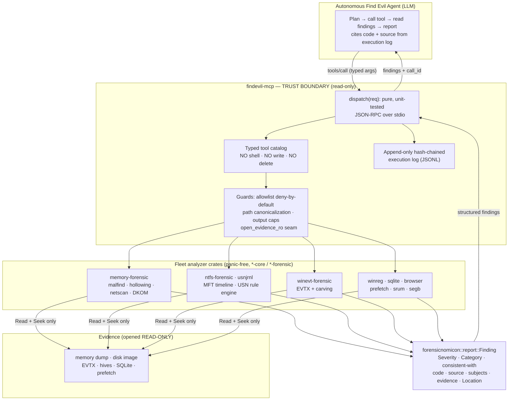

# FindEvil MCP — Design for an Autonomous "Find Evil" DFIR Agent over the SecurityRonin Fleet

*Design document — 2026-06-15. Status: DESIGN ONLY, nothing implemented. Target event: SANS "FIND EVIL!" hackathon ([findevil.devpost.com](https://findevil.devpost.com)), "Protocol SIFT" MCP track.*

---

## Executive Summary

**Recommendation:** build a single new `findevil-mcp` crate — a thin, read-only MCP server that exposes the already-built SecurityRonin forensic fleet (memory, NTFS/MFT, EVTX, registry, browser/SQLite carving, prefetch, SRUM, Biome) as **typed, read-only tools** to an autonomous "Find Evil" agent. Every tool opens evidence read-only, returns `forensicnomicon::report::Finding` structures, and the server exposes **no shell, write, or delete capability** — so the agent *structurally cannot* spoliate evidence. Reuse the proven shape of the fleet's existing MCP server (`browsing-state-mcp` in `browser-forensic`) — pure testable `dispatch`, secure-by-default allowlist, bypass tests — rather than inventing a new pattern.

**Why the fleet fits the six judging criteria** (honest framing — strengths and the one real gap):

| Criterion | Fleet fit | Confidence |
|---|---|---|
| 1 · Autonomous execution quality | Typed inputs/outputs let an agent chain tools without parsing free text; findings are machine-structured | Strong (precedent exists in `browsing-state-mcp`) |
| 2 · IR accuracy (confirmed vs inferred, hallucination flags) | **The fleet's biggest differentiator.** The `Finding` model already encodes `Severity`, `Category`, observed-vs-inferred layering, and a hard "consistent with — never a verdict" rule (CLAUDE.md). Surfaced verbatim to the agent. | Strong (model is built; surfacing is new) |
| 3 · Breadth & depth | ~40 Windows + ~50 Linux memory walkers, NTFS USN rule engine, EVTX carving, deleted-row SQLite carving, registry persistence decoders — *depth* is the fleet's natural shape | Strong on built capability; **much is "dark" (unwired)** — see §8 |
| 4 · Constraint implementation (architectural vs prompt) | Read-only by construction: the destructive capability is *absent from the tool surface*, not merely discouraged. Testable for bypass. | Strong (this is the central thesis) |
| 5 · Audit trail | Each `Finding` carries `code` + `source` + `subjects` + `evidence` + `Location` (byte offset / RVA / record id / VA). A per-call execution log ties any conclusion to the exact tool invocation + offset. | Strong (provenance fields exist; the log wrapper is new) |
| 6 · Usability / docs | One static Rust binary on SIFT (Linux), self-describing `tools/list`, per-tool JSON Schema | Moderate (needs doc-writing effort) |

**One-paragraph pitch:** *FindEvil MCP turns a battle-tested, panic-free forensic fleet into a read-only tool surface for an autonomous DFIR agent. The agent calls `analyze_memory_injection`, `extract_mft_timeline`, `find_threat_events`, `detect_registry_persistence`, or `carve_deleted_rows` and receives structured findings that explicitly separate what the evidence shows from what it is "consistent with" — so the agent can report confirmed facts, flag inferences, and never overstate. Because the server exposes no shell and opens every artifact read-only, the agent physically cannot alter the evidence it is investigating.*

---

## 1 · What the server is

A standalone MCP (Model Context Protocol) server binary, `findevil-mcp`, speaking JSON-RPC over stdio. It registers a focused catalog of **read-only forensic tools**, each wrapping a fleet analyzer crate. Tool outputs are anchored on the canonical `forensicnomicon::report::Finding` model so the agent receives one uniform finding shape across every evidence type instead of N bespoke result schemas.

**Design lineage (verified):** the fleet *already* ships an MCP server — `browser-forensic/crates/browsing-state-mcp`. Its shape is the template this design extends:

- A **pure `dispatch(req, …) -> Option<Value>`** function over already-collected data — the entire protocol surface is unit-testable; `main` owns only the stdio read/write loop (Humble Object).
- **Secure-by-default allowlist**: env-driven, **unset permits nothing** (verified in `tests/allowlist.rs`: `unset_permits_nothing`).
- **Output hygiene**: query-string stripping, an explicit `untrusted_evidence: true` flag on attacker-controlled strings, and hard caps (`MAX_MINUTES`, `MAX_CAP`).
- **Bypass tests** as first-class citizens (`tests/allowlist.rs`).

FindEvil MCP generalizes this from one artifact (browser state) to the fleet.

---

## 2 · Tool Catalog

Anchored on what is **already built** in the fleet (per `docs/fleet-capability-inventory.md`). Each tool returns a list of `forensicnomicon::report::Finding` (plus a small envelope — see §5). Lead tools (highest "find evil" signal) first; depth is favored over breadth.

**Legend for "fleet status":** 🟢 wired into issen/CLI today · 🟡 built, partially wired · 🔴 built but "dark" (decoder works, ingest/surface is a stub). Status is from the inventory dated 2026-06-12 and should be re-verified at build time (Doer-Checker).

### 2a · Memory — highest signal ([M] navigation: PID → EPROCESS → VA → PA)

Wraps `memory-forensic` (`memf-windows` / `memf-linux`). Several walkers have Volatility 3 + MemProcFS parity per the inventory.

| Tool | Typed input | Structured output (Finding focus) | Wraps | Fleet status |
|---|---|---|---|---|
| `analyze_memory_injection` | `{ image_path, pid?: u32 }` | Findings `MEM-PROCESS-HOLLOWING`, `MEM-INJECTED-CODE` (malfind), `MEM-APC-INJECTION`; `Category::Threat`, MITRE `T1055.*` "consistent with" | `memf_windows::{malfind, hollowing, apc_injection}` | 🟢 malfind wired; 🔴 hollowing/APC dark |
| `scan_process_anomalies` | `{ image_path }` | psscan vs psxview hidden-process Findings; `Category::Concealment` | `memf_windows::{psscan, psxview}` | 🟢 |
| `detect_c2_network` | `{ image_path }` | netscan connections + C2-classification Note column; `Category::Threat` | `memf_windows::netscan` (+ issen-mem netstat C2 helper) | 🟢 |
| `detect_dkom_rootkit` | `{ image_path }` | DKOM / DSE / ETW / AMSI patch, SSDT/IAT hook, kernel-callback Findings | `memf_windows::{ssdt, iat_hooks, callbacks}`, DSE/ETW/AMSI | 🟢 patches wired; 🔴 SSDT/IAT/callbacks dark |
| `dump_credential_artifacts` | `{ image_path }` | SAM/LSA-secrets/cachedump/credman presence Findings (`Category::Residue`/`Threat`) — **metadata only, not plaintext secrets** (see §3) | `memf_windows::{hashdump, lsadump, cachedump, credman}` | 🔴 dark |
| `memory_execution_timeline` | `{ image_path }` | in-memory shimcache/amcache/prefetch execution Findings (hiding-immune) | `memf_windows::{shimcache, amcache, prefetch}` | 🔴 dark |

### 2b · Disk / Filesystem — [P] navigation: name → inode → block

| Tool | Typed input | Structured output | Wraps | Fleet status |
|---|---|---|---|---|
| `extract_mft_timeline` | `{ image_or_mft_path, since?: ts, until?: ts, limit?: u32 }` | MFT entries → `TimelineEvent`-shaped Findings; `Location::RecordId` + `$SI`/`$FN` timestamps | issen MFT parser / `ntfs-forensic` | 🟡 real impl, not force-linked in ingest |
| `analyze_usn_journal` | `{ image_or_usn_path }` | USN rule-engine Findings: `USN-SUSPICIOUS-EXECUTABLES`, `USN-RANSOMWARE`, `USN-SECURE-DELETE`, `USN-CREDENTIAL-ACCESS` | `ntfs-forensic` USN engine / `usnjrnl-forensic` | 🟡 partial |
| `detect_timestomp` | `{ image_or_mft_path }` | `$SI < $FN` Findings — **deliberately `Severity::Info` leads** (FP-prone; see §4) | issen timestomp detector | 🟡 |
| `audit_container` | `{ image_path }` | partition/container Findings: `VHDX-DIRTY-LOG`, `VMDK-RGD-MISMATCH`, `MBR-GAP-WIPED`, GPT/APM overlaps | `vhdx/vmdk/qcow2/mbr/gpt/apm-forensic` | 🔴 mostly unwired |

### 2c · Log — [L] navigation: timestamp / record-number → boundary → field

| Tool | Typed input | Structured output | Wraps | Fleet status |
|---|---|---|---|---|
| `find_threat_events` | `{ evtx_path, event_ids?: [u32], since?, until? }` | EventID→ATT&CK-mapped Findings (logon type, persistence, defense-evasion); carved records from unallocated flagged with lower confidence | `winevt-forensic` + `forensicnomicon::eventids` | 🟢 EVTX wired; 🟡 carving partial |
| `correlate_logon_sessions` | `{ evtx_paths: [path] }` | reconstructed logon-session Findings (4624/4625/4634/4647/4648) | issen logon correlator (`Session` command) | 🟢 |

### 2d · Application Artifacts

| Tool | Typed input | Structured output | Wraps | Fleet status |
|---|---|---|---|---|
| `detect_registry_persistence` | `{ hive_path }` | run-key / IFEO / AppInit / service / COM-hijack Findings; `Category::Provenance` | `winreg-artifacts` (run_keys, com_hijacking, svc_diff) + `forensicnomicon::persistence` | 🔴 11 decoders dark |
| `carve_deleted_rows` | `{ sqlite_path, table?: string }` | recovered deleted rows from free pages + WAL frames + overflow chains, each with recovery `confidence` | `sqlite-forensic` | 🔴 dark |
| `analyze_browser_history` | `{ profile_or_db_path }` | history/downloads + `HistoryCleared` / `AutoIncrementGap` Findings (anti-forensic signal) | `browser-forensic` (`browser-carve`, `browser-integrity`) | 🔴 dark |
| `analyze_prefetch` | `{ prefetch_path_or_dir }` | execution-evidence Findings (run count, first/last run, loaded modules) | `prefetch-forensic` | 🟢 |
| `analyze_srum` | `{ srudb_path }` | per-app user-presence (InFocus/UserInput) + network-bytes Findings — human engagement vs silent C2 beacon | `srum-forensic` | 🟡 command-only |
| `analyze_biome` | `{ biome_path }` | macOS/iOS App.MenuItem activity + CRC-mismatch / timestamp-order anomaly Findings | `segb-forensic` / `useract-forensic` | 🟢 |

### 2e · Content-Addressed (optional, lower priority for FindEvil)

`analyze_git_provenance { repo_path }` → commit/blob graph + provenance Findings via `git-forensic` (🟢 published). Useful for supply-chain / tampered-repo scenarios; deprioritized for a host-triage "find evil" loop.

**Recommended initial focus (depth over breadth):** the five lead tools in **bold** below, all backed by *wired* (🟢) capability so the MVP is honest about what it can do today:
`analyze_memory_injection`, `detect_c2_network`, `find_threat_events`, `extract_mft_timeline`, `analyze_prefetch`. (`detect_registry_persistence` and `carve_deleted_rows` are the two highest-value 🔴-dark tools to wire next — they are *built*, just not surfaced.)

---

## 3 · Trust Boundary & Architectural Guardrails

The thesis the hackathon rewards (criterion 4): **the destructive capability is absent from the tool surface, not merely discouraged in a prompt.**

### Architectural (structural) guarantees — enforced by the server

1. **No generic shell.** There is no `execute_shell_cmd`, `run`, `eval`, or path-passthrough-to-subprocess tool. The agent's *entire* vocabulary is the typed catalog in §2. An instruction-injected prompt cannot conjure a capability the server never registered. Contrast: a server that exposes `run_tool(cmd: string)` is one prompt-injection away from `rm -rf`.
2. **Read-only opens, enforced in one place.** Every evidence handle is obtained through a single `open_evidence_ro(path) -> ReadOnlyEvidence` seam that opens with read-only flags and hands back a `Read + Seek` handle with **no write API**. No tool receives a writable handle; the type system carries the guarantee (a `ReadOnlyEvidence` has no `write`/`truncate` method to call). This mirrors the fleet's `*-core` reader contract (`Read + Seek`, never mutate).
3. **No write/delete tools at all.** The catalog contains zero tools whose verb is create/modify/delete. Output is JSON returned over stdio; the server never writes to the evidence filesystem.
4. **Allowlist, secure by default.** Reusing `browsing-state-mcp`'s pattern: an evidence-root allowlist (env-driven) where **unset permits nothing**. Path arguments are canonicalized and must resolve *under* an allowed root — defeating `../` traversal and symlink escapes. (The browser server's `parse_allowlist(None)` returning deny-all is the verified precedent.)
5. **Panic-free, allocation-capped parsing.** The whole fleet is built to the Paranoid-Gatekeeper standard: `unwrap_used`/`expect_used = deny`, bounds-checked integer reads, length/offset/count fields range-checked before use, allocation caps against decompression/length bombs, and per-structure cargo-fuzz targets ("must not panic"). A malicious image cannot crash the server or read out of bounds. Per-tool output caps (rows/findings/bytes) prevent context-flooding and resource exhaustion.
6. **No network egress from analysis tools.** Analysis tools touch only local evidence; they make no outbound connections. (A future `remote_access` query tool would be a *separate*, explicitly-flagged capability behind its own allowlist — out of scope for the read-only triage MVP.)

### Prompt-based guardrails (used only as belt-and-suspenders, never as the boundary)

The system prompt *also* tells the agent to report "consistent with" not verdicts (§4) — but this is reinforcement, not enforcement. The architectural guarantees above hold even if the prompt is fully compromised.

### How to test for bypass (criterion 4 explicitly rewards this)

Modeled on `browsing-state-mcp/tests/allowlist.rs`, ship a `tests/guardrails.rs` suite:

| Test | Asserts |
|---|---|
| `no_shell_tool_registered` | `tools/list` contains none of a denylist of dangerous verbs (`exec`, `run`, `shell`, `write`, `delete`, `rm`) |
| `unset_allowlist_denies_everything` | every tool with a path arg returns an error when the allowlist is unset |
| `path_traversal_is_rejected` | `../`, absolute paths outside roots, and symlinks pointing outside roots are all denied after canonicalization |
| `unknown_tool_is_error` | `tools/call` with an unregistered name → JSON-RPC `-32601`/`-32602` (precedent test exists) |
| `evidence_is_unchanged_after_run` | hash the evidence file before and after a full tool sweep; assert byte-identical (spoliation regression guard) |
| `malformed_image_does_not_panic` | fuzz/corrupt inputs return an error Finding envelope, never a panic (ties to the existing per-crate fuzz targets) |
| `output_caps_enforced` | a pathological image cannot make a tool return more than the cap |

The `evidence_is_unchanged_after_run` hash-equality test is the load-bearing one for "zero evidence spoliation": it is a *mechanical* proof, not a claim.

---

## 4 · Anti-Hallucination / IR-Accuracy Story

This is the fleet's strongest differentiator for criterion 2, and it is **already built into the data model** — the server's job is to surface it faithfully.

### The three epistemic layers, carried in the data

`forensicnomicon::report` encodes the exact distinction a DFIR examiner must preserve (CLAUDE.md, "three layers of epistemic authority"):

1. **Observed fact** — what the bytes show. Carried as the Finding's `evidence` + `Location` (e.g. "executable VAD at VA 0x… with PAGE_EXECUTE_READWRITE and no backing file").
2. **Forensic inference** — what the pattern is *consistent with*. Carried as `ExternalRef::mitre_attack("T1055.012")` and `note` text, under the binding fleet rule: **"consistent with", never a verdict.** The model never emits "confirms" / "proves".
3. **Legal conclusion** — never emitted by any tool. The agent is instructed to hand these to the human ("the analyst may draw their own conclusions").

### Severity is tri-state, and that matters

`Severity` is `Option<Severity>`. `None` ("not scored") is forensically distinct from `Some(Info)` ("scored, benign"). The server passes this through unchanged so the agent can tell *"the analyzer deliberately declined to grade this in isolation"* from *"the analyzer graded this and it's benign."* Example surfaced honestly: the timestomp detector emits `$SI < $FN` as **`Info`, not `High`**, precisely because it is FP-prone (a documented fleet decision). The agent therefore reports it as a *lead to corroborate*, not a finding of guilt.

### What the agent receives, and the contract on it

Every tool returns findings already shaped as:

```json
{
  "code": "MEM-PROCESS-HOLLOWING",
  "severity": "High",
  "category": "Threat",
  "note": "Image of running process does not match on-disk image — consistent with process hollowing.",
  "source": "memf-windows::hollowing",
  "subjects": [{ "scheme": "process", "kind": "process", "id": "1337", "label": "svchost.exe" }],
  "evidence": [{ "location": { "Rva": 4096 }, "detail": "section header mismatch" }],
  "context": { "confidence": "High", "external_refs": ["MITRE:T1055.012"] },
  "verdict": false
}
```

The MCP server adds a tool-output preamble (in `tools/list` descriptions and an envelope field) stating the **interpretation contract** to the agent:

- `note` and `external_refs` are **"consistent with" hypotheses**, never confirmations. Quote them with hedged language.
- `severity: null` means *unscored*, not *benign*. Do not invent a grade.
- A finding with low `confidence` or sourced from **carved/unallocated** data (EVTX `ElfChnk`, SQLite free-page rows) carries a `recovered: true` / lower-confidence flag — report it as recovered/uncertain.
- Strings drawn from attacker-controlled evidence are flagged `untrusted_evidence: true` (the browser server's precedent), so the agent treats embedded paths/URLs/commands as *data to report*, not *instructions to follow* — closing a prompt-injection-via-evidence vector.

### Constraining overstatement

The agent **cannot** fabricate a finding the tools did not return, because its only knowledge of the evidence is the structured tool output (it has no shell to "go look"). If a tool returns zero findings, "no evidence found" is the honest answer the architecture forces. A hallucination check in the agent loop: every claim in the agent's report must cite a `code` + `source` from an actual tool call in the execution log (§5); uncited claims are flagged.

---

## 5 · Audit-Trail Model

Criterion 5: a judge must trace any conclusion back to the exact tool execution + evidence offset.

### Provenance is already in every Finding

- `code` — published, stable, scheme-prefixed identifier (e.g. `USN-RANSOMWARE`) — *what kind* of finding.
- `source` — the producing analyzer (e.g. `memf-windows::malfind`) — *which code path* produced it.
- `subjects` — `SubjectRef { scheme, kind, id, label }` — *what entity* (process/module/registry key) it is about.
- `evidence` + `Location` — `ByteOffset` / `Lba` / `Sector` / `Rva` / `RecordId` / `Path` / `Field` / `Key` — *where in the evidence* it lives.

So a single Finding already answers "what, from which analyzer, about what entity, at which offset."

### The execution-log envelope (new — the server's contribution)

Wrap every `tools/call` in an append-only JSONL record so the *call itself* is auditable, not just the finding:

```json
{
  "ts": "2026-06-15T10:31:22.481Z",
  "call_id": "01J…ULID",
  "tool": "analyze_memory_injection",
  "args": { "image_path": "/evidence/mem.raw", "pid": 1337 },
  "evidence_sha256": "e3b0c44…",
  "tool_version": "memf-windows 0.x.y",
  "duration_ms": 842,
  "finding_codes": ["MEM-PROCESS-HOLLOWING"],
  "result_status": "ok"
}
```

Properties:

- **Append-only, hash-chained** (each record carries the prior record's hash) so the trail itself is tamper-evident.
- **`evidence_sha256`** binds the finding to the *exact bytes* examined — a judge can confirm the same image was analyzed and was not altered.
- **`call_id`** is referenced back from each emitted Finding (`provenance.call_id`), so the agent's final report → Finding → execution-log entry → evidence offset is a closed chain.
- **`tool_version`** records the analyzer crate version, so a finding is reproducible against a known build.

The fleet already has a normalized `Report { findings, provenance, timeline, metadata }` aggregate; the execution log is the per-call sibling of `provenance`.

---

## 6 · Architecture Diagram



The boundary box is the whole security argument: the agent reaches evidence *only* through the typed catalog, and the catalog has no destructive verb to call.

---

## 7 · Build vs Extend

**Recommendation: build a new `findevil-mcp` crate. Do not overload `browsing-state-mcp`.**

| Option | For | Against |
|---|---|---|
| Extend `browsing-state-mcp` | Reuse its `dispatch`/allowlist/redact code directly | It lives in the `browser-forensic` workspace and is scoped to browser state; pulling memory/NTFS/EVTX deps into that workspace inverts the dependency direction and bloats a published, single-purpose crate |
| **New `findevil-mcp` crate** | Correct home for a cross-fleet orchestration tool (ORCHESTRATION layer, alongside issen); depends *down* on the analyzer crates exactly as the architecture prescribes; can copy the proven `dispatch`/allowlist *pattern* without coupling | New crate to stand up |

Place it in the `issen` workspace (it is ORCHESTRATION — it wires multiple paths together, which is issen's defined role). Reuse the *pattern* from `browsing-state-mcp` (pure `dispatch`, Humble-Object `main`, `parse_allowlist`, bypass tests), not the crate. Where an analyzer is reachable as a library, call it directly; where only a CLI surface exists today (e.g. SRUM), wrap the library entry point, not a subprocess, to keep the no-shell guarantee total.

**SIFT deployment (Linux):** ship as a **single static Rust binary** (`x86_64-unknown-linux-musl`), zero runtime deps, dropped onto the SIFT Workstation and registered as an MCP stdio server. This matches the fleet's "single static binary, no runtime deps" positioning and is the lowest-friction install for the hackathon (criterion 6). The browser server is already a stdio binary, confirming the shape works.

---

## 8 · Scoped MVP vs Full Vision

Honest about effort and about what is *wired* vs *dark*.

### MVP (a minimal-but-complete, defensible entry)

**Scope:** 5 tools, all backed by 🟢-wired capability, plus the full guardrail + audit story (the guardrails and audit trail are what *win* criteria 4 and 5, and they are largely crate-stand-up work, not new forensics).

- Tools: `analyze_memory_injection` (malfind), `detect_c2_network`, `find_threat_events` (EVTX), `extract_mft_timeline`, `analyze_prefetch`.
- The `dispatch` + allowlist + `open_evidence_ro` seam + execution-log envelope.
- `tests/guardrails.rs` (§3) — the bypass suite is part of the MVP, not a follow-up; it *is* the criterion-4 evidence.
- One documented agent loop: plan → call → read findings → write a report that cites `code`/`source` per claim.

**Effort (inferred, not measured):** moderate. The forensics already exist and are tested; the work is the MCP wrapper, the read-only seam, the allowlist/canonicalization, the execution log, and the bypass tests. The browser precedent shows this is a contained crate (~8 source files).

### Full vision (fleet-wide server)

- All §2 tools, including the high-value **dark** ones (`detect_registry_persistence`, `carve_deleted_rows`, `analyze_browser_history`, `dump_credential_artifacts` as *metadata*, `memory_execution_timeline`). These need **wiring** of already-built decoders, per the inventory — real effort but not new algorithms.
- Cross-artifact correlation surfaced as a tool (`build_supertimeline`, `correlate_case`) over issen's existing correlation engine + `forensicnomicon::{playbooks, attack_flow}`.
- A `list_evidence` discovery tool so the agent can enumerate available artifacts under the allowlist before planning.

### Honest gap statement

The fleet's *built* capability is broad and deep, but a meaningful slice is **dark** (decoder works, surface is a stub) per the 2026-06-12 inventory. An MVP that claims only 🟢-wired tools is defensible and accurate; a full-fleet claim requires the wiring work and **must be re-verified against the code at build time** before being asserted — do not advertise a tool whose underlying ingest is still a stub.

---

## Appendix · Grounding (what was verified vs inferred)

**Verified by reading source this session:**
- `browser-forensic/crates/browsing-state-mcp` exists and implements: pure `dispatch` (JSON-RPC `2024-11-05`), Humble-Object `main`, secure-by-default `parse_allowlist` (`tests/allowlist.rs`: unset = deny-all), query-string redaction + `untrusted_evidence` flag, `MAX_MINUTES`/`MAX_CAP` caps, unknown-tool → error.
- `forensicnomicon::report` (0.5.x) defines `Severity`, `Category`, `Location` enum, `SubjectRef`, `FindingContext`, `Finding` with `observation`/`unrated` builders.
- `issen-cli` subcommands include Analyse, Correlate, Ingest, Timeline, Memory, Report, Supertimeline, Srum, Biome, Session, AttackFlow, Pivot.

**From `docs/fleet-capability-inventory.md` (dated 2026-06-12 — re-verify before relying):** which tools are 🟢 wired / 🟡 partial / 🔴 dark, the memory walker inventory, the NTFS USN rule codes, and the dark-decoder backlog.

**Inferred (marked as such in-text):** exact effort sizing; the precise library entry points for each wrapped analyzer (some are reachable only via CLI today and need a library seam); whether every listed `code` string matches the shipped constant (codes shown are representative of the documented scheme and must be checked against the crates at build time).
