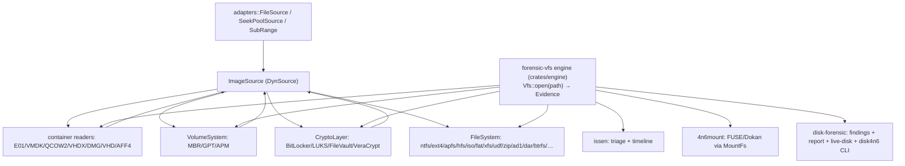

# Fleet VFS Migration & Handoff

**Updated:** 2026-07-16
**Scope:** `forensic-vfs`, the reader crates, `disk-forensic`, `4n6mount`, `issen`.
**Status:** Current-state handoff. The contract + adapter layer is largely built and partly published; this doc hands the **remaining migration** (engine reconciliation, reader vfs re-add, consumer integration, duplicate retirement) to the session that owns the engine + reader release train.

## Executive summary

`forensic-vfs` is the fleet's **single VFS contract layer** — four traits every evidence reader implements behind an optional `vfs` feature:

- `ImageSource` (positioned-read byte source), `VolumeSystem` (partitions), `CryptoLayer` (FDE), `FileSystem` (node-addressed tree).

All four contracts now have **production, Tier-1-validated leaf implementations**, and the contract crate is **published at 0.2.0**. What remains is not contract work — it's (a) finishing the reader vfs re-add now that 0.2.0 is live, (b) reconciling the engine, (c) the **consumer-integration migration**: move `4n6mount` and `disk-forensic` onto forensic-vfs and **retire the two duplicate stacks** (the standalone `~/src/forensic-vfs-engine` and disk-forensic's parallel `Read+Seek` decode).

## Shipped & live (verified on crates.io / in tree)

- **`forensic-vfs 0.2.0`** — published. Additive over 0.1.0: `CryptoScheme::VeraCrypt`, `SeekPoolSource`, `SourceView` tail-magic helpers.
- **`veracrypt-core 0.2.1`** — published; the `VeraCryptLayer` CryptoLayer adapter (vfs feature, dep `forensic-vfs 0.2`), merged to `main`.
- **All 4 contracts covered:** ImageSource (7 containers: ewf/qcow2/vmdk/vhdx/dmg/vhd/aff4), VolumeSystem (GPT/MBR/APM), CryptoLayer (BitLocker/FileVault/VeraCrypt/LUKS — all decrypt-validated against real dfVFS/cryptsetup images via audited RustCrypto, no hand-rolled crypto), FileSystem (13: ntfs, fat+exFAT, ext4, apfs, hfsplus, xfs, iso9660, udf, zip, ad1, dar, btrfs).
- **5 readers published v0.1.0 WITHOUT vfs** (deferred): `xfs-core`, `btrfs-core`, `zfs-forensic-core`, `ufs-core`, `refs-core` — cores live, repos tagged `v0.1.0`.
- **`safe-read`** (panic-free-by-construction bounded readers) and **`forensic-vfs-mount`** (`MountFs`, the FileSystem→u64-inode adapter) — built.
- **Docs:** the universal-reader paper (in forensic-vfs 0.2.0), PRD + 7 ADRs, README.
- **README wording convention:** input-fuzzed = the headline/badge word; "panic-free" only as the qualified static half ("panic-free by lint") — codified in `issen/CLAUDE.md`, swept across 25 fleet READMEs.

## Done-but-unmerged adapters (on feature branches; dep already-published forensic-vfs; unsigned)

Each is RED/GREEN, Tier-1 validated, ready to merge → re-sign → publish (like veracrypt):

| Contract | Crate | Branch |
|---|---|---|
| ImageSource | vhd-core | `feat/vhd-imagesource` |
| ImageSource | aff4 (test-only→prod) | `feat/aff4-imagesource-production` |
| VolumeSystem | gpt / mbr / apm-partition-core | `feat/{gpt,mbr,apm}-volumesystem` |
| FileSystem | btrfs-core | `feat/btrfs-filesystem` |
| CryptoLayer | bitlocker / filevault / luks-core | `feat/{bitlocker,filevault,luks}-cryptolayer` |

## Target architecture (unchanged, still the north star)

One engine composes the contracts; `issen`, `4n6mount`, `disk-forensic` become **consumers**, each keeping only its unique top layer. Retire the standalone `forensic-vfs-engine` and disk-forensic's parallel decode.

## Remaining work — sequenced (each unblocks the next)

**Phase A — Reconcile the engine (BLOCKER; unblocks everything).**
The forensic-vfs workspace currently does not resolve: `crates/engine` deps `xfs = { …, features = ["vfs"] }` (`crates/engine/Cargo.toml:17`) but `xfs-core` archived its `vfs` feature to publish first. Bring the engine's vfs deps back into lockstep with the readers' vfs re-add, or the workspace stays red (and `cargo publish -p forensic-vfs` needed the member temporarily excluded — see note below).

**Phase B — Re-add vfs to the 5 readers now that `forensic-vfs 0.2` is live.**
The readers published v0.1.0 without vfs; their trees carry **no `vfs.rs`** except btrfs. Un-archive / write each `FileSystem` adapter (dep `forensic-vfs = "0.2"`), bump to `0.1.1`, republish.
- **btrfs** — adapter exists on `feat/btrfs-filesystem` (this session); re-point its dep to the published `btrfs-core` + `forensic-vfs 0.2`.
- **xfs/zfs/ufs/refs** — vfs adapters are archived/not-in-tree. **Owner: the session that archived them.** (Only btrfs was written by the contract session.)

**Phase C — Merge + publish the done-but-unmerged adapters** (the table above), each `dep forensic-vfs 0.1/0.2`.

**Phase D — Consumer integration (the "usable end-to-end" arc; retires the duplicates).**
- **`4n6mount`** currently forwards to the standalone `~/src/forensic-vfs-engine` (feature flags `forensic-vfs-engine/ntfs`, `/ext4`, …). Rewire it onto the **canonical `crates/engine` + `MountFs`** (the FileSystem→inode adapter is already built in `forensic-vfs-mount`), then delete the standalone-engine dependence.
- **`disk-forensic` (disk4n6)** has **no forensic-vfs dep** — re-express its middle on the contracts (`container::open`→`ImageSource`, `analyse_disk`/`layout`→`VolumeSystem`, `logical::open`→`FileSystem`), keeping its unique top (findings/report/live-disk/CLI). It becomes the reporting/triage layer over the VFS, not a parallel decode stack.
- **Retire the standalone `forensic-vfs-engine`** once 4n6mount is off it (task: do-not-publish the duplicate).
- **tar/7z** — new `*-core` reader crates + `FileSystem` adapters (logic currently lives in the standalone engine on the old `ForensicFs` trait); the only formats with no fleet crate.

**Cleanup.** Re-sign the unsigned session commits and push/merge (checklist below).

## Ownership (two sessions)

- **Contract/adapter session (this one):** built the four contracts' adapters + published `forensic-vfs 0.2.0` and `veracrypt-core 0.2.1`. Done. Remaining owned bits: merge/publish the done adapters (Phase C), btrfs vfs re-point (Phase B).
- **Engine/release session (handed over here):** owns `crates/engine`, the 5 readers + their vfs re-add (Phase B for xfs/zfs/ufs/refs), the reconciliation (Phase A), and the consumer-integration migration (Phase D). **This doc hands the migration to that session.**

## Key facts / gotchas for whoever executes

- **Publishing forensic-vfs while the engine is red:** `crates/core` has zero engine/reader deps, so it was published by temporarily setting `members = ["crates/core"]` in the workspace root (reverted after). Once Phase A lands, publish cleanly without that.
- **Version discipline:** `forensic-vfs 0.2.0` and `veracrypt-core 0.2.1` are taken; any republish needs a bump. `veracrypt-forensic` is `0.2.1` locally but `0.2.0` on crates.io (no functional change — vfs is core-only); republish for lockstep or leave.
- **No hand-rolled crypto:** every CryptoLayer adapter wires the reader crate's audited RustCrypto; validated against real images (dfVFS `bdetogo.raw`/`fvdetest`, cryptsetup-minted LUKS, staged VeraCrypt cascades). Keep that bar.
- **`MountFs`** (`forensic-vfs-mount`) is the ready FileSystem→FUSE/inode building block for the 4n6mount rewire.
- **Unsigned session commits to re-sign** (`git rebase --exec 'git commit --amend --no-edit -S' <base>`): the `feat/*` adapter branches (gpt/mbr/apm/vhd/aff4/btrfs/bitlocker/filevault/luks), `veracrypt-forensic main`, and `forensic-vfs feat/engine` (⚠️ shared — coordinate before rewriting its history).

## Superseded

The bespoke `ForensicFs`/`SlicedReader`/`PartitionedFs` in the standalone engine are superseded by `FileSystem`/`SubRange`/`VolumeSystem`. The evidence-anchored duplication inventory is [`fleet-duplication-inventory.md`](./fleet-duplication-inventory.md).
