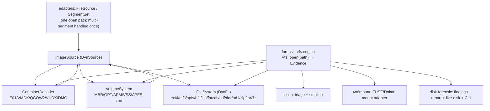

# Fleet VFS Consolidation — Lessons Learned & Refactoring Plan

**Date:** 2026-07-15
**Scope:** `forensic-vfs`, `disk-forensic`, `4n6mount`, `issen`, and the reader crates.
**Status:** Plan. Nothing below is committed as a decision yet; sequencing and scope are open for review.

## Executive summary

The fleet has grown **three parallel abstractions for "open evidence and read its file tree,"** built independently:

1. **`forensic-vfs`** (published 0.1.0) — the intended, sound VFS *contracts* leaf (`ImageSource`/`VolumeSystem`/`ContainerDecoder`/`CryptoLayer`/`FileSystem` + a probe `Registry`), with an in-progress engine at `forensic-vfs/crates/engine` (`feat/engine`, v0.0.0) that composes them into `Vfs::open(path) → Evidence`. ~10 reader crates already implement its contracts behind a `vfs` feature.
2. **`disk-forensic`** — a separate `Read+Seek`-based stack (`container::open`, `analyse_disk`, `layout`, `logical::open`) that re-implements container decode + MBR/GPT/APM parsing **outside** `forensic-vfs`, over the *same* underlying parser crates. Consumed by `issen` and by the duplicate engine below.
3. **`~/src/forensic-vfs-engine`** (standalone, unpublished) — a second engine, same crate name as #1's engine, built on `disk-forensic` + a bespoke `ForensicFs` trait ported from `4n6mount`. This is a **duplicate** created in a session that skipped searching for prior art.

**Target:** one stack. `forensic-vfs` contracts + one engine; every reader on the contracts; `disk-forensic` becomes a forensic *reporting/triage* layer over `forensic-vfs` (keeping its unique findings/live-disk/CLI); `4n6mount` and `issen` consume the one engine; the standalone duplicate is retired.

## Current state (who does what)

> Full evidence-anchored duplication inventory (every site cited `crate/file:line`, ranked hotspots → canonical home): [`fleet-duplication-inventory.md`](./fleet-duplication-inventory.md). The table below is the summary.

| Layer | `forensic-vfs` (+ engine) | `disk-forensic` | `~/src/forensic-vfs-engine` (dup) | `issen` | `4n6mount` |
|---|---|---|---|---|---|
| Container decode (E01/VMDK/…) | `ContainerDecoder`→`ImageSource` (EWF in-crate; VHD/VHDX/QCOW2/VMDK/DMG decoders live **in the engine crate**) | `container::open`→`OpenedImage{Read+Seek}` | uses `disk-forensic` | uses `disk-forensic` | via the dup engine |
| Partition/volume (MBR/GPT/APM) | `VolumeSystem`/probes (in the engine) | `analyse_disk`→`DiskReport` + `layout` | its own `PartitionedFs`+`SlicedReader` | uses `disk-forensic` | via the dup engine |
| Filesystem read | `FileSystem`/`DynFs` (ext4/ntfs/apfs/hfs/iso/fat+exfat/xfs/udf/dar/ad1) | `logical::open` (AD1/AFF4-L/DAR) | its own `ForensicFs` + 10 backends | `ntfs-core` directly + readers | via the dup engine |
| Mount / triage / timeline | — (contracts only) | findings + report + live-disk + `disk4n6` CLI | — | triage + timeline + `issen` CLI | FUSE/Dokan + session overlay |

Underlying parser crates (`mbr`/`gpt`/`apm-partition-*`, `ewf`/`vmdk`/`qcow2`/`vhdx`/`dmg`/`aff4`/`ad1`/`dar`) are the **same** under both #1 and #2 — the duplication is in the *facades*, not the parsers.

## Lessons learned (this session)

1. **Research-first / DRY-via-search-first is non-negotiable, and I violated it repeatedly.** The standalone `forensic-vfs-engine` duplicated an existing in-progress crate *down to its name*; the "exFAT/zip/tar/7z have no fleet crate" claim was false (exFAT is in `fat-core`, `zip-forensic` exists) — asserted twice without running `ls ~/src`. **Rule: before building or claiming a crate/abstraction is absent, grep `~/src` and crates.io and say what was found.** A crate literally named `forensic-vfs`**-engine** was the signal I ignored.
2. **Verify existence in the same breath as the claim.** "No fleet equivalent" from an earlier audit was repeated as fact. Audits summarize; they don't excuse a same-response `ls`/`grep` check before a factual assertion.
3. **Hold on irreversible actions was correct and load-bearing.** Declining to `cargo publish` the (turns-out-duplicate) crate kept a permanent mistake off crates.io. Irreversible + outward-facing ⇒ explicit human authorization, every time.
4. **Naming is architecture.** Two crates named `forensic-vfs-engine` is the tell. Reserve/registry crate names fleet-wide before creating a new one.
5. **Salvage is real but partial.** Genuinely useful outputs survived: the AD1 `FileSystem` adapter (now in `ad1-core`, on-contract), the `disk-forensic` DAR backend + `ReadSeek: Send`, the tier-1 GPT+exFAT validation harness, and the `4n6mount` thinning *direction*. The bespoke `ForensicFs`/`SlicedReader`/`PartitionedFs` are superseded by `FileSystem`/`SubRange`/`VolumeSystem`.

## Target architecture

One engine composes the contracts; `issen`, `4n6mount`, and `disk-forensic` become **consumers** of it, each keeping only its unique top layer.

## Refactoring plan (sequenced — each step unblocks the next)

**Phase 0 — Stop the bleeding (cheap, do first).**
- Retire the standalone `~/src/forensic-vfs-engine` (do not publish). Salvage its on-contract pieces into the fleet (AD1 done). Record this decision as an ADR.
- Reserve the `forensic-vfs-engine` crate name for the in-repo engine only.

**Phase 1 — Stabilize `forensic-vfs` (foundation; unblocks everything).**
- Relocate the `VHD`/`VHDX`/`QCOW2`/`VMDK`/`DMG` `ContainerDecoder` impls out of `crates/engine` into each reader crate's `vfs` feature (mirroring EWF's in-crate `impl ImageSource`), so consumers depend on stable reader crates, not the WIP engine.
- Add the **unified multi-segment source** layer to `forensic-vfs` adapters: a segment locator (first-segment path → ordered siblings for `.E01/.E02`, `.ad1/.ad2`, `.001/.002`) + a `ConcatSource`/source-set, so every reader opens from a `DynSource` and no reader globs the filesystem itself. Rebase AD1/EWF's path-open onto it.
- Wire the engine's `default_registry()` (currently empty) with all container/volume/filesystem probes; get `Vfs::open` green on a real corpus.

**Phase 2 — Complete format coverage on the contracts.**
- **Done:** ext4, ntfs, apfs, hfsplus, iso, fat (+exFAT), xfs, udf, dar, ad1, ewf.
- **In progress:** `zip` `FileSystem` adapter in `zip-forensic-core` (`vfs.rs`, mirroring dar/ad1).
- **New crates needed:** `tar-forensic` (.gz/.bz2) and `sevenz-forensic` (.7z) — the only formats with no fleet crate — each a `*-core` reader + a `FileSystem` adapter.

**Phase 3 — Reconcile `disk-forensic`.**
- Re-express `disk-forensic`'s middle on `forensic-vfs`: `container::open`→`ImageSource`, `analyse_disk`/`layout`→`VolumeSystem`, `logical::open`→`FileSystem` (readers already implement these). Keep its unique top — findings/report, the live-disk unified `PhysicalDisk` presentation, `disk4n6` CLI, AD1 (now `ad1-core`'s `Ad1Vfs`).
- Net: `disk-forensic` becomes the forensic *reporting/triage* layer over the fleet VFS, not a parallel decode stack.

**Phase 4 — Consumers adopt the engine.**
- **`4n6mount`:** build the missing `FileSystem → FUSE/inode` mount adapter (map `u64 ↔ FileId`, loop `read_at` for whole-file/ranged reads, interior mutability for `fuser`), then mount over `Vfs::open`. Delete its dependence on the retired standalone engine's `ForensicFs`.
- **`issen`:** move triage + timeline onto `Vfs::open`/`DynFs` (bump off `disk-forensic 0.9`'s direct container/reader use to the engine), keeping its orchestration/timeline/report layers. This is the biggest consumer change and should follow Phases 1–3.

## Gaps that need a decision (not just implementation)

- **`FileSystem → FUSE/inode` adapter home** — in the engine, in `4n6mount`, or a small shared `forensic-vfs-fuse` crate? Nothing provides it today.
- **`tar`/`7z` crate creation** — confirm the `*-forensic` crate pattern (vs. folding into one `archive-forensic`).
- **`disk-forensic`'s future identity** — first-class reporting/triage tool over `forensic-vfs`, or fold its unique bits into `issen`/`forensicnomicon` and retire it?
- **CryptoLayer** — `forensic-vfs` defines `CryptoProbe`/`CryptoLayer` but no crate implements BitLocker/LUKS/FileVault; a gap if FDE handling is in scope.

## Done this session (on-contract, verified)

- `ad1-core`: `impl forensic_vfs::FileSystem for Ad1Vfs` (`vfs` feature), TDD, 48 tests, merged to `main`.
- `zip-forensic-core`: `FileSystem` adapter in progress (TDD).
- `disk-forensic`: DAR logical backend + `ReadSeek: Send` (0.11.0, unpublished) — value depends on the Phase 3 reconciliation.
- Tier-1 validation harness (`scripts/mint-partfs-fixture.sh`: real GPT + real exFAT read end-to-end) — reusable regardless of consolidation.
