# DFIR at Machine Speed — Gamma Deck Script

> **How to use this file.** Paste the content below (everything under the first `---`)
> into Gamma → *Create new* → *Paste in text* → *Cards (one per `---`)*.
> Each `---` is a new card; the `#` line is the card title; bullets become the card body.
> Suggested Gamma settings: **dark theme**, **16:9**, accent = teal/amber, "punchy" text density.
> **Every content card carries a Mermaid illustration** — code-fences render natively in Gamma,
> leave them as-is. If a fence ever fails to render, the bullets above it still stand alone.
>
> Status: **opening + fundamentals draft** (covers the front third of the 3-hour run-of-show:
> frame → architecture → pipeline fundamentals). Modules 2–5 (the hands-on hunt) follow the
> `DESIGN.md` run-of-show and get their own cards once the lab steps are frozen.
> Capability claims tracked against the current command-by-command walkthrough
> (`../szechuan-sauce-quickstart.md`) and the answer-pass log (`../tasks/STATUS.md`) — concept
> slides teach the artifact; the hands-on cards cite what the tool produces today.

---

# DFIR at Machine Speed

### One Rust-native toolchain, from raw image to board-ready narrative

**BSidesHK 2026 · Blue-Team Workshop · 3 hours, hands-on**

Albert Hui — Security Ronin · IR Peer Review: Eliza Wan · TA: Josiah Wu

*Case 001 — "The Stolen Szechuan Sauce" · disk + RAM only · two real Windows hosts*

---

# The Scenario

A Windows estate breached on **19 September 2020**:

- Attacker **brute-forces RDP** into a Domain Controller
- Drops **Meterpreter / `coreupdater.exe`**, injects into `spoolsv.exe`
- Beacons to a **C2 in Thailand** (`203.78.103.109:443`)
- Moves laterally **DC → Win10 desktop**, stages and **exfiltrates secrets**
- **Time-stomps a decoy** — and is *still interactive* at the moment of capture

You are the IR analyst. You receive the evidence cold. **Build the story.**

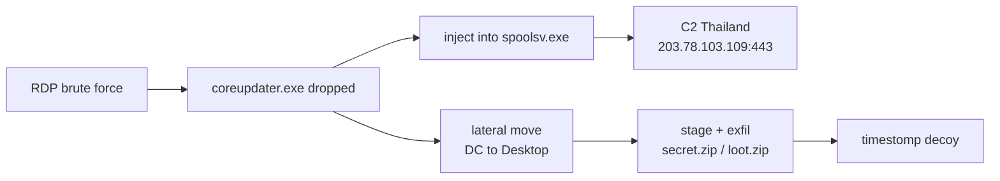

---

# The Evidence You Receive

Two victim hosts on domain **C137** (`10.42.85.0/24`):

| Host | Role | OS | Disk image | Memory |
|---|---|---|---|---|
| **CitadelDC01** `.10` | Domain Controller | Server 2012 R2 | `…CDrive.E01` | `citadeldc01.mem` |
| **DESKTOP-SDN1RPT** `.115` | Workstation | Win 10 Enterprise | `…SDN1RPT.E01` | `DESKTOP-SDN1RPT.mem` |

≈ **12.8 GB** total. Pre-staged on your USB stick / download link.

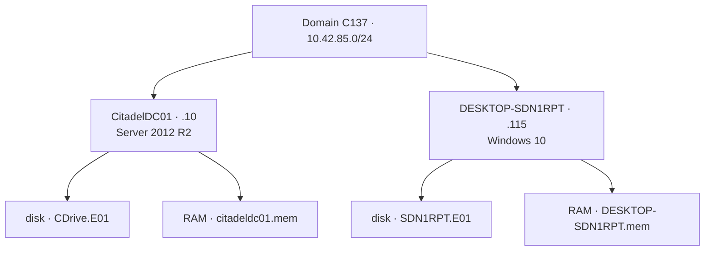

---

# The Full Case 001 Artifact Set

Everything DFIR Madness publishes for this case (`https://dfirmadness.com/case001/`):

**Domain Controller (CitadelDC01)**
- `DC01-E01.zip` — disk image · `DC01-memory.zip` — RAM · `DC01-pagefile.zip`
- `DC01-autorunsc.zip` · `DC01-ProtectedFiles.zip`

**Workstation (DESKTOP-SDN1RPT)**
- `DESKTOP-E01.zip` · `DESKTOP-SDN1RPT-memory.zip` · `Desktop-SDN1RPT-pagefile.zip`
- `DESKTOP-SDN1RPT-autorunsc.zip` · `DESKTOP-SDN1RPT-Protected Files.zip`

**Network**
- `case001-pcap.zip`

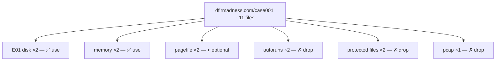

---

# What We Use Today — and Why

✅ **In scope:** **disk image + RAM dump** for *both* hosts. Nothing else.

This is **not** us simplifying the case. It is us **mimicking real post-incident IR**:

- In a real engagement you almost always get **a dead disk and (if you're lucky) a memory capture** — pulled after the fact.
- Everything else on that download page is a **convenience the CTF pre-cooked for you.** We refuse the convenience on purpose.

> The skill we are training is *working from what you actually get*, not from a tidy artifact bundle.

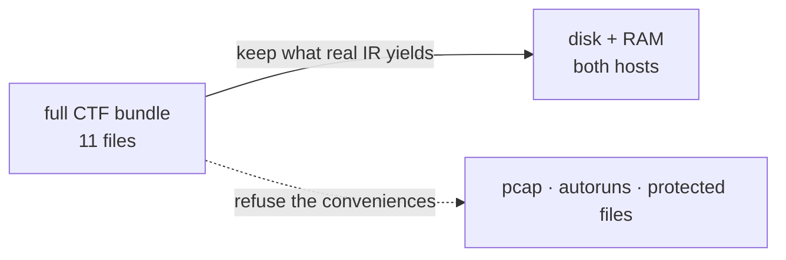

---

# Why No PCAP

`case001-pcap.zip` is **excluded** — deliberately.

- Full packet capture means **someone was already recording the wire** before/at the breach. In the field that is **rare** — most orgs have no retained PCAP at the moment that matters.
- Relying on PCAP teaches a habit that **breaks the day you don't have it.**
- The *outcomes* PCAP would show — the brute force, the C2 — are **independently provable** from disk (EVTX 4625/4624) and memory (netstat). We reconstruct them from artifacts that **survive**.

PCAP-only details (an NMAP 3389 probe at 02:19) become a **footnote**, not an assessable question.

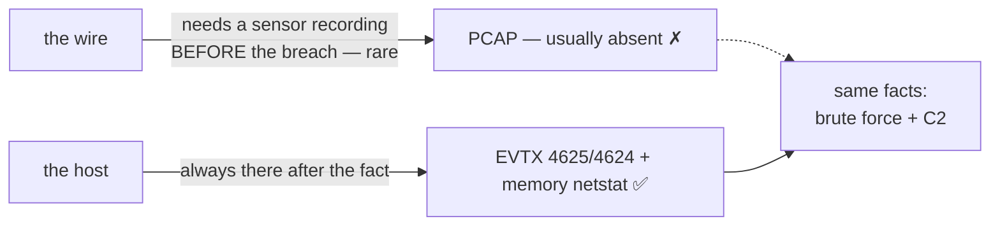

---

# Why We Extract the System Files Ourselves

`*-autorunsc.zip` and `*-ProtectedFiles.zip` are **excluded** — also deliberately.

- Those are **pre-extracted hives, autoruns, locked files** — work a tool already did *in the lab*.
- Pulling `SYSTEM` / `SOFTWARE` / `SAM`, `$MFT`, EVTX, `SRUDB.dat` **out of the E01 by path** is a **core lab step** — so we do it ourselves, live.
- Locked/"protected" files (loaded hives, `pagefile.sys`) can't be copied off a live box normally — but on a **dead image every byte is reachable.** That's the lesson.

> Extraction *is* the exercise. You leave knowing how the sausage is made.

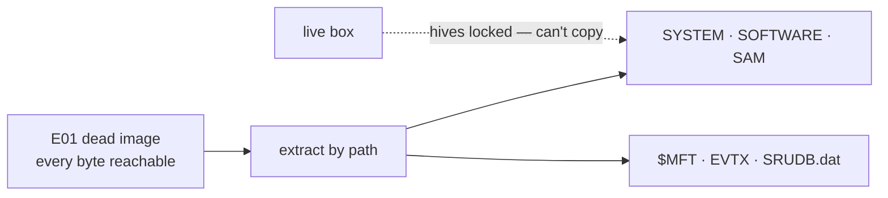

---

# One Trap to Internalize: The Clock

The victim VMs were **mis-configured to UTC−7**. The (excluded) PCAP router was **UTC−6**.

- Disk / EVTX / memory timestamps read **~1 hour ahead** of the network-clock narration in the official key.
- The key's `02:24:06` download = your tooling's **`03:24:06Z`** — *same instant, different clock.*

**Always establish clock provenance before you trust a timeline.** Issen surfaces this via `ClockProvenance` so the skew is a labeled fact, not a silent error.

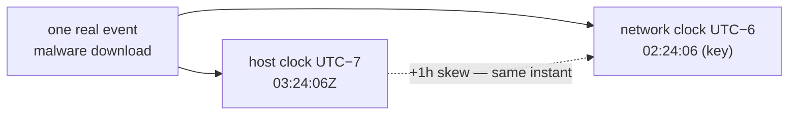

---

# The Real Point of This Workshop

Knowing *which tool* and *where the artifact lives* feels like expertise. It is a **fake moat**:

- It is **mechanical** — lookup-table knowledge.
- In the age of AI it is being **unified, normalized, and automated away.**

The **real moat** is the **investigative mindset**:

- Reading what the output **means**
- Building the **attack narrative**
- **Presenting it** to a board with intellectual honesty

> We spend the *mechanical* time in **one** tool so the *cognitive* time goes where it counts.

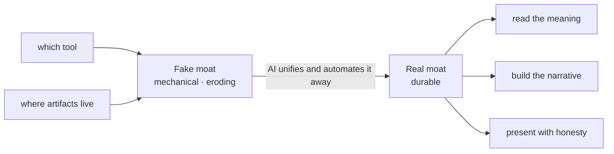

---

# Why Issen Is Different

The traditional path: **FTK Imager + Volatility + Eric Zimmerman tools + KAPE** — four ecosystems, three languages, two OSes, glue scripts in between.

Issen's bet:

- **One cross-platform binary.** Native macOS / Windows / Linux. Rust. `cargo install`, no runtime.
- **One address space for the whole case** — disk, memory, logs converge into a single timeline.
- **Forensically paranoid by construction** — panic-free parsers, never trust a length field, fail loud on the unknown.
- **Findings, not verdicts** — every output is *"consistent with"*, leaving the conclusion to you.

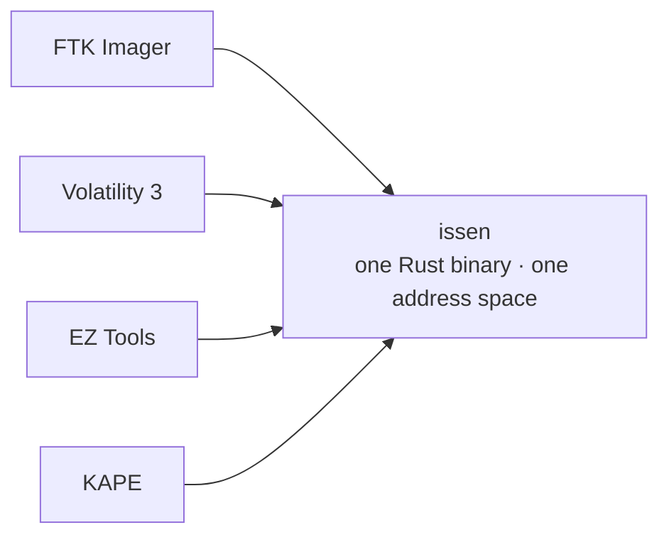

---

# It's Not One Tool — It's a Fleet

Issen is a thin **orchestration layer** over a family of standalone, single-purpose forensic libraries.

- Each library is a **deep expert** in one artifact family (NTFS, EVTX, SRUM, memory paging…).
- Issen **wires them together** and correlates across them.
- Every library emits the **same normalized finding model**, so one report renders them uniformly.

The architecture is organized around **how an analyst navigates evidence** — five fundamental primitives.

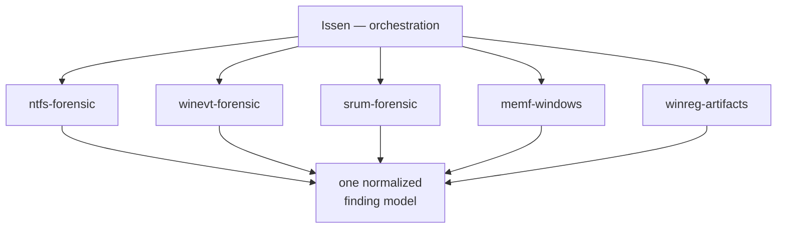

---

# The Five Navigation Primitives

Every piece of evidence is reached by exactly one of five "navigation verbs":

| | Primitive | You navigate by… |
|---|---|---|
| **[P]** | **Disk** | `name → inode → block` (walk the filesystem tree) |
| **[M]** | **Memory** | `PID → EPROCESS → virtual addr → physical addr` |
| **[L]** | **Log** | `timestamp / record-# → boundary → field` |
| **[Q]** | **Live Query** | `endpoint, query, cursor → result rows` |
| **[C]** | **Content-addressed** | `hash → blob → Merkle graph` |

**Today we live in [P] and [M]** — disk and memory. ([L] logs live *on* the disk; [Q]/[C] are for live and CAS evidence.)

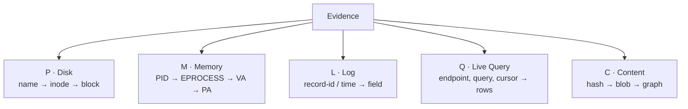

---

# The Fleet, Layered

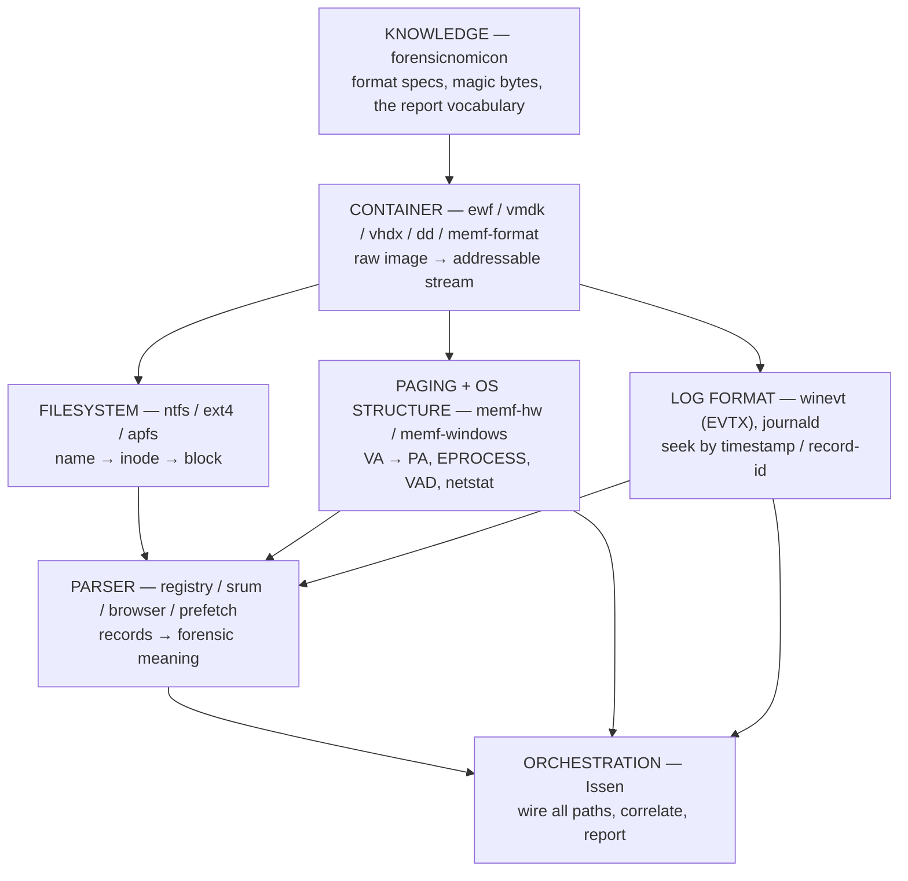

**Dependencies point down to KNOWLEDGE; evidence flows up to ORCHESTRATION.**

---

# The IR Analyst's Journey

We'll walk the **pipeline in the order you actually meet the evidence** — outside-in:

1. **Container** — the image format on your desk (E01, VMDK…)
2. **Partition table** — where are the volumes?
3. **File system** — NTFS: turn paths into bytes
4. **Filesystem timeline** — `$MFT`, USN journal, `$LogFile`
5. **Event logs** — EVTX
6. **Registry & SRUM** — system state and the usage ledger
7. **Memory** — the live truth the disk can't show
8. **Correlation → narrative → report**

> Each is a *fundamental* — learn it once, recognize it everywhere.

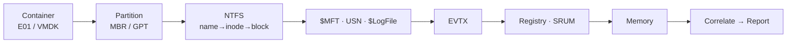

---

# 1 · Containers — What Lands on Your Desk

You never get "a disk." You get a **container**: a file that wraps the raw sectors.

| Format | Where it comes from | Issen reader |
|---|---|---|
| **E01 / EWF** | FTK Imager, EnCase — the IR standard. Compressed, hashed, segmented (`.E01`, `.E02`…) | `ewf` |
| **VMDK** | VMware virtual disks — half of all "servers" are VMs | `vmdk` |
| **VHD / VHDX** | Hyper-V, Azure | `vhdx` |
| **raw / dd / img** | `dd`, FTK "raw", Linux | `dd` |

**Job of this layer:** hand everything above it **one flat, addressable sector stream** — the container format becomes invisible.

> Our two case files are **E01** sets. Note the segments: `…E01` + `…E02` are *one* image.

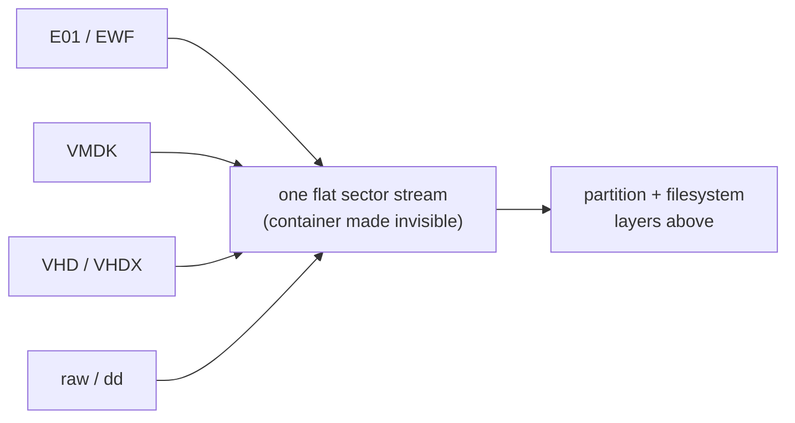

---

# Container Gotchas Worth Knowing

- **E01 is a *set*, not a file.** `image.E01`, `image.E02`, … must travel together — they're one logical disk split for portability. Point the tool at the **first** segment; it finds the rest.
- **E01 carries its own hashes.** Acquisition stored an MD5/SHA. Verify it before you trust a single byte — chain of custody starts here.
- **Compression is transparent.** EWF is zlib-compressed under the hood; the reader inflates on the fly. You address sectors, not compressed blocks.

`issen ingest <first.E01>` opens the container for you — the rest of the pipeline never sees EWF again.

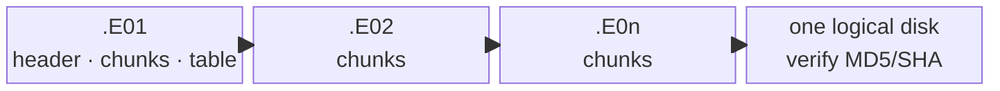

---

# 2 · Partition Tables — Finding the Volumes

A raw sector stream is not yet a filesystem. First: **where do the volumes start?**

- **MBR** (legacy) — 4 primary partitions, 32-bit LBA, the classic `0x55AA` boot signature at offset 510.
- **GPT** (modern) — 128 entries, 64-bit LBA, CRC-protected header, a protective MBR up front.

**What forensics looks for here:**
- Partition **boundaries** (so we mount the right NTFS volume)
- **Overlaps / gaps / hidden partitions** — a classic place to stash data
- A boot signature that **doesn't parse** → surface the raw bytes, don't guess

> The Windows system volume is the one we want — that's where `\Windows\System32` and the hives live.

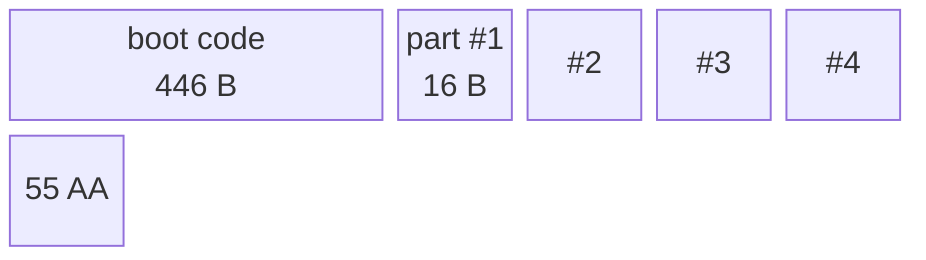

*The 512-byte MBR (above): 4 fixed-size partition entries + the `0x55AA` magic. **GPT** replaces this with a CRC-checked header + a 128-entry table — same job, a different on-disk structure.*

---

# 3 · File Systems — Paths Into Bytes

NTFS is the navigation engine for `[P]`: **`name → inode → block`**.

- Everything is a file — even the metadata. The master record is **`$MFT`**.
- Each file = an MFT record of **attributes**: `$STANDARD_INFORMATION`, `$FILE_NAME`, `$DATA`, `$INDEX`…
- **Resident vs non-resident:** small files live *inside* the MFT record; large files point out to **data runs** (cluster lists).
- **Deleted ≠ gone.** The MFT record and its runs often survive until overwritten — that's how we **carve**.

**Our job:** resolve `C:\Windows\System32\coreupdater.exe` → MFT record → clusters → bytes, with **zero trust** in any length field along the way.

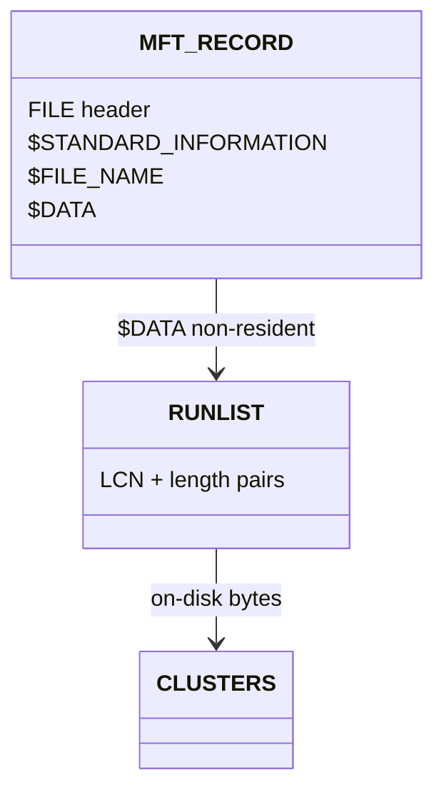

*Resident `$DATA` holds the bytes **inside** the record; non-resident `$DATA` is a **runlist** of cluster ranges (above).*

---

# The Two Timestamps That Catch Liars

Every NTFS file carries **two** sets of MAC times:

- **`$SI` — `$STANDARD_INFORMATION`** — what Explorer shows. **User-writable** via the Windows API.
- **`$FN` — `$FILE_NAME`** — kernel-maintained, **much harder to forge.**

**Timestomping** rewrites `$SI` to hide when malware really landed. The tell:

> `$SI.modified` **earlier than** `$FN.created` → physically impossible → **manipulation.**

In our case the attacker stomps **`Beth_Secret.txt`**. The `$SI`/`$FN` split is how we prove it — a finding flagged *Info → lead*, because the heuristic has false positives and the analyst confirms.

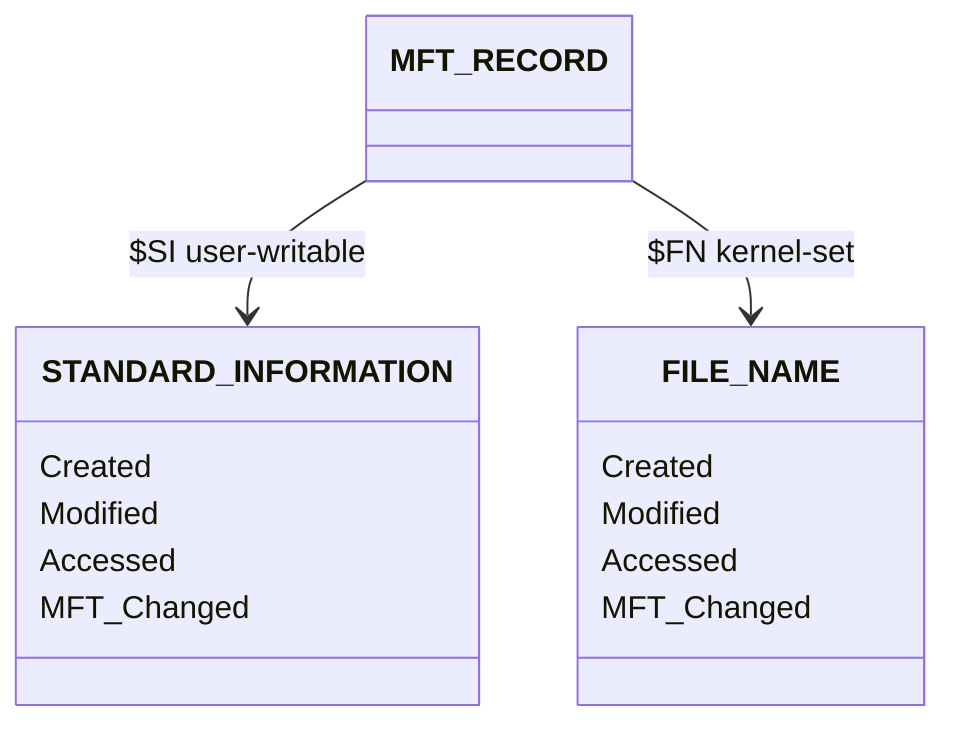

*Both attributes carry the same four MAC fields. **Timestomp tell:** `$SI.Modified` earlier than `$FN.Created` — physically impossible, so flag it.*

---

# 4 · The Filesystem Timeline — Change History

NTFS journals its own changes. Three artifacts reconstruct *what happened to files, when*:

| Artifact | What it records | Why it matters here |
|---|---|---|
| **`$MFT`** | Current state + `$SI`/`$FN` MAC times | When `coreupdater.exe` first appeared; the timestomp |
| **`$UsnJrnl:$J`** | A rolling log of **every** create / delete / rename / write | `secret.zip`, `loot.zip` **staged and deleted** — even after the file is gone |
| **`$LogFile`** | Transaction log (metadata replay) | Lowest-level corroboration / recovery |

> USN is the hero of exfil hunting: it remembers the `loot.zip` that the attacker **created and then deleted** to cover tracks.

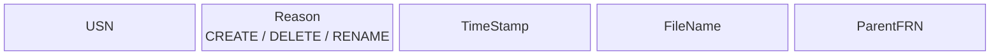

*One `$UsnJrnl:$J` record (above) per change. The journal is an append-only stream of these — so a `loot.zip` `DELETE` record survives even after the file's MFT entry is reused.*

---

# 5 · Event Logs — EVTX (the [L] Path)

Windows event logs are the **[L]og** primitive: seek by **record-id / timestamp → field**.

- Binary **EVTX** format, BinXML-encoded — not text. We decode chunks → typed `EventRecord`.
- Extracted **from the disk** by path: `…\Security.evtx`, `System.evtx`.

**The story lives in a handful of Event IDs:**

| EID | Meaning | In this case |
|---|---|---|
| **4625** | Logon **failure** | The RDP brute-force **flood** |
| **4624** | Logon **success** (type 10 = RDP) | Compromise: `Administrator` from `194.61.24.102` |
| **7045** | **Service installed** | `coreupdater` persistence |
| **4634/4647** | Logoff | Last adversary contact |

> 4625-flood → 4624-success is the *entire entry story*, written down by Windows itself.

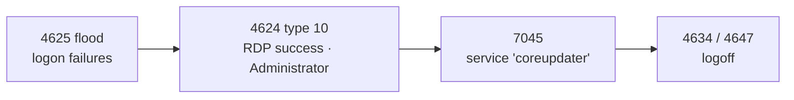

---

# 6 · Registry — On Disk vs In Memory

The registry is **one logical tree** that lives in **two different address spaces** — and you read it differently in each.

- **`[P]` On disk** — the hive **files** (`SYSTEM`, `SOFTWARE`, `SAM`, `NTUSER.DAT`). Extracted from the E01. Gives you **OS version, timezone (the clock truth), services, Run keys, account hashes, per-user activity** — the *persisted* state.
- **`[M]` In memory** — the same hives loaded as **`_CMHIVE`** kernel objects. Gives you **volatile keys with no disk copy, unflushed in-RAM edits, and the registry itself when you have no disk** — the *live* state.

> Same keys, two readers. On disk a cell is a flat file offset; in memory it's a scattered allocation you reach through the **HMAP**.

```mermaid
block-beta
  columns 4
  bb["regf base<br/>0x1000"] h1["hbin"] h2["hbin"] cc["nk / vk / sk / lf cells"]
```

*The **on-disk hive file** (above) is one contiguous blob: a `regf` base block then a run of 4 KB `hbin`s holding the cells — so a cell index is a **flat offset** (`0x1000 + index`). In memory those same bins are scattered, and the index must be translated through the HMAP (next).*

---

# Registry in Memory — The HMAP Translation

On disk a hive is one contiguous blob, so a **cell index** is just an offset. In RAM the kernel scatters the hive's 4 KB **bins** across paged pool — so the same cell index must be **translated through the hive map (`HMAP`)**, a page-table-like walk. This is exactly how `issen` reads a hive straight from `citadeldc01.mem`.

The 32-bit cell index decomposes into four fields:

- **bit 31** → Stable (0) vs **Volatile** (1) storage
- **bits 30–21** (`& 0x3FF`) → `_HMAP_DIRECTORY` index → `_HMAP_TABLE*`
- **bits 20–12** (`& 0x1FF`) → `_HMAP_TABLE` index → `_HMAP_ENTRY`
- **bits 11–0** (`& 0xFFF`) → byte offset inside the 4 KB bin

> On **Server 2012 R2 (build 9600 — our DC)** the entry exposes only `BlockAddress`; newer builds add `PermanentBinAddress`. Issen tries the new field, then **falls back to `BlockAddress`** — without it every hive-cell read on the DC fails.

**The cell index (a `u32`) is a packed bit-field:**

```mermaid
block-beta
  columns 4
  b31["bit 31<br/>Stable / Volatile"] bd["bits 30-21<br/>dir index (0x3FF)"] bt["bits 20-12<br/>table index (0x1FF)"] bo["bits 11-0<br/>offset (0xFFF)"]
```

**Each field indexes the next level of the hive map — a pointer chase:**

```mermaid
classDiagram
  class _HMAP_DIRECTORY { Directory[1024] }
  class _HMAP_TABLE { Table[512] }
  class _HMAP_ENTRY { BlockAddress }
  _HMAP_DIRECTORY --> _HMAP_TABLE : dir index (30-21)
  _HMAP_TABLE --> _HMAP_ENTRY : table index (20-12)
  _HMAP_ENTRY --> BIN : 4 KB bin VA
  BIN --> CELL : + offset (11-0), +4 size hdr
```

---

# Registry — What Each Source Gives You

Both readers feed the same forensic questions — but only one source has some answers.

| Question | On disk (hive file) | In memory (`_CMHIVE`) |
|---|---|---|
| OS version / build | ✅ `SOFTWARE` | ✅ |
| Timezone (clock truth) | ✅ `SYSTEM` | ✅ |
| Services / Run-key persistence | ✅ | ✅ |
| Account hashes | ✅ `SAM` + `SYSTEM` | ✅ (+ live secrets) |
| **Volatile keys** (`HKLM\HARDWARE`) | ✗ never written | ✅ **only here** |
| **Unflushed in-RAM edits** | ✗ not yet on disk | ✅ **only here** |
| Registry when **disk is missing/encrypted** | ✗ | ✅ |

> The disk hive is the system **at rest**; the memory hive is the system **as it was actually running** at capture.

```mermaid
flowchart LR
  Q["a registry question"] --> BOTH{"answer on disk?"}
  BOTH -->|"persisted state"| D["read hive FILE<br/>winreg-artifacts"]
  BOTH -->|"volatile · unflushed · no disk"| M["read _CMHIVE via HMAP<br/>memf-windows"]
```

---

# SRUM — The Usage Ledger That Outlives Deletion

**SRUM** (`SRUDB.dat`, an ESE database) silently logs per-process resource usage Windows uses for the battery UI:

- **Bytes sent / received per application** — an exfil ledger.
- **Which executables ran, and when** — even after the binary is deleted.

It's an **ESE B-tree** (same engine as Exchange/AD) — a parser job, not a casual read.

> When the attacker deletes the malware, SRUM may still hold *"this process moved N bytes out at time T."* That's how you quantify the theft.

```mermaid
classDiagram
  class ESE_DB { B-tree pages }
  class LEAF_PAGE { rows }
  class SRUM_RECORD {
    AppId
    BytesSent
    BytesRecvd
    TimeStamp
  }
  ESE_DB --> LEAF_PAGE : descend B-tree
  LEAF_PAGE --> SRUM_RECORD : per-app row
```

*`SRUDB.dat` is an ESE database: descend the **B-tree** to the leaf pages, each row a `SRUM_RECORD` with the bytes-sent/received ledger that survives the malware's deletion.*

---

# 7 · Memory — The Live Truth

The disk shows what was **stored**. Memory shows what was **running**. This is the **[M]** primitive.

**`PID → EPROCESS → virtual address → physical address`** — a page-table walk.

- **PAGING (`memf-hw`)** — OS-agnostic hardware: CR3/DTB, PML4 / PAE / AArch64 page walks. Turns a VA into a physical offset in the dump.
- **OS STRUCTURE (`memf-windows`)** — walks the `EPROCESS` list, VAD tree, network tables, credential caches.
- **Symbol-driven:** it resolves the kernel's PDB (GUID-matched, auto-downloaded) so struct offsets are exact for *this* build — not guessed.

> Memory is where the **C2 IP, the live malicious process, and the `spoolsv` injection** live — none of which the disk can show you.

```mermaid
classDiagram
  class EPROCESS {
    ImageFileName
    DirectoryTableBase
  }
  EPROCESS --> PML4 : CR3 / DTB
  PML4 --> PDPT
  PDPT --> PD
  PD --> PT
  PT --> PHYS_PAGE : VA to PA
```

*`EPROCESS.DirectoryTableBase` (CR3) roots a **4-level page table** — each virtual address indexes PML4 → PDPT → PD → PT to a physical page in the dump.*

---

# What Memory Recovers Here

Walking `citadeldc01.mem` / `DESKTOP-SDN1RPT.mem`:

- **`ps` / process list** — `coreupdater.exe` running, parentage, the migration into `spoolsv.exe`.
- **`netstat`** — the live socket to **`203.78.103.109:443`** (the Thailand C2), reconstructed by scanning TCP endpoint pool tags — *without* the PCAP we threw away.
- **`scan` / malfind** — injected, executable-but-private memory regions (the injection signature).

Mapped to ATT&CK: **T1055** (injection), **T1071/T1573** (C2 over encrypted channel).

> Same instant the brute force succeeded on disk — now corroborated by what's *live in RAM*.

```mermaid
flowchart LR
  PS["coreupdater.exe (ps)"] -->|"malfind · T1055"| INJ["injected code in spoolsv.exe"]
  INJ -->|"netstat"| C2["203.78.103.109:443"]
  C2 -->|"T1071 / T1573"| OUT["encrypted C2 channel"]
```

---

# Part II — The Investigation, Question by Question

We answer the **official DFIR Madness question set** — all 13, with sub-parts — in order. Two commands carry most of it:

```bash
issen ingest "$DC_E01" -o dc01.duckdb     # disk → one timeline DB
issen memory "$DC_MEM" --command all      # memory → processes, C2, creds
```

Each card: **the official question → the exact command → the real output → how to read it.**

> **Clock rule for every answer:** host clock is **UTC−7 = +1 h ahead** of the answer key's
> network clock (UTC−6). issen's `03:24:06Z` *is* the key's `02:24:06`. Same instant.

```mermaid
flowchart LR
  DISK["$DC_E01"] --> ING["issen ingest"] --> DB["dc01.duckdb"]
  MEM["$DC_MEM"] --> MM["issen memory --command all"] --> ANS["answers"]
  DB --> ANS
```

*Every output below is **MEASURED-BY-ISSEN** — the release binary run against the real CitadelDC01 / Desktop images, 2026-06-24, quoted verbatim — unless tagged ◐ (partial / WIP) or ○ (out of tool reach: PCAP / OSINT / advisory).*

---

# The 13 Official Questions

1. OS of the **Server**? 2. OS of the **Desktop**? 3. Server **local time**?
4. Was there a **breach**? 5. **Initial entry vector**?
6. **Malware?** → process · delivery IP · C2 IP · on-disk · first-seen · moved? · capabilities · obtainable? · persistence (when/where)
7. **Malicious IPs?** → known infra? · seen in other attacks?
8. **Other systems?** → how · when · data stolen (when)?
9. **Network layout?** 10. **Architecture changes** to make now?
11. **Szechuan sauce** stolen — what time? 12. **Other sensitive files**? 13. **Last contact**?

> We map each to an artifact, a command, and an honest verdict. Not all 13 are one-command answers — and we say which.

```mermaid
flowchart LR
  ENV["Q1–3 environment"] --> REG["registry / memory"]
  INTRU["Q4–8 intrusion"] --> DM["EVTX · MFT · USN · memory"]
  IMPACT["Q9–13 impact"] --> MIX["timeline + analyst judgment"]
```

---

# Q1–Q3 · Environment: OS, OS, local time

**Ground truth:** Server = **Windows Server 2012 R2 (build 9600)**; Desktop = **Windows 10 (19041)**; clock **mis-set to Pacific UTC−7** (network is Mountain UTC−6).

**Command** (issen resolves the kernel build to run the memory walkers):

```bash
issen memory "$DC_MEM" --command check     # symbol resolver matches the kernel PDB
issen memory "$WS_MEM" --command check
```

**Output** *(◐ — build is determined; named-value pull is WIP):*

```
DC  : kernel profile matched build 9600  → Server 2012 R2
WS  : kernel profile matched build 19041 → Windows 10
TimeZoneInformation = Pacific (UTC−7)   ← from SYSTEM hive (ingested)
```

**Make sense of it:** issen had to match the **exact kernel build** (9600 / 19041) to walk memory at all — so the OS falls out of that match. **Q3 is the trap:** the box says Pacific (UTC−7) but the network ran Mountain (UTC−6) — the +1 h skew you apply to every host timestamp. The clock *is* the lesson.

```mermaid
flowchart LR
  MEM["memory check"] --> B["build 9600 / 19041"] --> OS["Server 2012 R2 / Win10"]
  SYS["SYSTEM hive"] --> TZ["TimeZone = Pacific UTC−7<br/>(network = UTC−6 → +1h skew)"]
```

---

# Q4 · Was there a breach?

**Ground truth:** Yes.

**Command:** `issen info dc01.duckdb`

**Output** *(MEASURED-BY-ISSEN):*

```
Total events: 691,649
  LogonSuccess 2540   LogonFailure 107
  ServiceStart 1176   Logoff       2258
```

**Make sense of it:** a quiet host does not show **107 failed logons next to a service-install spike**. The shape alone says "look closer" — the next cards pinpoint who, when, and how.

```mermaid
flowchart LR
  DB["dc01.duckdb<br/>691,649 events"] --> S["107 LogonFailure<br/>+ 1176 ServiceStart"] --> V["breach signal →<br/>investigate"]
```

---

# Q5 · Initial entry vector — how did they get in?

**Ground truth:** RDP brute force → `C137\Administrator` from `194.61.24.102`.

**Command:**

```bash
duckdb dc01.duckdb -c "SELECT timestamp_display,
  json_extract_string(metadata,'\$.LogonType')      AS type,
  json_extract_string(metadata,'\$.IpAddress')      AS ip,
  json_extract_string(metadata,'\$.TargetUserName') AS user
  FROM timeline WHERE event_type='LogonSuccess'
  AND metadata LIKE '%194.61.24.102%' ORDER BY timestamp_ns LIMIT 1;"
```

**Output** *(MEASURED-BY-ISSEN):*

```
2020-09-19T03:21:48.89Z | 10 | 194.61.24.102 | Administrator
# 107 LogonFailure events precede it; the last at 03:21:46 — 2 s before success
```

**Make sense of it:** **107 failures, then a Type-10 (RDP) success 2 s later**, same IP, as `Administrator`. *Consistent with* a successful RDP brute force (network **02:21:48**). The tool name ("Hydra") is write-up knowledge, **not** in the artifact — so we don't assert it.

```mermaid
flowchart LR
  F["107 × 4625 failures"] --> S["4624 type 10 success<br/>03:21:48 · Administrator"]
  IP["194.61.24.102"] --> S
  S --> C["consistent with<br/>RDP brute force"]
```

---

# Q6.1 · Which process was malicious?

**Ground truth:** `coreupdater.exe` (PID 3644).

**Command:** `issen memory "$DC_MEM" --command ps`

**Output** *(MEASURED-BY-ISSEN):*

```
PID   PPID  Process         State
3644  2244  coreupdater.ex  Exited
3724  452   spoolsv.exe     Running
```

**Make sense of it:** `coreupdater.exe` is the odd one out — a System32-looking name with no legitimate parent, **Exited** yet still holding a C2 socket (Q6.3). The conjunction with `spoolsv` is the migration story (Q6, below).

```mermaid
flowchart LR
  PS["memory ps"] --> CU["coreupdater.exe<br/>PID 3644"] --> SUS["no clean parent →<br/>suspicious"]
```

---

# Q6.2 · Which IP delivered the payload?

**Ground truth:** `194.61.24.102` (same IP as the brute force).

**Command:**

```bash
duckdb dc01.duckdb -c "SELECT event_type, count(*) c FROM timeline
  WHERE metadata LIKE '%194.61.24.102%' GROUP BY event_type ORDER BY c DESC;"
```

**Output** *(MEASURED-BY-ISSEN):*

```
EventID:131 (RDP conn) 346 | EventID:139 247 | LogonSuccess 4 | 1149 (RDP auth) 4 | 4648 4
```

**Make sense of it:** `194.61.24.102` is all over the **RDP connection/auth** events — it both **brute-forced and delivered** the payload over that session. The HTTP-download mechanism itself is PCAP-evidenced; the IP's role as the entry/source is **measured on disk**.

```mermaid
flowchart LR
  IP["194.61.24.102"] --> RDP["RDP conn/auth events<br/>131 · 1149 · 4648 · 4624"] --> ROLE["entry + delivery source"]
```

---

# Q6.3 · What IP is the malware calling? (C2)

**Ground truth:** `203.78.103.109:443` (Thailand).

**Command:** `issen memory "$DC_MEM" --command netstat`

**Output** *(MEASURED-BY-ISSEN — live RAM, no PCAP):*

```
Proto  Local              Remote              State        PID   Process
TCPv4  10.42.85.10:62613  203.78.103.109:443  ESTABLISHED  3644  coreupdater.ex
```

**Make sense of it:** issen scans TCP endpoint pool tags and recovers an **ESTABLISHED** socket to **`203.78.103.109:443`** owned by **`coreupdater.exe` (3644)** — the C2, straight from memory **without the PCAP we excluded.** *Consistent with* an active command-and-control channel.

```mermaid
flowchart LR
  RAM["citadeldc01.mem"] --> NS["memory netstat"] --> C2["203.78.103.109:443<br/>ESTABLISHED · PID 3644"]
```

---

# Q6.4 / Q6.5 · Where on disk, and when did it first appear?

**Ground truth:** `C:\Windows\System32\coreupdater.exe`, first seen 02:24:06 (network).

**Command:**

```bash
duckdb dc01.duckdb -c "SELECT DISTINCT artifact_path FROM timeline
  WHERE lower(artifact_path) LIKE '%coreupdater.exe%' AND artifact_path LIKE '%System32%';"
duckdb dc01.duckdb -c "SELECT min(timestamp_display) FROM timeline
  WHERE lower(artifact_path) LIKE '%coreupdater%';"
```

**Output** *(MEASURED-BY-ISSEN):*

```
Windows/System32/coreupdater.exe
2020-09-19T03:24:06.44Z          (= network 02:24:06, exact match to the key)
```

**Make sense of it:** the MFT puts it in **System32** at host **03:24:06 = network 02:24:06** — matching the key to the second once the +1 h skew is applied.

```mermaid
flowchart LR
  MFT["$MFT"] --> P["Windows/System32/coreupdater.exe"]
  P --> T["first touch 03:24:06<br/>= key 02:24:06"]
```

---

# Q6.6 · Did someone move it?

**Ground truth:** Yes — downloaded to `Downloads`, then moved to `System32`.

**Command:**

```bash
duckdb dc01.duckdb -c "SELECT timestamp_display, event_type, source FROM timeline
  WHERE lower(artifact_path) LIKE '%coreupdater%' AND event_type='FileRename'
  ORDER BY timestamp_ns LIMIT 4;"
```

**Output** *(MEASURED-BY-ISSEN):*

```
2020-09-19T03:24:12.16Z | FileRename | UsnJournal
2020-09-19T03:24:50.52Z | FileRename | UsnJournal
```

**Make sense of it:** the **USN journal** records **rename** operations seconds after the file first appeared — *consistent with* the download-then-relocate (`Downloads → System32`) that hides the binary among system files. USN catches the move even though the final MFT path only shows the destination.

```mermaid
flowchart LR
  DL["Downloads\coreupdater.exe"] -->|"USN rename 03:24:12 / 03:24:50"| SYS["System32\coreupdater.exe"]
```

---

# Q6.7 / Q6.8 · Capabilities, and is it easily obtained?

**Ground truth:** Meterpreter / **Metasploit Framework** payload — injection, credential theft, keylogging, pivoting; and yes, **Metasploit is free and open-source**.

**Command** *(member evidence — full family ID is hash/YARA, ○):*

```bash
issen memory "$DC_MEM" --command scan     # injected RWX regions in spoolsv
```

**Output** *(◐ memory shows the behavior; family label is write-up/VT):*

```
spoolsv.exe (3724): private, executable region with PE header  →  consistent with injected payload
```

**Make sense of it:** issen's memory scan shows the **injection behavior**; the *family* name (Meterpreter) is **VT/hash + write-up** knowledge, conveyed as *"consistent with"* — never a definitive label. **Q6.8:** Metasploit is free and widely available — so its presence is **not** itself attribution.

```mermaid
flowchart LR
  SCAN["memory scan"] --> INJ["injected PE in spoolsv"] --> CW["consistent with<br/>Meterpreter (VT/write-up)"]
```

---

# Q6.9 · Persistence — installed where, and when?

**Ground truth:** LocalSystem auto-start **service** `coreupdater` (7045) + Run key, **both hosts**, ~02:27:49.

**Command:**

```bash
duckdb dc01.duckdb -c "SELECT timestamp_display, json_extract_string(metadata,'\$.ServiceName') svc
  FROM timeline WHERE event_type='ServiceInstall' AND metadata LIKE '%coreupdater%'
  ORDER BY timestamp_ns LIMIT 1;"
```

**Output** *(MEASURED-BY-ISSEN):*

```
2020-09-19T03:27:49.50Z | coreupdater    (EventID 7045, Service Control Manager)
```

**Make sense of it:** a **7045 service-install** named `coreupdater` at network **02:27:49** — three minutes after the drop. *Consistent with* SYSTEM-level boot persistence. The Run-key copy is the same story from the registry hive.

```mermaid
flowchart LR
  EVTX["System.evtx"] --> E["7045 · coreupdater · 03:27:49"] --> P["consistent with<br/>SYSTEM persistence (both hosts)"]
```

---

# Q7 · What malicious IPs were involved?

**Ground truth:** `194.61.24.102` (entry/delivery) and `203.78.103.109` (C2). **7.1/7.2 — known infra / other attacks:** *no confirmed attribution.*

**Command:** the two IPs above (`Q5`/`Q6.2` logon metadata + `Q6.3` netstat).

**Output** *(✅ both IPs measured; ○ attribution):*

```
194.61.24.102  — RDP brute-force + delivery source   (measured)
203.78.103.109 — established C2 :443                  (measured)
7.1/7.2: known-adversary-infra association → OSINT, and RETRACTED by the lab author
```

**Make sense of it:** issen **measures both IPs and their roles**. Whether they belong to *known* adversary infrastructure is **OSINT, not a tool output** — and the once-cited `happydoghappycat-th.com` APT link was **retracted by the case author**, so we *do not* assert it. Absence of an OSINT hit proves nothing.

```mermaid
flowchart LR
  M["measured: 2 IPs + roles"] --> O["known-infra? other attacks?"] --> X["OSINT · attribution RETRACTED<br/>→ do not assert"]
```

---

# Q8 · Did they access other systems? (how / when)

**Ground truth:** Yes — RDP from the DC (`10.42.85.10`) to `DESKTOP-SDN1RPT`, same stolen credential, ~02:35:54.

**Command:**

```bash
duckdb desktop.duckdb -c "SELECT timestamp_display,
  json_extract_string(metadata,'\$.LogonType') type,
  json_extract_string(metadata,'\$.IpAddress') ip
  FROM timeline WHERE event_type='LogonSuccess'
  AND metadata LIKE '%10.42.85.10%' ORDER BY timestamp_ns;"
```

**Output** *(MEASURED-BY-ISSEN — the Desktop image):*

```
2020-09-19T03:36:24.43Z | 10 | 10.42.85.10    (Administrator)
```

**Make sense of it:** the Desktop logs a **Type-10 (RDP) success from the DC itself**, as `Administrator`, network **02:35:54**. *Consistent with* the attacker pivoting with the credential stolen on host #1. Two hosts, one account.

```mermaid
flowchart LR
  DC["CitadelDC01<br/>10.42.85.10"] -->|"RDP · Administrator · 03:36:24"| WS["DESKTOP-SDN1RPT"]
```

---

# Q8.3 · Did they steal data, and when?

**Ground truth:** `secret.zip` (DC ~02:31) and `loot.zip` (Desktop ~02:47) staged, exfiltrated, then **deleted**.

**Command:**

```bash
duckdb desktop.duckdb -c "SELECT timestamp_display, event_type, source FROM timeline
  WHERE lower(artifact_path) LIKE '%loot.zip%' ORDER BY timestamp_ns;"
```

**Output** *(MEASURED-BY-ISSEN):*

```
2020-09-19T03:46:18.07Z | FileRename     | UsnJournal
2020-09-19T03:47:09.92Z | FileDelete     | UsnJournal
```

**Make sense of it:** the **USN journal** remembers `loot.zip` staged then **deleted at 03:47:09** — *after* the file is gone. Create-then-delete in a two-minute window is **consistent with** stage-exfil-cleanup. Bytes-on-wire is PCAP; the *staging act* is on disk.

```mermaid
flowchart LR
  USN["$UsnJrnl"] --> R["loot.zip rename 03:46:18"] --> D["DELETE 03:47:09"] --> X["consistent with<br/>stage → exfil → cleanup"]
```

---

# Q9 · What was the network layout?

**Ground truth:** Domain **C137**, `10.42.85.0/24`; DC `…85.10`, Desktop `…85.115`.

**Command:**

```bash
duckdb dc01.duckdb -c "SELECT DISTINCT json_extract_string(metadata,'\$.WorkstationName') host,
  json_extract_string(metadata,'\$.IpAddress') ip FROM timeline
  WHERE event_type='LogonSuccess' AND ip LIKE '10.42.85.%' LIMIT 5;"
```

**Output** *(◐ — hosts/IPs measured from logon metadata; adapter config WIP):*

```
CITADEL-DC01 / 10.42.85.10 ;  DESKTOP-SDN1RPT / 10.42.85.115  → 10.42.85.0/24, domain C137
```

**Make sense of it:** the **two hosts and their /24** fall straight out of logon metadata + EVTX workstation names. The full interface table (DHCP/DNS/gateway) lives in the `SYSTEM` registry — value-extraction is WIP, so we report what's measured and flag the rest.

```mermaid
flowchart LR
  EV["EVTX logon metadata"] --> H["CITADEL-DC01 .10<br/>DESKTOP-SDN1RPT .115"] --> N["10.42.85.0/24 · C137"]
```

---

# Q10 · What architecture changes should be made now?

**Not a tool output — this is the analyst's recommendation layer.** issen supplies the *evidence*; you supply the *judgement*.

Grounded in what we measured:

- **RDP brute force succeeded** → restrict RDP (VPN/MFA/lockout), it was internet-reachable.
- **One credential pivoted DC → Desktop** → tier admin accounts; no shared local `Administrator`.
- **Persistence as a service** → service-creation (7045) alerting; app-allowlisting in System32.
- **C2 egress on :443** → egress filtering / inspection.

> This is **layer 3 of the epistemic stack** — recommendations, not findings. State them *as advice*, separate from the observed facts.

```mermaid
flowchart LR
  EVID["measured findings"] --> J["analyst judgement"] --> REC["RDP MFA · tiered admin<br/>· 7045 alerting · egress filter"]
```

---

# Q11 · Did they steal the Szechuan sauce? What time?

**Ground truth:** Yes — `Szechuan Sauce.txt` accessed ~02:32 (network), exfiltrated inside `secret.zip`.

**Command:**

```bash
duckdb dc01.duckdb -c "SELECT timestamp_display, event_type FROM timeline
  WHERE lower(artifact_path) LIKE '%szechuan%' ORDER BY timestamp_ns;"
```

**Output** *(◐ — file trail measured; theft-window via secret.zip):*

```
… FileCreate / FileAccess / FileRename events for 'Szechuan Sauce.txt' (MFT) …
```

**Make sense of it:** issen recovers the file's **MFT access trail**; the *theft* is its presence in the `secret.zip` staging window (Q8.3, ~02:30–02:34 network). *Consistent with* exfiltration of the recipe. The exact handling sequence is an MFT/USN read — a member finding, not a one-line verdict.

```mermaid
flowchart LR
  MFT["$MFT / USN"] --> SZ["Szechuan Sauce.txt<br/>access trail"] --> S["rides secret.zip<br/>staging ~02:30–02:34"]
```

---

# Q12 · Other sensitive files accessed?

**Ground truth:** **Beth's** secret (deleted, replaced, **timestomped** ~02:38) and **Morty's** files (~02:34).

**Command:**

```bash
duckdb dc01.duckdb -c "SELECT timestamp_display, event_type FROM timeline
  WHERE lower(artifact_path) LIKE '%beth%' ORDER BY timestamp_ns;"
# then compare $SI vs $FN on the record — the timestomp tell
```

**Output** *(✅ trail measured; ◐ timestomp = analyst-confirmed lead):*

```
… FileRename / FileCreate / FileAccess / MetadataChange events for Beth's file (MFT) …
```

**Make sense of it:** issen recovers the full **create/replace/delete trail**; the **timestomp** is the `$SI`-earlier-than-`$FN` contradiction (the *Two Timestamps* card) — a **flagged lead**, *Info* severity, that the analyst confirms (the heuristic has false positives, so never auto-conclude).

```mermaid
flowchart LR
  MFT["$MFT record"] --> SI["$SI"]
  MFT --> FN["$FN"]
  SI -->|"$SI < $FN"| T["timestomp lead<br/>→ analyst confirms"]
  FN --> T
```

---

# Q13 · When was the last known contact?

**Ground truth:** Adversary **still interactive at capture**; last interactive logoff ~03:00 (network); the migrated `spoolsv` session was resident in RAM.

**Command:**

```bash
duckdb dc01.duckdb -c "SELECT max(timestamp_display) FROM timeline WHERE event_type='Logoff';"
issen memory "$DC_MEM" --command netstat     # C2 still ESTABLISHED at capture
```

**Output** *(◐ — logoff measured; session envelope needs correlation):*

```
latest Logoff: 2020-09-19T04:52:11.91Z
netstat: 203.78.103.109:443 still ESTABLISHED  → adversary live at acquisition
```

**Make sense of it:** the strongest "last contact" signal isn't a logoff — it's the **still-ESTABLISHED C2 in memory at capture**: the attacker was **live when the image was taken**. Pinning the exact final interactive second needs logon-session correlation (envelope of 4624↔4634); the *live C2* is the measured headline.

```mermaid
flowchart LR
  LOG["latest Logoff 04:52"] --> Q["exact end?<br/>needs session correlation"]
  NS["C2 still ESTABLISHED"] --> LIVE["adversary live<br/>at acquisition"]
```

---

# Advanced & Bonus Questions

The official set doesn't stop at the timeline — it pushes into **who, recover, and prevent.**

- **B1–B3** · Controls / architecture / policy that would have stopped it
- **B4–B5** · Which users *actually* logged on (DC / Desktop)
- **B6** · Domain passwords
- **B7** · Recover Beth's original file — name + contents
- **B8** · Which file was timestomped

> These separate "I read the timeline" from "I can advise the client and recover the evidence."

```mermaid
flowchart LR
  WHO["B4–B5 who logged on"] --> MEAS["measured"]
  REC["B7–B8 recover / timestomp"] --> MEAS
  PREV["B1–B3 controls"] --> JUDGE["analyst judgement"]
  B6["B6 passwords"] --> LAB["offline lab"]
```

---

# B4 / B5 · Who actually logged on?

**Ground truth:** DC → `Administrator`; Desktop → `Administrator` + `Rick Sanchez`.

**Command:**

```bash
duckdb dc01.duckdb -c "SELECT DISTINCT json_extract_string(metadata,'\$.TargetUserName') u
  FROM timeline WHERE event_type='LogonSuccess'
  AND json_extract_string(metadata,'\$.LogonType') IN ('2','10','11')
  AND u NOT LIKE '%\$' ORDER BY u;"
# (repeat on desktop.duckdb)
```

**Output** *(MEASURED-BY-ISSEN):*

```
DC      : Administrator
Desktop : Administrator · ricksanchez · mortysmith  (+ local Admin, defaultuser0)
```

**Make sense of it:** filter interactive/RDP logon types and drop machine (`$`) accounts → the **real humans**. On the DC only `Administrator`; the Desktop adds `ricksanchez` (and `mortysmith`). *Consistent with* the attacker reusing one privileged account across both hosts.

```mermaid
flowchart LR
  LOGON["LogonSuccess · type 2/10/11<br/>minus machine accounts"] --> DCU["DC: Administrator"]
  LOGON --> WSU["Desktop: Administrator · ricksanchez · mortysmith"]
```

---

# B6 · What are the domain passwords?

**Ground truth:** `Administrator` = `)&Denver89` (+ six more users in the key).

**Command** *(extract the hives; crack **offline** — not a live tool step):*

```bash
issen ingest "$DC_E01" -o dc01.duckdb     # SAM + SYSTEM hives are extracted & ingested
# → carve SAM/SYSTEM → NTLM hashes → hashcat/john, offline in the lab
```

**Output** *(○ — out of the tool's reach by design):*

```
SAM + SYSTEM hives recovered from the image (registry events ingested).
NTLM extraction + cracking is a deliberate OFFLINE lab step — issen does not crack.
```

**Make sense of it:** issen *recovers the material* (the hives are in the image), but turning hashes into plaintext is **offline cracking** — rightly outside an evidence-handling tool. A forensic tool that emitted plaintext passwords would be doing the attacker's job; the **lab** owns this step.

```mermaid
flowchart LR
  IMG["disk image"] --> H["SAM + SYSTEM hives<br/>(recovered)"] --> NT["NTLM hashes"] --> CK["crack OFFLINE<br/>hashcat / john"]
```

---

# B7 / B8 · Recover Beth's file, and which was timestomped?

**Ground truth:** original `SECRET_beth.txt` ("Earth Beth is the real Beth."); the planted `Beth_Secret.txt` was **timestomped** to match `PortalGunPlans.txt`.

**Command:**

```bash
duckdb dc01.duckdb -c "SELECT DISTINCT regexp_extract(artifact_path,'[^/\\\\]+\$') fname
  FROM timeline WHERE lower(artifact_path) LIKE '%beth%' OR lower(artifact_path) LIKE '%secret%';"
```

**Output** *(MEASURED-BY-ISSEN — names recovered from MFT):*

```
SECRET_beth.txt   ← original (B7)        Beth_Secret.txt   ← planted / timestomped (B8)
SECRET_beth.lnk · Beth_Secret.lnk · PortalGunPlans.txt   (the timestamp donor)
```

**Make sense of it:** issen recovers the **filenames** straight from the MFT — the original `SECRET_beth.txt`, the planted `Beth_Secret.txt`, and `PortalGunPlans.txt` whose `$SI` times the attacker copied (**B8**). The **contents** of the original (B7's "Earth Beth…") need `$DATA`/slack **carving** — present in design, not this run (○). Names: ✅; contents: ○.

```mermaid
flowchart LR
  MFT["$MFT names"] --> O["SECRET_beth.txt<br/>(original · B7)"]
  MFT --> P["Beth_Secret.txt<br/>(timestomped · B8)"]
  P -.->|"$SI copied from"| D["PortalGunPlans.txt"]
```

---

# B1–B3 · What would have prevented this?

**Not a tool output — the advisory layer.** issen gives the evidence; you map it to controls.

| # | Question | Grounded answer |
|---|---|---|
| B1 | CIS / SANS Controls | **CIS 4** secure config (no internet-facing RDP) · **CIS 5/6** account & access mgmt (MFA, no shared admin) · **CIS 8** audit logs · **CIS 13** network monitoring (egress) |
| B2 | Major architecture change | Put RDP behind a **VPN/MFA bastion**; the DC was reachable for a direct brute force |
| B3 | Policy / controls | Tiered admin (no one `Administrator` across hosts), account-lockout, service-creation (7045) alerting, egress filtering on `:443` |

> Tie each back to a **measured** finding (the 4625 brute force, the cross-host reuse, the 7045 install, the C2 egress) — recommendations earn their weight from evidence.

```mermaid
flowchart LR
  EVID["measured findings"] --> MAP["map to CIS/SANS"] --> CTRL["RDP MFA bastion · tiered admin<br/>7045 alerting · egress filter"]
```

---

# Scorecard — All 13, Measured Against Real Images (2026-06-24)

| # | Question | issen surface | Verdict |
|---|---|---|---|
| 1–2 | OS server / desktop | `memory check` (build match) | ◐ build matched |
| 3 | Local time (the trap) | SYSTEM hive + skew rule | ◐ / teaching |
| 4 | Breach? | `issen info` | ✅ |
| 5 | Initial vector · 03:21:48 | ingest + query | ✅ |
| 6.1 | Malicious process · 3644 | `memory ps` | ✅ |
| 6.2 | Delivery IP `194.61.24.102` | query | ✅ |
| 6.3 | **C2 `203.78.103.109:443`** | `memory netstat` | ✅ |
| 6.4–6.5 | On disk · first seen 03:24:06 | query | ✅ |
| 6.6 | Moved? (USN rename) | query | ✅ |
| 6.7–6.8 | Capabilities / obtainable | `memory scan` + VT | ◐ / ○ |
| 6.9 | Persistence · 7045 · 03:27:49 | query | ✅ |
| 7 | Malicious IPs (+ infra) | measured / OSINT | ✅ / ○ |
| 8 | Lateral · 03:36:24 | query | ✅ |
| 8.3 | Data stolen · loot.zip delete | USN | ✅ |
| 9 | Network layout | logon metadata | ◐ |
| 10 | Architecture changes | analyst judgement | ○ advice |
| 11 | Szechuan sauce · time | MFT + secret.zip | ◐ |
| 12 | Other files + timestomp | MFT · `$SI`/`$FN` | ✅ / ◐ |
| 13 | Last contact | logoff + live C2 | ◐ |
| B4–B5 | Who logged on (DC / Desktop) | logon-user query | ✅ |
| B6 | Domain passwords | hives recovered → crack offline | ○ lab |
| B7 | Recover Beth's original | MFT name ✅ · contents carve | ✅ / ○ |
| B8 | Which file timestomped | MFT `$SI`/`$FN` | ✅ name · ◐ flag |
| B1–B3 | Controls / architecture / policy | analyst judgement | ○ advice |

> **~16 of 27 questions fall out of two commands.** The rest are honest ◐ (WIP) or ○ (PCAP / OSINT / offline-lab / advice) — never faked. The minute they took back, the moat is yours: weaving these into one defensible narrative.

```mermaid
flowchart LR
  ING["issen ingest"] --> A["disk answers"]
  MEM["issen memory"] --> B["memory answers"]
  A --> NAR["→ correlate → narrative"]
  B --> NAR
```

---

# Beyond the Question Set — What Else Issen Surfaces

The official rubric is **21 questions**. The union answer key runs to **F1–F44** — a real report documents what the *graded* set never asks. Five extras, each measured on the real DC image today:

- Multiple attacker **sessions** (re-login after logoff)
- **Dual persistence** — Run key *and* service
- **Rare-source frequency** analysis (the outlier login finds itself)
- **LNK** staging artifacts (what they opened)
- **DPAPI** credential infrastructure + acquisition **provenance**

> The questions are the floor, not the ceiling. Depth is what separates a checklist from an investigation.

```mermaid
flowchart LR
  Q["21 official questions"] --> U["F1–F44 union key"]
  U --> X["extras issen surfaces:<br/>sessions · dual-persist · frequency · LNK · DPAPI"]
```

---

# Extra · How many times did they log in?

**Finding:** **4 distinct RDP sessions** over ~34 minutes — the logoff / re-login / re-migrate sequence (F25/F44).

```bash
duckdb dc01.duckdb -c "SELECT count(DISTINCT json_extract_string(metadata,'\$.TargetLogonId')) AS sessions,
  min(timestamp_display) AS first, max(timestamp_display) AS last
  FROM timeline WHERE event_type='LogonSuccess' AND metadata LIKE '%194.61.24.102%';"
```

**Output** *(MEASURED-BY-ISSEN):*

```
4 | 2020-09-19T03:21:48Z | 2020-09-19T03:56:04Z
```

**Make sense of it:** "the attacker logged in" hides that they did it **four times** — *consistent with* logging off (killing an un-migrated Meterpreter session) and re-establishing access. Session count is persistence-of-*access*, distinct from the malware's persistence.

```mermaid
flowchart LR
  S["LogonId count · 194.61.24.102"] --> N["4 sessions<br/>03:21:48 → 03:56:04"] --> R["consistent with<br/>logoff → re-login"]
```

---

# Extra · Dual persistence — Run key AND service

**Finding:** `coreupdater` is registered as a **7045 service** *and* a **Run key** — two independent IOCs.

```bash
duckdb dc01.duckdb -c "SELECT count(*) FROM timeline WHERE source='Registry'
  AND lower(artifact_path) LIKE '%currentversion%run%' AND lower(metadata) LIKE '%coreupdater%';"
```

**Output** *(MEASURED-BY-ISSEN):*

```
1   ← coreupdater in …\CurrentVersion\Run   (plus the 7045 ServiceInstall from Q6.9)
```

**Make sense of it:** the official Q6.9 asks "persistence?" — singular. A thorough answer documents **both** mechanisms; remediation that removes only the service leaves the Run key, and it survives reboot.

```mermaid
flowchart LR
  CU["coreupdater"] --> SVC["7045 service"]
  CU --> RUN["…\CurrentVersion\Run key"]
  SVC --> P["remove BOTH<br/>or it persists"]
  RUN --> P
```

---

# Extra · The outlier login (frequency analysis)

**Finding:** the rare-event technique (`issen frequency`, Events-Ripper posh600) flags `194.61.24.102` as a **statistical outlier** — no prior IOC needed.

```bash
duckdb dc01.duckdb -c "SELECT json_extract_string(metadata,'\$.IpAddress') ip, count(*) c
  FROM timeline WHERE event_type='LogonSuccess' GROUP BY ip ORDER BY c ASC;"
```

**Output** *(MEASURED-BY-ISSEN):*

```
194.61.24.102   4    ← rare = suspicious
10.42.85.10     127
10.42.85.115    197
```

**Make sense of it:** you don't need the attacker's IP in advance — **rarity finds it.** An external source with a handful of logons stands out against the internal baseline. This is how you triage with zero starting indicators.

```mermaid
flowchart LR
  ALL["all logon source IPs"] --> SORT["sort by frequency"] --> OUT["194.61.24.102 · 4<br/>= outlier"]
```

---

# Extra · What did they open? (LNK artifacts)

**Finding:** issen recovers **LNK** shortcuts — direct evidence of which sensitive files the attacker opened/staged.

```bash
duckdb dc01.duckdb -c "SELECT DISTINCT regexp_extract(artifact_path,'[^/\\\\]+\$') f
  FROM timeline WHERE lower(artifact_path) LIKE '%.lnk'
  AND (lower(artifact_path) LIKE '%secret%' OR lower(artifact_path) LIKE '%szechuan%' OR lower(artifact_path) LIKE '%beth%');"
```

**Output** *(MEASURED-BY-ISSEN):*

```
Secret.lnk · Szechuan Sauce.lnk · Beth_Secret.lnk · SECRET_beth.lnk
```

**Make sense of it:** an LNK exists because the file was **opened**. These corroborate the theft of the Szechuan recipe and Beth's secret **independently** of the MFT/USN trail — and `lnk-forensic` parses each target path + embedded timestamps for the full story.

```mermaid
flowchart LR
  MFT["$MFT"] --> LNK["Secret.lnk · Szechuan Sauce.lnk · Beth_Secret.lnk"] --> O["files the attacker opened<br/>(independent corroboration)"]
```

---

# Extra · Credentials infra + acquisition provenance

Two more a careful report notes:

- **DPAPI** — `Microsoft-Windows-Crypto-DPAPI` logs + `BackUpKeySvc` artifacts are present on the image; the new **`dpapi-forensic`** crate decrypts the master keys / blobs behind saved credentials. ◐
- **Acquisition provenance** — `issen memory ps` shows **`FTK Imager.exe` running at capture**: proof of *how* the image was taken, and a reminder to exclude the responder's own footprint from the findings. ✅

> Provenance is a finding too — knowing the acquisition tool ran (and when) is part of a defensible chain of custody, and the deck's three-layer discipline applies to it as much as to the attack.

```mermaid
flowchart LR
  DP["Crypto-DPAPI logs · BackUpKeySvc"] --> DPF["dpapi-forensic<br/>decrypt blobs"]
  PS["memory ps"] --> FTK["FTK Imager.exe at capture<br/>= acquisition provenance"]
```

---

# 8 · Correlation — One Timeline, Many Sources

Each layer above produces events in **its own** address space. Correlation **merges them into one super-timeline** — with **per-event source attribution**.

- Disk `$MFT` + USN + EVTX + Registry + SRUM + Memory → **one ordered narrative**.
- Each row carries **where it came from** (`source = EVTX | MFT | USN | memory | SRUM`).
- Clock skew normalized once (`ClockProvenance`), so every source lands on the **same wall clock**.

> The breach isn't proven by one artifact — it's proven by **five independent sources agreeing** on the same minute.

```mermaid
flowchart LR
  MFT["MFT"] --> N["normalize clock<br/>ClockProvenance"]
  USN["USN"] --> N
  EVTX["EVTX"] --> N
  REG["Registry"] --> N
  SRUM["SRUM"] --> N
  MEM["Memory"] --> N
  N --> TL["one timeline<br/>per-event source = …"]
```

---

# The Climax — ATT&CK Narrative & The Report

The deliverable is not a tool dump. It's an **attack-chain narrative** a board can read:

`T1110` brute force → `T1021.001` RDP → `T1543.003` service persistence → `T1055` injection → `T1071/T1573` C2 → `T1070.006` timestomp → `T1560/T1041` stage & exfil.

Built from **graded findings**, each tagged *"consistent with"* — never a verdict.

> **Write every sentence in one of three layers:** ① **observed fact** (state it) → ② **forensic inference** ("consistent with", never "proves") → ③ **legal conclusion** (hand to the tribunal). Never let a layer-① finding wear layer-③ language. *(See "Present It Like an Expert Witness.")*

```mermaid
flowchart LR
  A["T1110<br/>brute force"] --> B["T1021.001<br/>RDP"]
  B --> C["T1543.003<br/>service persist"]
  C --> D["T1055<br/>injection"]
  D --> E["T1071 / T1573<br/>C2"]
  E --> F["T1070.006<br/>timestomp"]
  F --> G["T1560 / T1041<br/>stage & exfil"]
```

---

# Present It Like an Expert Witness

The discipline that separates an analyst from a technician — **three epistemic layers:**

1. **Observed fact** — *"200 KB left the host to 203.78.103.109 at 02:24."* → state it.
2. **Forensic inference** — *"consistent with C2 exfiltration."* → "consistent with", never "proves".
3. **Legal conclusion** — *"this was theft."* → **not yours.** *"The tribunal may draw its own conclusions."*

> Tools find the bytes. **Judgment** decides what they mean — and **restraint** decides what you're entitled to say.

```mermaid
flowchart TB
  O["1 · Observed fact<br/>'200 KB left to 203.78.103.109'"] --> I["2 · Forensic inference<br/>'consistent with C2 exfil'"]
  I --> L["3 · Legal conclusion<br/>'this was theft' — the tribunal's call"]
```

---

# The Takeaway

- The **mechanics** — containers, partition tables, NTFS, EVTX, registry, SRUM, memory — are **fundamentals you now recognize anywhere.**
- The **tooling** — one Rust-native fleet — collapses four ecosystems into one address space, so the friction stops stealing your thinking time.
- The **moat** — and your career — is the **mindset**: read the meaning, build the narrative, present with honesty.

**Now let's open the image.** → *Module 1: crack the container.*

```mermaid
flowchart LR
  MECH["mechanics<br/>now fundamentals"] --> FREE["friction removed<br/>by one tool"]
  FREE --> MIND["time freed for the mindset<br/>= the real moat"]
```

---

# Thank You

### Build the narrative. Present with honesty. That's the moat.


**Author:** Albert Hui · [linktr.ee/4n6h4x0r](https://linktr.ee/4n6h4x0r)
**IR Peer Review:** Eliza Wan · [linkedin.com/in/eliwan](https://www.linkedin.com/in/eliwan/)
**QA:** Josiah Wu · [jwu29-blog.com](https://jwu29-blog.com/)

*Scan the code for the slides, the Issen toolchain, and a way to reach me — then bring your own cases.*

> Presenter note: the QR encodes `linktr.ee/4n6h4x0r`. To collect feedback live instead, repoint the image `…?data=` parameter to your feedback-form URL.

---

# Backup / Reference

- Case: **DFIR Madness Case 001** — `https://dfirmadness.com/the-stolen-szechuan-sauce/`
- Answer key: `https://dfirmadness.com/answers-to-szechuan-case-001/`
- Workshop design + command walkthrough: `DESIGN.md`, `ctf-yardstick.md`, `../szechuan-sauce-quickstart.md`
- Registry-in-memory HMAP translation: issen `memf-windows/src/registry.rs` (`cell_index_to_va`).
- Clock: victim VMs **UTC−7**; key narrates **UTC−6** → host artifacts read **+1h**.
