# DFIR at Machine Speed — Gamma Deck Script

> **How to use this file.** Paste the content below (everything under the first `---`)
> into Gamma → *Create new* → *Paste in text* → *Cards (one per `---`)*.
> Each `---` is a new card; the `#` line is the card title; bullets become the card body.
> Suggested Gamma settings: **dark theme**, **16:9**, accent = teal/amber, "punchy" text density.
> **Every content card carries a Mermaid illustration** — code-fences render natively in Gamma,
> leave them as-is. If a fence ever fails to render, the bullets above it still stand alone.
>
> Status: **opening + fundamentals draft** (covers the front third of the 3-hour run-of-show:
> frame → architecture → pipeline fundamentals). Modules 2–5 (the hands-on hunt) follow the
> `DESIGN.md` run-of-show and get their own cards once the lab steps are frozen.
> Capability claims tracked against the current command-by-command walkthrough
> (`../szechuan-sauce-quickstart.md`) and the answer-pass log (`../tasks/STATUS.md`) — concept
> slides teach the artifact; the hands-on cards cite what the tool produces today.

---

# DFIR at Machine Speed

### One Rust-native toolchain, from raw image to board-ready narrative

**BSidesHK 2026 · Blue-Team Workshop · 3 hours, hands-on**

Albert Hui — Security Ronin · TA: Josiah Wu

*Case 001 — "The Stolen Szechuan Sauce" · disk + RAM only · two real Windows hosts*

---

# The Scenario

A Windows estate breached on **19 September 2020**:

- Attacker **brute-forces RDP** into a Domain Controller
- Drops **Meterpreter / `coreupdater.exe`**, injects into `spoolsv.exe`
- Beacons to a **C2 in Thailand** (`203.78.103.109:443`)
- Moves laterally **DC → Win10 desktop**, stages and **exfiltrates secrets**
- **Time-stomps a decoy** — and is *still interactive* at the moment of capture

You are the IR analyst. You receive the evidence cold. **Build the story.**

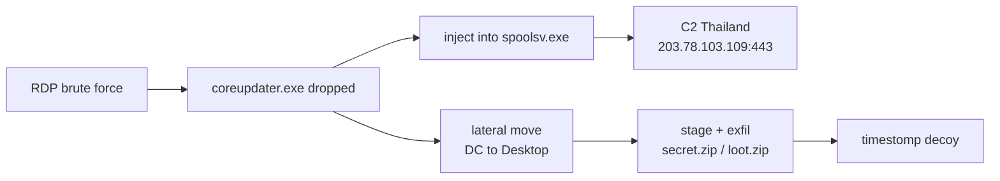

---

# The Evidence You Receive

Two victim hosts on domain **C137** (`10.42.85.0/24`):

| Host | Role | OS | Disk image | Memory |
|---|---|---|---|---|
| **CitadelDC01** `.10` | Domain Controller | Server 2012 R2 | `…CDrive.E01` | `citadeldc01.mem` |
| **DESKTOP-SDN1RPT** `.115` | Workstation | Win 10 Enterprise | `…SDN1RPT.E01` | `DESKTOP-SDN1RPT.mem` |

≈ **12.8 GB** total. Pre-staged on your USB stick / download link.

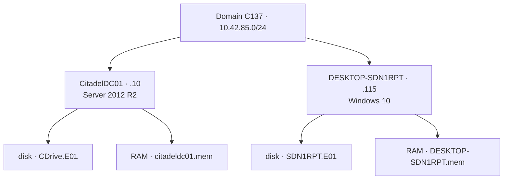

---

# The Full Case 001 Artifact Set

Everything DFIR Madness publishes for this case (`https://dfirmadness.com/case001/`):

**Domain Controller (CitadelDC01)**
- `DC01-E01.zip` — disk image · `DC01-memory.zip` — RAM · `DC01-pagefile.zip`
- `DC01-autorunsc.zip` · `DC01-ProtectedFiles.zip`

**Workstation (DESKTOP-SDN1RPT)**
- `DESKTOP-E01.zip` · `DESKTOP-SDN1RPT-memory.zip` · `Desktop-SDN1RPT-pagefile.zip`
- `DESKTOP-SDN1RPT-autorunsc.zip` · `DESKTOP-SDN1RPT-Protected Files.zip`

**Network**
- `case001-pcap.zip`

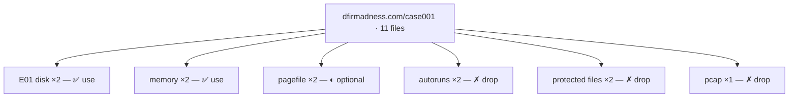

---

# What We Use Today — and Why

✅ **In scope:** **disk image + RAM dump** for *both* hosts. Nothing else.

This is **not** us simplifying the case. It is us **mimicking real post-incident IR**:

- In a real engagement you almost always get **a dead disk and (if you're lucky) a memory capture** — pulled after the fact.
- Everything else on that download page is a **convenience the CTF pre-cooked for you.** We refuse the convenience on purpose.

> The skill we are training is *working from what you actually get*, not from a tidy artifact bundle.

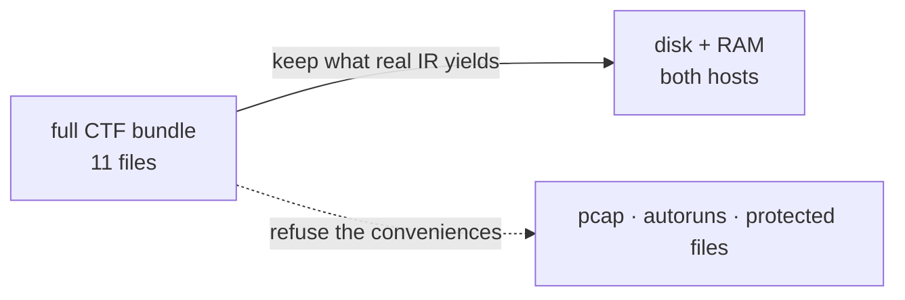

---

# Why No PCAP

`case001-pcap.zip` is **excluded** — deliberately.

- Full packet capture means **someone was already recording the wire** before/at the breach. In the field that is **rare** — most orgs have no retained PCAP at the moment that matters.
- Relying on PCAP teaches a habit that **breaks the day you don't have it.**
- The *outcomes* PCAP would show — the brute force, the C2 — are **independently provable** from disk (EVTX 4625/4624) and memory (netstat). We reconstruct them from artifacts that **survive**.

PCAP-only details (an NMAP 3389 probe at 02:19) become a **footnote**, not an assessable question.

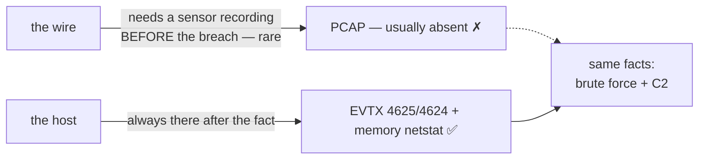

---

# Why We Extract the System Files Ourselves

`*-autorunsc.zip` and `*-ProtectedFiles.zip` are **excluded** — also deliberately.

- Those are **pre-extracted hives, autoruns, locked files** — work a tool already did *in the lab*.
- Pulling `SYSTEM` / `SOFTWARE` / `SAM`, `$MFT`, EVTX, `SRUDB.dat` **out of the E01 by path** is a **core lab step** — so we do it ourselves, live.
- Locked/"protected" files (loaded hives, `pagefile.sys`) can't be copied off a live box normally — but on a **dead image every byte is reachable.** That's the lesson.

> Extraction *is* the exercise. You leave knowing how the sausage is made.

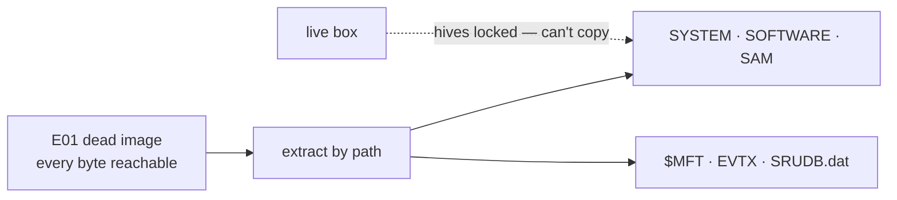

---

# One Trap to Internalize: The Clock

The victim VMs were **mis-configured to UTC−7**. The (excluded) PCAP router was **UTC−6**.

- Disk / EVTX / memory timestamps read **~1 hour ahead** of the network-clock narration in the official key.
- The key's `02:24:06` download = your tooling's **`03:24:06Z`** — *same instant, different clock.*

**Always establish clock provenance before you trust a timeline.** Issen surfaces this via `ClockProvenance` so the skew is a labeled fact, not a silent error.

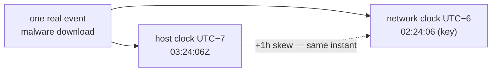

---

# The Real Point of This Workshop

Knowing *which tool* and *where the artifact lives* feels like expertise. It is a **fake moat**:

- It is **mechanical** — lookup-table knowledge.
- In the age of AI it is being **unified, normalized, and automated away.**

The **real moat** is the **investigative mindset**:

- Reading what the output **means**
- Building the **attack narrative**
- **Presenting it** to a board with intellectual honesty

> We spend the *mechanical* time in **one** tool so the *cognitive* time goes where it counts.

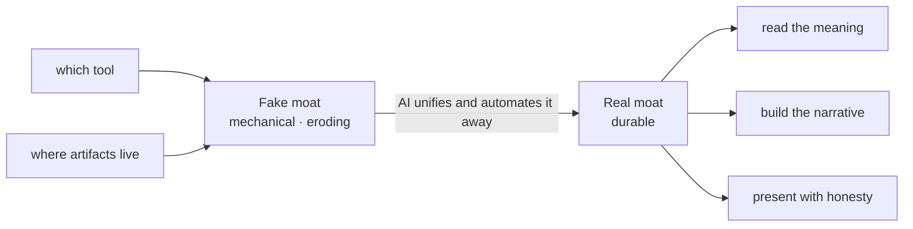

---

# Why Issen Is Different

The traditional path: **FTK Imager + Volatility + Eric Zimmerman tools + KAPE** — four ecosystems, three languages, two OSes, glue scripts in between.

Issen's bet:

- **One cross-platform binary.** Native macOS / Windows / Linux. Rust. `cargo install`, no runtime.
- **One address space for the whole case** — disk, memory, logs converge into a single timeline.
- **Forensically paranoid by construction** — panic-free parsers, never trust a length field, fail loud on the unknown.
- **Findings, not verdicts** — every output is *"consistent with"*, leaving the conclusion to you.

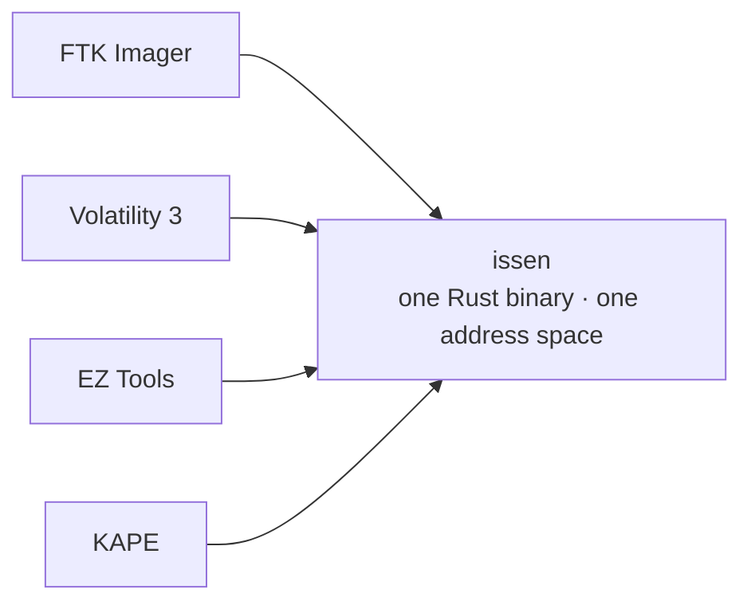

---

# It's Not One Tool — It's a Fleet

Issen is a thin **orchestration layer** over a family of standalone, single-purpose forensic libraries.

- Each library is a **deep expert** in one artifact family (NTFS, EVTX, SRUM, memory paging…).
- Issen **wires them together** and correlates across them.
- Every library emits the **same normalized finding model**, so one report renders them uniformly.

The architecture is organized around **how an analyst navigates evidence** — five fundamental primitives.

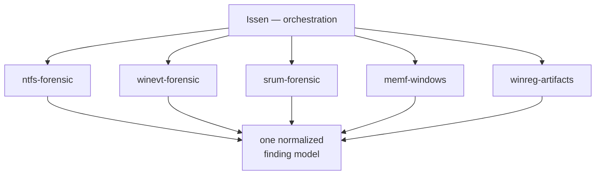

---

# The Five Navigation Primitives

Every piece of evidence is reached by exactly one of five "navigation verbs":

| | Primitive | You navigate by… |
|---|---|---|
| **[P]** | **Disk** | `name → inode → block` (walk the filesystem tree) |
| **[M]** | **Memory** | `PID → EPROCESS → virtual addr → physical addr` |
| **[L]** | **Log** | `timestamp / record-# → boundary → field` |
| **[Q]** | **Live Query** | `endpoint, query, cursor → result rows` |
| **[C]** | **Content-addressed** | `hash → blob → Merkle graph` |

**Today we live in [P] and [M]** — disk and memory. ([L] logs live *on* the disk; [Q]/[C] are for live and CAS evidence.)

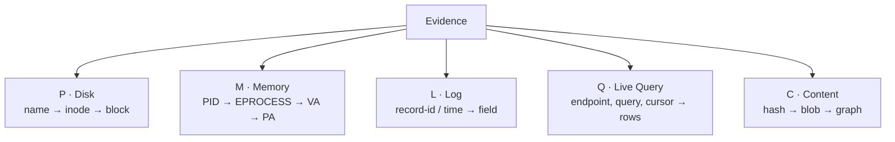

---

# The Fleet, Layered

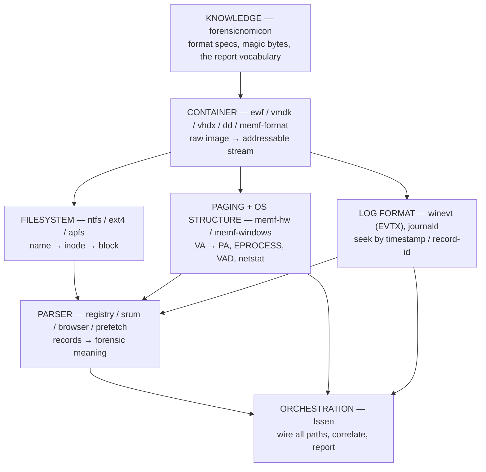

**Dependencies point down to KNOWLEDGE; evidence flows up to ORCHESTRATION.**

---

# The IR Analyst's Journey

We'll walk the **pipeline in the order you actually meet the evidence** — outside-in:

1. **Container** — the image format on your desk (E01, VMDK…)
2. **Partition table** — where are the volumes?
3. **File system** — NTFS: turn paths into bytes
4. **Filesystem timeline** — `$MFT`, USN journal, `$LogFile`
5. **Event logs** — EVTX
6. **Registry & SRUM** — system state and the usage ledger
7. **Memory** — the live truth the disk can't show
8. **Correlation → narrative → report**

> Each is a *fundamental* — learn it once, recognize it everywhere.

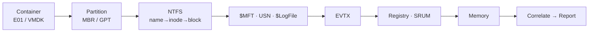

---

# 1 · Containers — What Lands on Your Desk

You never get "a disk." You get a **container**: a file that wraps the raw sectors.

| Format | Where it comes from | Issen reader |
|---|---|---|
| **E01 / EWF** | FTK Imager, EnCase — the IR standard. Compressed, hashed, segmented (`.E01`, `.E02`…) | `ewf` |
| **VMDK** | VMware virtual disks — half of all "servers" are VMs | `vmdk` |
| **VHD / VHDX** | Hyper-V, Azure | `vhdx` |
| **raw / dd / img** | `dd`, FTK "raw", Linux | `dd` |

**Job of this layer:** hand everything above it **one flat, addressable sector stream** — the container format becomes invisible.

> Our two case files are **E01** sets. Note the segments: `…E01` + `…E02` are *one* image.

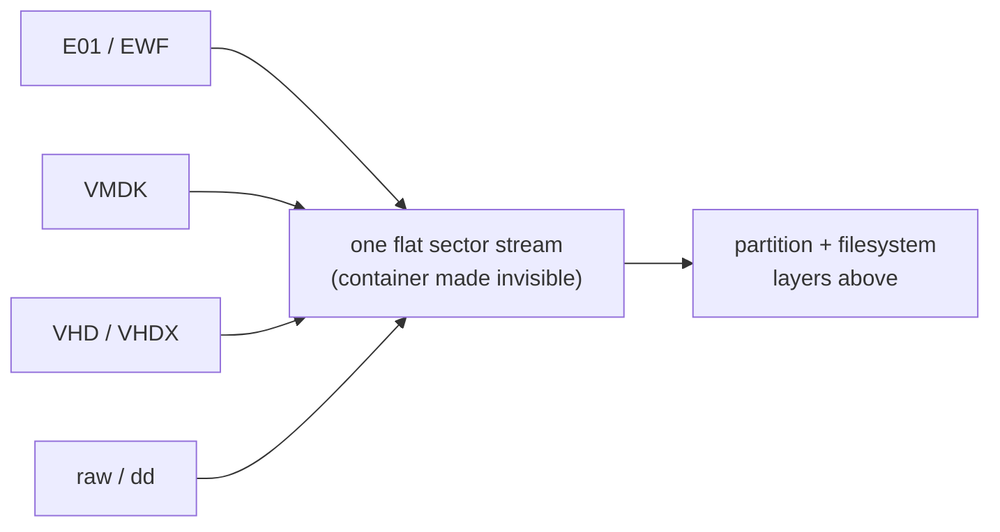

---

# Container Gotchas Worth Knowing

- **E01 is a *set*, not a file.** `image.E01`, `image.E02`, … must travel together — they're one logical disk split for portability. Point the tool at the **first** segment; it finds the rest.
- **E01 carries its own hashes.** Acquisition stored an MD5/SHA. Verify it before you trust a single byte — chain of custody starts here.
- **Compression is transparent.** EWF is zlib-compressed under the hood; the reader inflates on the fly. You address sectors, not compressed blocks.

`issen ingest <first.E01>` opens the container for you — the rest of the pipeline never sees EWF again.

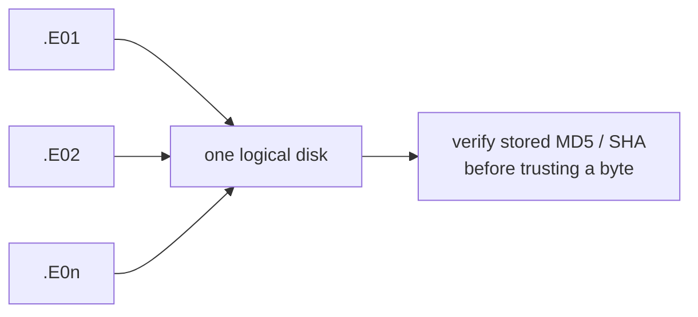

---

# 2 · Partition Tables — Finding the Volumes

A raw sector stream is not yet a filesystem. First: **where do the volumes start?**

- **MBR** (legacy) — 4 primary partitions, 32-bit LBA, the classic `0x55AA` boot signature at offset 510.
- **GPT** (modern) — 128 entries, 64-bit LBA, CRC-protected header, a protective MBR up front.

**What forensics looks for here:**
- Partition **boundaries** (so we mount the right NTFS volume)
- **Overlaps / gaps / hidden partitions** — a classic place to stash data
- A boot signature that **doesn't parse** → surface the raw bytes, don't guess

> The Windows system volume is the one we want — that's where `\Windows\System32` and the hives live.

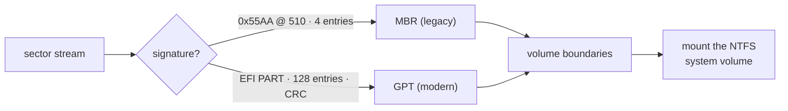

---

# 3 · File Systems — Paths Into Bytes

NTFS is the navigation engine for `[P]`: **`name → inode → block`**.

- Everything is a file — even the metadata. The master record is **`$MFT`**.
- Each file = an MFT record of **attributes**: `$STANDARD_INFORMATION`, `$FILE_NAME`, `$DATA`, `$INDEX`…
- **Resident vs non-resident:** small files live *inside* the MFT record; large files point out to **data runs** (cluster lists).
- **Deleted ≠ gone.** The MFT record and its runs often survive until overwritten — that's how we **carve**.

**Our job:** resolve `C:\Windows\System32\coreupdater.exe` → MFT record → clusters → bytes, with **zero trust** in any length field along the way.

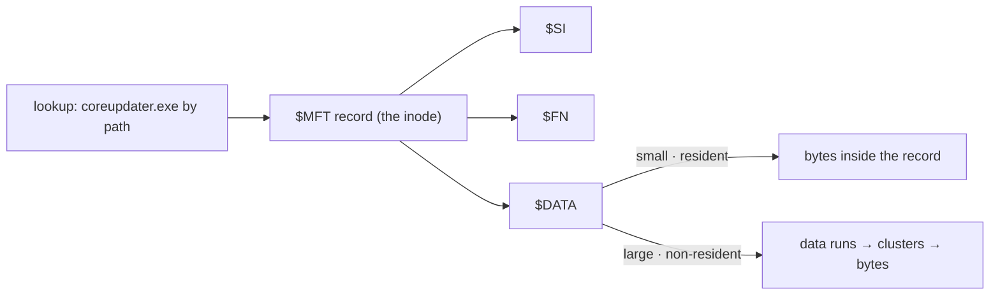

---

# The Two Timestamps That Catch Liars

Every NTFS file carries **two** sets of MAC times:

- **`$SI` — `$STANDARD_INFORMATION`** — what Explorer shows. **User-writable** via the Windows API.
- **`$FN` — `$FILE_NAME`** — kernel-maintained, **much harder to forge.**

**Timestomping** rewrites `$SI` to hide when malware really landed. The tell:

> `$SI.modified` **earlier than** `$FN.created` → physically impossible → **manipulation.**

In our case the attacker stomps **`Beth_Secret.txt`**. The `$SI`/`$FN` split is how we prove it — a finding flagged *Info → lead*, because the heuristic has false positives and the analyst confirms.

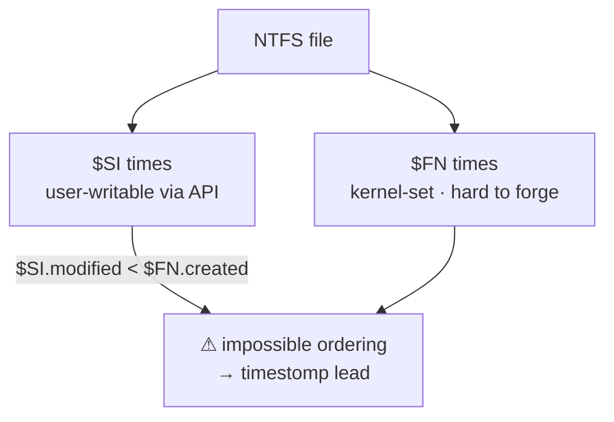

---

# 4 · The Filesystem Timeline — Change History

NTFS journals its own changes. Three artifacts reconstruct *what happened to files, when*:

| Artifact | What it records | Why it matters here |
|---|---|---|
| **`$MFT`** | Current state + `$SI`/`$FN` MAC times | When `coreupdater.exe` first appeared; the timestomp |
| **`$UsnJrnl:$J`** | A rolling log of **every** create / delete / rename / write | `secret.zip`, `loot.zip` **staged and deleted** — even after the file is gone |
| **`$LogFile`** | Transaction log (metadata replay) | Lowest-level corroboration / recovery |

> USN is the hero of exfil hunting: it remembers the `loot.zip` that the attacker **created and then deleted** to cover tracks.

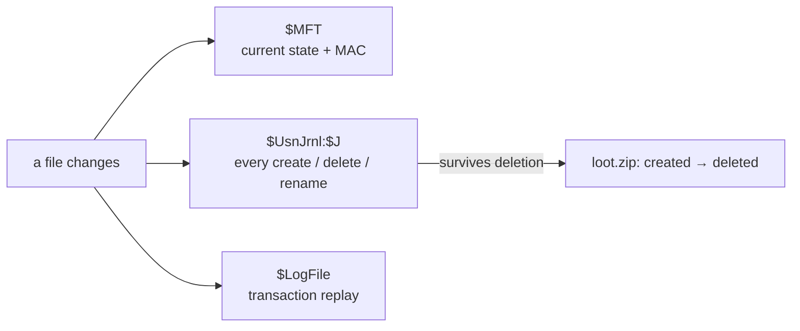

---

# 5 · Event Logs — EVTX (the [L] Path)

Windows event logs are the **[L]og** primitive: seek by **record-id / timestamp → field**.

- Binary **EVTX** format, BinXML-encoded — not text. We decode chunks → typed `EventRecord`.
- Extracted **from the disk** by path: `…\Security.evtx`, `System.evtx`.

**The story lives in a handful of Event IDs:**

| EID | Meaning | In this case |
|---|---|---|
| **4625** | Logon **failure** | The RDP brute-force **flood** |
| **4624** | Logon **success** (type 10 = RDP) | Compromise: `Administrator` from `194.61.24.102` |
| **7045** | **Service installed** | `coreupdater` persistence |
| **4634/4647** | Logoff | Last adversary contact |

> 4625-flood → 4624-success is the *entire entry story*, written down by Windows itself.

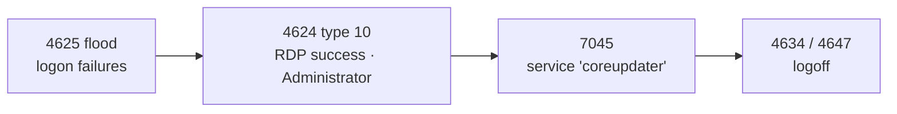

---

# 6 · Registry — On Disk vs In Memory

The registry is **one logical tree** that lives in **two different address spaces** — and you read it differently in each.

- **`[P]` On disk** — the hive **files** (`SYSTEM`, `SOFTWARE`, `SAM`, `NTUSER.DAT`). Extracted from the E01. Gives you **OS version, timezone (the clock truth), services, Run keys, account hashes, per-user activity** — the *persisted* state.
- **`[M]` In memory** — the same hives loaded as **`_CMHIVE`** kernel objects. Gives you **volatile keys with no disk copy, unflushed in-RAM edits, and the registry itself when you have no disk** — the *live* state.

> Same keys, two readers. On disk a cell is a flat file offset; in memory it's a scattered allocation you reach through the **HMAP**.

```mermaid
flowchart TB
  REG["one logical registry"]
  REG --> DISK["[P] On disk · hive FILE<br/>contiguous: regf + hbins"]
  REG --> MEM["[M] In memory · _CMHIVE<br/>bins scattered in paged pool"]
  DISK --> DT["cell index = flat offset<br/>0x1000 + index (+4 hdr)"]
  MEM --> MT["cell index → HMAP walk<br/>directory → table → entry"]
```

---

# Registry in Memory — The HMAP Translation

On disk a hive is one contiguous blob, so a **cell index** is just an offset. In RAM the kernel scatters the hive's 4 KB **bins** across paged pool — so the same cell index must be **translated through the hive map (`HMAP`)**, a page-table-like walk. This is exactly how `issen` reads a hive straight from `citadeldc01.mem`.

The 32-bit cell index decomposes into four fields:

- **bit 31** → Stable (0) vs **Volatile** (1) storage
- **bits 30–21** (`& 0x3FF`) → `_HMAP_DIRECTORY` index → `_HMAP_TABLE*`
- **bits 20–12** (`& 0x1FF`) → `_HMAP_TABLE` index → `_HMAP_ENTRY`
- **bits 11–0** (`& 0xFFF`) → byte offset inside the 4 KB bin

> On **Server 2012 R2 (build 9600 — our DC)** the entry exposes only `BlockAddress`; newer builds add `PermanentBinAddress`. Issen tries the new field, then **falls back to `BlockAddress`** — without it every hive-cell read on the DC fails.

```mermaid
flowchart LR
  CI["cell index · u32"] --> B31["bit 31<br/>Stable / Volatile"]
  CI --> BD["bits 30–21 & 0x3FF<br/>directory index"]
  CI --> BT["bits 20–12 & 0x1FF<br/>table index"]
  CI --> BO["bits 11–0 & 0xFFF<br/>offset in 4 KB bin"]
  B31 --> STG["_HHIVE.Storage[ ]"]
  STG --> DIR["_HMAP_DIRECTORY"]
  BD --> DIR
  DIR --> TBL["_HMAP_TABLE"]
  BT --> TBL
  TBL --> ENT["_HMAP_ENTRY<br/>BlockAddress → bin VA"]
  ENT --> CELL["cell VA"]
  BO --> CELL
  CELL --> DATA["+4 size header → cell data"]
```

---

# Registry — What Each Source Gives You

Both readers feed the same forensic questions — but only one source has some answers.

| Question | On disk (hive file) | In memory (`_CMHIVE`) |
|---|---|---|
| OS version / build | ✅ `SOFTWARE` | ✅ |
| Timezone (clock truth) | ✅ `SYSTEM` | ✅ |
| Services / Run-key persistence | ✅ | ✅ |
| Account hashes | ✅ `SAM` + `SYSTEM` | ✅ (+ live secrets) |
| **Volatile keys** (`HKLM\HARDWARE`) | ✗ never written | ✅ **only here** |
| **Unflushed in-RAM edits** | ✗ not yet on disk | ✅ **only here** |
| Registry when **disk is missing/encrypted** | ✗ | ✅ |

> The disk hive is the system **at rest**; the memory hive is the system **as it was actually running** at capture.

```mermaid
flowchart LR
  Q["a registry question"] --> BOTH{"answer on disk?"}
  BOTH -->|"persisted state"| D["read hive FILE<br/>winreg-artifacts"]
  BOTH -->|"volatile · unflushed · no disk"| M["read _CMHIVE via HMAP<br/>memf-windows"]
```

---

# SRUM — The Usage Ledger That Outlives Deletion

**SRUM** (`SRUDB.dat`, an ESE database) silently logs per-process resource usage Windows uses for the battery UI:

- **Bytes sent / received per application** — an exfil ledger.
- **Which executables ran, and when** — even after the binary is deleted.

It's an **ESE B-tree** (same engine as Exchange/AD) — a parser job, not a casual read.

> When the attacker deletes the malware, SRUM may still hold *"this process moved N bytes out at time T."* That's how you quantify the theft.

```mermaid
flowchart LR
  SRUM["SRUDB.dat · ESE B-tree"] --> APP["per-app · per-hour rows"]
  APP --> BYTES["bytes sent / received"]
  APP --> RUN["exe ran @ time"]
  BYTES --> Q["quantify exfil —<br/>even after the malware is deleted"]
```

---

# 7 · Memory — The Live Truth

The disk shows what was **stored**. Memory shows what was **running**. This is the **[M]** primitive.

**`PID → EPROCESS → virtual address → physical address`** — a page-table walk.

- **PAGING (`memf-hw`)** — OS-agnostic hardware: CR3/DTB, PML4 / PAE / AArch64 page walks. Turns a VA into a physical offset in the dump.
- **OS STRUCTURE (`memf-windows`)** — walks the `EPROCESS` list, VAD tree, network tables, credential caches.
- **Symbol-driven:** it resolves the kernel's PDB (GUID-matched, auto-downloaded) so struct offsets are exact for *this* build — not guessed.

> Memory is where the **C2 IP, the live malicious process, and the `spoolsv` injection** live — none of which the disk can show you.

```mermaid
flowchart LR
  PID["PID"] --> EP["EPROCESS"]
  EP --> CR3["DirectoryTableBase (CR3)"]
  CR3 --> PW["PML4 → PDPT → PD → PT"]
  PW --> PA["physical page in the dump"]
```

---

# What Memory Recovers Here

Walking `citadeldc01.mem` / `DESKTOP-SDN1RPT.mem`:

- **`ps` / process list** — `coreupdater.exe` running, parentage, the migration into `spoolsv.exe`.
- **`netstat`** — the live socket to **`203.78.103.109:443`** (the Thailand C2), reconstructed by scanning TCP endpoint pool tags — *without* the PCAP we threw away.
- **`scan` / malfind** — injected, executable-but-private memory regions (the injection signature).

Mapped to ATT&CK: **T1055** (injection), **T1071/T1573** (C2 over encrypted channel).

> Same instant the brute force succeeded on disk — now corroborated by what's *live in RAM*.

```mermaid
flowchart LR
  PS["coreupdater.exe (ps)"] -->|"malfind · T1055"| INJ["injected code in spoolsv.exe"]
  INJ -->|"netstat"| C2["203.78.103.109:443"]
  C2 -->|"T1071 / T1573"| OUT["encrypted C2 channel"]
```

---

# Part II — The Investigation, Question by Question

Now we **apply** the fundamentals. Two commands carry most of the case:

```bash
# disk → one timeline DB        # memory → processes, C2, creds
issen ingest "$DC_E01" -o dc01.duckdb
issen memory "$DC_MEM" --command all
```

Each question below: **the exact command → the real output → how to read it.**

> **Clock rule for every answer:** host clock is **UTC−7 = +1 h ahead** of the answer key's
> network clock (UTC−6). issen's `03:24:06Z` *is* the key's `02:24:06`. Same instant.

```mermaid
flowchart LR
  DISK["$DC_E01"] --> ING["issen ingest"] --> DB["dc01.duckdb"]
  MEM["$DC_MEM"] --> MM["issen memory --command all"] --> ANS["answers"]
  DB --> ANS
```

*Outputs on the following cards are **MEASURED-BY-ISSEN** — the issen release binary run against the real CitadelDC01 image, 2026-06-24, quoted verbatim.*

---

# Q · Was there a breach at all?

**Ground truth:** Yes.

**Command:**

```bash
issen info dc01.duckdb
```

**Output** *(MEASURED-BY-ISSEN):*

```
Total events: 691,649
  LogonSuccess  2540    LogonFailure  107
  ServiceStart  1176    Logoff        2258
```

**Make sense of it:** a quiet host does not show **107 failed logons next to a service-install spike**. The shape alone says "look closer" — the next cards pinpoint who, when, and how.

```mermaid
flowchart LR
  DB["dc01.duckdb<br/>691,649 events"] --> S["107 LogonFailure<br/>+ 1176 ServiceStart"] --> V["breach signal →<br/>investigate"]
```

---

# Q · Initial access — how did they get in?

**Ground truth:** RDP brute force → `C137\Administrator` from `194.61.24.102`.

**Command:**

```bash
duckdb dc01.duckdb -c "SELECT timestamp_display,
  json_extract_string(metadata,'\$.LogonType')   AS type,
  json_extract_string(metadata,'\$.IpAddress')   AS ip,
  json_extract_string(metadata,'\$.TargetUserName') AS user
  FROM timeline WHERE event_type='LogonSuccess'
  AND metadata LIKE '%194.61.24.102%' ORDER BY timestamp_ns LIMIT 1;"
```

**Output** *(MEASURED-BY-ISSEN):*

```
2020-09-19T03:21:48.89Z | 10 | 194.61.24.102 | Administrator
# 107 LogonFailure events precede it; the last at 03:21:46 — 2 s before success
```

**Make sense of it:** **107 failures, then a Type-10 (RDP) success 2 seconds later**, same source IP, as `Administrator`. *Consistent with* a successful RDP brute force. Network-clock time = **02:21:48**. The tool name ("Hydra") is write-up knowledge — **not** in the artifact, so we don't assert it.

```mermaid
flowchart LR
  F["107 × 4625<br/>failures"] --> S["4624 type 10 success<br/>03:21:48 · Administrator"]
  IP["194.61.24.102"] --> S
  S --> C["consistent with<br/>RDP brute force"]
```

---

# Q · The payload — what landed, and when?

**Ground truth:** `coreupdater.exe` dropped to `C:\Windows\System32\`, first seen 02:24:06 (network).

**Command:**

```bash
duckdb dc01.duckdb -c "SELECT min(timestamp_display) AS first_seen, count(*) AS events
  FROM timeline WHERE lower(artifact_path) LIKE '%coreupdater%';"
```

**Output** *(MEASURED-BY-ISSEN):*

```
2020-09-19T03:24:06.44Z | 28
```

**Make sense of it:** the MFT puts `coreupdater.exe` on disk at host-derived **03:24:06** = network **02:24:06** — *matching the answer key to the second* once the +1 h skew is applied. 28 MFT/USN events trace its create → move → execution footprint.

```mermaid
flowchart LR
  MFT["$MFT / USN"] --> CU["coreupdater.exe<br/>first touch 03:24:06"] --> K["= key 02:24:06<br/>(+1h skew)"]
```

---

# Q · Persistence — how did it survive reboot?

**Ground truth:** installed as a LocalSystem auto-start **service** (`coreupdater`) + Run key.

**Command:**

```bash
duckdb dc01.duckdb -c "SELECT timestamp_display, json_extract_string(metadata,'\$.ServiceName') AS svc
  FROM timeline WHERE event_type='ServiceInstall'
  AND metadata LIKE '%coreupdater%' ORDER BY timestamp_ns LIMIT 1;"
```

**Output** *(MEASURED-BY-ISSEN):*

```
2020-09-19T03:27:49.50Z | coreupdater     (EventID 7045, Service Control Manager)
```

**Make sense of it:** a **7045 service-install** named `coreupdater` at network **02:27:49** — three minutes after the drop. *Consistent with* establishing boot persistence as SYSTEM. (The Run-key copy is the same story from the registry hive.)

```mermaid
flowchart LR
  EVTX["System.evtx"] --> E["7045 ServiceInstall<br/>name = coreupdater · 03:27:49"] --> P["consistent with<br/>SYSTEM persistence"]
```

---

# Q · C2 — who was it talking to?

**Ground truth:** `203.78.103.109:443` (Thailand), held by the malware.

**Command:**

```bash
issen memory "$DC_MEM" --command netstat
```

**Output** *(MEASURED-BY-ISSEN — this is the live RAM, no PCAP):*

```
Proto  Local              Remote              State        PID   Process         Note
TCPv4  10.42.85.10:62613  203.78.103.109:443  ESTABLISHED  3644  coreupdater.ex  external-established
```

**Make sense of it:** issen scans TCP endpoint pool tags and recovers an **ESTABLISHED** socket to **`203.78.103.109:443`** owned by **`coreupdater.exe` (PID 3644)** — the C2, pulled straight from memory **without the PCAP we excluded.** *Consistent with* an active command-and-control channel.

```mermaid
flowchart LR
  RAM["citadeldc01.mem"] --> NS["issen memory netstat"] --> C2["203.78.103.109:443<br/>ESTABLISHED · PID 3644 coreupdater"]
```

---

# Q · Was the process injected / migrated?

**Ground truth:** Meterpreter migrated `coreupdater` → `spoolsv.exe`.

**Command:**

```bash
issen memory "$DC_MEM" --command ps
```

**Output** *(MEASURED-BY-ISSEN):*

```
PID   PPID  Process         State
3644  2244  coreupdater.ex  Exited
3724  452   spoolsv.exe     Running
2840  3472  FTK Imager.exe  Running
```

**Make sense of it:** `coreupdater` (3644) is **Exited** — yet the C2 socket (prev card) is still tied to it — while `spoolsv.exe` (3724) **runs** as a service child. The dead owner + live service host + shared C2 is **consistent with** process migration. (`FTK Imager.exe` is the *acquisition* tool, captured mid-image — a good provenance check, not the intrusion.)

```mermaid
flowchart LR
  PS["issen memory ps"] --> A["coreupdater 3644 · Exited"]
  PS --> B["spoolsv 3724 · Running"]
  A --> M["consistent with<br/>Meterpreter migration"]
  B --> M
```

---

# Q · Lateral movement — where did they go next?

**Ground truth:** RDP from the DC (`10.42.85.10`) to `DESKTOP-SDN1RPT` with the same stolen credential, ~02:35:54.

**Command:**

```bash
duckdb desktop.duckdb -c "SELECT timestamp_display,
  json_extract_string(metadata,'\$.LogonType') AS type,
  json_extract_string(metadata,'\$.IpAddress') AS ip
  FROM timeline WHERE event_type='LogonSuccess'
  AND metadata LIKE '%10.42.85.10%' ORDER BY timestamp_ns;"
```

**Output** *(MEASURED-BY-ISSEN — the **Desktop** image):*

```
2020-09-19T03:36:24.43Z | 10 | 10.42.85.10     (Administrator)
```

**Make sense of it:** the Desktop logs a **Type-10 (RDP) success from `10.42.85.10` — the DC itself** — as `Administrator`, network **02:35:54**. *Consistent with* the attacker pivoting deeper using the credential stolen on host #1. Two hosts, one stolen account.

```mermaid
flowchart LR
  DC["CitadelDC01<br/>10.42.85.10"] -->|"RDP · Administrator · 03:36:24"| WS["DESKTOP-SDN1RPT"]
  WS --> E["Desktop 4624 type 10<br/>source = the DC"]
```

---

# Q · Exfil staging — what did they take?

**Ground truth:** `secret.zip` (DC) and `loot.zip` (Desktop) staged, exfiltrated, then **deleted**.

**Command:**

```bash
duckdb desktop.duckdb -c "SELECT timestamp_display, event_type, source
  FROM timeline WHERE lower(artifact_path) LIKE '%loot.zip%' ORDER BY timestamp_ns;"
```

**Output** *(MEASURED-BY-ISSEN):*

```
2020-09-19T03:46:18.07Z | FileRename      | UsnJournal
2020-09-19T03:46:18.13Z | MetadataChange  | UsnJournal
2020-09-19T03:47:09.92Z | FileDelete      | UsnJournal
```

**Make sense of it:** the **USN journal** remembers `loot.zip` being staged and then **deleted at 03:47:09** — *after* the file itself is gone. Create-then-delete inside a two-minute window is **consistent with** stage-exfiltrate-cleanup. The bytes-on-the-wire proof would be PCAP; the *staging act* is right here on disk.

```mermaid
flowchart LR
  USN["$UsnJrnl"] --> R["loot.zip rename 03:46:18"] --> D["loot.zip DELETE 03:47:09"]
  D --> X["consistent with<br/>stage → exfil → cleanup"]
```

---

# Q · Anti-forensics — did they hide a file's age?

**Ground truth:** Beth's secret file was deleted, replaced, and **timestomped** (~02:38).

**Command:**

```bash
duckdb dc01.duckdb -c "SELECT timestamp_display, event_type FROM timeline
  WHERE lower(artifact_path) LIKE '%beth%' ORDER BY timestamp_ns;"
# then compare $SI vs $FN on the record (the timestomp tell)
```

**Output** *(MEASURED-BY-ISSEN — the MFT trail):*

```
… FileRename / FileCreate / FileAccess / MetadataChange events for Beth's file …
```

**Make sense of it:** issen recovers the **full create/rename/access trail** for Beth's file from the MFT — the raw material. The timestomp itself is the **`$SI` earlier than `$FN`** contradiction (the *Two Timestamps* card): a **flagged lead**, *Info* severity, that the analyst confirms — heuristics here have false positives, so we never auto-conclude.

```mermaid
flowchart LR
  MFT["$MFT record"] --> SI["$SI time"]
  MFT --> FN["$FN time"]
  SI -->|"$SI < $FN"| T["timestomp lead<br/>→ analyst confirms"]
  FN --> T
```

---

# Q · The hard ones — OS, timezone, passwords

Some answers need a parser issen is still wiring, or a step that belongs in the lab. **We say so plainly** — that honesty *is* the method.

| Question | Where the answer lives | Today |
|---|---|---|
| Server OS / build | `SOFTWARE` hive · memory `check` | ◐ memory surfaces it; disk registry value-extract WIP |
| Timezone (the clock truth) | `SYSTEM\…\TimeZoneInformation` | ◐ hive ingested; named-value pull WIP |
| Domain passwords | `SAM`+`SYSTEM` → NTLM → crack | ○ extract hives, crack **offline** in the lab |

> A tool that **fabricated** these would be worse than one that flags the gap. "Consistent with," "not yet wired," and "out of reach" are all honest answers.

```mermaid
flowchart LR
  Q["OS · timezone · passwords"] --> R["registry hive / SAM<br/>(ingested as raw events)"]
  R --> W["value-extract WIP<br/>· crack offline in lab"]
```

---

# Scorecard — What Issen Measured Here

Run against the **real** Case 001 images (2026-06-24), every claim above is a quoted tool output:

| Answer | issen surface | Verdict |
|---|---|---|
| Breach / 107 failures | `issen info` | ✅ measured |
| Initial access · 03:21:48 · Administrator | ingest + query | ✅ measured |
| Payload `coreupdater` · 03:24:06 | ingest + query | ✅ measured |
| Persistence · 7045 · 03:27:49 | ingest + query | ✅ measured |
| **C2 `203.78.103.109:443` · PID 3644** | `memory netstat` | ✅ measured |
| Migration · `spoolsv` 3724 | `memory ps` | ✅ measured |
| Lateral · DC → Desktop · 03:36:24 | ingest + query | ✅ measured |
| Exfil staging · `loot.zip` delete | USN | ✅ measured |
| Timestomp · `$SI`/`$FN` | MFT | ◐ lead, analyst-confirmed |
| OS / timezone / passwords | registry / SAM | ◐ / ○ WIP / lab |

> The mechanical answers fall out of two commands. **The minute they took, the moat is yours: weaving them into one defensible narrative.**

```mermaid
flowchart LR
  ING["issen ingest"] --> NINE["8 answers measured"]
  MEM["issen memory"] --> NINE
  NINE --> NAR["→ correlate → narrative"]
```

---

# 8 · Correlation — One Timeline, Many Sources

Each layer above produces events in **its own** address space. Correlation **merges them into one super-timeline** — with **per-event source attribution**.

- Disk `$MFT` + USN + EVTX + Registry + SRUM + Memory → **one ordered narrative**.
- Each row carries **where it came from** (`source = EVTX | MFT | USN | memory | SRUM`).
- Clock skew normalized once (`ClockProvenance`), so every source lands on the **same wall clock**.

> The breach isn't proven by one artifact — it's proven by **five independent sources agreeing** on the same minute.

```mermaid
flowchart LR
  MFT["MFT"] --> N["normalize clock<br/>ClockProvenance"]
  USN["USN"] --> N
  EVTX["EVTX"] --> N
  REG["Registry"] --> N
  SRUM["SRUM"] --> N
  MEM["Memory"] --> N
  N --> TL["one timeline<br/>per-event source = …"]
```

---

# The Climax — ATT&CK Narrative & The Report

The deliverable is not a tool dump. It's an **attack-chain narrative** a board can read:

`T1110` brute force → `T1021.001` RDP → `T1543.003` service persistence → `T1055` injection → `T1071/T1573` C2 → `T1070.006` timestomp → `T1560/T1041` stage & exfil.

Built from **graded findings**, each tagged *"consistent with"* — never a verdict.

```mermaid
flowchart LR
  A["T1110<br/>brute force"] --> B["T1021.001<br/>RDP"]
  B --> C["T1543.003<br/>service persist"]
  C --> D["T1055<br/>injection"]
  D --> E["T1071 / T1573<br/>C2"]
  E --> F["T1070.006<br/>timestomp"]
  F --> G["T1560 / T1041<br/>stage & exfil"]
```

---

# Present It Like an Expert Witness

The discipline that separates an analyst from a technician — **three epistemic layers:**

1. **Observed fact** — *"200 KB left the host to 203.78.103.109 at 02:24."* → state it.
2. **Forensic inference** — *"consistent with C2 exfiltration."* → "consistent with", never "proves".
3. **Legal conclusion** — *"this was theft."* → **not yours.** *"The tribunal may draw its own conclusions."*

> Tools find the bytes. **Judgment** decides what they mean — and **restraint** decides what you're entitled to say.

```mermaid
flowchart TB
  O["1 · Observed fact<br/>'200 KB left to 203.78.103.109'"] --> I["2 · Forensic inference<br/>'consistent with C2 exfil'"]
  I --> L["3 · Legal conclusion<br/>'this was theft' — the tribunal's call"]
```

---

# The Takeaway

- The **mechanics** — containers, partition tables, NTFS, EVTX, registry, SRUM, memory — are **fundamentals you now recognize anywhere.**
- The **tooling** — one Rust-native fleet — collapses four ecosystems into one address space, so the friction stops stealing your thinking time.
- The **moat** — and your career — is the **mindset**: read the meaning, build the narrative, present with honesty.

**Now let's open the image.** → *Module 1: crack the container.*

```mermaid
flowchart LR
  MECH["mechanics<br/>now fundamentals"] --> FREE["friction removed<br/>by one tool"]
  FREE --> MIND["time freed for the mindset<br/>= the real moat"]
```

---

# Thank You

### Build the narrative. Present with honesty. That's the moat.


**Author:** [Albert Hui](https://linktr.ee/4n6h4x0r)
**QA:** [Josiah Wu](https://jwu29-blog.com/)

*Scan the code for the slides, the Issen toolchain, and a way to reach me — then bring your own cases.*

> Presenter note: the QR encodes `linktr.ee/4n6h4x0r`. To collect feedback live instead, repoint the image `…?data=` parameter to your feedback-form URL.

---

# Backup / Reference

- Case: **DFIR Madness Case 001** — `https://dfirmadness.com/the-stolen-szechuan-sauce/`
- Answer key: `https://dfirmadness.com/answers-to-szechuan-case-001/`
- Workshop design + command walkthrough: `DESIGN.md`, `ctf-yardstick.md`, `../szechuan-sauce-quickstart.md`
- Registry-in-memory HMAP translation: issen `memf-windows/src/registry.rs` (`cell_index_to_va`).
- Clock: victim VMs **UTC−7**; key narrates **UTC−6** → host artifacts read **+1h**.
