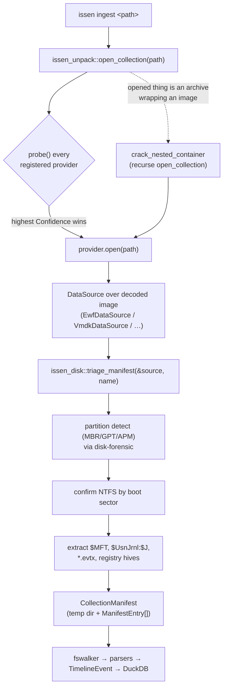
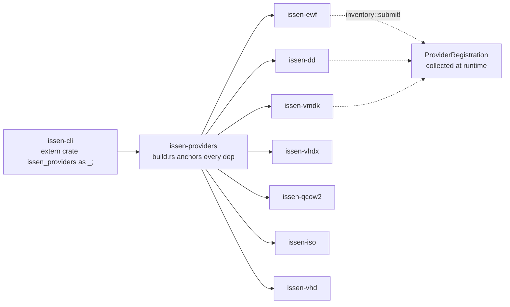

# Writing Disk-Image Crates for Issen

A hands-on guide to adding a new container/disk-image format (EWF, VMDK, VHDX, raw,
…) to the Issen forensic pipeline, and — more broadly — how Issen is extended at
every layer.

For the surrounding system, see [`ARCHITECTURE.md`](./ARCHITECTURE.md) (ingestion
pipeline, plugin system, correlation engine) and the multi-repo layer model in the
root [`CLAUDE.md`](../CLAUDE.md). This guide is the contributor-facing companion:
what to write, where it plugs in, and the invariants it must hold.

## Executive Summary

A disk-image crate in Issen is a thin `issen-<format>` wrapper around a published
`<format>-core` reader. It satisfies **two contracts** and registers itself once:

1. **`DataSource`** (`issen_core::plugin::traits::DataSource`) — random-access
   bytes over the decoded image: `len()`, `read_at(offset, buf)`. This is what the
   disk pipeline reads to find partitions and crack NTFS.
2. **`CollectionProvider`** (`issen_unpack::CollectionProvider`) — format
   recognition and entry point: `probe(path) -> Confidence` (inspect **magic
   bytes**, never the extension) and `open(path) -> CollectionManifest`.

Registration is one line — `inventory::submit!(ProviderRegistration { create: || Box::new(MyProvider) })`
— plus **one dependency line in `crates/issen-providers/Cargo.toml`**, because a
provider only registers if its crate is actually linked into the binary (the
`inventory` link-graph gotcha; see [Extending Issen](#extending-issen)).

Two invariants are non-negotiable, both learned the hard way:

- **Bounded memory.** Never `std::fs::read(whole_file)`. Back the reader with
  positioned reads and lazy structural tables, so RAM scales with the working set,
  not the image. A 2 TB image must open in megabytes. (`vhdx-core` shipped with a
  `std::fs::read(path)` that pulled the whole container into RAM — the bug this rule
  exists to prevent.)
- **Read straight from a `.zip`.** Evidence arrives as `image.E01` inside a `.zip`
  (often hundreds of segments). Provide `open_zip(zip_path)` that reads *stored*
  entries in place and *inflates deflated* entries once — never extract to a temp
  file first.

The fastest way to start: copy `crates/issen-dd` (the simplest reference, ~120
lines of non-test code) and the magic-probe + crack path from `crates/issen-ewf`.

---

## Part 1 — How Issen ingests a disk image

`issen ingest evidence.zip` (or a loose `image.E01`) flows through one registry and
two contracts:



Two distinct roles, easy to conflate:

- The **`CollectionProvider`** is the *entry point and recognizer*. Its `open()`
  returns a `CollectionManifest` — a temp directory of extracted artifacts plus
  metadata — that the rest of the pipeline walks.
- The **`DataSource`** is the *byte plane*. A disk-image provider builds one over
  the decoded image and hands it to `issen_disk::triage_manifest`, which does the
  partition/NTFS work and produces the manifest.

For a non-disk collection (a Velociraptor/UAC zip of loose artifacts) the provider
extracts files directly and never touches `DataSource`. For a disk image, the
provider is a few lines: build the `DataSource`, call `triage_manifest`.

### The registry picks the winner by confidence

`open_collection(path)` probes **every** registered provider and opens with the
highest-confidence match (`crates/issen-unpack/src/registry.rs`):

```rust
for reg in inventory::iter::<ProviderRegistration> {
    let provider = (reg.create)();
    match provider.probe(path) {
        Ok(c) if c > Confidence::None => { /* keep if highest so far */ }
        Ok(_) => {}                 // Confidence::None — skip
        Err(e) => { /* log, continue */ }
    }
}
// open the best; if none matched, fail loud naming every provider probed
```

`Confidence` is `None < Low < Medium < High`. A definitive magic match returns
`High`; a structure-but-no-signature match returns `Medium`; raw/dd (no magic at
all) returns `Low` so it is the last-resort fallback and never steals a file a
real format owns.

If the opened collection turns out to be an **archive wrapping a disk image**,
`crack_nested_container` recurses one level deeper (bounded by
`MAX_CONTAINER_RECURSION = 8`) so `issen ingest zipped-e01.zip` cracks the image
inside. This is why your `open_zip` and your provider compose for free.

---

## Part 2 — The two contracts

### `DataSource` — random-access bytes

From `crates/issen-core/src/plugin/traits.rs`:

```rust
pub trait DataSource: Send + Sync {
    /// Total size in bytes (the LOGICAL image size, after decode).
    fn len(&self) -> u64;

    fn is_empty(&self) -> bool { self.len() == 0 }

    /// Read bytes at `offset` into `buf`. Returns bytes read.
    fn read_at(&self, offset: u64, buf: &mut [u8]) -> Result<usize, RtError>;

    /// Underlying file path, if the source is file-backed. Defaults to None.
    fn source_path(&self) -> Option<&std::path::Path> { None }
}
```

Contract notes:

- `read_at` is **positioned and bounded**: it seeks and reads on demand. It must
  not pre-load the image. With an internal `Mutex<File>`, lock → seek → read-loop
  (see `DdDataSource::read_at`). `len()` returns the *logical* size — for a sparse
  format (VMDK/VHDX/QCOW2) that is the virtual disk size, not the file size.
- `Send + Sync` is required; the pipeline reads partitions concurrently.
- Implement `source_path()` only if a downstream parser needs real file semantics
  (ESE/SQLite seeking). A purely byte-backed source returns `None` and parsers
  degrade gracefully.

### `CollectionProvider` — recognize and open

From `crates/issen-unpack/src/lib.rs`:

```rust
pub trait CollectionProvider: Send + Sync {
    fn name(&self) -> &str;

    /// Inspect INTERNAL STRUCTURE (magic bytes) — never the file extension.
    fn probe(&self, path: &Path) -> Result<Confidence, RtError>;

    /// Extract/decode and return a manifest the ingest pipeline can walk.
    fn open(&self, path: &Path) -> Result<CollectionManifest, RtError>;
}
```

`probe` reads the header and matches a signature. `open` either cracks the image
(disk-image providers) or fails loud (see below). The two are separate so the
registry can probe cheaply across all providers before committing to one `open`.

---

## Part 3 — Writing the crate, step by step

We build `issen-foo` for a hypothetical `.foo` container. Use `issen-dd` as the
skeleton and `issen-ewf` for the real crack + zip paths.

### 3.0 Cargo.toml

```toml
[package]
name = "issen-foo"
version = "0.1.0"
edition.workspace = true
rust-version.workspace = true
license = "Apache-2.0"
description = "FOO disk image reader for the Issen forensic pipeline"
repository.workspace = true

[lib]
name = "issen_foo"
path = "src/lib.rs"

[dependencies]
issen-core   = { workspace = true }
issen-unpack = { workspace = true }
issen-disk   = { workspace = true }   # only if it cracks a filesystem
inventory    = { workspace = true }
thiserror    = { workspace = true }
foo          = "0.1"                   # the published <format>-core reader
zip          = { workspace = true }    # only if you implement open_zip
tempfile     = { workspace = true }

[lints]
workspace = true
```

Prefer the **published** `foo`/`foo-core` reader over a path dep once it is on
crates.io, and depend on it **batteries-included** (no `default-features = false`)
— the analyst ships one static binary that must do the whole job. See the
"Batteries-Included" and "Dependency Preference" disciplines in
[`CLAUDE.md`](../CLAUDE.md).

### 3.1 The error type

A local error that converts into `RtError`, so `?` works through the trait methods:

```rust
#[derive(Debug, thiserror::Error)]
pub enum FooError {
    #[error("I/O error: {0}")]
    Io(#[from] std::io::Error),
    #[error("FOO decode: {0}")]
    Foo(String),
}

impl From<FooError> for RtError {
    fn from(e: FooError) -> Self {
        match e {
            FooError::Io(io) => Self::Io(io),
            FooError::Foo(m) => Self::UnsupportedFormat(m),
        }
    }
}
```

### 3.2 The `DataSource` (bounded reads)

```rust
pub struct FooDataSource {
    reader: Mutex<foo::FooReader<Box<dyn ReadSeekSend>>>,
    size: u64,
}

impl FooDataSource {
    pub fn open(path: &Path) -> Result<Self, FooError> {
        let file = File::open(path)?;
        let reader = foo::FooReader::open(Box::new(file) as Box<dyn ReadSeekSend>)?;
        let size = reader.virtual_size();         // logical disk size
        Ok(Self { reader: Mutex::new(reader), size })
    }
}

impl DataSource for FooDataSource {
    fn len(&self) -> u64 { self.size }

    fn read_at(&self, offset: u64, buf: &mut [u8]) -> Result<usize, RtError> {
        let mut guard = self.reader.lock().expect("FooDataSource mutex poisoned");
        guard.seek(SeekFrom::Start(offset)).map_err(RtError::Io)?;
        let mut total = 0;
        while total < buf.len() {
            match guard.read(&mut buf[total..]) {
                Ok(0) => break,
                Ok(n) => total += n,
                Err(e) => return Err(RtError::Io(e)),
            }
        }
        Ok(total)
    }
}
```

The bounded-memory rule lives in the `*-core` reader, not here: `open` must hand it
a `File` (or positioned backing), and the reader must build its grain/BAT/chunk
table **lazily**. If `foo-core` does `std::fs::read(path)` internally, fix that
first — it is the whole-image-in-RAM bug. Validate the fix against an independent
oracle (`qemu-img` for qcow2/vmdk/vhdx, `ewfexport`/libewf for EWF) and measure
peak RSS with `/usr/bin/time -l` on a real image.

> The `.expect("… mutex poisoned")` is acceptable: the issen workspace denies
> `unwrap_used` but not `expect_used`, and a poisoned mutex is unrecoverable. The
> standalone `*-core` repos (Pattern A) deny **both** — there, thread no `expect`
> into the reader. See "Paranoid Gatekeeper" in [`CLAUDE.md`](../CLAUDE.md).

### 3.3 `open_zip` — read the container in place from a `.zip`

Two backings, chosen per entry. This is the boxed-trait pattern from
`issen-vmdk`; `issen-ewf` uses an equivalent `SegmentSource` enum for its
multi-segment case.

```rust
/// A sealed backing the core reader can sit on: either a positioned File or RAM.
pub trait ReadSeekSend: Read + Seek + Send {}
impl<T: Read + Seek + Send> ReadSeekSend for T {}

pub fn open_zip(zip_path: &Path) -> Result<Self, FooError> {
    let backing = Arc::new(File::open(zip_path)?);
    let mut archive = zip::ZipArchive::new(File::open(zip_path)?)
        .map_err(|e| FooError::Foo(format!("zip open: {e}")))?;

    // find the .foo entry…
    let entry = archive.by_index(i).map_err(/* … */)?;
    let reader: Box<dyn ReadSeekSend> =
        if entry.compression() == zip::CompressionMethod::Stored {
            // Uncompressed & contiguous → read straight from the zip at its data
            // offset. Zero extraction, zero inflate, true random access.
            Box::new(SubRangeReader::new(Arc::clone(&backing),
                                         entry.data_start(), entry.size()))
        } else {
            // Deflated → inflate ONCE into RAM (deflate is sequential), then
            // random-access it from a Cursor.
            let mut buf = Vec::with_capacity(usize::try_from(entry.size()).unwrap_or(0));
            entry.read_to_end(&mut buf)?;
            Box::new(std::io::Cursor::new(buf))
        };
    Self::from_backing(reader)
}
```

`SubRangeReader` is a tiny `Read + Seek` over `[data_start, data_start + size)` of
the shared `Arc<File>`, clamping every read to the window. Copy it from
`issen-vmdk/src/lib.rs`.

Why this matters: a `Stored` E01 is read with **zero** extra memory; a `Deflated`
one costs one segment of RAM, not the whole image (and E01 is already compressed,
so people usually `Stored` it inside the zip anyway). The lazy core table sits on
top of either backing, so the structural index stays bounded regardless.

### 3.4 The `CollectionProvider` (probe magic, then crack or fail loud)

```rust
#[derive(Debug, Default)]
pub struct FooProvider;

impl CollectionProvider for FooProvider {
    fn name(&self) -> &str { "FOO" }

    fn probe(&self, path: &Path) -> Result<Confidence, RtError> {
        const FOO_MAGIC: [u8; 4] = *b"FOO\0";
        let mut f = File::open(path).map_err(RtError::Io)?;
        let mut magic = [0u8; 4];
        match f.read_exact(&mut magic) {
            Ok(()) => {}
            Err(e) if e.kind() == std::io::ErrorKind::UnexpectedEof => {
                return Ok(Confidence::None);   // too short — not ours
            }
            Err(e) => return Err(RtError::Io(e)),
        }
        if magic == FOO_MAGIC { Ok(Confidence::High) } else { Ok(Confidence::None) }
    }

    fn open(&self, path: &Path) -> Result<CollectionManifest, RtError> {
        // A disk image that cracks NTFS: build the DataSource, hand it to the
        // shared disk-triage path (same as EWF/VMDK).
        let source = FooDataSource::open(path)?;
        Ok(issen_disk::triage_manifest(&source, self.name())?)
    }
}
```

`triage_manifest(&source, name)` does all the disk work: partition table
(`disk-forensic`), NTFS confirmation by boot sector, extraction of `$MFT`,
`$UsnJrnl:$J`, every `.evtx`, and the registry hives, namespaced per partition
offset so two volumes' same-named files don't collide.

**Fail loud when you can decode but can't yet triage.** If your container opens but
no extractor is wired, do **not** return an empty manifest — that emits a silent,
clean-looking timeline indistinguishable from a genuinely empty image. Return
`UnsupportedFormat` and **show the evidence** — the leading bytes as hex and their
offset — exactly as `DdProvider::open` does:

```rust
let mut head = [0u8; 16];
let read = src.read_at(0, &mut head)?;
Err(RtError::UnsupportedFormat(format!(
    "{}: image opens, but artifact extraction is not yet wired \
     (refusing to emit a silent empty timeline). First bytes at offset 0: {}",
    self.name(), hex_dump(&head[..read]),
)))
```

This is the "Bootstrap failure ≠ artifact-not-found" and "Show the unrecognized
value" discipline from [`CLAUDE.md`](../CLAUDE.md): a prerequisite failure is loud;
degrade-to-empty is legitimate only for a per-artifact miss *after* a validated
bootstrap.

### 3.5 Register it

```rust
inventory::submit!(issen_unpack::registry::ProviderRegistration {
    create: || Box::new(FooProvider),
});
```

That is the entire registration. The registry discovers it at runtime via
`inventory::iter` — **if the crate links** (next section).

---

## Extending Issen

This section is the general model: how any new capability — a container, a parser,
a correlation rule, a remote source — attaches to Issen, and the invariants every
extension must hold.

### The extension surfaces

Issen is extended at well-defined seams, each a trait + a compile-time registry:

| You want to add… | Implement | Register via | Lives in |
|---|---|---|---|
| A disk-image / container format | `DataSource` + `CollectionProvider` | `inventory::submit!(ProviderRegistration)` | `crates/issen-<format>` |
| A loose-artifact collection format (Velociraptor, UAC, zip) | `CollectionProvider` | `inventory::submit!(ProviderRegistration)` | `crates/issen-unpack` / `crates/issen-<format>` |
| An artifact parser (MFT, EVTX, registry, …) | `ForensicParser` | parser inventory | `crates/parsers/issen-parser-<x>` |
| A correlation rule | YAML rule (no code) | rules dir | `crates/issen-correlation` rules |
| A remote/live source | `ArtifactProvider` | remote registry | `crates/issen-remote-access` |

This guide covers the first row. Parsers and correlation rules follow the same
"trait + compile-time registry" shape; see [`ARCHITECTURE.md`](./ARCHITECTURE.md)
§Plugin System and §Correlation Engine.

### The `inventory` link-graph gotcha (the one that bites)

`inventory::submit!` only registers a provider **if the crate is linked into the
final binary**. A workspace member that nothing depends on is dead-code-eliminated,
its `submit!` never runs, and the provider silently never appears — `open_collection`
won't list it and won't use it. There is no error; the format just doesn't work.

Issen forces the link through the **`issen-providers` umbrella**. Its `build.rs`
reads its own `[dependencies]` and emits one real `extern crate <dep> as _;` per
entry into `OUT_DIR/anchors.rs`; `issen-cli` carries `extern crate issen_providers as _;`.
So the link chain is:



**To wire a new container, the dependency line is mandatory** — not optional
polish. The complete wiring checklist:

1. `crates/issen-foo/` exists with the crate above.
2. Add `"crates/issen-foo"` to `members` in the root `Cargo.toml`.
3. Add `issen-foo = { path = "crates/issen-foo" }` to `[workspace.dependencies]`.
4. **Add `issen-foo = { workspace = true }` to `crates/issen-providers/Cargo.toml`
   `[dependencies]`** — this is what anchors the link so `submit!` survives DCE.
5. If `.foo` is a split-segment family, add its first-segment extension to
   `FIRST_SEGMENT_IMAGE_EXTS` in `crates/issen-core/src/container.rs` so archive
   recursion nominates it.

> **Worked example of the rule:** `issen-aff4` originally shipped only a
> `DataSource` with no provider and no anchor, so AFF4 was invisible to ingest.
> Closing it took exactly the wiring above — an `Aff4Provider` (`probe` + fail-loud
> `open`) registered via `inventory::submit!`, plus the one `issen-aff4` dependency
> line in `issen-providers` that emits its `extern crate` anchor.

### Standing invariants for every extension

These are not style preferences; they are correctness requirements drawn from real
failures (see [`CLAUDE.md`](../CLAUDE.md) for the full disciplines):

- **Bounded memory.** No `std::fs::read(whole_file)`, no `read_to_end` of the image.
  RAM scales with the working set. A 2 TB single-file E01 must open in megabytes.
- **Read from `.zip` in place.** `open_zip` reads `Stored` entries positioned and
  inflates `Deflated` entries once. Evidence is delivered zipped; extracting TBs to
  a temp dir first is not acceptable.
- **Probe by magic, never by extension.** `probe` reads the header. Extension only
  *nominates a candidate* (`is_container_first_segment`); magic *confirms*.
- **Fail loud on bootstrap failure.** A decode/partition/mount failure is a named,
  non-empty error showing the offending bytes + offset — never an `Ok(empty
  manifest)`. Degrade-to-empty only for a per-artifact miss after a validated open.
- **Panic-free.** No `unwrap`/`panic!`/unchecked indexing in non-test code; read
  integers through bounds-checked helpers in the `*-core` reader; cap allocations
  against length-field bombs. The `*-core` repos additionally deny `expect`.
- **Prefer our own readers.** Use the SecurityRonin `<format>-core` crate; if none
  exists, that justifies building one (Pattern A: `<x>-core` reader + `<x>-forensic`
  analyzer). Reach for a third-party reader only for a solved, audited primitive
  (the documented `lznt1`/`cfb` exceptions).
- **Batteries-included.** Depend with full default features; fix license/dep gates
  in `deny.toml`, never by amputating capability with `default-features = false`.

### Validate against an independent oracle, on real data

Tests you wrote against fixtures you generated inherit your blind spots. For a
disk-image crate:

- **Reader correctness** — read the same offsets from the loose image and an
  independent tool; reconcile byte-for-byte. `qemu-img convert` to raw for
  vmdk/vhdx/qcow2; `ewfexport` (libewf) for EWF.
- **`open_zip` fidelity** — assert `open_zip` returns bytes identical to `open` on
  the loose image, for **both** a `Stored` and a `Deflated` zip (the
  `open_zip_matches_open_loose_stored_and_deflated` test in `issen-ewf`/`issen-vmdk`
  is the template).
- **Bounded memory** — measure peak RSS with `/usr/bin/time -l` on a real,
  multi-hundred-MB image; confirm it tracks the working set, not the file size.
- **End-to-end** — run the four Case-001 "Szechuan Sauce" sources (both hosts ×
  disk + memory) through `issen ingest`; confirm a populated, non-crashing
  timeline. See the convergence-corpus note in [`CLAUDE.md`](../CLAUDE.md).
- **Provenance** — record every test artifact in `tests/data/README.md` and
  `docs/corpus-catalog.md` (source, URL, MD5, license, or the verbatim generator
  command for synthetic fixtures).

### TDD and commits

Strict Red-Green: write the failing test first (RED commit: tests only), then the
minimal implementation (GREEN commit). For a new provider, the RED set is the
magic-probe test, the `read_at` correctness test, the `Send + Sync` assertion, the
`open_zip`-matches-loose oracle test, the fail-loud test, and the
`*_provider_registered_in_inventory` test:

```rust
#[test]
fn foo_provider_registered_in_inventory() {
    use issen_unpack::registry::ProviderRegistration;
    let names: Vec<String> = inventory::iter::<ProviderRegistration>
        .into_iter().map(|r| (r.create)().name().to_string()).collect();
    assert!(names.contains(&"FOO".to_string()), "got: {names:?}");
}
```

---

## Reference

### Format status

| Format | Crate | Bounded reader | `open_zip` | Anchored in issen-providers |
|---|---|---|---|---|
| EWF / E01 | `issen-ewf` | ✅ (lazy chunk table) | ✅ | ✅ |
| VMDK | `issen-vmdk` | ✅ (lazy grain tables) | ✅ | ✅ |
| VHDX | `issen-vhdx` | ✅ (bounded backing) | ✅ | ✅ |
| Raw / dd | `issen-dd` | ✅ (flat, positioned) | ✅ | ✅ |
| VHD | `issen-vhd` | ✅ (`open_reader` backing) | ✅ | ✅ |
| QCOW2 | `issen-qcow2` | ✅ (lazy L1/L2 + `open_reader`) | ✅ | ✅ |
| ISO9660 | `issen-iso` | ✅ (flat, positioned) | ✅ | ✅ |
| AFF4 | `issen-aff4` | ✅ (`open_reader` backing) | ✅ | ✅ |

Every container above reads positioned and supports `open_zip` (read straight
from a `.zip`, validated byte-identical against the loose open for both `Stored`
and `Deflated` entries). The `open_reader` note marks readers given a
backing-source constructor (`Box<dyn ReadSeekSend>`) so the wrapper's `open_zip`
can drive them without a temp file.

### The contracts at a glance

| Contract | Path | Methods | Role |
|---|---|---|---|
| `DataSource` | `issen_core::plugin::traits` | `len`, `read_at`, `source_path?` | random-access bytes over the decoded image |
| `CollectionProvider` | `issen_unpack` | `name`, `probe`, `open` | recognize a file, produce a manifest |
| `triage_manifest` | `issen_disk` | `(&dyn DataSource, &str)` | crack partitions + NTFS → manifest |
| `ProviderRegistration` | `issen_unpack::registry` | `inventory::submit!` | compile-time registration |

### Reference crates to copy from

- `crates/issen-dd` — simplest `DataSource` + fail-loud provider + inventory test.
- `crates/issen-ewf` — magic probe, real crack via `triage_manifest`, multi-segment
  `open_zip` with `SegmentSource`.
- `crates/issen-vmdk` — boxed `ReadSeekSend` backing + `SubRangeReader` + `open_zip`
  over a sparse reader.
- `crates/issen-disk` — the shared `DataSource → partitions → NTFS → manifest`
  bridge every disk-image provider calls.
