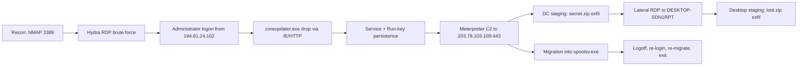

# Case 001 — “The Stolen Szechuan Sauce” · Union Answer Key + issen Walkthrough

**Audience:** a DFIR analyst working DFIR Madness Case 001 with issen.
**Ground truth:** the union finding set **F1–F44** ([corpus](plans/2026-06-11-case001-ground-truth-corpus.md)) distilled from twelve published write-ups, anchored on the official DFIR Madness answer key (W2). Measured issen values come from the capstone’s G1 gate run ([capstone v5 §5](plans/2026-06-11-issen-correlate-capstone-v5.md)).
**Discipline:** findings are observations, never verdicts — “consistent with” throughout; the analyst (or tribunal) concludes.

---

## Summary

On 19 September 2020 an attacker at `194.61.24.102` brute-forced RDP on the domain controller CITADEL-DC01 (`10.42.85.10`, domain C137) of a two-host network, logged in as `Administrator`, used Internet Explorer inside the RDP session to download `coreupdater.exe` (a Metasploit/Meterpreter payload) over HTTP from the same IP, installed it as a LocalSystem auto-start service and Run-key entry, staged and exfiltrated `secret.zip` (including the Szechuan sauce recipe and Beth’s secret file, which was deleted, replaced, and timestomped), then pivoted by RDP to DESKTOP-SDN1RPT (`10.42.85.115`) with the same stolen credential and repeated the playbook there (`loot.zip`). The malware held an established TCP connection to C2 `203.78.103.109:443` and was migrated into `spoolsv.exe`; after the first logoff killed an un-migrated Meterpreter session, the attacker logged in a second time, restarted and migrated the session, and exited.

The chain, in order (times on the network clock — see the clock-skew caveat below):

- **Recon** — 02:19 a single NMAP probe of TCP 3389 from `194.61.24.102` (F7, F39)
- **Initial access** — 02:21 Hydra RDP brute force; `Administrator` logon succeeds from the same IP (F5, F6, F38)
- **Payload drop** — 02:24:06 `coreupdater.exe` downloaded via IE over HTTP from `194.61.24.102`, moved Downloads → `C:\Windows\System32\` (F8, F13, F14)
- **C2 + persistence** — 02:27:49 installed as a LocalSystem service (7045) + Run key; established TCP to `203.78.103.109:443` (F12, F17, F27)
- **Staging/exfil on the DC** — ~02:30–02:34 `secret.zip` staged, exfiltrated, deleted; `Szechuan Sauce.txt` accessed; Beth’s file deleted/replaced/timestomped (F20, F21, F23, F24)
- **Lateral movement** — 02:35:54 RDP DC → DESKTOP-SDN1RPT, same credential; same drop + persistence there by ~02:41 (F19, F41)
- **Staging/exfil on the Desktop** — ~02:46–02:48 `loot.zip` staged, exfiltrated, deleted (F21)
- **Migration + second session** — Meterpreter migrated `coreupdater` → `spoolsv.exe`; first logoff ~03:00 killed an un-migrated session; the attacker re-logged-in, re-migrated, and exited — no log clearing observed (F25, F26–F29, F44)



**Clock-skew caveat (read before trusting any timestamp).** The victim VMs’ clock offset was misconfigured (effective UTC−7; the DC’s registry `TimeZoneInformation` is set to Pacific) while the virtual router that captured the PCAP was correctly at UTC−6. The observable consequence: timestamps derived from host artifacts (EVTX, MFT, USN) read **one hour ahead** of the network clock the official answer key narrates. Example: the key’s 02:24:06 UTC download is the host-derived `2020-09-19T03:24:06Z` that issen measures. This document quotes the key’s times as “network clock” and issen’s as “host-derived”; both name the same instant (F3).

**Provenance legend** used throughout:

| Tag | Meaning |
|---|---|
| **MEASURED-BY-ISSEN** | the value was produced by issen on the real Case 001 images during the G1 disk gate run (2026-06-11) and is quoted verbatim |
| **WRITE-UP-CORROBORATED** | reproduced from ≥ 2 published write-ups; **issen does not currently produce it** — it needs a capability not yet wired (see coverage below) |
| **OUT** | outside issen’s current evidence reach (pcap, OSINT/whois, content carving) — answered from the write-ups only |

### issen coverage today — honest accounting

**issen does not yet solve this case end-to-end.** Of the F1–F44 union, only **~11 findings are MEASURED-BY-ISSEN**; the rest are write-up-corroborated, design, partial, or out. Concretely:

- **Disk leg — 4 of the 8 common artifacts are wired** and gave correct results on the real images: **$MFT, $UsnJrnl ($J), Registry hives, EVTX**. These carry the intrusion timeline, brute-force/logon, lateral RDP, and service+Run persistence answers.
- **Not wired (parser crates exist but are dead code in the binary — PRE-5):** **Prefetch, Shimcache (AppCompatCache), Amcache, LNK/Jump Lists.** Verified 0 events on both hosts (2026-06-11). Several official answers genuinely *require* these — the **evidence-of-execution** answers (“was `coreupdater.exe` *run*, how many times, at what times”, its hash) come from Prefetch/Amcache/Shimcache, and the staging answers from `Loot.lnk`/`Secret.lnk` targets. issen currently only *infers* execution indirectly (the `.pf` file’s MFT creation time + the 7045 service start); it does not parse the prefetch/amcache run metadata.
- **Memory leg — the process list is now MEASURED** (G2 passed 2026-06-11 via psscan: 40 processes incl. `coreupdater.exe` 3644, `spoolsv.exe` 3724). Deeper memory enrichment (netstat C2 row, malfind injection bytes) is not yet wired for this dump.

So where this document tags a finding **WRITE-UP-CORROBORATED**, the answer is taken from a published human analysis, **not** produced by issen. Closing the disk gap is tracked as **PRE-5** (wire the four parsers + add the `.lnk` discovery arm) and the broader artifact-expansion plan.

---

## The Answers

The question list is the official DFIR Madness set (W2, “Quick Answers to the Questions” plus the advanced/bonus block). Each answer carries its finding IDs and provenance.

### Core questions

**1. What is the Operating System of the Server?**
Windows Server 2012 R2 (build 9600). — F1; corroborated by W2, W7, W9, W11; W1/W9 reach the same conclusion from RAM alone (KDBG profile `Win2012R2x64_18340`, in-memory SOFTWARE hive — F35). **WRITE-UP-CORROBORATED** (issen’s registry named-value extraction, PRE-3, is pending; the G1 run does ingest 193,636 registry events, so the raw material is in the database).

**2. What is the Operating System of the Desktop?**
Windows 10 Enterprise (build 19041). — F2; W2, W9, W11. **WRITE-UP-CORROBORATED** (same PRE-3 gap).

**3. What was the local time of the Server?**
The trick question. The site sits in Mountain time (the router/PCAP clock, UTC−6, is the correct reference), but the DC’s registry `TimeZoneInformation` is set to **Pacific** — the misconfiguration that produces the one-hour skew between host artifacts and the network clock. The lesson is the skew itself, not a single zone name. — F3; W2 (the author’s own note and comment thread), W3, W12. **WRITE-UP-CORROBORATED** (registry value extraction pending PRE-3; issen’s EVTX-internal skew detector exists but the pcap cross-check leg is OUT).

**4. Was there a breach?**
Yes. Every source reaches this; issen’s measured members on the DC alone: a 4625 failed-logon burst, 2,540 `LogonSuccess` events including the attacker logon, and service-install events. — F4 (rides F5/F6/F17). **MEASURED-BY-ISSEN** (member events; the single woven correlation chain is the capstone’s target).

**5. What was the initial entry vector (how did they get in)?**
RDP brute force against `Administrator`, then a successful interactive logon from the attacker IP. issen measured on DC01: the 4625 burst at host-derived **03:21:25Z**, followed by **4624 LogonType 10, `Administrator`, from `194.61.24.102` at 03:21:48Z** — the first attacker `LogonSuccess`. The official key names **Hydra** as the tool; local host evidence supports “RDP brute force” and stops there — tool naming is the key’s knowledge, not an artifact-derived conclusion. — F5 (MEASURED), F6 (member MEASURED), F38 (Hydra: **OUT** as-named). **MEASURED-BY-ISSEN**.

**6. Was malware used?**
Yes — `coreupdater.exe`, consistent with a Metasploit/Meterpreter payload (F8, F15). Sub-answers:

- **What process was malicious on the Domain Controller?** `coreupdater.exe` (PID 3644) initially, then **migrated into `spoolsv.exe`** (PID 3724). In the DC memory image, coreupdater is present but dead — 0 threads, parent PID absent — while spoolsv carries a `PAGE_EXECUTE_READWRITE` private region with an `MZ` header and the live C2 connection; the conjunction is consistent with Meterpreter process migration. — F26–F29; W1, W7, W8, W10. **WRITE-UP-CORROBORATED** (issen’s `memf ps`/`scan`/`netstat` walkers cover each member; pending the G2 gate).
- **What IP address delivered the payload?** `194.61.24.102`, via an IE download inside the attacker’s RDP session. issen measured the IP in **611 events’ metadata** on DC01. — F11 (delivery *mechanism* is pcap-evidenced — that leg is OUT). **MEASURED-BY-ISSEN** (the IP’s presence and role as logon source).
- **What IP address is the malware calling to?** `203.78.103.109`, port 443, ESTABLISHED, tied to the malware PID in the DC memory image (`netscan`). — F12, F27; W1, W7, W8, W9. **WRITE-UP-CORROBORATED** (the local-port literal 62613 appears only in write-up screenshots — treat as image-derived).
- **Where is this malware on disk?** `C:\Windows\System32\coreupdater.exe` on both hosts. issen measured the Desktop `FileCreate` for `Windows/System32/coreupdater.exe` at host-derived **2020-09-19T03:40:00Z**, with its Prefetch file created at **03:40:59Z** (execution-consistent), and 4 coreupdater MFT events on the DC. — F13, F14. **MEASURED-BY-ISSEN**.
- **When did it first appear?** DC: first coreupdater MFT event at host-derived **03:24:06Z** (= the key’s 02:24:06 network-clock download). Desktop: **03:40:00Z** (= the key’s 02:40). The official key left this blank (“I didn’t write this down”); the artifact record answers it. **MEASURED-BY-ISSEN**.
- **Was it moved?** Yes — from the Administrator’s `Downloads` folder to `C:\Windows\System32\` on both hosts (USN parent-directory analysis). The G1 re-run now surfaces 61,491 USN events on DC01, so the rename trail is in the database; the join (`CORR-MALWARE-RELOCATE`) is designed, not yet emitted. — F14; W2, W7, W11. **WRITE-UP-CORROBORATED** (members ingested).
- **What were the capabilities of this malware?** Extensive — Meterpreter: process migration, credential theft, keylogging, screen scraping, module ecosystem. Family identification comes from VirusTotal on the carved binary and from ClamScan/FLOSS over the malfind dump (the dumped region yields the C2 string). — F15, F30; W1, W7. **WRITE-UP-CORROBORATED** (issen carries hash-IOC and YARA hooks; family naming ships only as “consistent with”).
- **Is this malware easily obtained?** Yes — Metasploit Framework is freely available. — F16. **OUT** (general knowledge, not evidence-derived).
- **Was it installed with persistence?** Yes, on **both** hosts, twice over: a `coreupdater` Windows service (EVTX 7045, LocalSystem) and a registry Run-key/Services entry. issen’s earlier baseline measured 129 × 7045 events on DC01 (the coreupdater row among them; the exact 7045 event-shape literal is being re-pinned post-G1). DC service install at network-clock 02:27:49; Desktop ~02:41. — F17; W2, W6, W7, W11, W12. **MEASURED-BY-ISSEN** (7045 events) + **WRITE-UP-CORROBORATED** (registry value leg, PRE-3).

**7. What IP addresses were involved that were malicious? Were any from known adversary infrastructure?**
`194.61.24.102` (delivery + brute source) and `203.78.103.109` (C2). OSINT at the time tracked `194.61.24.102` as RDP-brute infrastructure (CVE-2015-1635 associations). **Caution:** W2’s original link of `203.78.103.109` to `happydoghappycat-th.com` and an APT was **retracted by the author** (“has since been reported as not being involved”) — do not assert APT attribution. Whois places the C2 with Netway Communications, Bangkok, Thailand (F42). — F11, F12, F18, F42. IPs: **MEASURED-BY-ISSEN** (`194.61.24.102`) / **WRITE-UP-CORROBORATED** (`203.78.103.109`); all OSINT legs: **OUT**.

**8. Were any other systems accessed by the attacker? How, and when?**
Yes — DESKTOP-SDN1RPT, via RDP **from inside the DC**, re-using the same compromised `Administrator` credential. issen measured on the Desktop: **4624 LogonType 10 from `10.42.85.10` (the DC), `Administrator`, host-derived 03:36:24Z** (= the key’s 02:35:54 network clock). — F19, F41; W2, W7, W8, W10, W11. **MEASURED-BY-ISSEN** (the logon member; the cross-host `CORR-LATERAL-MOVE` join is designed).

**9. Was any data stolen or accessed? When?**
Consistent with yes, on both hosts: `secret.zip` staged and exfiltrated from the DC (~02:31 network clock), `loot.zip` from the Desktop (~02:48), both deleted after exfil; `Loot.lnk`/`Secret.lnk` and webcache entries corroborate. issen measured 5 `loot.zip` events on the Desktop; the DC-side `secret.zip` trail is now reachable in the G1 USN data (unpinned). Exfil rode the Meterpreter session and the RDP GUI channel — byte-level transfer evidence is pcap territory. — F20, F21, F23; W2, W7, W8, W11. **MEASURED-BY-ISSEN** (staging members) / **OUT** (transfer mechanism).

**10. What was the network layout of the victim network?**
Domain **C137**, single subnet `10.42.85.0/24`: CITADEL-DC01 at `10.42.85.10`, DESKTOP-SDN1RPT at `10.42.85.115`. (The original walshcat write-up swaps a host/IP label once; the corpus canon above is the corrected reading.) — F22; W2, W7, W10, W11. **WRITE-UP-CORROBORATED** (hostnames flow in issen’s measured EVTX events; the registry interface extraction is PRE-3).

**11. What architecture changes should be made immediately?**
Remove RDP exposure to the internet (especially to a DC); place remote access behind a VPN; add an external firewall/IPS; tighten password policy and kill credential re-use; EDR coverage. — advisory, from W2. **OUT** (recommendation, not finding).

**12. If the Szechuan sauce was stolen, what time was it stolen?**
Approximately **02:30 UTC network clock** (host-derived ~03:30Z) — the sauce recipe rode the `secret.zip` staging/exfil window on the DC; `Szechuan Sauce.txt` was accessed at 02:32:21. — F23 (rides F20/F21); W2. **WRITE-UP-CORROBORATED** (issen’s file-access events cover the members; the woven chain is the capstone target).

**13. Were any other sensitive files stolen or accessed? What were the times?**
Yes. Around 02:34 network clock: `SECRET_beth.txt` was deleted from the DC file share and a different-content `Beth_Secret.txt` was created (then timestomped ~02:38 to match `PortalGunsPlans.txt`); Morty’s thoughts were taken in the same window. issen measured **8 `Beth_Secret` MFT events** on the DC. — F24; W2, W8. **MEASURED-BY-ISSEN** (the MFT create/access/delete trail) / **OUT** (content comparison — see bonus Q below).

**14. When was the last known contact with the adversary?**
Last interactive logoff around **03:00 network clock**; at memory-capture time attacker tooling was still resident (the migrated spoolsv session). The fuller shape: the first logoff killed an un-migrated Meterpreter session, the attacker logged in a **second time**, restarted and migrated the session, then exited. — F25, F44; W2. **WRITE-UP-CORROBORATED** (issen has the `Logoff` events; the per-session envelope that pins “last adversary logoff” is designed, and the UTC literal is still being reconciled).

### Advanced / bonus questions

**What controls or architecture would have prevented this?** VPN-gated remote access, external firewall, IPS, EDR, password complexity + no re-use; map to CIS controls accordingly. **OUT** (advisory).

**What users have actually logged onto the DC?** `Administrator`. **Onto the Desktop?** `Administrator` and `ricksanchez` (the user-profile folders on each image corroborate). — W2. **WRITE-UP-CORROBORATED** (issen surfaces logon account metadata; a per-host “users seen” rollup is report-layer work).

**What are the passwords for the users in the domain?** Published by the lab author (e.g. `Administrator : )&Denver89`, `jerrysmith : !BETHEYBOO12!`, `ricksanchez : 800PortalsForMe%`, …). Recovering them from evidence requires SAM/NTDS or LSASS credential material — `issen memf creds` routes to hashdump/lsadump/SAM walkers but is unvalidated on this corpus (F32). **OUT** today (quoted from W2; no credential material is reproduced beyond the author’s published list).

**Can you recover the original file about Beth’s secrets?** Yes — from the recycle bin. Original name `SECRET_beth.txt`; original contents “Earth Beth is the real Beth.” (recovered from `$Recycle.Bin\S-1-…-500` `$R` data in W8). The replacement `Beth_Secret.txt` carries a different secret. — F24, F43; W2, W8. **OUT** (issen recognizes recycle-bin paths but has no `$I`/`$R` content carver).

**What file was timestomped?** `Beth_Secret.txt`, stomped with Meterpreter to match `PortalGunsPlans.txt`. issen’s current MFT timeline is `$SI`-only and its `$SI`-vs-`$FN` timestomp detector is deliberately an Info-grade lead; this specific stomp was **not** flagged in the measured run. — F24-adjacent; W2. **WRITE-UP-CORROBORATED**, honestly a current issen gap.

---

## Walkthrough with issen

### Disk leg — reproducible today

The commands below are the G1 gate run (2026-06-11, issen at HEAD). Both ingests complete fast (DC01 ~15 s, Desktop ~30 s).

```bash
# DC01 (Server 2012 R2) — E01 inside DC01-E01.zip
issen ingest 20200918_0347_CDrive.E01 -o dc01.duckdb -s citadel-dc01

# Desktop (Windows 10) — E01 inside DESKTOP-E01.zip
issen ingest <DESKTOP-SDN1RPT>.E01 -o desktop.duckdb -s desktop-sdn1rpt

# Per-source event breakdown
issen info dc01.duckdb
issen info desktop.duckdb
```

Measured G1 totals: **DC01 689,605 events** (Mft 349,136 · Registry 193,636 · EventLog 85,342 · UsnJournal 61,491) and **Desktop 768,862 events** (Mft 417,628). The same breakdown is one query away:

```bash
duckdb dc01.duckdb -c "SELECT source, count(*) FROM timeline GROUP BY source ORDER BY 2 DESC;"
```

**The attacker logon (answers Q5).** First `LogonSuccess` from the attacker IP — type 10 (RemoteInteractive), `Administrator`, host-derived 03:21:48Z:

```bash
duckdb dc01.duckdb -c "SELECT timestamp_display, json_extract_string(metadata,'\$.LogonType')
  FROM timeline WHERE event_type='LogonSuccess' AND metadata LIKE '%194.61.24.102%'
  ORDER BY timestamp_ns LIMIT 5;"
```

**Attacker-IP footprint (answers Q6 delivery-IP / Q7).** 611 events carry the IP in metadata on DC01:

```bash
duckdb dc01.duckdb -c "SELECT count(*) FROM timeline WHERE metadata LIKE '%194.61.24.102%';"
```

**Malware on disk, first appearance (answers Q6 where/when).** DC first touch 03:24:06Z; Desktop `FileCreate` 03:40:00Z with Prefetch 03:40:59Z:

```bash
duckdb dc01.duckdb -c "SELECT min(timestamp_display) FROM timeline
  WHERE lower(artifact_path) LIKE '%coreupdater%';"

duckdb desktop.duckdb -c "SELECT timestamp_display, event_type, artifact_path
  FROM timeline WHERE lower(artifact_path) LIKE '%coreupdater%'
  ORDER BY timestamp_ns;"
```

**The brute-force burst (Q4/Q5)** is surfaced by issen’s signature pass (4625 burst at 03:21:25Z; 107 `LogonFailure` events on DC01), and **lateral movement (Q8)** is the same logon query shape against `desktop.duckdb` with `metadata LIKE '%10.42.85.10%'` — measured: type 10, `Administrator`, 03:36:24Z.

Remember the skew when comparing with the official key: every host-derived value above reads one hour ahead of the key’s network-clock narrative.

### Memory leg — coming (be honest here)

**No memory answer in this document was produced by issen yet.** The G2 first-contact run (2026-06-11) recorded the blocker: `citadeldc01.mem` (raw WinPMEM) is detected as a Raw dump, and every subcommand currently refuses with “dump has no embedded CR3; use --cr3” — the header-less DTB scanner in memf-symbols is not yet wired into the Raw-dump dispatch path (`build_reader`). Until that wiring (B1-wire) lands and G2 re-runs, the memory findings F26–F37 are reproduced from the published write-ups (W1 canonical; W7, W8, W9), which used Volatility:

```bash
# What the write-ups ran (Volatility 2/3, profile Win2012R2x64_18340)
vol.py -f citadeldc01.mem --profile=Win2012R2x64_18340 pstree -v
vol.py -f citadeldc01.mem --profile=Win2012R2x64_18340 netscan
vol.py -f citadeldc01.mem --profile=Win2012R2x64_18340 malfind -D dump/
# then: clamscan / FLOSS / strings over the dumped region
```

What those show on the DC image, and what the equivalent `issen memf` subcommand will surface once the gate clears:

| Volatility result (write-ups) | F | issen equivalent | Expected output once G2 + wiring land |
|---|---|---|---|
| `coreupdater.exe` PID 3644 present but dead — 0 threads, parent PID 2244 absent | F26 | `issen memf <dump> --command ps` | the orphaned, exited process row (walker exists; routed for Windows) |
| ESTABLISHED TCP to `203.78.103.109:443` tied to PID 3644 | F27 | `--command netstat` | the C2 row with Note `external-established`; escalation to a C2-graded note ships with build M-1 (process-context escalation, not a port list) |
| `spoolsv.exe` PID 3724: RWX private VAD region, `MZ` header | F28 | `--command scan` | the injected region flagged; today it would label `injected-code` — the `injected-PE` sub-classification ships with build M-2 (first-bytes capture) |
| migration: dead orphan ∧ injected live PID ∧ shared C2 endpoint | F29 | `CORR-PROC-MIGRATION` (designed rule) | a single migration correlation over the ps/scan/netstat members |
| ClamScan/FLOSS on the malfind dump → Meterpreter, C2 string in-region | F30 | `scan` dump + YARA/strings | region dump + strings; family naming stays “consistent with” |
| spoolsv LISTENING on 62475 (TCPv4+v6) | F31 | `--command netstat` | the listener rows under the injected PID |
| SYSTEM-context malware → domain credential exposure | F32 | `--command creds` | exposure finding (hashdump/lsadump walkers routed, unvalidated here) |
| netscan noise triage on a DC (dns.exe et al. vs external-established) | F34 | netstat Note column | the mechanized split the analysts did by hand |
| KDBG/profile + in-RAM SOFTWARE hive give the OS from memory | F35 | auto-profile + in-RAM registry walker | profile resolution is the very thing G2 validates |
| ShimCache in RAM; memory bodyfile into the super-timeline | F36, F37 | `--command timeline` | declared, “not yet wired for this OS” — design work |

Two corpus-wide honesty notes carried from the write-ups: the local-port literals (62613, 62475) appear only in screenshots, not scrapeable text — treat them as image-derived; and the **Desktop** memory image defeated structured parsing in Volatility *and* Rekall (W1) — the published Desktop-memory conclusions rest on FLOSS/strings sweeps (18.1M lines) and carry lower confidence than the DC’s structured results (F33). When issen meets that dump, a strings + IOC-sweep fallback with an explicit lower-confidence label is the designed behavior.

---

## Finding index (F1–F44)

Statuses reflect the capstone v5 grading updated by the G1 run. “measured” = demonstrated by issen on the real images; “design” = capability mapped, pending named pre-task/gate/rule; “partial” = in-scope half produced or designed, named leg out; “out” = outside current reach.

| F | One-line conclusion | Sources | issen status |
|---|---|---|---|
| F1 | DC OS = Windows Server 2012 R2 (build 9600) | W0, W2, W7, W9, W11 (+RAM: W1/W9) | design (PRE-3) |
| F2 | Desktop OS = Windows 10 Enterprise (19041) | W0, W2, W9, W11 | design (PRE-3) |
| F3 | DC time zone misconfigured (Pacific vs Mountain) → 1 h artifact/network skew | W0, W2, W3, W12 | partial (PRE-3; pcap leg out) |
| F4 | A breach occurred | all | design (the woven chain); members measured |
| F5 | 4625 brute-force burst vs `Administrator` | W0, W2, W7, W9, W10, W12 | **measured** (03:21:25Z) |
| F6 | 4624 from `194.61.24.102` follows the burst → RDP-brute initial access | W0, W2, W3, W7, W9–W12 | design (rule); member measured (03:21:48Z) |
| F7 | pcap: ICMP probe then RDP-brute traffic | W0, W3 | out (no pcap parser) |
| F8 | `coreupdater.exe` fetched over HTTP from `194.61.24.102` | W0, W2, W3, W7, W11 | design (chain); mechanism leg out (pcap) |
| F9 | SHA256 `10f3b920…cfda6` of the carved binary, VT-known-bad | W7 (text), Netresec, ds4n6 | design (PRE-6 extract+hash) |
| F10 | Download corroborated by webcache + Amcache | W0, W2, W9 | partial (PRE-5; ESE webcache out) |
| F11 | `194.61.24.102` = payload-delivery IP | W0, W2, W7, W9, W10, W11 | partial; **measured** presence (611 events) |
| F12 | C2 = `203.78.103.109` | W0 + RAM: W1, W7, W8, W9 | design (PRE-1, G2) |
| F13 | coreupdater first on DC 03:24:06Z host-derived (MFT, USN agreement) | W0, W2, W5 | **measured** MFT value; USN events now present (G1), join unpinned |
| F14 | Moved Downloads → System32 on both hosts (USN parents) | W0, W2, W7, W11 | design (rule); USN data ingested post-G1 |
| F15 | Malware consistent with Meterpreter/Metasploit | W0 + RAM: W1, W7 | partial (hash/YARA labels, “consistent with” only) |
| F16 | Metasploit freely obtainable | W0, W2 | out (not evidence-derived) |
| F17 | Persistence both hosts: `coreupdater` service (7045) + Run key | W0, W2, W6, W7, W11, W12 | measured members (129 × 7045, re-pinning); registry leg design (PRE-3) |
| F18 | OSINT on both IPs; the W2 APT link was retracted by its author | W0, W2 | out (OSINT; never assert APT) |
| F19 | Lateral RDP DC → Desktop, `Administrator` | W0, W2, W7, W8, W10, W11 | design (rule); member **measured** (03:36:24Z) |
| F20 | `Administrator` accessed the Secret-share files on both hosts | W0, W2, W7, W8, W11 | design (G1 re-query pending) |
| F21 | Staging: `loot.zip` (Desktop) + `secret.zip` (DC) + LNK/webcache | W0, W2, W7 | design; 5 loot.zip events measured; LNK leg PRE-5 |
| F22 | Domain C137; DC `10.42.85.10`, Desktop `10.42.85.115` | W0, W2, W7, W10, W11 | design (PRE-3); hostnames flow today |
| F23 | The sauce was stolen (rides F20/F21) | all | design (aggregate chain) |
| F24 | `SECRET_beth.txt` deleted, `Beth_Secret.txt` created + timestomped | W0, W2, W8 | partial; 8 MFT events measured; content-diff out |
| F25 | Last adversary contact = last DC logoff (~03:00 network clock) | W0, W2 | design (session envelope; literal unreconciled) |
| F26 | coreupdater PID 3644 in RAM: dead (0 threads), orphaned | W1, W7, W8, W10 | design (G2 + PRE-1; walker routed) |
| F27 | ESTABLISHED C2 `203.78.103.109:443` from PID 3644 | W1, W7, W8, W9 | design (M-1 build + G2; port literal 62613 image-derived) |
| F28 | spoolsv PID 3724 injected: RWX private region, MZ header | W1, W7 | design (M-2 build + G2) |
| F29 | Process migration coreupdater → spoolsv | W1, W7, W8 | design (`CORR-PROC-MIGRATION`) |
| F30 | Injected region consistent with Meterpreter (ClamScan/FLOSS) | W1, W7 | partial (family naming = rule pack) |
| F31 | spoolsv LISTENING on 62475 (image-derived literal) | W8, W1 | design (G2 + PRE-1) |
| F32 | SYSTEM-context malware → domain credential exposure | W1, W12 | design (creds validation, G2) |
| F33 | Desktop dump defeats structured parse; strings/IOC sweep still hits | W1 | partial (fallback design; lower-confidence labels) |
| F34 | DC netscan noise triage (external-established vs noise) | W1 | design (G2 re-grade; classifier unit-tested) |
| F35 | OS/build recoverable from RAM (KDBG, in-RAM SOFTWARE hive) | W7, W9 | partial (auto-profile = G2’s test; printkey unwired) |
| F36 | Memory-resident ShimCache feeds evidence-of-execution | W1, W5 | design (walker exists, unwired) |
| F37 | Memory bodyfile merges into the super-timeline | W4, W5 | design (Timeline stub) |
| F38 | The brute tool was Hydra | W2 | out as-named (behavior supports “RDP brute” only) |
| F39 | Recon: ICMP probe + NMAP of 3389, Snort alert | W3 | out (pcap/IDS) |
| F40 | Attacker Kali hostname via EVTX 4776 / LLMNR | W2, W8, W10 | partial (4776 mapping = D2; LLMNR out) |
| F41 | Same credential re-used for the DC → Desktop pivot | W2, W8, W10, W11 | design (`CORR-LATERAL-MOVE` guard) |
| F42 | C2 whois → Netway Communications, Bangkok | W1, W9 | out (online enrichment) |
| F43 | Beth’s original file content recovered from `$Recycle.Bin` | W8, W2 | out (no `$I`/`$R` carver) |
| F44 | A second adversary session (logoff → death → re-login → migrate → exit) | W2 | design (multi-session envelope) |

**Quarantined single-source leads (not ground truth).** Four claims appear only in W12 and are unverified: U1 Impacket-SMBexec usage; U2 a 1102 log-clear on a second internal host; U3 “~14 MB exfiltrated”; U4 “95 brute attempts in < 2 s”. Treat as leads to test against the corpus, never as answers. And once more: the `happydoghappycat-th.com`/APT association for the C2 IP was retracted by the lab author — it does not belong in any answer.

---

## Sources

- W1 [DFIR Madness — Case 001 Memory Analysis](https://dfirmadness.com/case-001-memory-analysis/) (canonical memory lab)
- W2 [DFIR Madness — Answers to the Case of the Stolen Szechuan Sauce](https://dfirmadness.com/answers-to-szechuan-case-001/) (official answer key)
- W3 [DFIR Madness — Case 001 PCAP Analysis](https://dfirmadness.com/case-001-pcap-analysis/)
- W4 [DFIR Madness — Triage Disk Analysis](https://dfirmadness.com/triage-disk-analysis-case-001/) · W5 [Super Timeline Analysis](https://dfirmadness.com/case-001-super-timeline-analysis/) · W6 [AutoRuns Analysis](https://dfirmadness.com/case-001-autoruns-analysis/)
- W7 [g4rud4](https://g4rud4.gitlab.io/2023/Case-001-DFIR-Madness-The-Stolen-Szechuan-Sauce/) · W8 [nathan-out (CyberDefenders variant)](https://nathan-out.github.io/write-up/cyberdefenders-digital-forensics-szechuan-sauce/) · W9 [iblue.team](https://www.iblue.team/ctf-challenges/dfir-madness-ctf-challenges/case-001-szechuan-sauce)
- W10 [Herdomain](https://github.com/Herdomain/digital-forensics-szechuan-sauce-investigation) · W11 [Dorakhris](https://github.com/Dorakhris/Forensics-Analysis-The-Stolen-Szechuan-Sauce) · W12 [AdhamElgarhy](https://github.com/AdhamElgarhy-33/DFIR-Project-The-Stolen-Szechuan-Sauce-/)
- W0 [walshcat](https://web.archive.org/web/20250911141030/https://walshcat.medium.com/case-write-up-the-stolen-szechuan-sauce-2409344264c3) (the original F1–F25 oracle; no memory analysis)
- Internal: [union ground-truth corpus](plans/2026-06-11-case001-ground-truth-corpus.md) · [correlate capstone v5](plans/2026-06-11-issen-correlate-capstone-v5.md) (G1/G2 gate records) · [corpus catalog](corpus-catalog.md) (artifact downloads + hashes)
